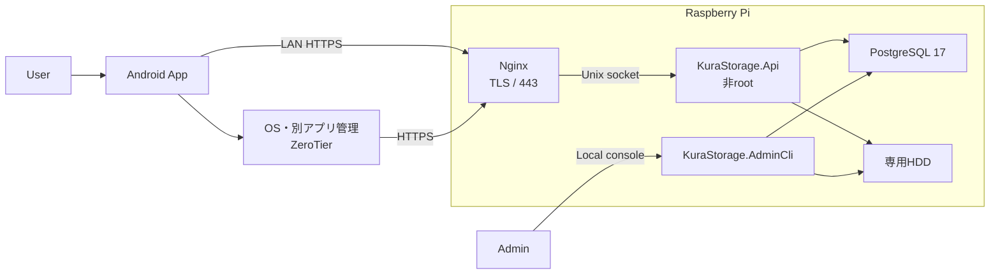
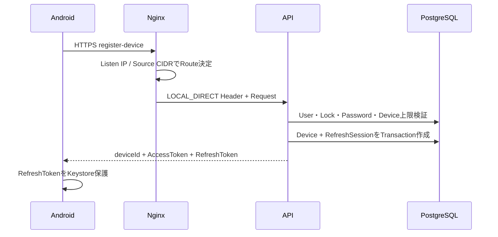
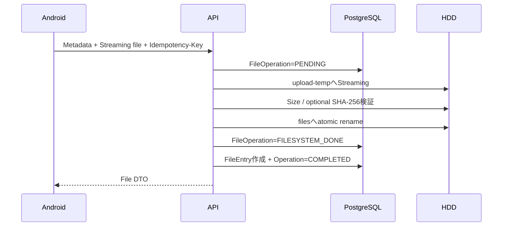

# KuraStorage MVP 設計書

## 1. 設計目的

本書は、`requirements.md`で定義したMVPを実装可能な構成へ落とし込む。

MVPは、バックエンドとAndroidアプリがRaspberry Pi実機で接続・認証・基本ファイル操作を完了できることを優先する。MVP後の機能用Host、Module、Table、API、依存ライブラリは先行作成しない。

## 2. アーキテクチャ概要

### 2.1 全体構成



### 2.2 主要原則

- Serverはモジュラーモノリスとし、Domain、Application、Infrastructure、Hostの依存方向を固定する。
- AndroidはUI、UseCase、Repository、Network・Keystore実装を分離する。
- Nginxを唯一のHTTPS入口とし、APIをTCPポートで外部公開しない。
- 実ファイルはHDD、認証・索引・操作状態はPostgreSQLを正とする。
- HDDとDBをまたぐ更新は`FileOperation`で中間状態を記録する。
- ZeroTierは通信路であり、KuraStorageのUser認証またはDevice認可の代替としない。

## 3. Server設計

### 3.1 Project構成

```text
server/
├── KuraStorage.sln
├── Directory.Build.props
├── Directory.Packages.props
├── src/
│   ├── KuraStorage.Domain/
│   ├── KuraStorage.Application/
│   ├── KuraStorage.Infrastructure/
│   ├── KuraStorage.Api/
│   └── KuraStorage.AdminCli/
└── tests/
    ├── KuraStorage.Domain.Tests/
    ├── KuraStorage.Application.Tests/
    └── KuraStorage.IntegrationTests/
```

MVPでは独立したWorker Hostを作成しない。未完了Uploadの清掃と`FileOperation`復旧は、API内の期限付きHosted Serviceと起動時復旧で実行する。将来の自動BackupやMedia変換で独立Workerが必要になった時点で別Steeringにより追加する。

### 3.2 依存方向

```text
Api / AdminCli
        |
        v
Application ---> Domain
        ^
        |
Infrastructure
```

- DomainはFramework、DB、Filesystem、HTTPに依存しない。
- ApplicationはDomainと自身が定義するPort Interfaceだけを参照する。
- InfrastructureはApplicationのPortをEF Core、Filesystem、Token、Password Hash実装で満たす。
- HostはDIとTransport変換を担当し、DBまたはHDDを直接更新しない。

### 3.3 Domain・Application Component

| Component | 責務 |
| --- | --- |
| `AuthenticationService` | Password検証、Login、Token発行、認証失敗記録 |
| `DeviceRegistrationService` | Local Directの確認、Device登録、上限判定 |
| `SessionService` | Refresh Token Hash、Rotation、Reuse検知、Logout、失効 |
| `AdministrationService` | User作成、Device一覧、Device失効 |
| `StorageGuard` | Mount、storageId、実Path、読み書き、空き容量の検証 |
| `FileCatalogService` | 所有者に限定した一覧・詳細取得 |
| `FolderService` | フォルダ作成、同名競合防止 |
| `TransferService` | Streaming Upload、Range Download、検証、原子的公開 |
| `TrashService` | ゴミ箱移動、元Path保存、復元、復元競合防止 |
| `FileOperationRecoveryService` | 中間状態の判定、完了、補償、管理者確認状態化 |

### 3.4 データモデル

#### `users`

- `id: uuid`
- `username_normalized: text unique`
- `display_name: text`
- `password_hash: text`
- `role: ADMIN | MEMBER`
- `status: ACTIVE | DISABLED`
- `failed_login_count: integer`
- `failed_login_window_started_at: timestamptz nullable`
- `lock_type: NONE | SECURITY`
- `created_at`, `updated_at`

#### `devices`

- `id: uuid`
- `user_id: uuid`
- `device_name: text`
- `platform: ANDROID`
- `status: ACTIVE | REVOKED`
- `registered_at`, `revoked_at nullable`

#### `refresh_sessions`

- `id: uuid`
- `family_id: uuid`
- `user_id: uuid`
- `device_id: uuid`
- `token_hash: bytea unique`
- `expires_at`, `used_at nullable`, `revoked_at nullable`
- `replaced_by_session_id: uuid nullable`
- `created_at`

#### `authentication_attempts`

- `id: uuid`
- `username_hash: bytea`
- `device_id: uuid nullable`
- `result_code: text`
- `remote_address: inet nullable`
- `created_at`

#### `audit_logs`

- `id: uuid`
- `actor_user_id: uuid nullable`
- `actor_device_id: uuid nullable`
- `actor_os_user: text nullable`
- `action: text`
- `target_type`, `target_id nullable`
- `result_code: text`
- `request_id: text nullable`
- `created_at`

#### `file_entries`

- `id: uuid`
- `owner_user_id: uuid`
- `parent_id: uuid nullable`
- `entry_type: FILE | FOLDER`
- `name: text`
- `relative_path: text`
- `mime_type: text nullable`
- `size: bigint`
- `status: ACTIVE | TRASHED`
- `original_parent_id: uuid nullable`
- `original_relative_path: text nullable`
- `trashed_at: timestamptz nullable`
- `file_version: bigint`
- `created_at`, `updated_at`

制約として、`ACTIVE`の同一Owner・Parent・Name、および`TRASHED`の同一Owner・ゴミ箱Pathの重複を防ぐ部分Unique Indexを設ける。`relative_path`は検証済みの内部値だけを保存し、Client入力を直接保存しない。

#### `file_operations`

- `id: uuid`
- `owner_user_id: uuid`
- `operation_type: UPLOAD | CREATE_FOLDER | TRASH | RESTORE`
- `idempotency_key: text nullable`
- `file_entry_id: uuid nullable`
- `source_relative_path`, `target_relative_path nullable`
- `expected_size: bigint nullable`
- `expected_sha256: text nullable`
- `status: PENDING | FILESYSTEM_DONE | COMPLETED | RECOVERY_REQUIRED`
- `error_code: text nullable`
- `created_at`, `updated_at`

`(owner_user_id, idempotency_key)`は、Keyがある場合に一意とする。

### 3.5 HDD構造

```text
<storage-root>/
├── .storage-identity
├── users/
│   └── <user-id>/
│       ├── files/
│       └── trash/
└── upload-temp/
    └── <user-id>/
```

- `<storage-root>`が実Mount Pointであり、`.storage-identity`が設定と一致する場合だけ書き込む。
- User入力から絶対Pathを生成せず、内部の`RelativeStoragePath`と検証済みRootから解決する。
- シンボリックリンクを作成・追跡しない。
- Uploadの一時Fileと正式Fileを同一Filesystem上に置き、atomic renameを使用する。

## 4. Network・ZeroTier・TLS設計

### 4.1 Server側経路判定

NginxはLAN API IPとZeroTier API IPの443だけでListenする。Request HeaderにClientが送信した経路情報があっても破棄し、NginxがListen先と接続元CIDRから決定した値で上書きする。

```text
LAN listener + NET-LAN-CIDR             -> X-KuraStorage-Route: LOCAL_DIRECT
ZeroTier listener + NET-ZEROTIER-CIDR   -> X-KuraStorage-Route: REMOTE_SECURE
otherwise                               -> reject
```

APIはNginxのUnix Socketから受け取ったHeaderだけを信頼する。Device登録APIは`LOCAL_DIRECT`以外を拒否する。

### 4.2 Android側経路判定

1. 基盤Wi-FiまたはEthernetのIPとPrefixを取得する。
2. `NET-LAN-API-IP`が同一Subnetにある場合、基盤NetworkへOkHttpをBindする。
3. `NET-API-HOSTNAME`を`NET-LAN-API-IP`へ解決し、Health、TLS、Hostnameを検証する。
4. 成功時は`LOCAL_DIRECT`とする。
5. 失敗時は`NET-API-HOSTNAME`を`NET-ZEROTIER-API-IP`へ解決し、同じHTTPS検証を行う。
6. 成功時は`REMOTE_SECURE`、失敗時は`DISCONNECTED`とする。

SSIDはLocal Directの認証または判定根拠に使用しない。LocalとZeroTierが両方成功する場合はLocalを優先する。

### 4.3 TLS

- `NET-API-HOSTNAME`をSANに持つServer証明書を使用する。
- AndroidにはKuraStorage専用Root CAの公開証明書だけをRelease Build Inputとして組み込む。
- Trust Anchorと`domain-config`を`NET-API-HOSTNAME`に限定する。
- HostnameVerifier、TrustManager、Build FlagによるProductionの検証回避を許可しない。
- Root CA秘密鍵はServer、Repository、APKへ配置しない。

## 5. API契約

### 5.1 共通形式

成功ResponseはResourceまたは結果DTOを返す。失敗Responseは次の形式へ統一する。

```json
{
  "code": "FILE_NAME_CONFLICT",
  "message": "A file with the same name already exists.",
  "requestId": "01J...",
  "details": {}
}
```

- `message`にUser存在、物理Path、Stack Trace、他UserのResource情報を含めない。
- Validation Errorは`details.fields`に対象Fieldと安定した理由Codeを返す。
- 保護APIはBearer Access Tokenを必須とする。

### 5.2 MVP Endpoint

| Method / Path | 認証 | 用途 |
| --- | --- | --- |
| `GET /api/v1/system/health` | 不要 | API到達、Protocol Version、Storage利用可否 |
| `POST /api/v1/auth/register-device` | 不要、Local Direct必須 | Password検証と初回Device登録 |
| `POST /api/v1/auth/login` | 不要 | 登録済みDeviceのLogin |
| `POST /api/v1/auth/refresh` | Refresh Token | Token Rotation |
| `POST /api/v1/auth/logout` | Access + Refresh Token | 現Session失効 |
| `GET /api/v1/files` | 必要 | `parentId`配下の`ACTIVE`項目一覧 |
| `GET /api/v1/files/{fileId}` | 必要 | 所有項目の詳細 |
| `POST /api/v1/folders` | 必要 | Folder作成 |
| `POST /api/v1/files/upload` | 必要 | Multipart Streaming Upload |
| `GET /api/v1/files/{fileId}/content` | 必要 | 元FileのRange Download |
| `DELETE /api/v1/files/{fileId}` | 必要 | ゴミ箱へ移動 |
| `GET /api/v1/trash` | 必要 | 自分のゴミ箱一覧 |
| `POST /api/v1/files/{fileId}/restore` | 必要 | 元の場所へ復元 |

### 5.3 Health Response

```json
{
  "api": "AVAILABLE",
  "storage": "AVAILABLE",
  "protocolVersion": 1
}
```

DB、Mount Path、storageId、OSの詳細は認証前Responseに含めない。API自体は応答できるがHDDが利用できない場合は`storage: UNAVAILABLE`とする。

### 5.4 Upload契約

`POST /api/v1/files/upload`は`multipart/form-data`を使用する。

| Part / Header | 必須 | 内容 |
| --- | --- | --- |
| `Idempotency-Key` Header | 必須 | DeviceがOperationごとに生成するUUID |
| `destinationFolderId` | 必須 | 所有する`ACTIVE` Folder ID |
| `fileName` | 必須 | 物理Pathとして直接使用しない表示名 |
| `size` | 必須 | 受信予定Byte数 |
| `contentType` | 任意 | MIME Type。信頼せずServer側検証の参考にする |
| `sha256` | 任意 | Lowercase Hex SHA-256 |
| `file` | 必須 | Streaming対象 |

同じUser・`Idempotency-Key`・同じMetadataの再送は既存の完了結果を返す。別MetadataでのKey再利用は`409 IDEMPOTENCY_CONFLICT`とする。通信中断時は次回のRequestでFile全体を再送する。

### 5.5 File DTO

```json
{
  "id": "uuid",
  "parentId": "uuid-or-null",
  "name": "document.pdf",
  "entryType": "FILE",
  "mimeType": "application/pdf",
  "size": 123456,
  "status": "ACTIVE",
  "fileVersion": 1,
  "createdAt": "2026-07-22T00:00:00Z",
  "updatedAt": "2026-07-22T00:00:00Z"
}
```

Owner ID、物理Path、ゴミ箱の実PathはClientへ返さない。

### 5.6 主要Error Code

| HTTP | Code | 条件 |
| --- | --- | --- |
| 400 | `VALIDATION_FAILED` | 形式、文字数、範囲が不正 |
| 401 | `AUTHENTICATION_REQUIRED` | Tokenなし、不正、期限切れ |
| 401 | `REFRESH_TOKEN_REUSED` | 使用済みRefresh Tokenを再利用 |
| 403 | `DEVICE_REVOKED` | Deviceが失効済み |
| 403 | `DEVICE_REGISTRATION_REQUIRES_LOCAL_DIRECT` | 新規登録がLocal Direct以外 |
| 404 | `FILE_NOT_FOUND` | 未存在または他User所有 |
| 409 | `FILE_NAME_CONFLICT` | 同じParentに同名項目が存在 |
| 409 | `FILE_RESTORE_CONFLICT` | 復元先に同名項目が存在 |
| 409 | `IDEMPOTENCY_CONFLICT` | 同じKeyを別Payloadで使用 |
| 422 | `UPLOAD_SIZE_MISMATCH` | 宣言Sizeと受信Sizeが不一致 |
| 422 | `UPLOAD_CHECKSUM_MISMATCH` | 指定SHA-256と不一致 |
| 503 | `STORAGE_UNAVAILABLE` | HDD・storageId・読み書き検証失敗 |
| 507 | `STORAGE_CAPACITY_INSUFFICIENT` | 安全余裕を除いた空き容量不足 |

## 6. 主要データフロー

### 6.1 初回Device登録



DeviceとRefresh Sessionの作成は単一DB Transactionで行う。ZeroTierのMemberまたはNetwork情報は読み書きしない。

### 6.2 Token Rotation

1. Refresh TokenをSHA-256でHash化し、対象行を排他取得する。
2. User、Device、Session、有効期限を検証する。
3. 使用済みTokenの場合は同じ`family_id`をすべて失効する。
4. 有効Tokenの場合は旧行に`used_at`を設定し、新しいTokenとSession行を発行する。
5. `replaced_by_session_id`を設定し、新しいAccess・Refresh Tokenを返す。

上記は単一DB Transactionと行Lockで実行し、同じTokenの並列使用を防ぐ。

### 6.3 Streaming Upload



- NginxとASP.NET CoreのRequest Bufferingを無効化し、File全体をMemoryへ読み込まない。
- Stream受信中に宣言Sizeを超えた場合は即時停止する。
- 同名Fileは上書きせず`FILE_NAME_CONFLICT`を返す。
- DB更新前にProcessが停止した場合は、起動時復旧が`FileOperation`と実Fileを照合する。一意に完了できない場合は`RECOVERY_REQUIRED`として通常一覧へ公開しない。

### 6.4 Trash・Restore

1. Owner、`ACTIVE`状態、対象Path、Storage状態を検証する。
2. `FileOperation=PENDING`を作成する。
3. FileまたはFolderをUserの`trash/`へatomic renameする。
4. `original_parent_id`、`original_relative_path`、`trashed_at`を保存し、`TRASHED`へ変更する。
5. Restoreは元Parentの存在、Owner、同名競合を検証し、上書きせず元Pathへatomic renameする。

FolderのTrash・Restoreは配下の実FileをFolder単位で移動し、DBは親Folderと子孫の状態を単一Transactionで変更する。

## 7. Android設計

### 7.1 Module構成

```text
apps/android/
├── app/
├── build-logic/
├── core-model/
├── core-network/
├── core-data/
├── core-security/
├── core-ui/
├── feature-connection/
├── feature-auth/
└── feature-files/
```

Room、WorkManager、Media3、Coil、PDF表示、Media変換用のModule・依存はMVPに追加しない。非秘密の`deviceId`と最後のUser名はDataStore、Refresh TokenはAndroid Keystoreの取り出し不可AES鍵とAES-GCMで暗号化して保存する。

### 7.2 主要Component

| Component | 責務 |
| --- | --- |
| `ConnectionCoordinator` | Local Direct優先の経路確認、TLS、Health、状態統合 |
| `RemoteAccessGuidanceController` | ZeroTier別アプリ案内と復帰後再確認 |
| `AuthRepository` | Register、Login、Refresh、Logout、Token付与 |
| `SecureCredentialStore` | Refresh TokenのKeystore保護、失効時削除 |
| `FileRepository` | 一覧、詳細、Folder作成、Trash、Restore |
| `TransferRepository` | SAF StreamとOkHttp Request/Response BodyのStreaming接続 |
| `SessionAuthenticator` | 401時の排他Refreshと1回限りのRequest再送 |

### 7.3 UI状態

- Connection: `Checking | LocalDirect | RemoteSecure | Disconnected | TlsFailure`
- Authentication: `Unregistered | SignedOut | Authenticating | Authenticated | DeviceRevoked`
- Storage: `Unknown | Available | Unavailable`
- File screen: `Loading | Content | Empty | Transferring | RecoverableError | FatalError`

一つのBooleanへ統合せず、接続、認証、Device、Storageを別々に保持する。

### 7.4 Navigation

```text
Splash
  -> Connection Status
      -> Device Registration or Login
          -> Home
              -> Files
                  -> File Detail
                  -> Create Folder
                  -> Upload
              -> Trash
                  -> Restore
```

HomeはMVPで「自分のファイル」「ゴミ箱」「接続状態」「ログアウト」だけを提供する。

### 7.5 Transfer

- Uploadは`ContentResolver.openInputStream()`のStreamをOkHttp Request Bodyへ直接接続する。
- DownloadはResponse Bodyを`ContentResolver.openOutputStream()`へChunk書き込みする。
- 進捗はByte数からFlowでUIへ通知する。
- CancelまたはNetwork中断時はStreamとHTTP Callを確実にCloseする。
- Upload再試行は同じ`Idempotency-Key`と同じMetadataでFile全体を再送する。
- Download先の中途Fileは利用者が完了Fileと誤認しないよう、失敗時に削除を試みる。削除できない場合は明示する。

## 8. Error Handling戦略

### 8.1 Server

- Domain/Applicationは`Result<T>`と安定したError Codeを返し、HTTP Statusへの変換はAPIで一元化する。
- 未処理例外は`500 INTERNAL_ERROR`とRequest IDだけを返し、詳細は構造化Logへ記録する。
- Client切断はCancellation TokenでFilesystem I/Oへ伝播し、一時FileとOperation状態を安全に残す。
- HDDが不正な場合、一覧はDB索引の参照だけを許可できるが、File Contentとすべての更新操作を拒否する。

### 8.2 Android

- API Error Codeを`Authentication`、`Authorization`、`Connection`、`Storage`、`Conflict`、`Validation`、`Unknown`へ変換する。
- `401`では排他制御下でRefreshを1回だけ試行し、成功時だけ原Requestを1回再送する。
- `DEVICE_REVOKED`、Refresh失敗、Token Reuseはローカル認証情報を削除し、再ログインまたはLocal Direct再登録を案内する。
- TLS失敗を通常の未接続と同じ再試行ループに入れない。

## 9. Deployment設計

### 9.1 配置Path

```text
/opt/kurastorage/current/          # Publish済みServer
/etc/kurastorage/                  # 非Secret設定
/etc/kurastorage/secrets/          # root所有Secret
/etc/kurastorage/tls/              # Nginx Server証明書・秘密鍵
/run/kurastorage/api.sock          # API Unix socket
/var/lib/kurastorage/              # 非HDDの小さな運用状態
<storage-root>/                    # 専用HDD
```

### 9.2 Service

- `kurastorage-api.service`: PostgreSQLとHDD Mount後に起動し、専用非root Userで動作する。
- NginxはAPI Unix SocketだけへProxyする。
- MigrationはAPI起動時に自動実行せず、配置Scriptの明示Stepとする。
- UpdateはVersion付きDirectoryへ配置し、Migration・Health確認後に`current`を切り替える。
- Rollbackは直前ArtifactとDB Backupを使用し、破壊的MigrationをMVPで導入しない。

### 9.3 Firewall

- LANの`NET-LAN-CIDR` -> `NET-LAN-API-IP:443`だけを許可する。
- ZeroTierの`NET-ZEROTIER-CIDR` -> `NET-ZEROTIER-API-IP:443`だけを許可する。
- PostgreSQLはlocalhostまたはUnix Socketに限定する。
- ZeroTier InterfaceからSSH、SMB、LAN Forward、他ZeroTier MemberへのForwardを拒否する。

## 10. Test戦略

### 10.1 Server単体Test

- Username正規化、Password Policy、Argon2id Hash検証
- Refresh Token Rotation、Reuse検知、Device失効
- `RelativeStoragePath`、FileName、シンボリックリンク拒否
- Owner認可、Folder作成競合、Trash・Restore状態遷移
- Upload Size、Checksum、Idempotency判定

### 10.2 Server結合Test

- PostgreSQL Migrationの新規適用とRollback可否
- Local Direct登録とRemote Secure登録拒否
- Login、Refresh並列実行、Reuse検知、Logout、Device失効
- User AからUser BのFile IDを指定した場合の拒否
- Streaming Upload中断、Size不一致、Checksum不一致、同名競合
- Range Downloadの先頭、中間、末尾、範囲外
- Trash・Restore、Folder配下、復元競合
- HDD未Mount、storageId不一致、読取専用、容量不足
- Process停止後の`FileOperation`復旧

### 10.3 Android単体・UI Test

- Local Direct優先、Remote Secure Fallback、TLS失敗分離
- Refresh排他制御、ローカルToken削除、Keystore利用不可
- Connection/Auth/Storage/File UI State変換
- 一覧、空状態、読込み、エラー、ゴミ箱
- Upload・Downloadの進捗、Cancel、Retry
- Device失効、Storage利用不可、復元競合の表示

### 10.4 実機E2E

1. Local Directから未登録Deviceを登録する。
2. ZeroTier経由の未登録Deviceが拒否される。
3. 登録済みDeviceでLAN・ZeroTierの両方からLoginする。
4. Folder作成、Upload、一覧、Detail、Download、内容一致を確認する。
5. File・FolderをTrashし、Restoreする。
6. 別UserのFileへのアクセスを拒否する。
7. HDDを利用不可にし、書き込みと誤保存が発生しないことを確認する。
8. Device失効後のRefreshと保護APIを拒否する。
9. Raspberry Pi・Androidを再起動し、再接続・再Loginする。
10. ZeroTierからHTTPS以外の宛先へ到達できないことを確認する。

## 11. CI・検証Command

Repository統一のWrapper Scriptを作成し、LocalとCIで同じCommandを使用する。

```text
./scripts/ci/verify-config.sh
./scripts/ci/verify-server.sh
./scripts/ci/verify-security.sh
./scripts/ci/verify-android.sh
```

Wrapper内で少なくとも次を実行する。

```text
dotnet format server/KuraStorage.sln --verify-no-changes
dotnet build server/KuraStorage.sln --no-restore
dotnet test server/KuraStorage.sln --no-build

./apps/android/gradlew -p apps/android ktlintCheck
./apps/android/gradlew -p apps/android detekt
./apps/android/gradlew -p apps/android lintDebug
./apps/android/gradlew -p apps/android testDebugUnitTest
./apps/android/gradlew -p apps/android assembleDebug assembleRelease
./apps/android/gradlew -p apps/android connectedDebugAndroidTest
```

`connectedDebugAndroidTest`はAndroid Emulatorまたは実機を使用するCI Jobと最終実機検証で実行する。

## 12. 依存関係方針

### 12.1 Server

- .NET 10 SDKを`global.json`で固定する。
- ASP.NET Core、EF Core、Npgsqlは.NET 10対応の同一MajorとLock Fileで固定する。
- PostgreSQL 17を基準とする。
- Argon2idは保守されたライブラリを実装開始時に選定し、Versionを中央管理する。
- Testは標準Test Framework、Assertion Library、PostgreSQL統合Test用ContainerまたはCI Serviceを使用する。

### 12.2 Android

- Kotlin 2.x、Jetpack Compose、Coroutines・Flow、OkHttp、Retrofit、DataStoreをVersion CatalogとCompose BOMで固定する。
- `minSdk 29`とする。`compileSdk`、`targetSdk`、AGP、JDK、Gradleは実装開始時の公式対応表に合わせ、Lockした値を正とする。
- MVPで使用しないRoom、WorkManager、Media3、Coil、PDF Libraryを追加しない。

## 13. セキュリティ考慮事項

- APIは既定で認証必須とし、HealthとAuthだけを明示的に匿名許可する。
- PasswordはArgon2id v1.3、Salt 16Byte、メモリ19MiB、反復2、並列度1をMVP初期値とする。
- Access TokenはES256で署名し、`sub`、`device_id`、`session_family_id`、`iss`、`aud`、`exp`を検証する。
- Client入力の`userId`、`ownerUserId`、`deviceId`をファイル認可の根拠にしない。
- User間IDOR、Path Traversal、Symlink、NUL、Encodingの二重化をSecurity Testに含める。
- NginxとAPIのBody Size、Timeout、Rate LimitはStreaming UploadとLoginで個別設定する。
- Password、Token、Key、File本文、物理Path、ZeroTier Node IdentityをLogへ出力しない。
- Android Screenshot、Clipboard、Backup対象から認証情報を除外する。

## 14. Performance考慮事項

- File全体をServer・AndroidのMemoryへ読み込まない。
- File一覧は初期100件、最大500件でPagingする。
- PostgreSQL Connection PoolはRaspberry Pi実機で計測し、初期上限20とする。
- APIが同時に受付ける大容量Uploadの上限は初期2とし、超過時は`429`とRetry-Afterを返す。
- HashはUpload Stream受信と同時に更新し、Fileを二重読みしない。
- Directory一覧はDB Indexを使用し、RequestごとにHDD全体を走査しない。

## 15. 実装順序とPull Request境界

1. **PR1: MVP再定義と環境前提**
   - 正式文書をMVPとMVP後へ再分類する。
   - 環境項目と実機E2Eに必要な未設定値を明確化する。
2. **PR2: Repository・Build・CI基盤**
   - Server、Android、OpenAPI、検証Scriptの最小構成を作り、空のBuild・Testを成立させる。
3. **PR3: Server基盤・認証・Device**
   - DB、StorageGuard、Health、User、Device、Session、Admin CLIを完成させる。
4. **PR4: Server基本File操作**
   - 一覧、詳細、Folder作成、Upload、Download、Trash、Restoreと復旧を完成させる。
5. **PR5: Android接続・認証**
   - Android基盤、経路判定、TLS、Device登録、Login、Refresh、Logoutを完成させる。
6. **PR6: Android基本File操作**
   - 一覧、詳細、Folder作成、Upload、Download、Trash、RestoreのUIとData層を完成させる。
7. **PR7: Raspberry Pi配置・実機MVP完成**
   - Nginx、systemd、Firewall、Migration、Update・Rollback、Release APK、LAN・ZeroTier E2Eを完了する。

各Pull Requestは前のPull Requestが`main`へMergeされた後に開始する。対象範囲の実装、Test、文書、`tasklist.md`更新、Commit、Push、Pull Request作成、Pull Request完了記録までを1回の作業単位とする。

## 16. MVP後の拡張方針

MVP完了後は、利用優先度と実機の運用結果に基づき、機能ごとの別Steeringを作成する。

1. Android自動バックアップ
2. 共有・検索・最近使用
3. サムネイル・アプリ内表示・動画変換
4. 分割Upload・完全削除・保持・高度復旧
5. Webアプリまたは代替リモート接続方式

後続機能は既存の`/api/v1`とMVP Dataを互換に拡張し、MVPの基本File操作を使用不能にする破壊的変更を避ける。

## 17. 参照ドキュメント

- `.steering/20260722-kurastorage-mvp/requirements.md`
- `docs/product-requirements.md`
- `docs/functional-design.md`
- `docs/architecture-design.md`
- `docs/repository-structure.md`
- `docs/development-guidelines.md`
- `docs/environment-info.example.md`
- `docs/environment-info.md`
