# ゴミ箱の完全削除・30日保持・自動清掃 設計書

## 1. 設計方針

既存のClean Architecture、`FileOperation` Journal、PostgreSQL advisory lock、`StorageGuard`、追記専用`AuditLog`を拡張する。完全削除はHDDとPostgreSQLを単一Transactionにできないため、物理削除を冪等に再実行できる操作としてJournal化し、物理削除完了後に関連管理情報、`FileEntry`、成功監査、Operation完了を1つのDB Transactionで確定する。

30日保持の判定と自動清掃は独立したWorker Processへ配置し、APIからの手動完全削除と同じApplication Serviceを使用する。容量詳細はAdmin限定APIで提供し、匿名Healthの秘匿境界は変更しない。

```mermaid
flowchart LR
    Android[Android Trash UI] -->|DELETE + Idempotency-Key| API[KuraStorage.Api]
    Worker[KuraStorage.Worker\nTrashPurgeWorker] --> Purge[TrashPurgeService]
    API --> Purge
    Purge --> Lock[PostgreSQL advisory lock]
    Purge --> Journal[(FileOperation PURGE)]
    Purge --> Guard[StorageGuard]
    Purge --> Store[FileStore safe recursive delete]
    Purge --> Related[Permanent delete participants]
    Related --> DB[(PostgreSQL)]
    Purge --> Audit[(Independent audit_logs)]
    API --> Admin[AdminStorageService]
    Admin --> DB
    Admin --> Store
```



## 2. API・契約設計

### 2.1 手動完全削除

`DELETE /api/v1/trash/{fileId}`を追加する。

- Bearer認証を必須とする。
- `Idempotency-Key` Headerを必須とし、形式と最大長は既存Upload契約と揃える。
- JWTの`sub`、`device_id`、Request IDを`PurgeFileCommand`へ渡す。
- 対象は認証User所有かつ、ゴミ箱一覧のRoot項目に相当する`TRASHED`・`parent_id IS NULL`だけとする。
- 正常完了と同一Keyによる完了済み再送は`204 No Content`を返す。
- 同一User・同一Keyを異なる`fileId`で再利用した場合は`409 IDEMPOTENCY_CONFLICT`とする。
- 他User、`ACTIVE`、Root、存在しない対象は`404 FILE_NOT_FOUND`へ統一し、所有関係や状態を漏えいしない。
- 対象または配下に未完了の変更操作がある場合は`409 RECOVERY_REQUIRED`とし、完全削除を開始しない。
- Storage未Mount・Storage ID不一致・読取専用は`503 STORAGE_UNAVAILABLE`とする。
- 手動要求の応答待ち中に物理削除とDB確定まで実行し、成功を推測させる非同期`202`は初期実装では採用しない。

OpenAPI、Fixture、Server Contract Test、Android DTOを同じPull Request単位で更新する。

### 2.2 ゴミ箱保持期限表示

`FileEntry` Responseへ、`TRASHED` Root項目でだけ値を持つ`purgeEligibleAt`を追加する。Serverが`trashedAt + configured retention`をUTCで計算し、Androidは同じ30日を独自計算しない。`ACTIVE`項目とTrash配下の内部項目では`null`とする。

### 2.3 Admin Storage状態

`GET /api/v1/admin/storage`を追加し、次を返す。

```json
{
  "storage": "AVAILABLE",
  "totalBytes": 0,
  "availableBytes": 0,
  "capacityWarningThresholdBytes": 0,
  "capacityWarning": false,
  "trashBytes": 0,
  "expiredTrashRootCount": 0,
  "retentionDays": 30,
  "lastPurgeRun": {
    "startedAt": "2026-08-20T00:00:00Z",
    "completedAt": "2026-08-20T00:00:01Z",
    "status": "COMPLETED",
    "deletedRootCount": 0,
    "releasedBytes": 0,
    "errorCount": 0
  }
}
```

- `AdminOnly` Authorization Policyを追加し、`UserRole.Admin` Claimを要求する。
- Access TokenへRole Claimを追加する。Roleは現行Domainで変更操作がなく、Token有効期間も15分のためClaimによる認可を採用する。
- Token発行時はDBから取得済みUserのRoleを`IAccessTokenIssuer`へ渡す。
- 未認証は`401`、Memberは`403`とする。
- `totalBytes`と`availableBytes`は検証済みStorage Rootの`DriveInfo`から取得する。
- `trashBytes`はDB上の`TRASHED` Fileの`size`合計による概算値とし、要求ごとにHDD全体を走査しない。
- `expiredTrashRootCount`は`parent_id IS NULL`かつ期限到達済みのRoot項目数とする。
- 匿名`GET /api/v1/system/health`のResponseは変更しない。

## 3. Domain・Application設計

### 3.1 Operation TypeとCommand

`FileOperationType.Purge`を追加する。`FileEntryStatus`へ`DELETED`は追加しない。

`PurgeFileCommand`は次を持つ。

- `OwnerUserId`
- `ActorDeviceId`（自動実行時は`null`）
- `FileEntryId`
- `IdempotencyKey`
- `RequestId`（WorkerではPurge Run ID）
- `Trigger`: `USER`または`RETENTION_WORKER`

`FileOperation`には削除後の復旧に必要なSnapshotを残す。

- `file_entry_id`: 削除対象ID。現行どおり`file_entries`への外部キーは設定しない。
- `source_relative_path`: ゴミ箱Root項目の実体Path。
- `target_relative_path`: `null`。
- `expected_size`: 対象Rootと配下のFile Size合計。
- `idempotency_key`: 手動要求KeyまたはWorkerの決定的Key。
- OperationのOwner、Type、状態、作成・更新日時。

削除後のファイル名、元Path、MIME TypeはJournalへ追加しない。

### 3.2 完全削除対象

ゴミ箱一覧に表示するRoot項目をAggregate Rootとして扱う。

- Root File: Root自身の`FileEntry`と`users/<user-id>/trash/<root-id>/` Containerを削除する。
- Root Folder: Rootと`relative_path` Prefix配下にある全Descendant `FileEntry`、Container配下の実体を削除する。
- Folder配下のDescendantを個別の自動清掃候補やAPI対象にはしない。
- DB削除時は自己参照`parent_id`のRestrict制約を守り、Descendantを深い順に削除してからRootを削除する。

### 3.3 関連情報削除境界

Application層に`IPermanentDeleteParticipant`を定義し、実装済みの関連機能を列挙して完全削除へ参加させる。

```csharp
public interface IPermanentDeleteParticipant
{
    Task<IReadOnlyList<RelativeStoragePath>> ListPhysicalArtifactsAsync(
        PermanentDeleteTarget target,
        CancellationToken cancellationToken);

    Task DeleteManagementDataAsync(
        PermanentDeleteTarget target,
        CancellationToken cancellationToken);
}
```

- `ListPhysicalArtifactsAsync`は物理削除前に呼び、派生データ等の検証済み相対Pathだけを返す。
- `DeleteManagementDataAsync`は`FileEntry`削除と同じDB Transaction内で呼ぶ。
- 現在存在しないShare、Sync、Recent、Backup、Derivative用の空Tableは追加しない。
- 現行SchemaではFile catalog自身がRoot・Descendantを削除し、`FileOperation`と`AuditLog`は保持対象とする。
- 将来関連Tableを追加するMigrationでは、外部キーの`Restrict`/`Cascade`を明示し、Participantまたは検証済みCascadeのどちらで削除されるかを必須Testにする。
- Participantが返したPathは`StorageGuard`と`FileStore`のStorage Root境界を通し、ApplicationやWorkerが物理絶対Pathを組み立てない。

### 3.4 Purge処理

```text
1. CommandとIdempotency-Keyを検証する。
2. 同一User・Keyの既存Operationを確認する。
   - 同一targetでCOMPLETED: 冪等成功。
   - 異なるtarget: IDEMPOTENCY_CONFLICT。
   - 未完了: Recovery処理へ合流する。
3. StorageGuardを削除Intentで確認する。Mount、Storage ID、読取専用を検証するが、空き容量の安全余裕はPurge拒否条件にしない。
4. target IDのPostgreSQL advisory lockを取得する。
5. 対象を再読込し、所有者、TRASHED Root、未完了操作、保持期限を検証する。
6. Root・Descendant Snapshotと関連物理Artifactを取得する。
7. FileOperation(PURGE, PENDING)を保存する。
8. 関連物理Artifactとtrash/<root-id> Containerを安全に冪等削除する。
9. OperationをFILESYSTEM_DONEへ更新する。
10. DB Transactionを開始する。
11. Participantが関連管理情報を削除する。
12. Descendant、RootのFileEntryを順に削除する。
13. 成功AuditLogを追加し、OperationをCOMPLETEDにする。
14. SaveChangesとCommitを行い、Lockを解放する。
```

手動とWorkerは同じ`TrashPurgeService.PurgeAsync`を使う。Workerだけが保持期限到達を開始条件とし、手動削除は30日前でも許可する。

### 3.5 並行制御と可視性

- Purge、Restore、Trash、Rename、Moveで同じTarget IDから導出するadvisory lockを使用する。
- Purge対象Folder配下に未完了Operationがある場合はPurgeを開始しない。
- 1つの`file_entry_id`に複数の未完了Purge Operationが存在しない部分Unique Indexを追加する。
- Worker候補取得は期限到達したTrash Rootを古い順、ID順でBatch取得し、未完了Purge対象を除外する。
- 候補取得後もLock内で状態と`trashedAt`を再検証し、取得直後のRestoreや手動Purgeへ競合しない。
- `PENDING`または`FILESYSTEM_DONE`のPurge対象はTrash一覧・件数から除外し、Restoreを`RECOVERY_REQUIRED`で拒否する。
- `RECOVERY_REQUIRED`は通常一覧とTrash一覧から隔離し、Admin状態ではError件数として確認可能にする。

## 4. FileStore・安全な物理削除

`IFileStore`へFile・Folder共通の冪等削除を追加する。

```csharp
Task DeleteTreeIfExistsAsync(
    RelativeStoragePath path,
    CancellationToken cancellationToken);

Task<StorageCapacity> GetCapacityAsync(
    CancellationToken cancellationToken);
```

`DeleteTreeIfExistsAsync`は次を満たす。

- `RelativeStoragePath`からStorage Root配下へ解決する。
- Storage Root自身、`users/<user-id>`、`files`、`trash`等の管理Rootを削除対象にできない。
- 対象と各Ancestor、列挙した子孫がSymbolic Linkでないことを確認する。
- Symbolic Linkを辿らない。検出時は削除を停止してRecovery要求にする。
- Fileは`File.Delete`、Directoryは子を列挙して深い順に削除する。
- 存在しない対象は、再試行時の正常な削除済み状態として成功する。
- Cancellation、Unauthorized、I/O Errorを上位へ返し、catchして成功扱いにしない。
- 物理絶対PathをLog、Audit、API Responseへ出力しない。

現行`IStorageGuard.InspectAsync(bool requireWrite)`はMount・Identity・書込み可否と`MinimumFreeBytes`を同時判定するため、容量不足時に容量を解放するPurgeまで拒否してしまう。`StorageAccessIntent.Read`、`CreateOrUpdate`、`Delete`の明示的Intentへ変更する。

- `Read`: Mount、Storage ID、読取可能性を確認する。
- `CreateOrUpdate`: `Read`の条件、書込み可否、`MinimumFreeBytes`を確認する。
- `Delete`: Mount、Storage ID、Mountの読取専用状態を確認するが、`MinimumFreeBytes`は要求しない。
- Uploadの要求Size判定は既存`IFileStore.HasCapacityAsync`を維持する。
- Delete実行時の実際のI/O Errorは握り潰さずJournalへ反映する。

これにより、容量Warning中でも30日未満を自動削除せず、利用者の手動Purgeと期限到達Purgeによる容量解放は継続できる。

Folder再帰削除はatomicではないため、途中停止後は残存要素だけを同じ検証で再削除する。削除対象は専用`trash/<root-id>` Containerなので、同名の別項目やActive領域を巻き込まない。

## 5. Operation Recovery設計

既存`FileOperationRecoveryService`へPurge専用分岐を追加する。

| Operation状態 | 物理Container | DB `FileEntry` | 復旧動作 |
| --- | --- | --- | --- |
| `PENDING` | 存在 | 存在 | 安全な再帰削除を再実行する |
| `PENDING` | 不在 | 存在 | `FILESYSTEM_DONE`へ進め、DB削除を実行する |
| `FILESYSTEM_DONE` | 不在 | 存在 | 関連管理情報、FileEntry、監査をTransactionで削除する |
| `FILESYSTEM_DONE` | 存在 | 存在 | 判断矛盾として`RECOVERY_REQUIRED`にする |
| `COMPLETED` | 不在 | 不在 | 何もしない |
| 未完了 | 任意 | 不在 | 成功監査とOperation整合を確認し、判断不能なら`RECOVERY_REQUIRED`にする |

- Purge RecoveryもTarget advisory lockを取得する。
- DB確定処理は通常Purgeと同じ内部Methodを使用し、監査の重複をOperation IDまたはRequest IDで防ぐ。
- Storage未利用時は物理状態を推測せず、次回へ延期する。
- 安全に判断できない組合せだけを`RECOVERY_REQUIRED`にし、Fileが存在しないこと自体は物理削除後の正常状態として扱う。

## 6. 30日保持・TrashPurgeWorker設計

### 6.1 Process構成

`server/src/KuraStorage.Worker/`を追加し、`TrashPurgeWorker`を配置する。WorkerはHTTP Portを公開せず、Application Serviceの定期呼出、Run記録、Cancellation、Retry制御だけを担当する。業務判定と削除処理はApplication/Infrastructureへ置く。

systemdでは`kurastorage-worker.service`としてAPIと分離し、APIと同じ非Root User・共有Storage Group、保護された設定、PostgreSQL接続、Storage Rootへ必要最小限の権限で実行する。

### 6.2 設定

`TrashPurgeOptions`を追加する。

| 設定 | 既定値 | 検証 |
| --- | ---: | --- |
| `RetentionDays` | 30 | 30以上 |
| `IntervalHours` | 24 | 1〜168 |
| `BatchSize` | 100 | 1〜500 |
| `RetryDelayMinutes` | 15 | 1〜1440 |

WorkerはProcess起動後に1回実行し、その後`IntervalHours`ごとに実行する。時刻判定は`ISystemClock.UtcNow`を使用し、対象条件を`trashed_at <= now - RetentionDays`とする。30日未満へ設定できないため、容量不足による保持短縮経路を持たない。

### 6.3 Batch・Run状態

`trash_purge_runs`を追加し、Run単位で次を保持する。

- `id`
- `started_at`、`completed_at`
- `status`: `RUNNING`、`COMPLETED`、`COMPLETED_WITH_ERRORS`、`FAILED`
- `examined_root_count`
- `deleted_root_count`
- `released_bytes`
- `error_count`

各Batch終了後にCancellationを確認する。1項目の失敗でRun全体を中断せず、安全に分類できる失敗は記録して次項目へ進む。DB接続不能など候補処理を継続できない障害はRunを`FAILED`として終了する。次回Runは未完了OperationのRecovery後に候補処理を再開する。

複数Worker Processでは、未完了Purge部分Unique Index、Target advisory lock、Lock内再検証により重複を防ぐ。Runが`RUNNING`のままProcess停止した場合、次回起動時に失敗終了として確定してから新Runを開始する。

## 7. 監査ログ設計

### 7.1 Schema

`audit_logs`へ`actor_type`を追加する。

- `USER_DEVICE`: 認証UserとAndroid Deviceによる操作。
- `SYSTEM_WORKER`: TrashPurgeWorkerによる自動操作。
- `ADMIN_CLI`: 既存管理CLI操作。
- `SYSTEM`: Actorを特定できない既存または内部操作。
- 既存行はActor列の組合せから安全にBackfillし、判定できないものは`SYSTEM`として保持する。

既存Audit書込みも同じEnumへ整合する。監査ログは`FileEntry`への外部キーを持たず、完全削除後も保持する。

### 7.2 Event

Actionは次を使用する。

- `FILE_PURGE_MANUAL`
- `FILE_PURGE_RETENTION`
- `TRASH_PURGE_RUN`

結果は`SUCCESS`、既存Error Code、`RECOVERY_REQUIRED`を記録する。Targetは`FILE`または`FOLDER`とIDだけとし、名前、Path、内容、Sizeは保存しない。WorkerはActor User・Deviceを`null`、Actor Typeを`SYSTEM_WORKER`、Request IDをPurge Run IDとする。

成功Eventは関連管理情報・`FileEntry`削除・Operation完了と同じDB Transactionに入れる。拒否Eventは物理削除前に独立保存し、監査失敗を理由に所有・Path・Storage安全性検証を迂回しない。

## 8. 容量警告設計

`StorageOptions`へ`CapacityWarningFreeBytes`を追加し、既定値を10 GiBとする。

- 正数であること。
- `CapacityWarningFreeBytes >= MinimumFreeBytes`であること。
- `availableBytes <= CapacityWarningFreeBytes`を警告とする。
- Storage未利用時は容量値を返さず`storage: UNAVAILABLE`とする。
- Admin API取得時に清掃を起動しない。警告表示と削除実行は分離する。
- Warningによって`RetentionDays`、候補Query、Purge優先順位を変更しない。

`trashBytes`は期限内・期限超過を含む現在の`TRASHED` File Size合計であり、Filesystem Allocation Sizeではないことを運用文書へ記載する。Folder SizeはDescendant Fileの合計で表し、二重計上しない。

## 9. Android設計

### 9.1 認証・Model

- Token ResponseとCredential ModelへRoleを追加し、Keystore保護対象のCredentialとともに保存する。
- `UserRole.ADMIN`だけがAdmin Storage APIを呼ぶ。
- `FileEntry`へ`purgeEligibleAt`を追加する。
- `AdminStorageStatus`、`TrashPurgeRunSummary` ModelとRepositoryを追加する。

### 9.2 完全削除UI

Trash項目の詳細Dialogに`Restore`と`Delete permanently`を分離して表示する。

- 危険操作は通常Actionから離したdestructive表現にする。
- 確認Dialogへ対象名と「この操作は取り消せません」を表示する。
- 確認前にAPI Requestを送らない。
- 実行ごとにUUID Idempotency Keyを生成し、結果不明時の同一操作再試行では同じKeyを維持する。
- 送信中は同じ対象のRestoreと再送信を無効化する。
- `204`後はTrash一覧をServerから再取得する。
- 通信例外時は対象をローカル削除せず、結果不明として再取得または同一Key再試行を案内する。
- `404`は再取得、`409 RECOVERY_REQUIRED`は処理確認中、`503`はStorage障害として表示する。
- 保持期限を項目詳細へ表示する。

### 9.3 Admin容量警告

Admin Login時だけ、Home/Files上部でStorage状態を取得する。

- `capacityWarning == true`の場合、空き容量、警告閾値、ゴミ箱概算容量、期限超過件数、直近清掃結果を警告Panelへ表示する。
- Warning PanelからTrash画面へ移動できるが、30日未満の自動削除や一括削除は提供しない。
- MemberではAPI要求もPanelも生成しない。
- Admin API失敗はFile一覧利用を妨げず、管理状態の取得失敗として再試行できる。
- Byte表記は既存UI規則に合わせ、人間向け単位と正確なByte値をTest可能なModelで分離する。

## 10. Migration・データ互換性

Migrationでは次を行う。

- `audit_logs.actor_type`追加と既存行Backfill。
- `trash_purge_runs`追加。
- 期限候補Query用に`file_entries(status, parent_id, trashed_at, id)` Indexを追加。
- `file_operations`へPurge Typeを保存できることを確認する。Typeは文字列変換のためEnum追加だけで保存可能だが、Indexは追加する。
- 未完了Purgeの`file_entry_id`部分Unique Indexを追加する。
- Audit Event重複防止に必要なOperation/Request識別Indexを追加する場合は、既存重複データを事前検査する。

適用前Backup、Migration適用、既存Trash項目保持、Rollback後に旧Serverが起動できる範囲を確認する。Rollbackで新Workerが動作しないよう、配置順序はMigration→Server/Worker→Androidとする。Rollback前にWorkerを停止し、未完了`PURGE` Operationをすべて完了または安全な管理者対応状態へ収束させる。旧Serverが未知の未完了Operation Typeを読まないことを確認してから旧Serverへ戻し、必要なMigration rollbackを行う。

## 11. Error Handling

新しい業務Error Codeは原則増やさず、既存分類を使用する。

| 条件 | HTTP/API | Worker |
| --- | --- | --- |
| 対象不明・他User・非Trash Root | `404 FILE_NOT_FOUND` | 候補から除外 |
| Idempotency Key再利用不一致 | `409 IDEMPOTENCY_CONFLICT` | 発生しない決定的Keyを使用 |
| 未完了操作・判断不能 | `409 RECOVERY_REQUIRED` | Error記録し次回Recovery |
| Storage未Mount・ID不一致・読取専用 | `503 STORAGE_UNAVAILABLE` | Run失敗、削除しない |
| 空き容量が警告閾値以下 | Purgeは継続、Admin警告 | 期限到達Purgeは継続、期限前は削除しない |
| DB障害 | `500 INTERNAL_ERROR` | Run失敗、Journalから再開 |
| 再試行可能な物理削除途中のI/O Error | `503 STORAGE_UNAVAILABLE` | `PENDING` Operation保持、次回再試行 |
| Symbolic Link・矛盾した物理状態 | `409 RECOVERY_REQUIRED` | `RECOVERY_REQUIRED`として隔離 |
| MemberのAdmin API | `403 FORBIDDEN` | 対象外 |

予期しない例外はRequest ID、Operation ID、Purge Run IDだけで構造化Logへ記録し、Pathやファイル名を含めない。

## 12. テスト戦略

### 12.1 Domain・Application Unit Test

- 30日未満、ちょうど30日、30日超過、UTC境界の判定。
- `RetentionDays`を30未満にできないこと。
- 手動Purgeは保持期限前でも実行でき、Workerは期限前を選ばないこと。
- `ACTIVE`、Root、他User、Trash Descendantを拒否すること。
- File・Folder Target Snapshot、Descendant順序、Size集計。
- 同一Idempotency Key再送と異なるTargetへのKey再利用。
- `IPermanentDeleteParticipant`の物理Artifact列挙とDB削除呼出順序。
- 成功監査に名前、Path、秘密情報が含まれないこと。
- 容量警告判定が保持期限を変更しないこと。

### 12.2 Infrastructure・Integration Test

- PostgreSQL Migration、Index、部分Unique制約、既存行Backfill。
- 実Filesystem上のFile削除、空Folder、配下を持つFolder、既に一部削除済みの再試行。
- Path traversal、絶対Path、Storage Root、管理Root、Symbolic Link拒否。
- Root・Descendant `FileEntry`削除後も`FileOperation`と`AuditLog`が残ること。
- 実装済み関連管理情報と物理Artifactが残らないこと。
- 物理削除後DB失敗、DB Transaction中監査失敗、Process停止後のRecovery。
- 手動Purge、Restore、Worker、複数Worker、同一対象二重送信の競合。
- Purge中項目がTrash一覧・Restoreから隔離されること。
- 30日未満を容量警告中でも削除しないこと。
- Admin APIのAdmin成功、Member 403、未認証401、匿名Health非公開維持。
- `trashBytes`、期限超過件数、最新Run状態の集計。
- 既存File APIと認証Flowの回帰。

### 12.3 Worker Test

- 起動時実行、24時間周期、Cancellation、Batch継続。
- 古い順とID順の安定した候補取得。
- 1件失敗時の後続継続、基盤障害時のRun失敗。
- 停止した`RUNNING` Runの確定と次回再開。
- 期限到達項目だけをPurge Serviceへ渡すこと。
- 同一候補を複数Workerが重複完了しないこと。

### 12.4 Android Test

- API Path、Idempotency Header、204、404、409、503契約。
- File/Folder完全削除の確認、取消、Loading、成功後再取得。
- 二重Tap防止、結果不明時に一覧から消さないこと、同一Key再試行。
- 保持期限表示。
- Adminだけが容量APIを呼びWarning Panelを表示すること。
- Member非表示、容量API失敗時のFile一覧継続。
- Trash、Restore、Rename、Move、Upload、Download UI回帰。

### 12.5 実機・障害E2E

- Raspberry Pi、PostgreSQL、共有exFAT HDD、Android実機でFile・配下を持つFolderの手動完全削除。
- Test用Clockまたは検証用設定で30日境界を再現し、自動清掃を確認する。本番保持日数を30未満へ変更しない。
- HDD未Mount、読取専用、Worker/API停止、DB停止、物理削除後停止からの復旧。
- LAN・ZeroTierで手動完全削除と結果再取得。
- 容量警告表示中も期限前Trash項目が残ること。
- DB、HDD、Audit、Operation、管理状態を照合し、残存・欠落・二重削除がないこと。

## 13. 追加・変更予定の構成

```text
server/src/
├── KuraStorage.Domain/
│   ├── Audit/
│   ├── Files/
│   └── Maintenance/
├── KuraStorage.Application/
│   ├── Files/PurgeFile/
│   └── Administration/StorageStatus/
├── KuraStorage.Infrastructure/
│   ├── Configuration/
│   ├── Persistence/
│   └── Storage/
├── KuraStorage.Api/
└── KuraStorage.Worker/
    ├── Workers/TrashPurgeWorker.cs
    └── Program.cs

apps/android/
├── core-model/
├── core-network/
├── core-data/
├── feature-auth/
└── feature-files/

contracts/
├── openapi/kurastorage-api.yaml
└── fixtures/

deployment/
└── raspberry-pi/
```

実装時は既存Projectの規模に合わせ、空Directoryや未使用Classを先行作成しない。

## 14. 実装順序とPull Request分割

### PR1: Server完全削除・復旧・API契約

1. 正式文書、OpenAPI、設定契約、Migrationを更新する。
2. Purge Domain/Application、関連情報削除境界、FileStore再帰削除を実装する。
3. Operation Recovery、監査、並行制御、一覧隔離を実装する。
4. 手動完全削除APIとAdmin認可の基盤を実装する。
5. Unit・Integration・Security・回帰Testを完了する。

### PR2: Worker・容量状態・運用配置

1. `KuraStorage.Worker`とTrashPurgeWorkerを追加する。
2. 30日候補Query、Batch、Run永続状態、Retryを実装する。
3. Storage容量集計とAdmin Storage APIを完成する。
4. systemd、設定例、配置・更新・Rollback・監視手順を更新する。
5. Worker、Admin API、Migration、障害復旧、Raspberry Pi Testを完了する。

### PR3: Android操作・容量警告・実機E2E

1. Role、Purge、保持期限、Admin StorageのNetwork/Data契約を追加する。
2. Trash完全削除確認、結果不明、再取得、再試行をViewModel/UIへ実装する。
3. Admin容量Warning PanelとTrash導線を実装する。
4. Android Unit・Compose・Instrumented Testを完了する。
5. Server/Worker/Androidを実環境へ配置し、LAN・ZeroTier・障害・30日境界E2Eを完了する。

各PRは前段PRが`main`へMergeされた後に最新`main`から開始し、作成後はMergeせず停止する。

## 15. セキュリティ・プライバシー

- 認証User IDをRequest値として信用せずJWT Claimから取得する。
- Admin APIはRole Claimと既存Session/Device検証の両方を通す。
- `FILE_NOT_FOUND`で他User所有や状態を秘匿する。
- 完全削除PathはDBの所有済み`RelativeStoragePath`と内部規則からだけ生成する。
- Storage Root、User Root、Active領域を再帰削除APIへ渡せないDefense in Depthを設ける。
- Symbolic Link、Path Traversal、NUL、不正区切りを拒否する。
- 監査・Application Log・APIへ名前、Path、内容、Credentialを出さない。
- Workerは外部HTTP Endpointを公開せず、非Root・最小権限で実行する。
- 完全削除は不可逆であり、Androidで明示確認を必須とする。

## 16. パフォーマンス・運用

- 期限候補とTrash集計はIndexとDB集計を使用し、HDD全走査を行わない。
- Batch Sizeを100とし、大量Trashでも1Transactionや1Runへ全件を載せない。
- 1対象の物理削除はStreaming/列挙で行い、File内容をMemoryへ読まない。
- Target単位Lockにより無関係なUser・項目の操作を直列化しない。
- Run件数、削除件数、解放見込Byte、失敗件数、最終成功日時を運用確認可能にする。
- `releasedBytes`はDB Size Snapshotによる見込値で、Filesystem Allocation解放量と一致しない場合があることを明記する。
- 監査ログRetentionは本作業で変更しない。

## 17. 将来拡張境界

- Share、Sync、Recent、Backup Receipt、Derivative導入時は`IPermanentDeleteParticipant`とIntegration Testを同じ変更で追加する。
- Thumbnail・Cacheの物理Artifactは完全削除の`FILESYSTEM_DONE`前に削除する。
- Metricsを追加する場合もAdmin APIや匿名Healthへ詳細を流用せず、localhostまたは管理Network限定とする。
- 一括削除や「ゴミ箱を空にする」は、単一TargetのPurgeを安全に組み合わせる別Use Caseとして設計する。
- 保持期間をUser別にする場合は、既存30日下限とWorker候補Indexへの影響を別Steeringで定義する。
