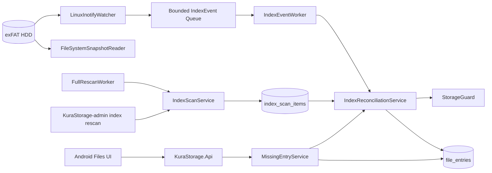
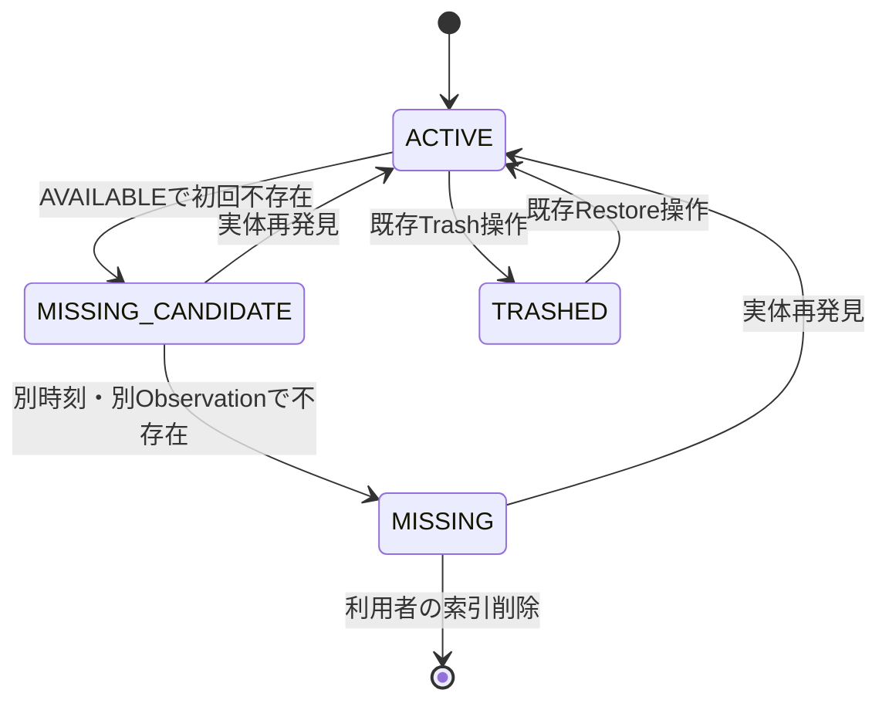

# 外部変更追従・MISSING管理 設計書

## 1. 設計方針

既存のClean Architecture、`FileEntry`索引、`StorageGuard`、PostgreSQL advisory lock、`KuraStorage.Worker`、AndroidのRepository・ViewModel境界を拡張する。HDD上の実ファイル、内容、物理階層を正とし、inotifyイベントは差分を早く発見するHint、全件再スキャンはイベント欠落を修復する最終的な収束手段として扱う。

索引照合はApplication層の共通Serviceへ集約し、管理CLI、`IndexEventWorker`、`FullRescanWorker`、明示再確認、File Open直前確認が同じ状態遷移を使用する。HDDとDBを更新する既存File操作とは異なり、外部変更追従は既にHDDで確定した状態をDBへ反映するため、新しい`FileOperation`は作成しない。代わりに`IndexScanRun`で走査の完全性を記録し、既存の未完了`FileOperation`と競合するPathは確定を延期する。



Pull Requestは次の順に分ける。

1. PR1: Domain、Schema、Filesystem Snapshot、全件再スキャン、管理CLI。
2. PR2: Linux inotify、Event処理、起動時・定期再スキャン、Worker・Raspberry Pi運用。
3. PR3: MISSING API、DBだけの索引削除、Android UI、全体E2E。

後続PRは依存元PRが`main`へMergeされた後に開始する。PR1・PR2の段階では本番設定の`Indexing.Enabled`を既定`false`とし、PR3でAndroidのProtocol対応と同時に本番有効化する。

## 2. 管理範囲とPath分類

### 2.1 通常索引対象

通常索引対象は次の形だけとする。

```text
users/<owner-user-id-n>/files/**
```

- `<owner-user-id-n>`をGUID `N`形式として解釈し、DBに存在するUserと既存の個人Root `FileEntry`へ対応付ける。
- `files`自身は既存User Root `FileEntry`へ対応し、新しいRootをScanから作らない。
- 配下は親Folderから順に処理し、DB上の`parent_id`を物理階層へ一致させる。
- File名は既存`FileName`、相対Pathは既存`RelativeStoragePath`で検証する。

### 2.2 除外・隔離対象

次は通常索引へ追加しない。

- Storage Root直下の`.storage-identity`。
- `users/<id>/trash/**`。
- Upload Session一時領域と既存Upload一時File。
- 将来追加されるDerivative・Cache・内部管理領域。
- `users`配下のGUIDでないnamespace、存在しないUser、Root未ProvisionのUser。
- Symbolic Link、Storage Root外へ解決されるPath、socket、device、FIFO等の特殊File。
- `FileName`または`RelativeStoragePath`の既存検証を満たさないPath。

除外規則は`ManagedStoragePathClassifier`へ集約し、Snapshotとinotifyの両方で共有する。未知領域や不正Pathは自動削除せず、Path本文をMetric Labelへ出さない低Cardinalityの理由別件数と、必要最小限の構造化Logだけを残す。

TrashはKuraStorage内部操作と保持期限清掃が管理するため、この機能の外部変更追従対象にしない。Trash実体の異常は既存Purge・Recovery運用で扱う。

## 3. Domain・データモデル設計

### 3.1 `FileEntryStatus`

```csharp
public enum FileEntryStatus
{
    Active,
    MissingCandidate,
    Missing,
    Trashed,
}
```

初期実装では正式文書にある`UPLOADING`と`ERROR`を`FileEntry`へ追加しない。Upload中は`UploadSession`、自動判断不能な操作は`FileOperation.RecoveryRequired`で管理する既存境界を維持する。

状態遷移は次のとおり。



- `ACTIVE`から`MISSING`への直接遷移は禁止する。
- `MISSING_CANDIDATE`から`MISSING`へ進めるには、最初のObservationと異なるIDかつ`MissingConfirmationDelay`経過後の確認を要求する。
- `MISSING`からの行削除は明示的な索引削除Use Caseだけが行う。
- `TRASHED`、Root、未完了`FileOperation`の対象は通常欠損遷移から除外する。

### 3.2 `FileEntry`追加列

| 列 | 型 | 用途 |
| --- | --- | --- |
| `source_modified_at` | `timestamptz null` | HDDが報告した最終更新日時 |
| `source_file_key` | `varchar(128) null` | Linux device・inode由来の補助同一性Key |
| `source_observed_at` | `timestamptz null` | 上記情報を観測した時刻 |
| `missing_detected_at` | `timestamptz null` | 最初の不存在確認時刻 |
| `missing_last_checked_at` | `timestamptz null` | 最後に不存在を確認した時刻 |
| `missing_observation_id` | `uuid null` | 最初の独立Observation識別子 |

- `status`列の最大長を16から32へ拡張し、`MISSING_CANDIDATE`を保存可能にする。
- `ACTIVE`では`missing_*`をすべて`null`、`MISSING_CANDIDATE`と`MISSING`では必須とするCheck Constraintを追加する。
- `source_file_key`は`stat`のdevice・inodeを正規化した非Path文字列とする。exFAT・再Mount・inode再利用の制約があるため、単独では同一性を確定しない。
- 内容VersionはSizeまたは`source_modified_at`変化、もしくはinotify `IN_CLOSE_WRITE`により内容変更が示された場合に増分する。Rename・Move、inode変化だけでは増分しない。
- 全件Checksumは通常Scanでは計算しない。Sizeとmtimeを意図的に保持した外部書換えは通常運用の対象外とし、必要時Checksum・将来Integrity Auditの拡張点を維持する。

### 3.3 一意制約

管理対象状態を`ACTIVE`、`MISSING_CANDIDATE`、`MISSING`と定義し、次を追加・変更する。

- `(owner_user_id, relative_path)`を管理対象状態で一意にする。
- `(owner_user_id, parent_id, name)`を管理対象状態で一意にする。
- User Rootは`ACTIVE`かつ`parent_id IS NULL`で従来どおり1件にする。
- `TRASHED`用の既存Path一意制約は維持する。

同じPathに実体が再出現した場合、新しい行を作らず既存の候補・欠損行を再照合して`ACTIVE`へ戻す。別Pathで発見した項目は、安全なMove対応付けができない限り新規行と旧行の候補化に分ける。

### 3.4 `IndexScanRun`

`index_scan_runs`を追加する。

| 列 | 内容 |
| --- | --- |
| `id` | Server生成UUID。Observation IDにも使用する |
| `trigger` | `STARTUP`、`SCHEDULED`、`OVERFLOW`、`ADMIN` |
| `mode` | `DRY_RUN`、`APPLY` |
| `status` | `RUNNING`、`COMPLETED`、`COMPLETED_WITH_WARNINGS`、`FAILED`、`CANCELLED` |
| `started_at`、`completed_at` | Server UTC |
| 集計 | enumerated、added、updated、moved、candidate、missing、revived、isolated、error count |
| `error_code` | 低CardinalityのRun全体Error。例外本文やPathは保存しない |

`index_scan_items`をAPPLY Scan中だけ使用する永続Staging Tableとして追加する。DRY_RUNは同じSchemaのPostgreSQL一時Tableを専用Connection上に作り、Transaction終了時に破棄するため、業務DBへ永続変更を残さない。

- `scan_id`、`relative_path`を複合主Keyにする。
- Owner、Parent path、Name、Type、Size、MIME、mtime、source file keyを保存する。
- 列挙中はBatch insertし、全件をProcess Memoryへ保持しない。
- APPLY Scan完了後に削除し、中断した古いStagingは次回起動時に保持期限を超えたものだけ清掃する。
- DRY_RUNは`IndexScanRun`も永続化せず、Process内で生成したRun IDと集計だけをCLIへ返す。
- StagingのPathは通常索引と同じ機密区分とし、API、Metric、通常Logへ公開しない。

`IndexScanRun`は通常のFile一覧へ公開せず、運用Log、Metric、管理CLIのRun IDと集計で確認する。

## 4. Filesystem Snapshot設計

Infrastructure層に`IManagedFileSystemSnapshotReader`を実装する。

```csharp
public interface IManagedFileSystemSnapshotReader
{
    IAsyncEnumerable<ObservedStorageEntry> EnumerateAsync(
        StorageSnapshotContext context,
        CancellationToken cancellationToken);

    Task<ObservedStorageEntry?> InspectAsync(
        RelativeStoragePath path,
        CancellationToken cancellationToken);
}
```

`ObservedStorageEntry`は相対Path、親Path、Name、EntryType、Size、MIME候補、mtime、source file keyだけを持ち、物理絶対PathをApplicationへ返さない。

実装規則は次のとおり。

- 走査開始前に`StorageGuard`をRead Intentで確認し、Mount Point、Storage Root実Path、Storage ID、読取可否を検証する。
- Directory単位で列挙し、`lstat`相当でSymbolic Linkを辿らない。
- 各Batch境界でStorage状態を再確認し、Storage IDまたはMountが変化したらRunを失敗させる。
- `UnauthorizedAccessException`、`IOException`を握り潰さず、個別隔離可能なEntry Errorと列挙完全性を失うRun Errorに分類する。
- Directoryを読めない場合は、その配下が存在しないと断定できないためRun全体を不完全として欠損確定を禁止する。
- MIMEは既存Extension規則を再利用し、内容全体を読み込まない。
- 一般FileのSizeは`long`、Folderは0とする。
- CancellationをDirectory・Batch単位で確認する。

## 5. 全件再スキャン設計

### 5.1 実行手順

```text
1. 固定Global Scan advisory lockを取得する。取得できなければ重複実行として終了する。
2. StorageGuard(Read)を確認する。
3. APPLYはIndexScanRun(RUNNING)を作成し、DRY_RUNは専用Connectionに一時Stagingを作成する。
4. 正式User領域をStreaming列挙し、検証済みEntryを永続または一時index_scan_itemsへBatch保存する。
5. 列挙完了後にStorageGuardとStorage IDを再確認する。
6. DB索引、Staging、未完了FileOperationを比較し、差分Planを作成する。
7. DRY_RUNなら集計をCLIへ返し、一時Stagingを破棄して永続DB変更なしで終了する。
8. APPLYなら差分を親から子、再発見、更新、移動、追加、欠損候補の順でBatch適用する。
9. 各Batchで対象FileEntryの現在状態と競合を再確認し、古いSnapshotで上書きしない。
10. IndexScanRunを完了し、Stagingを削除する。
11. Global lockを解放する。
```

全Scan結果を単一の巨大Transactionにはしない。Stagingを完全な観測Snapshotとして保持し、適用Batchごとに条件付き更新する。途中失敗した場合はRunを`FAILED`にし、次回Scanが最初から再計算する。追加・Metadata更新・再発見は冪等である。欠損確定だけは完走したSnapshotと確定直前の個別再確認を必要とするため、部分適用から誤確定しない。

### 5.2 差分分類

| HDD Snapshot | DB索引 | 分類 | 結果 |
| --- | --- | --- | --- |
| 存在 | 同じPath・`ACTIVE` | 一致/Metadata更新 | Metadata反映。内容変化時だけVersion増分 |
| 存在 | 同じPath・候補/欠損 | 再発見 | 同じIDを`ACTIVE`へ戻す |
| 存在 | 不在 | 外部追加 | 親が確定後に新規`FileEntry`作成 |
| 新Path存在 | 旧Pathだけ存在 | Move候補 | 一意に対応できる場合だけ同じIDを移動 |
| 不在 | `ACTIVE` | 初回不存在 | `MISSING_CANDIDATE` |
| 不在 | 候補 | 再確認 | Delay・Observation条件を満たせば`MISSING` |
| 不在 | `MISSING` | 継続 | 最終確認日時だけ更新 |
| 任意 | `TRASHED`/Root/操作中 | 対象外/延期 | 状態を変更しない |

### 5.3 Rename・Move同一性

優先順位は次のとおり。

1. 同じPathの再照合。
2. inotifyの同一`cookie`で対応する`IN_MOVED_FROM`と`IN_MOVED_TO`。
3. 同一Scan内で、旧Pathが不在、新Pathが未索引、Owner・Type・source file key・Size・mtimeが一致し、候補が1対1の場合。
4. 上記で一意にならなければ自動結合しない。

Folder Moveを確定した場合、対象Folder IDを維持し、既存のPrefix置換規則で子孫Pathを更新する。Move前後両方存在、複数候補、同名競合、未完了Operationがある場合は自動Moveを行わず隔離または次回再照合へ送る。

### 5.4 Scan中の変更

- Watcherを有効化してから起動時Scanを開始し、Scan中のEventをbounded Queueへ保持する。
- Scan適用後にQueueを現在のHDD状態から再照合するため、古いSnapshotによるMetadataは最終的にEvent結果で上書きされる。
- Scan中にQueue overflow、watch追加失敗、監視再作成が発生した場合はRun後にもう一度全件Scanを要求する。
- 欠損候補化・確定前は対象Pathを`InspectAsync`で再確認する。
- 同時API操作がDB状態を変更した場合はadvisory lock内で再読込し、条件不一致ならそのEntryをスキップしてEventまたは次回Scanへ戻す。

## 6. inotify・Worker設計

### 6.1 `LinuxInotifyWatcher`

Infrastructure層でlibcの`inotify_init1`、`inotify_add_watch`、`inotify_rm_watch`、`read`を限定P/Invokeする。新しいNuGet Packageは追加しない。

- `IN_CREATE`、`IN_CLOSE_WRITE`、`IN_ATTRIB`、`IN_DELETE`、`IN_MOVED_FROM`、`IN_MOVED_TO`、`IN_DELETE_SELF`、`IN_MOVE_SELF`を監視する。
- `IN_Q_OVERFLOW`を必ず検出する。
- watch descriptorと検証済み相対Directory pathのMapを保持し、絶対PathをEvent DTOへ渡さない。
- Move cookieは設定した短いPairing Window内だけ保持する。片側だけなら旧Pathと新Pathの個別照合へ変換する。
- 新規Directoryはwatch追加後に対象Directoryを個別走査し、作成とwatch開始の隙間を回収する。
- `SafeHandle`相当でfile descriptorを確実に閉じ、Cancellation時にread loopを終了する。
- Linux以外では本番起動を拒否する。Unit Test用Fake watcherはApplication abstractionへ実装する。

### 6.2 Bounded Queue・coalesce

`Channel<IndexEvent>`を`BoundedChannelFullMode.Wait`で作成し、native readerは`TryWrite`失敗時にEventを待たず、共有`RescanRequested`を立てる。Queue既定容量は4096とする。

- EventはPathごとに既定500ms debounceする。
- `CREATE + CLOSE_WRITE`は1回のupsert、連続`ATTRIB/CLOSE_WRITE`は最後の現在状態確認へ集約する。
- `DELETE + CREATE`は順序を推測せず現在Pathを再確認する。
- Queue overflow後の個別Event完全性は信用せず、全件Scan完了まで`RescanRequested`を維持する。
- Process停止でmemory Queueを失っても、次回起動時Scanが回収する。

### 6.3 `IndexEventWorker`

`KuraStorage.Worker`内のHosted Serviceとし、業務判定を持たない。

```text
1. StorageがAVAILABLEであることを確認する。
2. Event pathをManagedStoragePathClassifierで分類する。
3. Move pairまたは単一PathごとのIndexReconciliationServiceを呼ぶ。
4. 対象Entry・Parentのadvisory lock内でDBとHDDを再読込する。
5. 成功、延期、全件Scan要求へ分類する。
```

Storageが利用不可になった場合はWatcherを停止し、Eventを根拠に欠損状態を進めない。再Probeで同じStorage IDが`AVAILABLE`になったらWatcherを作り直し、起動時相当の全件Scan完了後にEvent処理を再開する。

### 6.4 `FullRescanWorker`

既存`KuraStorage.Worker`へ独立Hosted Serviceとして追加する。

- Process起動後、設定周期、`RescanRequested`時に`IndexScanService`を呼ぶ。
- 起動時はWatcher初期化後にScanする。Watcher初期化不能でもRunを失敗記録し、Backoff後に再試行する。
- Global advisory lockによりCLI・別Workerとの重複Scanを避ける。
- 1件の隔離可能Errorは`COMPLETED_WITH_WARNINGS`、列挙完全性喪失・Storage変化・DB障害は`FAILED`とする。
- `FAILED`後はRetry Backoff、正常完了後はIntervalを使う。
- TrashPurgeWorkerとは別Scope・別Loopにし、一方の例外で他方を停止させない。

## 7. MISSING判定・再確認・索引削除

### 7.1 二段階判定

初回不存在Observationでは次を保存する。

- `status = MISSING_CANDIDATE`
- `missing_detected_at = now`
- `missing_last_checked_at = now`
- `missing_observation_id = observationId`

確定には次をすべて要求する。

- Storageが同じStorage IDで`AVAILABLE`。
- 現在の対象Pathが不存在。
- `observationId != missing_observation_id`。
- `now >= missing_detected_at + MissingConfirmationDelay`。
- Root・`TRASHED`・未完了Operation対象でない。
- 対象Entry lock内の再読込後も`MISSING_CANDIDATE`。

`MissingConfirmationDelay`既定値は5分、許容範囲は1分〜24時間とする。Userの明示再確認がDelay前の場合は現在状態を確認するが、`MISSING`へ確定せず候補のまま返す。

Folderが不存在の場合、Snapshotで不存在が確認された管理対象子孫も同じObservationで候補化する。確定・再発見は親から子の順で行う。欠損Folderの索引削除は、配下がすべて`MISSING`である場合だけ許可し、`ACTIVE`、候補、`TRASHED`、操作中の子孫が1件でもあれば`409 FILE_STATE_CONFLICT`とする。

### 7.2 再発見

- 同じPathの候補・欠損行を優先して同じIDで`ACTIVE`へ戻す。
- Metadata、Parent、NameをHDDへ合わせ、`missing_*`を消去する。
- 内容Metadataが欠損前から変化した場合だけ`fileVersion`を増分する。
- 別Pathの場合は安全なMove同一性規則を満たすときだけ同じIDを再利用する。
- 同名競合、複数候補、親不整合は自動復帰せず`INDEX_CONFLICT`として次回Scanまたは運用確認へ残す。

### 7.3 索引削除

索引削除はDBだけのTransactionとし、`IFileStore`、`StorageGuard`のDelete Intent、`FileOperation`を呼ばない。

```text
1. Bearer認証からOwner Userを取得する。
2. target ID advisory lockを取得する。
3. 対象を所有User境界で再読込する。
4. status == MISSING、非Root、未完了Operationなしを確認する。
5. Folderなら全子孫がMISSINGであることを確認し、深い順に対象化する。
6. IPermanentDeleteParticipantのDB管理情報削除だけを呼ぶ。
7. FileEntryを深い順に削除し、成功Auditを同じTransactionで保存する。
8. Commitして204を返す。
```

既存`IPermanentDeleteParticipant.ListPhysicalArtifactsAsync`は呼ばず、`DeleteManagementDataAsync`だけを再利用する。将来Participantが物理削除を前提にすることを防ぐため、実装時にDB専用の`IFileIndexDeletionParticipant`へ分離する。現時点で未実装のShare、Recent、Derivative等の空実装・空Tableは追加しない。

## 8. API設計

### 8.1 File DTO

既存`FileEntry` Responseへ追加する。

```json
{
  "status": "MISSING",
  "missingDetectedAt": "2026-08-22T01:02:03Z",
  "missingLastCheckedAt": "2026-08-22T01:07:03Z"
}
```

- `missingDetectedAt`、`missingLastCheckedAt`は候補・欠損だけ値を持つ。
- 物理Path、`source_file_key`、Scan IDは返さない。
- 一覧は`ACTIVE`、`MISSING_CANDIDATE`、`MISSING`を同じ親Folderの管理対象として返す。
- Trash一覧は従来どおり`TRASHED`だけを返す。

### 8.2 明示再確認

```http
POST /api/v1/files/{fileId}/missing/recheck
Authorization: Bearer <access-token>
```

- Request Bodyは持たない。
- 所有Userの候補・欠損だけを対象にする。
- 成功は`200 OK`と再確認後の`FileEntry`を返す。
- 再発見、候補継続、欠損継続のいずれも現在状態をResponseで返す。
- 他User、Root、`ACTIVE`、`TRASHED`、不存在は`404 FILE_NOT_FOUND`へ統一する。
- Storage利用不可は`503 STORAGE_UNAVAILABLE`。
- 同時Scan・削除・File操作で状態が変化した場合は再読込後の状態を返すか、判断不能なら`409 INDEX_CONFLICT`とする。

### 8.3 一覧から削除

```http
DELETE /api/v1/files/{fileId}/missing-index-entry
Authorization: Bearer <access-token>
```

- 所有Userの確定`MISSING`だけを対象にする。
- 成功は`204 No Content`とする。削除後の再送は対象の所有関係を証明できないため`404 FILE_NOT_FOUND`とし、追加のHDD・DB削除は行わない。
- `ACTIVE`、候補、`TRASHED`、Root、他User、存在しない対象は`404 FILE_NOT_FOUND`へ統一する。
- 子孫状態競合または未完了Operationは`409 FILE_STATE_CONFLICT`。
- このEndpointはHDD利用不可時でも、対象が確定`MISSING`で競合がなければ実行できる。HDDへ一切アクセスしない。

### 8.4 File Openと禁止操作

- Download・Range開始直前に`StorageGuard(Read)`と`InspectAsync`を実行する。
- DBが`ACTIVE`でも実体がなければ、同じ対象lock内で`MISSING_CANDIDATE`にして`409 FILE_MISSING`を返す。
- DBが候補なら`409 FILE_MISSING_CANDIDATE`、確定欠損なら`409 FILE_MISSING`を返す。
- Rename、Move、Trash等の既存実体操作は候補・欠損を所有関係非開示の`404 FILE_NOT_FOUND`として拒否する。
- 一覧・詳細要求ではHDDを全走査せずDBから返す。

### 8.5 Protocol互換性

`FileEntryStatus`の列挙追加は旧Androidの`valueOf`に非互換なため、PR3でHealthの`protocolVersion`を1から2へ上げ、Androidの期待Versionも2へ上げる。

- PR1・PR2では`Indexing.Enabled=false`を既定とし、新状態を本番生成しない。
- Production rolloutは新Android配布、Server・Worker配置、Migration、Protocol 2確認、`Indexing.Enabled=true`の順とする。
- Protocol不一致のAndroidは既存Connection画面で更新要求を表示し、File APIへ進まない。
- 新Androidは未知Statusを`UNKNOWN`へ安全にMappingするが、`UNKNOWN`項目へ破壊的操作を提供しない。
- 新AndroidがProtocol 1 Serverへ接続した場合もProtocol不一致として更新待ちを表示する。

## 9. Android設計

### 9.1 Model・Repository

`FileEntryStatus`へ`MISSING_CANDIDATE`、`MISSING`、`UNKNOWN`を追加し、`valueOf`を安全なMapping関数へ置き換える。`FileEntry`へ`missingDetectedAt`と`missingLastCheckedAt`を追加する。

`FileRepository`へ次を追加する。

```kotlin
suspend fun recheckMissing(fileId: String): FileEntry
suspend fun removeMissingIndexEntry(fileId: String)
```

Repositoryは認証更新を既存`AuthenticatedRequestExecutor`へ委譲する。通信結果不明時は成功を返さず、一覧再取得によってServer状態を確認する。

### 9.2 ViewModel・UI

- `MISSING`は警告Icon、状態文言「ファイルが見つかりません」、最終確認日時を表示する。
- `MISSING_CANDIDATE`は「ファイルを確認中」と表示し、破壊的操作を無効にする。
- `UNKNOWN`は「アプリの更新が必要です」として操作を無効にする。
- 欠損項目を選択した場合はDownload、Rename、Move、Trashを表示せず、「再確認」と「一覧から削除」を表示する。
- 「一覧から削除」は「HDD上のファイルは削除しません。KuraStorageの一覧と関連管理情報から削除します」と確認する。
- 再確認・削除中は対象ID単位に二重Tapを防ぎ、成功後はPage 1から一覧を再取得する。
- Storage利用不可、候補継続、欠損継続、再発見、競合、通信結果不明を別のUI stateとして扱う。
- Compose Semanticsへ状態とAction labelを追加し、色だけで状態を表現しない。

## 10. 並行制御と整合性

### 10.1 Lock順序

既存`IFileRepository.AcquireMutationLocksAsync`を使用し、GUID昇順で取得する。

1. Full scanは固定Global Scan IDだけを長時間保持する。
2. Entry適用時はGlobal lockを保持したまま、対象Entry、旧Parent、新ParentをGUID昇順に短時間取得する。
3. Event、再確認、索引削除は対象Entryと必要なParentだけを取得する。
4. 既存File操作も同じEntry・Parent lockを使用するため、lock内再読込後の状態を正とする。

Global Scan lockは別Scanだけを排他し、APIの無関係なFile操作を全件停止しない。Batch間でDbContextを分け、候補取得Entityを追跡したままlock待ちしない。

### 10.2 `FileOperation`との関係

- `PENDING`、`FILESYSTEM_DONE`、`RECOVERY_REQUIRED`のOperationが対象またはPath prefixにある場合、Scan・Eventは状態確定を延期する。
- Operation完了後に発生するinotify Eventまたは次回Scanで再照合する。
- 外部変更追従はHDDを変更しないため、新しいOperation Journalを作成しない。
- Index Scan適用失敗はRun状態へ記録し、次回RunでHDDから再計算する。

### 10.3 競合例

| 競合 | 動作 |
| --- | --- |
| API Rename中に旧Path DELETE Event | Operation中なので延期し、Move完了後Eventで新Pathへ収束 |
| Scan後に同PathへFile再作成 | 候補化直前Inspectで再発見し、`ACTIVE`維持 |
| `MISSING`削除と実体再出現 | Entry lock内Inspectで再発見を優先し、索引削除をConflictにする |
| Worker停止中のMove | 起動時Scanで一意一致時だけID維持、曖昧なら新規＋旧候補 |
| HDD取外し中のDELETE Event | Storage unavailableとして状態変更せず、再接続Scanへ延期 |
| Queue overflow | 個別Eventを信用せずFull scan要求を維持 |

## 11. Error・Audit・観測性

### 11.1 Error Code

| HTTP/終了 | Code | 条件 |
| --- | --- | --- |
| 404 | `FILE_NOT_FOUND` | 他User、禁止状態、Root、存在しないAPI対象 |
| 409 | `FILE_MISSING_CANDIDATE` | 内容操作時に候補状態 |
| 409 | `FILE_MISSING` | 内容操作時に実体不存在または欠損確定 |
| 409 | `FILE_STATE_CONFLICT` | 子孫、Operation、同時更新で索引削除不能 |
| 409 | `INDEX_CONFLICT` | 同一性、同名、親子状態を安全に自動確定不能 |
| 409/CLI 3 | `INDEX_SCAN_ALREADY_RUNNING` | 別の全件Scanが実行中 |
| 503/CLI 4 | `STORAGE_UNAVAILABLE` | Mount、Storage ID、読取状態が不正 |
| CLI 1 | `INDEX_SCAN_FAILED` | Scanが不完全またはDB障害 |

APIは共通Error ResponseとRequest IDを使用し、例外本文やPathを返さない。

### 11.2 Audit

- Userの明示再確認と索引削除について、Action、結果、対象ID、Actor User・Device、Request ID、日時を記録する。
- Workerの各File差分をAuditへ大量記録せず、`IndexScanRun`集計と構造化Logを使用する。
- 索引削除成功AuditはFileEntry削除と同じDB Transactionで保存する。
- File名、相対・絶対Path、source file key、内容をAuditへ含めない。

### 11.3 Metric

- `index_watcher_up`
- `index_event_queue_length`
- `index_event_overflow_total`
- `index_scan_duration_seconds`
- `index_scan_last_success_timestamp_seconds`
- `index_scan_entries_total{result}`
- `file_entries_missing_total{status}`

LabelはRun trigger、result、reason等の固定集合だけとし、User ID、File ID、Pathを使用しない。

## 12. 設定・配置設計

`IndexingOptions`を追加する。

| 設定 | 既定値 | 検証 |
| --- | ---: | --- |
| `Enabled` | `false` | Boolean。PR3本番配置で`true` |
| `FullRescanIntervalHours` | 24 | 1〜168 |
| `BatchSize` | 500 | 10〜5000 |
| `EventQueueCapacity` | 4096 | 128〜65536 |
| `EventDebounceMilliseconds` | 500 | 50〜10000 |
| `MovePairingWindowMilliseconds` | 2000 | 100〜30000 |
| `MissingConfirmationDelayMinutes` | 5 | 1〜1440 |
| `RetryDelayMinutes` | 5 | 1〜1440 |
| `StagingRetentionHours` | 24 | 1〜168 |

- `appsettings.example.json`、Worker設定、設定検証、deployment Verifyを更新する。
- `kurastorage-worker.service`の既存非Root User、Storage Group、Secrets、HDD read accessを維持する。
- WorkerはHTTP Listenerを持たない。
- `LimitNOFILE`と`fs.inotify.max_user_watches`の現状値、必要watch数、余裕を配置前に確認する。
- sysctlは計測値に基づく必要最小値だけを専用設定Fileで変更し、無制限値を設定しない。
- UpgradeはDB Backup、Migration、Android Protocol 2配布、Server・Worker配置、dry-run、`Enabled=true`、本Scanの順とする。
- Rollback前に新状態件数を確認し、旧Binaryが未知Statusを読まないようMigration Downだけを先行実行しない。

## 13. 管理CLI設計

```text
kurastorage-admin index rescan --dry-run
kurastorage-admin index rescan
```

- `--dry-run`以外の未知Optionを終了Code 2で拒否する。
- Applicationの`IIndexScanService`を呼び、直接SQL・物理Path組立てを行わない。
- 標準出力はRun ID、status、件数集計だけとする。
- 個別Pathを表示する詳細Modeは初期実装で追加しない。
- 成功0、Run失敗1、引数不正2、Scan重複3、Storage unavailable 4とする。
- dry-run、本実行ともGlobal Scan lockとStorage検証を行う。

## 14. セキュリティ・プライバシー

- API入力はFile IDだけとし、ClientからPath、Owner ID、Observation IDを受け取らない。
- User所有権はJWT `sub`とDB行で検証し、他Userと禁止状態を`FILE_NOT_FOUND`へ統一する。
- `ManagedStoragePathClassifier`と`RelativeStoragePath`をSnapshot、Event、再確認の全経路で通す。
- Native inotifyの可変長Event名は長さ、NUL、UTF-8/Filesystem encoding、Path separatorを検証し、未検証文字列をPath結合しない。
- Symbolic Linkは列挙・Inspect・Openの全段階で拒否する。
- 索引削除Endpointから`IFileStore`へ到達できないApplication依存境界をTestする。
- Staging TableとFileEntryのPathは既存DB Backup・権限・Log秘匿方針に従う。
- Metrics、Health、匿名Endpointへ物理Path、Storage ID、User別件数を追加しない。

## 15. パフォーマンス・資源制御

- 30万件を基準にStreaming列挙、500件Batch、keyset paginationを使用し、全件`ToList`を禁止する。
- StagingへのBatch insertはNpgsql/EF Coreのparameter上限とTransaction時間を測定して調整する。
- 差分比較用Indexを`scan_id, relative_path`、管理対象`owner_user_id, relative_path`へ作成する。
- 通常一覧と詳細はDB索引だけを使用し、HDD全走査を行わない。
- Event Queueはboundedとし、過負荷時はDropを隠さずFull scanへ切り替える。
- WorkerのCPU・IO優先度はAPIより低い既存systemd方針を維持する。
- 実機でScan時間、CPU、RSS、DB負荷、HDD I/O、API p95を測定し、正式性能目標を満たさない場合はBatch・周期を文書と同時に調整する。
- 通常Scanで全File Checksumを計算せず、HDD全読込みによるAPI・媒体寿命への影響を避ける。

## 16. テスト戦略

### 16.1 Domain・Application Test

- 全許可・禁止状態遷移、Confirmation Delay境界、異なるObservation、再発見。
- 内容変更と配置変更の`fileVersion`規則。
- Same path、move cookie、1対1 source key、曖昧Moveの分類。
- 親子順序、Folder子孫、孤児、同名競合、未知User、未完了Operation延期。
- Scan、Event、再確認、索引削除の冪等性と条件付き更新。
- 索引削除がDB Participantだけを呼び、Filesystem abstractionを呼ばないこと。

### 16.2 PostgreSQL・Filesystem Integration Test

- Migration Up/Down、Check Constraint、部分Unique Index、Global/Entry advisory lock。
- Staging Batch、Run失敗・取消、古いStaging清掃、dry-run非変更性。
- 実Filesystemで追加、更新、Rename、Move、削除、Folder子孫、Unicode、深度境界、空Folder。
- Symbolic Link、特殊File、Storage Root外、未知User、読取不能Directory。
- HDD未Mount、Storage ID不一致、read-only、Scan中切断、DB停止で誤欠損しないこと。
- 走査中のAPI Rename・Move・Trash・Purge・Upload確定との競合。

### 16.3 Linux inotify Test

- 実Linux kernelで全対象Mask、Move cookie、新規Directory watch、watch削除を確認する。
- Event重複、順序逆転、Burst、Queue full、`IN_Q_OVERFLOW`を再現する。
- Worker停止中変更、起動時race、watch limit、Watcher再作成からFull scanへ収束する。
- Native descriptor leakがなく、graceful shutdownできる。

### 16.4 API・Android Test

- File DTO、再確認、索引削除、状態別Error、所有関係非開示、Open直前存在確認。
- Protocol 1/2不一致と未知Status安全Mapping。
- 欠損・候補・未知表示、Action、確認Dialog、二重Tap、再取得、通信結果不明。
- Compose Semantics、画面回転、Back、競合、Storage unavailable。

### 16.5 実機・性能E2E

- Raspberry Pi、共有exFAT HDD、PostgreSQL、Android実機で外部変更からUI収束まで確認する。
- HDD取外し、同一HDD再接続、別Storage ID、Worker/API/DB停止、Event overflowを障害注入する。
- 30万件相当または再現可能な縮尺データでScan・Burst・API併行負荷を測定する。
- 既存Upload、Resume、Download、Range、Folder、Rename、Move、Trash、Restore、Purgeを回帰確認する。

## 17. 依存関係

新しいNuGet、Gradle、Native packageは原則追加しない。

- inotifyはLinux libcへの限定P/Invokeで実装する。
- DBは既存EF Core・Npgsqlを使用する。
- Queueは`System.Threading.Channels`を使用する。
- Androidは既存Kotlin Coroutines、kotlinx.serialization、Composeを使用する。

実装調査でP/Invokeの保守性または対象Architecture互換性を満たせない場合だけ、保守済みinotify Libraryを比較し、正式文書、lock file、Security検査、依存理由を同じPRで更新する。

## 18. 変更予定構造

```text
server/src/
├── KuraStorage.Domain/
│   └── Indexing/
│       ├── IndexScanRun.cs
│       └── IndexingEnums.cs
├── KuraStorage.Application/
│   ├── Abstractions/IndexingAbstractions.cs
│   └── Indexing/
│       ├── IndexScanService.cs
│       ├── IndexReconciliationService.cs
│       ├── MissingEntryService.cs
│       └── IndexingContracts.cs
├── KuraStorage.Infrastructure/
│   ├── Indexing/
│   │   ├── ManagedStoragePathClassifier.cs
│   │   ├── FileSystemSnapshotReader.cs
│   │   ├── LinuxInotifyWatcher.cs
│   │   └── IndexEventQueue.cs
│   └── Persistence/
│       ├── Configurations/IndexScanRunConfiguration.cs
│       └── Migrations/<timestamp>_AddIndexReconciliation.cs
├── KuraStorage.Api/
│   └── Files/MissingEndpoints.cs
├── KuraStorage.AdminCli/
│   └── Program.cs
└── KuraStorage.Worker/
    └── Workers/
        ├── IndexEventWorker.cs
        └── FullRescanWorker.cs

apps/android/
├── core-model/.../FileModels.kt
├── core-network/.../ApiContracts.kt
├── core-network/.../KuraStorageApi.kt
├── core-data/.../FileRepository.kt
└── feature-files/
    ├── .../FileBrowserViewModel.kt
    └── .../FileBrowserScreen.kt

deployment/raspberry-pi/
docs/testing/
.steering/20260822-external-change-missing-management/
```

実際のnamespaceとFile配置は既存Repository構造を優先し、機械的に不要な小Fileへ分割しない。

## 19. 実装順序

1. `FileEntry`状態・Metadata、Scan Run/Staging、Migration、Repository契約を追加する。
2. Path分類、Snapshot Reader、Scan差分分類、二段階欠損、dry-run・管理CLIを実装する。
3. PR1のDomain・Integration・性能Test、正式文書、Migration運用を完了する。
4. Linux inotify adapter、bounded Queue、coalesce、Event reconciliationを実装する。
5. `IndexEventWorker`、`FullRescanWorker`、Options、systemd・deployment・Metricを実装する。
6. PR2のLinux・Worker・Raspberry Pi実機Testと運用文書を完了する。
7. Missing再確認・索引削除API、File Open存在確認、OpenAPI、Protocol 2を実装する。
8. Android Model、Repository、ViewModel、Compose UI、Protocol対応を実装する。
9. PR3のServer・Android自動Test、全体実機E2E、正式文書整合を完了する。

## 20. 将来拡張

- Searchは`ACTIVE`索引だけを検索対象とし、候補・欠損を状態Filterで明示的に扱う。
- Share、Recent、Backup Receipt、Derivative追加時は`IFileIndexDeletionParticipant`へ参加し、索引削除後に孤児を残さない。
- Derivative追加後は内容Version増分・欠損確定・索引削除をCache無効化契約へ接続する。
- Integrity Auditが必要になった場合は、低優先度のChecksum Jobと保存済みChecksumを追加し、通常全件Scanと分離する。
- 複数Storage Rootまたは複数HDD対応時は、FileEntryとScan RunへStorage ID参照を追加し、現行単一Storageの暗黙境界をMigrationする。
- Web Clientは同じFile状態、再確認、索引削除APIを使用し、物理Pathを扱わない。

## 21. 設計上の判断まとめ

- inotifyは高速追従、全件再スキャンは欠落修復の正とし、どちらも共通照合Serviceへ集約する。
- Scanは永続StagingへStreaming保存し、完走・Storage再確認後だけ欠損判定へ使用する。
- 外部Moveはcookieまたは一意な複合情報で確定できる場合だけIDを維持し、曖昧時は誤結合しない。
- `MISSING`は異なるObservationと5分以上の間隔を要求し、Storage障害を個別欠損へ変換しない。
- 索引削除はDBだけを変更し、Filesystem Serviceへ到達しない。
- 列挙型追加はProtocol 2として扱い、Android更新と索引機能有効化を同じ最終Rolloutで行う。
- 通常Scanでは全File Checksumを計算せず、mtime・Size・inotify write eventを内容変更Signalとする。
