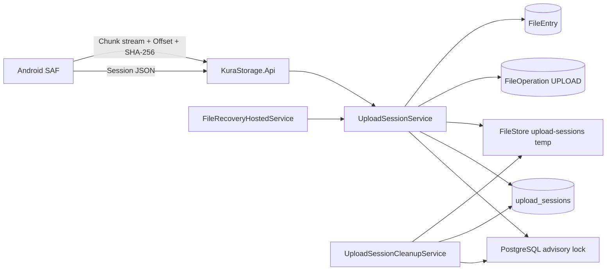

# 分割アップロード・中断再開 設計書

## 1. 設計方針

既存のClean Architecture、Streaming Multipart Upload、`FileOperation` Journal、PostgreSQL advisory lock、`StorageGuard`、同一Filesystem上のatomic renameを拡張する。Upload Sessionの進捗はPostgreSQLを正、一時Fileの内容はHDDを正とし、各Chunk確定時に「一時FileをdurableにしてからDBの確定Offsetを進める」順序を守る。障害時に一時FileがDBより先へ進んだ場合はDB Offsetへtruncateできるが、DBが一時Fileより先へ進む状態は自動成功扱いにしない。

Upload Session APIは既存`POST /api/v1/files/upload`と別Resourceとして追加する。初回実装は1 Sessionにつき1本の一時Fileへ、Serverが返したOffset順に直列追記する。並列・順不同Chunkは採用せず、Androidは最大1 ChunkだけをMemoryへ保持してSHA-256を付与する。これにより、File全体Bufferingを避けつつ、Chunk単位の破損・重複再送を検証する。



## 2. 確定する初期値

初期値は型付き`UploadSessionOptions`へ置き、Server起動時に検証する。実機測定で変更した場合は、正式文書、設定例、Test、運用記録を同じ変更で更新する。

| 設定 | 初期値 | 検証 |
| --- | ---: | --- |
| `PreferredChunkBytes` | 4 MiB | 256 KiB〜`MaximumChunkBytes` |
| `MaximumChunkBytes` | 8 MiB | 256 KiB〜64 MiB |
| `MaximumFileBytes` | 1 TiB | 1 Byte以上、`long`範囲内 |
| `IdleExpirationHours` | 24 | 1〜168 |
| `AbsoluteExpirationHours` | 168 | `IdleExpirationHours`以上、最大720 |
| `CleanupIntervalMinutes` | 15 | 1〜1440 |
| `CleanupBatchSize` | 100 | 1〜500 |
| `MaximumActiveSessionsPerUser` | 10 | 1〜100 |
| `MaximumActiveSessionsPerDevice` | 5 | 1〜50、User上限以下 |
| `MaximumConcurrentChunkWrites` | 2 | 1〜16 |
| `OverloadRetryAfterSeconds` | 5 | 1〜300 |

- Chunk成功時に`expiresAt = min(now + IdleExpirationHours, absoluteExpiresAt)`へ延長する。
- 状態照会は期限を延長しない。
- 最終Chunkだけは256 KiB未満を許可する。File Sizeが256 KiB未満の場合は1 Chunkで送信する。
- Androidは`min(PreferredChunkBytes, ServerのmaximumChunkBytes)`を使用する。
- `MaximumFileBytes`以下でも、`StorageOptions.MinimumFreeBytes`を差し引いた利用可能容量を満たさない場合はSessionを作成しない。

## 3. API・契約設計

### 3.1 共通規則

- Base pathは既存どおり`/api/v1`とし、既存Endpointの意味は変更しない。
- 全EndpointでBearer認証、`sub`、`device_id`、Deviceの`ACTIVE`状態を検証する。
- Sessionは作成したUserとDeviceへBindingする。別Deviceからの引継ぎは今回提供しない。
- `Idempotency-Key`はUUID文字列を必須とし、Session作成から完了まで同じ値を使用する。
- DateTimeはUTCのISO 8601、Checksumは64文字のlowercase SHA-256 hexとする。
- Chunk Requestは`application/octet-stream`とし、Multipartへ入れない。
- Success ResponseとOffset Conflict Responseには`Upload-Offset` Headerを付け、Clientはこの値をServer確定Offsetとして扱う。
- Error Bodyは既存の共通Error形式を維持し、物理PathやSession Metadataを含めない。

### 3.2 Session作成

`POST /api/v1/upload-sessions`

Header:

```text
Authorization: Bearer <access-token>
Idempotency-Key: <uuid>
Content-Type: application/json
```

Request:

```json
{
  "destinationFolderId": "uuid",
  "fileName": "video.mp4",
  "contentType": "video/mp4",
  "size": 4294967296,
  "sha256": "64-lowercase-hex"
}
```

Android手動アップロードはSession作成前に送信元をStreaming走査して全体SHA-256を計算し、`sha256`を必ず送る。API契約上は将来Consumerのためnullableを維持する。

新規作成は`201 Created`と`Location`、同一Key・同一Metadataの再送は`200 OK`を返す。Response:

```json
{
  "id": "uuid",
  "status": "ACTIVE",
  "size": 4294967296,
  "receivedBytes": 0,
  "nextOffset": 0,
  "preferredChunkBytes": 4194304,
  "maximumChunkBytes": 8388608,
  "expiresAt": "2026-08-23T00:00:00Z",
  "absoluteExpiresAt": "2026-08-29T00:00:00Z",
  "resumable": true,
  "file": null
}
```

作成時は空の一時Fileを作らない。最初のChunk受信時にSession IDから決まる検証済み相対Pathへ作成する。DB作成だけが成功した状態は`receivedBytes=0`として正常に再開できる。

### 3.3 Session状態照会

`GET /api/v1/upload-sessions/{sessionId}`

- 作成User・Deviceが一致するSessionだけを返す。
- Responseは3.2と同じ型を使用する。
- `COMPLETED`では`file`に既存`FileItem`を返す。
- `CANCELLED`、`EXPIRED`、`RECOVERY_REQUIRED`では`resumable=false`とする。
- 他User、別Device、存在しないSessionは`404 UPLOAD_SESSION_NOT_FOUND`へ統一する。
- 期限到達済み`ACTIVE`を照会した場合はLock内で`EXPIRED`へ遷移させ、`409 UPLOAD_SESSION_EXPIRED`を返す。物理削除は同要求またはCleanupで冪等に行う。

### 3.4 Chunk送信

`PUT /api/v1/upload-sessions/{sessionId}/chunks`

Header:

```text
Content-Type: application/octet-stream
Content-Length: <chunk-bytes>
Upload-Offset: <zero-based-byte-offset>
X-Chunk-Sha256: <64-hex>
```

- `Content-Length`、`Upload-Offset`、`X-Chunk-Sha256`は必須とする。SHA-256は大文字・小文字の16進を受け付け、Server内とResponseで小文字へ正規化する。
- 通常Chunkは256 KiB以上かつServerの`maximumChunkBytes`以下、最終Chunkは残Byte数と同じ長さを必須とする。
- `offset + Content-Length`が期待Sizeを超える要求はBodyを書き込む前に拒否する。
- 正常時は`200 OK`で、受信したChunkのOffset、Length、SHA-256、更新後の`receivedBytes`、`nextOffset`、`expiresAt`を返す。
- 直前に確定したChunkと同じOffset、Length、SHA-256の再送はBodyを制限付きで読み取ってSHA-256を再検証し、Fileへ追記せず同じ成功Responseを返す。
- 直前より古いOffset、異なる直前Chunk、未来Offset、Gap、Overlapは`409 UPLOAD_OFFSET_MISMATCH`とし、現在の`Upload-Offset` Headerを返す。
- Androidは最大1 ChunkをByteArrayへ読み込み、SHA-256を計算後に送る。Memory上限はServerの最大Chunk Sizeで固定され、File Sizeには比例しない。
- ServerはRequest Bodyを64 KiBから1 MiBの固定BufferでStreamingし、Chunk全体をMemoryへ保持しない。

### 3.5 Session完了

`POST /api/v1/upload-sessions/{sessionId}/complete`

- Request Bodyは不要とする。
- `receivedBytes == size`、一時File長、全体SHA-256、保存先、認可、同名競合、Storage状態をLock内で再検証する。
- 成功は`200 OK`で既存`FileItem`を返す。
- `COMPLETED`への再送は同じ`FileItem`を返す。
- 未受信Byteがある場合は`409 UPLOAD_INCOMPLETE`と`Upload-Offset`を返す。
- 全体Checksum不一致は一時Fileを0 Byteへtruncateし、Sessionを`ACTIVE`、`receivedBytes=0`へ戻して`422 UPLOAD_CHECKSUM_MISMATCH`を返す。同じSessionとKeyで先頭から再送できる。
- 一時File長がDB Offsetより短い等、安全にリセットできない不整合は`RECOVERY_REQUIRED`とする。

### 3.6 Session取消

`DELETE /api/v1/upload-sessions/{sessionId}`

- `ACTIVE`だけを`CANCELLED`へ遷移できる。
- `CANCELLED`への再送は`204 No Content`とする。
- `COMPLETED`はFile削除操作ではないため`409 UPLOAD_SESSION_COMPLETED`とし、公開Fileを削除しない。
- DB状態を先に`CANCELLED`へ確定してChunk受付を停止し、その後一時Fileを冪等削除する。
- 物理削除失敗時もSessionを再開可能へ戻さず、Cleanup対象として残して`503 STORAGE_UNAVAILABLE`を返す。

### 3.7 Error対応

| Code | HTTP | 用途 |
| --- | ---: | --- |
| `VALIDATION_FAILED` | 400 | Header、UUID、名前、Size、Checksum形式不正 |
| `AUTHENTICATION_REQUIRED` | 401 | Token不正・期限切れ |
| `UPLOAD_SESSION_NOT_FOUND` | 404 | 不在、他User、別Device |
| `FILE_NOT_FOUND` | 404 | 保存先Folder不在・非公開 |
| `IDEMPOTENCY_CONFLICT` | 409 | 同一KeyのMetadata不一致 |
| `FILE_NAME_CONFLICT` | 409 | 作成時・完了時の同名競合 |
| `UPLOAD_OFFSET_MISMATCH` | 409 | Offset、重複Chunk内容、Gap、Overlap不一致 |
| `UPLOAD_INCOMPLETE` | 409 | 全Byte受信前の完了 |
| `UPLOAD_SESSION_EXPIRED` | 409 | 期限到達 |
| `UPLOAD_SESSION_CANCELLED` | 409 | 取消済みSessionの更新 |
| `UPLOAD_SESSION_COMPLETED` | 409 | 完了済みSessionのChunk・取消 |
| `RECOVERY_REQUIRED` | 409 | 自動判断不能なDB・HDD状態 |
| `CHUNK_SIZE_LIMIT_EXCEEDED` | 413 | Chunk上限超過 |
| `FILE_SIZE_LIMIT_EXCEEDED` | 413 | File上限超過 |
| `CHUNK_CHECKSUM_MISMATCH` | 422 | Chunk SHA-256不一致 |
| `UPLOAD_CHECKSUM_MISMATCH` | 422 | 全体SHA-256不一致 |
| `UPLOAD_LIMIT_REACHED` | 429 | Session数・同時Chunk上限。`Retry-After`付き |
| `STORAGE_CAPACITY_INSUFFICIENT` | 507 | 空き容量不足 |
| `STORAGE_UNAVAILABLE` | 503 | Mount、read-only、I/O障害 |

## 4. Domain・Persistence設計

### 4.1 UploadSession Aggregate

状態は次の6種類に限定する。

| 状態 | 意味 | 許可する操作 |
| --- | --- | --- |
| `ACTIVE` | 作成済み・Chunk受付中 | 照会、Chunk、完了、取消、期限切れ |
| `COMPLETING` | 全体検証済み・公開処理中 | 照会、Recovery |
| `COMPLETED` | File公開とDB確定済み | 照会、完了再送 |
| `CANCELLED` | Client取消またはDevice失効 | 照会、物理清掃 |
| `EXPIRED` | 有効期限到達 | 照会、物理清掃 |
| `RECOVERY_REQUIRED` | 自動判断不能 | 管理者確認、Recovery |

`CREATED`と`UPLOADING`は分けず、`ACTIVE.receivedBytes`が0か否かで判別する。公開処理だけはChunk・Cleanupを停止する必要があるため`COMPLETING`を独立させる。

主なField:

- `id`
- `owner_user_id`
- `device_id`
- `destination_folder_id`
- `file_entry_id`: 作成時に予約する公開File ID
- `file_operation_id`: 完了開始時に作成するJournal ID、nullable・unique
- `idempotency_key`
- `file_name`
- `content_type`
- `expected_size`
- `expected_sha256`
- `received_bytes`
- `last_chunk_offset`、`last_chunk_length`、`last_chunk_sha256`
- `temporary_relative_path`: `upload-sessions/<owner-id>/<session-id>.upload`
- `status`、`error_code`
- `created_at`、`updated_at`、`expires_at`、`absolute_expires_at`、`completed_at`

Sessionに物理絶対Path、File内容、Access Tokenを保存しない。File名とContent Typeは公開File作成に必要な業務MetadataとしてSessionへ保存するが、Auditと通常Logには出さない。

### 4.2 制約とIndex

- `(owner_user_id, idempotency_key)`を一意にする。
- `expected_size >= 0`、`0 <= received_bytes <= expected_size`をCheck Constraintにする。
- `expires_at <= absolute_expires_at`をCheck Constraintにする。
- `file_operation_id`はnullable uniqueとし、1 Sessionから複数の公開Journalを作成できないようにする。
- Cleanup用に`(status, expires_at, id)`、Device失効用に`(device_id, status, id)`、上限集計用に`(owner_user_id, status)`をIndex化する。
- FileEntry、Device、User、保存先FolderとのForeign Keyは削除規則を明示し、未完了SessionがあるDeviceやFolderを暗黙Cascadeで消さない。保存先FolderがPurgeされた場合は`destination_folder_id`だけを`SET NULL`とし、Sessionの完了を拒否しつつ一時Fileを期限Cleanupで回収する。
- EF CoreのConcurrency Tokenと条件付きUpdateを設定するが、正当性はSession advisory lockとLock内再読込で保証する。

### 4.3 Repository境界

Application層へ`IUploadSessionRepository`を追加し、次を提供する。

- User・Key、Session ID、Device別Session取得
- Active Session数取得
- 期限切れ候補の期限順・ID順Batch取得
- Session advisory lock取得
- Destination File操作Lock取得
- Session、FileOperation、FileEntry、Auditを同一Transactionで確定するUnit of Work

Endpoint、Hosted Service、Android固有層から`DbContext`を直接呼ばない。

## 5. Chunk書込み・確定設計

### 5.1 新規Chunk

```text
1. 認証、Header形式、Content-Length上限を検証する。
2. Session ID由来のPostgreSQL transaction advisory lockを取得する。
3. Sessionを再読込し、User、Device、ACTIVE、期限、Offset、残Byteを検証する。
4. StorageGuardをCreateOrUpdate intentで検証する。
5. 一時Fileを開く。receivedBytes=0なら新規作成、既存なら長さを照合する。
6. File長 > receivedBytesならDB Offsetへtruncateする。File長 < receivedBytesならRECOVERY_REQUIREDにする。
7. Request Bodyを固定Bufferで追記し、実長とSHA-256を計算する。
8. 長さまたはSHA-256不一致ならreceivedBytesへtruncateし、DB進捗を変更しない。
9. Flushし、File内容をdurableにする。
10. receivedBytes、last chunk、expiresAtを更新してCommitする。
11. Upload-OffsetとChunk結果を返してLockを解放する。
```

DB更新失敗やProcess停止でFileだけが進んでも、次回の手順6でDB Offsetへ戻せる。DB Offsetはdurable Fileより先に進めない。

### 5.2 直前Chunkの冪等再送

`Upload-Offset == last_chunk_offset`かつLengthとHeader SHA-256が保存値と一致する場合だけ冪等候補とする。ServerはRequest Bodyを上限付きで最後まで読み、実長とSHA-256を検証する。一致すればFileへ書かず現在Offsetを返す。不一致なら`CHUNK_CHECKSUM_MISMATCH`または`UPLOAD_OFFSET_MISMATCH`とし、DB・Fileを変更しない。

Clientは次Chunkの成功を受け取るまで先のChunkを送らないため、応答不明再送で必要なのは直前Chunkだけである。それ以前のOffsetはBodyを書き込まず`UPLOAD_OFFSET_MISMATCH`と現在Offsetを返し、Clientは状態照会へ移る。Chunk履歴Tableは追加しない。

## 6. 完了・FileOperation・Recovery設計

### 6.1 正常完了

```text
1. Session lockを取得し、ACTIVE、期限、receivedBytes、File長を検証する。
2. 一時FileをStreamingして全体SHA-256を検証する。
3. 保存先Folderと名前から公開先を再解決する。
4. Session lockを保持したまま、保存先Folder ID由来のFile操作Lockを取得する。
5. 保存先、認可、同名、StorageをLock内で再検証する。
6. SessionをCOMPLETINGにし、FileOperation(UPLOAD, PENDING)を同じDB Transactionで保存する。
7. 一時Fileを公開先へatomic renameする。
8. FileOperationをFILESYSTEM_DONEへ保存する。
9. FileEntry作成、UploadSession COMPLETED、成功Audit、FileOperation COMPLETEDを1つのDB Transactionで確定する。
10. FileItemを返し、Lockを解放する。
```

File IDはSession作成時に予約し、一時Pathと公開後FileEntryで同じIDを使う。既存Multipart Uploadと同じFile名一意制約を最終防壁として維持する。

### 6.2 Recovery状態表

| Session状態 | Operation | 一時File | 公開File | FileEntry | 復旧 |
| --- | --- | --- | --- | --- | --- |
| `ACTIVE`、offset 0 | なし | 不在/空 | 不在 | 不在 | 正常。次Chunk受付 |
| `ACTIVE` | なし | DB Offsetと同長 | 不在 | 不在 | 正常。再開 |
| `ACTIVE` | なし | DB Offsetより長い | 不在 | 不在 | DB Offsetへtruncateして再開 |
| `ACTIVE` | なし | DB Offsetより短い | 不在 | 不在 | `RECOVERY_REQUIRED` |
| `COMPLETING` | `PENDING` | 存在 | 不在 | 不在 | 完了処理を再実行 |
| `COMPLETING` | `PENDING`/`FILESYSTEM_DONE` | 不在 | 存在 | 不在 | FileEntry・Session・OperationをTransaction確定 |
| `COMPLETING` | 任意 | 存在 | 存在 | 任意 | 矛盾として`RECOVERY_REQUIRED` |
| `COMPLETED` | `COMPLETED` | 不在 | 存在 | 存在 | 正常、冪等応答 |
| `CANCELLED`/`EXPIRED` | なし | 存在 | 不在 | 不在 | 一時Fileを冪等削除 |
| 任意 | 任意 | 不在 | 不在 | 存在 | 公開済み索引と物理不一致。既存Missing方針に従い隔離 |

- `FileRecoveryHostedService`が既存`FileOperationRecoveryService`とUpload Session Recoveryを起動時および5分周期で実行する。
- Recoveryは通常処理と同じSession・Destination lockと内部確定Methodを使用する。
- Storage未利用時は物理状態を推測せず次回へ延期する。
- Recovery成功AuditはOperation IDとActionの一意性で重複を防ぐ。

## 7. 期限切れ・取消・Device失効Cleanup

### 7.1 Cleanup処理

`UploadSessionCleanupService`をApplicationへ置き、既存API内Hosted Serviceから起動時と15分周期に呼び出す。独立Workerは追加しない。

```text
1. 固定Global Cleanup advisory lockを取得する。取得できなければ今回Runを終了する。
2. status=ACTIVEかつexpiresAt<=nowのSessionを期限順・ID順に100件取得する。
3. SessionごとにSession lockを取得し、状態と期限を再検証する。
4. ACTIVEならEXPIREDへ先にDB確定し、新規Chunkと完了を停止する。
5. 一時Fileを冪等削除する。
6. 削除失敗はEXPIREDのままerrorCodeを記録し、次回のterminal cleanup候補にする。
7. CANCELLED、EXPIREDで一時File残存の可能性があるSessionも同じBatch上限で再削除する。
8. Batchが上限件数未満になるまで繰り返し、Cancellationを各Batch間で確認する。
```

Global lockはRun記録Tableを新設せず、重複走行防止だけに使用する。Run結果はMetricと構造化Logへ件数だけを記録する。File名、Path、Checksumは記録しない。

### 7.2 Device失効

- Device失効Application処理が対象Deviceの`ACTIVE` SessionをBatch取得する。
- 各Session lock内で`CANCELLED`へ遷移し、`errorCode=DEVICE_REVOKED`を記録する。
- 状態を先に確定後、一時Fileを冪等削除する。
- 削除失敗はCleanupへ引き継ぐ。Device失効Transactionを物理削除待ちでRollbackしない。
- 別DeviceへのSession引継ぎは今回提供しない。将来追加時はDevice失効、監査、Backup Receiptとの関係を別設計する。

## 8. Android設計

### 8.1 Model・Repository

`UploadOperation`へ次を追加する。

- `sessionId: String?`
- `confirmedOffset: Long`
- `status: UploadState`
- `expiresAt: Instant?`
- `sha256: String`: Android手動Uploadでは必須

状態は`PREPARING`、`CREATING_SESSION`、`UPLOADING`、`PAUSED`、`VERIFYING`、`COMPLETED`、`CANCELLED`、`FAILED`とする。Server状態を置換せず、UI表示用の別Enumとして扱う。

`TransferRepository`は次のFlowを実装する。

```text
1. SAF URIをStreaming走査し、Sizeを再確認しながら全体SHA-256を計算する。
2. Sessionを作成する。同一UploadOperationのRetryでは同じIdempotency-Keyを使う。
3. ContentStreamを開き、Server nextOffsetへ移動する。
4. 最大4 MiBをByteArrayへ読み、Chunk SHA-256を計算する。
5. Offset、Length、ChecksumとともにChunkを送る。
6. Client計算ChecksumとServer Responseを比較し、confirmedOffsetを更新する。
7. 全Byte送信後にcompleteを呼ぶ。
8. 完了Fileを受け取り、一覧を再取得する。
```

通常送信中は同じInputStreamをChunk間で継続利用する。再接続またはOffset再同期時だけStreamを開き直す。Offset移動はseek可能なProviderではFile Descriptorを使用し、不可の場合は64 KiB Bufferで読み捨てる。物理Pathへ変換せず、Offset分のByteArrayを作らない。

### 8.2 再試行

- Response不明、接続切断、401 Refresh、429、再試行可能503ではSession GETを実行する。
- Serverの`nextOffset`を正としてStreamを開き直し、次Chunkから再開する。
- Chunk PUTのResponse前に失敗した場合は同じChunk ByteArray、Offset、Length、SHA-256を再送できる。
- `Retry-After`がある場合はその秒数を優先し、ない場合は既存Network再試行規則に従う。
- `UPLOAD_OFFSET_MISMATCH`はSession GET後に同期する。Client OffsetをServerへ強制適用しない。
- `EXPIRED`、`CANCELLED`、Device失効、Source変更では自動的に新Sessionを作らず、ユーザーへ再開始を求める。

### 8.3 Source整合性

- Session作成前の全体SHA-256計算時とUpload開始時にSizeを確認する。
- 各ChunkのClient・Server SHA-256を比較する。
- 完了時にServerが全体SHA-256を再検証する。
- URIを再度開けない、Sizeが変化した、全体Checksumが一致しない場合は同じSessionを続行しない。
- 全体Checksum計算中は`PREPARING`として進捗を表示し、File全体をMemoryへ保持しない。

### 8.4 UI・Lifecycle

- 進捗表示はServer確定Byteを基準とし、送信中だが未確定のChunkを完了量へ加えない。
- `Preparing`、`Uploading`、`Paused`、`Resuming`、`Verifying`を区別する。
- 通信障害にはRetry、明示取消には確認Dialogを表示する。
- 取消API成功またはServer状態確認まで、取消済みと推測して一覧を変更しない。
- 画面回転は既存ViewModelの実行中Flowを維持し、同じUploadを二重開始しない。
- Activityが生存する一時的Background遷移ではCoroutineを継続できるが、Process終了をまたぐSession永続化、自動再開、WorkManagerは実装しない。

## 9. Nginx・配置・互換性

- Chunk Endpointだけ`client_max_body_size 8m`相当を適用し、Serverの`MaximumChunkBytes`とConfig検証で一致させる。
- Chunk Endpointと既存Multipart Uploadは`proxy_request_buffering off`を維持する。
- Chunk 1件が低速回線でも完了できるtimeoutを設定するが、File全体時間に合わせた無制限timeoutは設定しない。
- 既存`POST /api/v1/files/upload`のBody上限と動作をChunk上限へ縮小しない。
- OpenAPIへ新Endpointを追加するだけで、既存Request/Responseを破壊しない。
- 新AndroidはHealthの`protocolVersion`またはSession Endpointの明確な非対応Responseで旧Serverを検出し、旧Multipartへ暗黙Fallbackしない。ユーザーへServer更新が必要と表示する。
- Migration適用後も旧Androidは既存Multipart Endpointを利用できる。
- Rollback前に`COMPLETING`と未完了FileOperationが0件であることを確認する。`ACTIVE` Sessionは旧Serverから再開できないため、取消・期限切れ清掃または新Serverへの再更新手順を運用文書へ記載する。

## 10. Security・観測性・性能

### 10.1 Security

- Endpointは認証ContextのUser・Deviceだけを使用し、RequestのUser ID・Device IDを無視する。
- Session IDはUUIDで推測困難にするが、ID自体を認可根拠にしない。
- 他User、別Device、不在を`UPLOAD_SESSION_NOT_FOUND`へ統一する。
- 一時PathはDomain入力から直接組み立てず、Server生成UUIDと検証済み`RelativeStoragePath`だけで生成する。
- Storage Root、管理Root、Path Traversal、絶対Path、Symbolic Linkを拒否する。
- Error、Log、Audit、MetricへFile名、内容、相対・絶対Path、Checksum全文、Tokenを含めない。
- Chunk Bufferは受信後に参照を保持せず、Crash Dumpや永続Cacheへ保存しない。

### 10.2 観測性

低Cardinality Metricを追加する。

- Active Session数
- Session作成、完了、取消、期限切れ、Recovery Required件数
- Chunk受付数・Byte数・処理時間
- 再開回数、Offset Conflict、Checksum不一致件数
- Cleanup検査・削除・失敗件数
- 同時Chunk受付数と429件数

Metric Labelは結果区分、Endpoint、Chunk Size bucket程度に限定し、User ID、Device ID、Session ID、File名を使用しない。構造化LogはRequest IDと内部Session IDを必要なError時だけ使用し、通常成功ChunkごとのInfo Logを出さない。

### 10.3 性能

- Server Bufferは64 KiBを初期値とし、Chunk全体をBufferしない。
- Androidは最大4 MiBのChunk Buffer 1個だけを保持する。
- 全体SHA-256はAndroidの準備時とServer完了時に各1回Streaming走査する。
- Chunk追記ごとにFileをdurable flushしてからDB Offsetを更新する。実機測定で遅延が許容できない場合も、DB先行更新へ変更せずChunk Sizeを調整する。
- 同時Chunk書込みは全体2件を初期値とし、超過時は待ち続けず429を返す。
- CleanupはDB Indexによる100件Batchだけを処理し、HDD全体走査を行わない。
- 大容量E2EでAndroid Heap、Server RSS、Chunk処理時間、再開時間、API応答への影響を測定する。

## 11. Error処理方針

- Domain・Applicationの期待Errorは`UploadSessionResult<T>`または既存`FileResult<T>`と整合するResult型で返し、EndpointでHTTPへ変換する。
- Header・JSON形式不正はAPI境界で400、業務状態不一致はApplicationで409、Checksumは422、容量は507、Storage I/Oは503へ分類する。
- Cancellationは成功扱いにせず、Chunk書込み中なら確定Offsetへtruncateしてから再throwする。
- DB確定前のI/O Errorは進捗を変更せず再試行可能にする。
- DB確定後に安全な自動復旧ができない状態だけを`RECOVERY_REQUIRED`にする。
- Exception MessageをそのままAPI Responseへ返さない。

## 12. テスト戦略

### 12.1 Domain・Application Unit Test

- 状態遷移、期限延長上限、完了・取消・期限切れ後の禁止遷移
- Metadata Idempotency、User・Device Binding、Session上限
- Offset、Length、最終Chunk、重複直前Chunk、Gap、Overlap、Checksum
- 完了時Size・全体Checksum・同名競合・二重完了
- Chunk、完了、取消、Device失効、Cleanupの競合
- Error Mapping、Audit・Metricの機密情報非包含

### 12.2 Infrastructure・Integration Test

- PostgreSQL Migration Up/Down、Constraint、Index、Concurrency、advisory lock
- 実Filesystemへの複数Chunk追記、truncate、durable flush、atomic rename
- Chunk途中切断、File先行・DB未更新、DB Offsetより短いFile
- 完了前、atomic rename後、DB確定前のProcess停止相当
- 期限境界、Cleanup Batch、複数Cleanup、Device失効
- Path Traversal、絶対Path、Symbolic Link、HDD未Mount、read-only、容量不足
- 他User、別Device、失効Device、Token更新、Rate Limit
- OpenAPI、Fixture、Nginx、既存Multipart Uploadと全File操作の回帰

### 12.3 Android Test

- SAF Streamの全体SHA-256とChunk分割が元内容と一致する
- 最大1 Chunk BufferでOffsetへseekまたは読み捨てできる
- Response不明、401 Refresh、429、503、Offset再同期後に同じChunkを再送する
- Source Size・内容変更、URI権限喪失、期限切れ、取消
- ViewModelの二重開始防止、進捗、Retry、Cancel、画面回転
- Composeの状態表示、Error Action、Cancel確認、アクセシビリティ

### 12.4 実機E2E

- Raspberry Pi、PostgreSQL、共有exFAT HDD、Android実機で小Fileと大容量動画を送信する
- LAN切断、経路切替、API・Nginx再起動後に確定Offsetから再開する
- 送信元と公開FileのSize・SHA-256を照合する
- Cleanup、Device失効、容量不足、HDD異常で不完全Fileを公開しない
- Android HeapとServer RSSがFile Size比例で増えないことを測定する

## 13. 依存ライブラリ

新しい外部ライブラリは追加しない。

- Serverは.NETの`Stream`、`IncrementalHash`、`FileStream`、既存EF Core/Npgsqlを使用する。
- Androidは既存OkHttp、Retrofit、Coroutine、SAF API、`MessageDigest`を使用する。
- Session Lockは既存PostgreSQL advisory lock実装を再利用する。
- Room、WorkManager、Background Upload SDK、外部Multipart SDKは追加しない。

## 14. ディレクトリ構造

実装時に既存規則へ合わせて次を追加・変更する。

```text
server/src/
├── KuraStorage.Domain/Transfers/
│   ├── UploadSession.cs
│   └── UploadSessionStatus.cs
├── KuraStorage.Application/Transfers/
│   ├── UploadSessionContracts.cs
│   ├── UploadSessionService.cs
│   ├── UploadSessionCleanupService.cs
│   └── UploadSessionRecoveryService.cs
├── KuraStorage.Application/Abstractions/
│   └── UploadSessionAbstractions.cs
├── KuraStorage.Infrastructure/Persistence/
│   ├── Configurations/UploadSessionConfiguration.cs
│   ├── Repositories/UploadSessionRepository.cs
│   └── Migrations/
├── KuraStorage.Infrastructure/Storage/
│   └── FileStore.cs
├── KuraStorage.Infrastructure/Configuration/
│   └── UploadSessionOptions.cs
└── KuraStorage.Api/
    ├── Contracts/Transfer/
    ├── Endpoints/Transfer/
    └── HostedServices/UploadSessionCleanupHostedService.cs

apps/android/
├── core-model/.../TransferModels.kt
├── core-network/.../KuraStorageApi.kt
├── core-data/.../TransferRepository.kt
└── feature-files/.../FileBrowserViewModel.kt

contracts/openapi/kurastorage-api.yaml
deployment/raspberry-pi/
docs/operations/
docs/testing/
```

現行API Endpointが`Program.cs`へ集約されている場合、PR1で無関係な全面Refactorは行わない。ただし新しいTransfer Endpoint群が既存配置規則に従って安全に分離できる最小変更は行う。

## 15. 実装順序

1. 正式文書、OpenAPI、Error、設定初期値を確定する。
2. UploadSession Domain、Persistence、Migration、Repository lockを実装する。
3. FileStoreのChunk追記、truncate、Checksum、完了検証を実装する。
4. Session作成・照会・Chunk・完了・取消Use CaseとEndpointを実装する。
5. FileOperation公開Flow、Recovery、Device失効、Cleanupを実装する。
6. Server Unit・Integration・Security・大容量Testを完了してPR1を作成する。
7. PR1 Merge後、Android Model、Network、Repository、ViewModel、UIを実装する。
8. Android Test、Raspberry Pi・Android実機E2E、性能測定、運用文書を完了してPR2を作成する。

## 16. 将来の拡張性

- Web Clientは同じJSON Session作成、binary Chunk、状態照会、完了APIを利用できる。AndroidのSAF型を契約へ持ち込まない。
- 自動バックアップはSession作成MetadataへBackup Contextを追加し、Chunk・完了・Cleanupを再利用する。Receiptと既存File atomic replaceは別Steeringで設計する。
- 別Deviceへの引継ぎ、Process終了をまたぐAndroid Queue、WorkManagerはSession所有権とDevice失効規則を再設計して追加する。
- 並列・順不同Chunkを追加する場合は、受信Range Table、Sparse File、全Range完了判定、Chunk履歴保持を別Migrationで導入する。現行`receivedBytes`を暗黙にBitmapへ変更しない。
- Object Storageへ移行する場合もApplication契約を維持し、InfrastructureでProvider固有Multipart IDとUpload Sessionを対応付ける。
