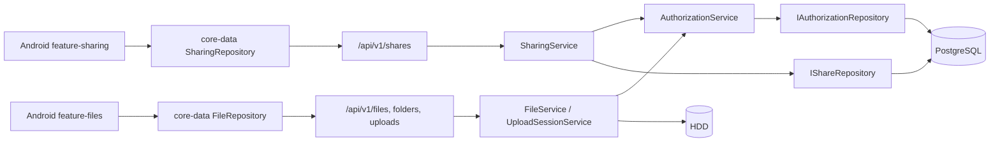

# 設計書

## アーキテクチャ概要

既存のモジュラーモノリスとDomain / Application / Infrastructure / Presentationの依存方向を維持する。Serverに共有Domainと`AuthorizationService`を追加し、ファイルの取得・作成・変更の入口で「認証User」と「対象の所有User」を分離する。共有データはFile IDを参照するため、名前変更や移動では更新せず、現在の祖先チェーンから継承権限を要求ごとに再解決する。

Androidは共有固有の表示と操作を新しい`feature-sharing`へ配置し、通信契約は`core-network`、Domain modelは`core-model`、Repositoryは`core-data`に配置する。共有フォルダを開いた後のファイル閲覧と操作は既存の`feature-files`を再利用する。



## 主要な設計決定

### 認証Userと所有Userの分離

- APIがJWTから取得するUser IDは`ActorUserId`とし、操作者と監査の根拠にする。
- `OwnerUserId`はクライアントから受け取らず、`FileEntry.OwnerUserId`または親Folderの所有者から導出する。
- `FindOwnedAsync(actorUserId, entryId)`だけに依存する現行フローを改め、IDで対象を取得した後に`AuthorizationService`で認可する。
- 作成・Uploadされる項目の所有者は作成者ではなく対象Folderの所有者とする。これにより同一Tree内のOwner一貫性を維持する。
- 共有先Userが異なるOwnerのTree間で項目を移動する操作は、Owner変更を伴うため`FILE_OPERATION_NOT_ALLOWED`で拒否する。

### 権限の順序と説明可能な解決

```text
OWNER > MANAGER > EDITOR > CONTRIBUTOR > VIEWER > NONE
```

- 公開する共有権限は`VIEWER | CONTRIBUTOR | EDITOR | MANAGER`とし、`OWNER`と`NONE`は認可内部の判定にだけ使用する。
- 対象の直接共有と、対象からルートまでの祖先Folder共有を1回の解決で評価する。
- 最強権限が同じ候補に複数ある場合、権限元は「直接共有」を「継承共有」より優先し、継承同士では最も近い祖先Folderを採用する。
- `EffectivePermission`は`Permission`、`Source (OWNER | DIRECT | INHERITED)`、`ShareTargetId`、`ShareId`を保持する。所有者では共有元IDを持たない。
- 認可判定はApplication内の共通Serviceだけに集約し、API EndpointやEF Repositoryに操作別権限表を重複実装しない。

### 操作別の権限

| 操作 | 必要権限 | 追加条件 |
| --- | --- | --- |
| 共有ルート一覧、Folder配下一覧、詳細、Download | `VIEWER` | `ACTIVE` / `MISSING_CANDIDATE` / `MISSING`の現行表示契約を維持 |
| Folder作成、Multipart Upload、Upload Session作成 | 親Folderの`CONTRIBUTOR` | Upload Session継続要求は作成者User・Deviceに固定 |
| Rename | 対象の`EDITOR` | Rootと非`ACTIVE`は従来どおり拒否 |
| Move | 対象と移動先Folderの`EDITOR` | 移動元Folderにも`EDITOR`を要求し、同一Owner Tree内に限定 |
| Trash | 対象の`EDITOR` | 所有者のTrashへ移動 |
| 所有者のTrash一覧、Restore、Purge、MISSING管理 | `OWNER` | 共有先にTrash管理権限は開放しない |
| 新規Share作成 | `OWNER` | 対象は非Rootの`ACTIVE` File / Folder |
| メンバー追加・更新・解除、Share全体解除 | `MANAGER` | Ownerは常に許可 |

`MANAGER`は共有先に別の`MANAGER`を追加できる。ただし所有者の権限はShareMemberで表現せず、所有者本人をメンバーに追加できない。

## コンポーネント設計

### 1. Sharing Domain

**責務**:

- `Share`、`ShareMember`、`SharePermission`の不変条件と状態変更を表現する。
- メンバーの追加、権限変更、解除で`updatedAt`を更新する。
- 権限の強度比較をDomainの1か所に定義する。

**実装の要点**:

- `server/src/KuraStorage.Domain/Sharing/`に配置し、EF CoreやHTTPに依存しない。
- `Share.TargetEntryId`と`Share.OwnerUserId`は作成後に変更しない。
- ファイル共有の`CONTRIBUTOR`禁止は、`SharingService`が現在の`FileEntry.EntryType`を取得し、作成とMember更新の両方で検証する。DBはPermission値自体のCheck Constraintを持つが、別Tableの対象種別との組み合わせはApplicationで保証する。

### 2. AuthorizationService

**責務**:

- 所有者、直接共有、祖先Folder共有から実効権限を解決する。
- 操作の必要権限を満たすか判定する。
- ページ内の複数FileEntryに対する権限をBatch解決する。

**実装の要点**:

- `server/src/KuraStorage.Application/Sharing/AuthorizationService.cs`に配置する。
- `IAuthorizationRepository.ResolveCandidatesAsync(actorUserId, entryIds)`は直接候補と祖先候補をPostgreSQLの再帰CTEまたは同等の有界Queryで一括取得する。深度はFile Treeの上限64を超えない。
- 単一項目用APIもBatch解決を1件で呼び出し、判定ロジックを分岐させない。
- 解決時は対象と共有元の状態を確認し、共有経路は`ACTIVE`な項目だけに公開する。`TRASHED`と未完了FileOperationの対象・子孫は解決対象から除外する。
- サーバー内のRoleが`ADMIN`であっても特別分岐を持たず、他UserのFile APIでは通常の共有権限だけを使用する。

### 3. SharingServiceとShare Repository

**責務**:

- 共有候補、Share作成、所有・受信一覧、Share詳細、メンバー更新・解除、Share解除を提供する。
- 対象種別、対象所有者、候補Userの状態、操作者の`OWNER | MANAGER`を再検証する。
- 共有の変更を監査Logへ追記する。

**実装の要点**:

- `IShareRepository`はShare Aggregateの更新と、ページングされた所有・受信一覧を担当する。共有一覧はフォルダ配下を展開せず、`ShareMember`が直接指すShareルートだけを返す。
- 候補UserはKuraStorageの単一設置内のすべての`ACTIVE` Userを同一家族とみなし、本人を除外する。現行User modelにFamily IDは追加しない。
- Share更新はDB Transactionで行い、`target_entry_id`と`(share_id, user_id)`の一意制約競合を公開Conflictへ変換する。
- メンバー解除で最後のMemberが消えた場合はShare自体も削除し、空のShareを残さない。

### 4. 共有対応FileServiceとTransferService

**責務**:

- 既存File APIの所有者限定Queryを、対象取得と共通認可の2段階へ置き換える。
- 一覧・詳細・Downloadに実効権限と権限元を付与する。
- Contributorが共有Folder配下へ作成・Uploadできるよう、ActorとTarget Ownerを分離する。
- Rename、Move、Trash、Restore、Purgeの既存ジャーナルとHDD/DB更新順序を維持しつつ、HDD変更前に認可を再検証する。

**実装の要点**:

- `IFileRepository`へID指定の`FindByIdAsync`、Owner指定のTree Query、Batch認可付き一覧に必要な境界を追加する。
- `FileItem`に`Owner { id, displayName }`、`Permission`、`PermissionSource`、`ShareTargetId?`を追加する。v1内の追加契約とし、現行`protocolVersion: 2`は破壊的変更がないため維持する。
- Personal Rootの`GET /files?parentId=null`は従来どおり認証User自身のRootを開く。共有FolderはShare一覧からその`targetEntryId`を`parentId`として開く。
- Folder一覧は親Folderの`VIEWER`を確認し、そのOwner Treeの直下を取得した後、ページ内の直接共有による強化をBatchで解決する。
- Multipart UploadとUpload Sessionは作成時に親Folderへ`CONTRIBUTOR`を要求する。Upload Sessionは`ActorUserId`、`TargetOwnerUserId`、`DeviceId`を分離し、作成後のChunk、完了、取消は作成者UserとDeviceにだけ許可する。
- Upload Session作成後に共有権限が失効した場合、Chunk受信は一時ファイルまでに限り継続できるが、正式公開となる完了処理で親Folderの`CONTRIBUTOR`を再確認し、失効時は公開せず取消・清掃対象にする。
- Moveは対象、source parent、target parentのMutation Lock取得後に全対象をReloadし、その後に権限を再解決する。認可失効時はFileOperationを作成せず拒否する。
- RestoreではShare行を更新せず、復元先の祖先チェーンから次の要求で再解決する。Purgeでは`IPermanentDeleteParticipant`をSharingが実装し、対象と子孫のShareをFileEntry削除と同じDB Transaction内で削除する。
- `MISSING`索引削除時は`IFileIndexDeletionParticipant`のSharing実装により対象と子孫のShareを整理する。

### 5. PostgreSQLとMigration

**責務**:

- Share Aggregateの参照整合性、一意性、権限値の制約を永続化層で保証する。
- 共有取得と認可解決に必要なIndexを提供する。
- Upload SessionのActorとTarget Ownerを区別する。

**Schema**:

```text
shares
  id uuid PK
  target_entry_id uuid NOT NULL FK file_entries(id) ON DELETE CASCADE
  owner_user_id uuid NOT NULL FK users(id)
  created_at timestamptz NOT NULL
  updated_at timestamptz NOT NULL
  UNIQUE (target_entry_id)

share_members
  share_id uuid NOT NULL FK shares(id) ON DELETE CASCADE
  user_id uuid NOT NULL FK users(id)
  permission varchar(16) NOT NULL CHECK (VIEWER, CONTRIBUTOR, EDITOR, MANAGER)
  created_at timestamptz NOT NULL
  updated_at timestamptz NOT NULL
  PK (share_id, user_id)
  owner membership is rejected by Application

upload_sessions
  actor_user_id uuid NOT NULL FK users(id)       # existing owner_user_id is renamed
  target_owner_user_id uuid NOT NULL FK users(id) # existing rows are backfilled from actor_user_id
```

**Index**:

- `shares(target_entry_id)` UNIQUE
- `shares(owner_user_id, updated_at, id)`
- `share_members(user_id, share_id)`
- `share_members(share_id, user_id)` PK / UNIQUE
- `upload_sessions(actor_user_id, idempotency_key)` UNIQUEと`(actor_user_id, status)`は現行制約を改名後も維持する。

Migration Upは既存Upload Sessionの`target_owner_user_id = actor_user_id`をBackfillしてから`NOT NULL`を設定する。Migration Downは共有先によるSessionが残る場合の情報損失を避けるため、下位版で表現できない行を検出して明示的に失敗させるか、本作業のDeployment方針で前方移行のみとして検証する。

### 6. API契約

**共有API**:

- `GET /api/v1/shares/candidates`
- `POST /api/v1/shares`
- `GET /api/v1/shares?scope=owned|received&targetType=FILE|FOLDER&page=1&pageSize=100`
- `GET /api/v1/shares/{shareId}`
- `PUT /api/v1/shares/{shareId}/members/{userId}`
- `DELETE /api/v1/shares/{shareId}/members/{userId}`
- `DELETE /api/v1/shares/{shareId}`

`PUT members/{userId}`はメンバーが未登録なら追加、登録済みなら権限更新とする。`POST /shares`は対象の所有者だけが実行でき、初期Memberを1件以上要求する。

**Response model**:

```text
ShareCandidate { userId, displayName }
ShareMemberItem { userId, displayName, permission }
ShareItem {
  id, targetEntryId, entryType, name,
  owner { id, displayName }, permission?, members?, createdAt, updatedAt
}
FileItem += {
  owner { id, displayName },
  permission: VIEWER | CONTRIBUTOR | EDITOR | MANAGER,
  permissionSource: OWNER | DIRECT | INHERITED,
  shareTargetId?
}
```

所有者の`FileItem.permission`はUIの操作判定を簡潔にするため`MANAGER`を返し、所有者性は`permissionSource: OWNER`で区別する。

**Error Code**:

- `INVALID_SHARE_PERMISSION`: File共有の`CONTRIBUTOR`など、対象種別と権限の組合せが不正
- `SHARE_NOT_FOUND`: 非存在または参照権限のないShareを同一応答で扱う
- `SHARE_MEMBER_NOT_FOUND`: メンバー単位解除の非存在
- `SHARE_CONFLICT`: 対象Shareの重複作成または競合
- `SHARE_OPERATION_NOT_ALLOWED`: 所有者のMember指定、非`ACTIVE` User、Root共有などの禁止操作

ファイルの存在自体を非公開にすべき場合は、従来の`FILE_NOT_FOUND`へ統一する。HTTP応答は現行のError envelopeとRequest IDを維持し、内部Path、Owner ID、SQLをMessageまたは`details`へ含めない。

### 7. Androidデータ層とUI

**責務**:

- `SharePermission`、`PermissionSource`、`ShareCandidate`、`ShareItem`、所有者情報を`core-model`へ追加する。
- `SharingApi`とDTOを`core-network`へ、`SharingRepository`とMappingを`core-data`へ追加する。
- `feature-sharing`で共有一覧、共有設定、候補・権限選択を実装する。
- `feature-files`の操作表示を`FileEntry.permission`と`permissionSource`から導出する。

**実装の要点**:

- Serverから未知の共有権限または権限元を受け取った場合は`UNKNOWN`へ閉じ、閲覧以外の操作と共有管理を表示しない。
- UIの権限判定は利便性のための表示制御であり、Serverの認可を代替しない。`403/404`や共有解除競合を受けたら一覧と詳細を再取得する。
- 共有解除、Member解除、`MANAGER`付与には確認Dialogを表示する。
- File共有の権限選択では`CONTRIBUTOR`を構成しない。Folder共有では配下への継承を明示する。
- 既存の`AppDestination`、`MainActivity`、`ServiceContainer`へSharing destinationとRepositoryを接続し、Share一覧のFolder選択から既存File browserへ`targetEntryId`を渡す。
- UIは`docs/ui/android/mockups/home-navigation/012-shared-files.png`、`files-media/024-sharing-settings.png`、`files-media/025-share-permissions.png`の情報構成を参照し、現行Compose ThemeとComponentに合わせる。

## データフロー

### Share作成

```text
1. APIがJWTからActorUserIdとDeviceIdを取得する。
2. SharingServiceがtargetEntryIdをIDで取得し、ACTIVE・非Root・ActorがOwnerであることを検証する。
3. 全MemberがACTIVE、Actor/Ownerと異なる、重複しない、対象種別とPermissionが一致することを検証する。
4. ShareとShareMemberを同一DB Transactionで作成し、監査Logを追記する。
5. APIが作成後のShareItemを返す。
```

### 共有Folderの閲覧

```text
1. Androidが受信Share一覧からFolderルートを選択する。
2. GET /files?parentId={targetEntryId}を呼び出す。
3. FileServiceが親FolderとそのOwnerを取得する。
4. AuthorizationServiceがActorの親FolderへのVIEWER以上を解決する。
5. Owner Treeの直下をページ取得し、各項目の実効権限をBatch解決する。
6. Owner、Permission、PermissionSource、ShareTargetId付きFilePageを返す。
```

### ContributorのUpload Session

```text
1. CreateでActorUserId・DeviceIdとDestinationFolderIdを受ける。
2. Destination FolderからTargetOwnerUserIdを導出し、CONTRIBUTOR以上を確認する。
3. SessionにActor、Target Owner、Device、Destinationを固定する。一時PathはActor/Session IDだけからサーバーが生成する。
4. ChunkはActor・Device・Sessionの一致を確認して一時Fileへ保存する。
5. CompleteはLock内でDestinationの存在・Owner・CONTRIBUTOR権限・同名競合を再検証する。
6. 検証成功時だけTarget OwnerのTreeへatomic publishし、FileEntry.OwnerUserIdをTarget Ownerとする。
```

### Moveによる継承経路変更

```text
1. Actor、対象、source parent、target parentを取得する。
2. 同一Owner Tree、ACTIVE、循環なし、深度上限、同名なしを確認する。
3. 対象、source parent、target parentのLockを安定順で取得する。
4. Reload後にActorが3対象すべてへEDITOR以上を持つか再解決する。
5. 従来のFileOperation PENDING -> HDD atomic rename -> FILESYSTEM_DONE -> DB確定を実行する。
6. Share行は更新せず、次の要求で新祖先チェーンと直接Shareから実効権限を解決する。
```

### Trash・Restore・Purge

```text
1. Trashは対象のEDITOR以上をLock内で確認し、OwnerのTrashへ移動する。Share行は保持する。
2. TRASHEDな対象と子孫はShare一覧と通常の認可Queryから除外する。
3. RestoreはOwnerだけが実行し、Share行を維持したままACTIVEへ戻す。
4. 復元後の直接Shareと新祖先から次の要求時に実効権限を再解決する。
5. PurgeまたはMISSING索引削除は、対象・子孫Shareの削除をFileEntry削除と同じDB Transactionで実行する。
```

## エラーハンドリング戦略

### Application Result

Share操作は既存の`FileResult<T>`とHTTP Mappingのパターンを再利用するか、同じFailure Kindを持つ`SharingResult<T>`を使用する。同一API内でError envelopeを分岐させない。

- 入力形式と不正Permission: `400`
- 非存在または存在を隠す認可失敗: `404`
- 一意制約、同時更新、既存Share: `409`
- 認証なし、失効Session・Device: `401`
- Storage利用不可や既存FileOperation中間状態は現行Error Codeを維持する。

DB一意制約と楽観的並行制御の例外はInfrastructureで業務例外へ変換し、Applicationが安定したError Codeを返す。ログにはRequest IDと操作結果を残すが、File名、物理Path、メンバーの表示名を通常ログやMetric Labelに含めない。

## テスト戦略

### ユニットテスト

- `Share`の作成、Member追加・更新・解除、不正ID、重複、最後のMember解除
- 権限強度と操作別の最小権限境界
- Owner、直接Share、祖先Share、複数祖先、直接と継承の同強度Tie-break、最強権限
- File直接Shareの非継承とFolder Shareの子孫継承
- `CONTRIBUTOR`のFolder作成・Upload許可とRename・Move・Trash拒否
- `EDITOR`のRename・Move・TrashとMoveのsource/target不足権限
- `ADMIN`の暗黙File権限がないこと
- Androidの未知Permission/Sourceの`UNKNOWN`変換、操作表示行列、FileとFolderのPermission選択肢

### 統合テスト

- Migrationの前方適用、制約、Index、既存Upload Session Backfill
- Share APIの全Endpoint、Paging、Filter、Owner/Manager/無権限の応答
- Folder階層の直接・継承・複数経路と解除後の即時失効
- 所有者と各4権限のList、Get、Download、Create Folder、Multipart Upload、Resumable Upload、Rename、Move、Trash
- 異Owner Tree移動、移動元または移動先権限不足、権限失効と同時操作の拒否
- Trash中の非公開、Owner Restore後のShare復活、PurgeとMISSING索引削除後の関連行消滅
- Share対象のRename/MoveとFileOperation Recovery後の認可整合性
- 共有権限を失効させたUpload SessionがCompleteで公開されないこと
- OpenAPI Schemaと実Endpointの整合性、他UserのFile/Share存在非開示、Path・SQL非開示

### AndroidテストとE2E

- RepositoryのDTO Mapping、401 Refresh・再試行、共有解除競合後の再取得
- Sharing ViewModelの初期読み込み、Paging、更新、解除、Error、二重送信防止
- Compose UIの共有一覧、種別・Owner・Permission表示、継承表示、Fileの`CONTRIBUTOR`非表示、危険操作Dialog
- Server API E2EでOwnerと複数Recipientを使い、4権限、継承、最強解決、共有解除、Rename/Move/Trash/Restore/Purgeを確認
- Android実機でOwnerのShare作成、Recipientの閲覧・作成・変更、ManagerのMember変更、解除後の失効を確認
- LANとZeroTierの同一HTTPS Hostnameで同じE2E Contractを確認

## 依存ライブラリ

新しい外部ライブラリは追加しない。Serverは既存のEF Core・Npgsql・ASP.NET Core、Androidは既存のRetrofit・kotlinx.serialization・Compose・Navigationを使用する。

## ディレクトリ構造

```text
server/src/
├── KuraStorage.Domain/Sharing/
│   ├── Share.cs
│   ├── ShareMember.cs
│   └── SharePermission.cs
├── KuraStorage.Application/
│   ├── Abstractions/SharingAbstractions.cs
│   └── Sharing/
│       ├── AuthorizationService.cs
│       ├── SharingContracts.cs
│       └── SharingService.cs
├── KuraStorage.Infrastructure/Persistence/
│   ├── Configurations/ShareConfiguration.cs
│   ├── Configurations/ShareMemberConfiguration.cs
│   ├── Migrations/<timestamp>_AddFileSharing.cs
│   ├── AuthorizationRepository.cs
│   └── ShareRepository.cs
└── KuraStorage.Api/Program.cs

server/tests/
├── KuraStorage.Domain.Tests/ShareTests.cs
├── KuraStorage.Application.Tests/
│   ├── AuthorizationServiceTests.cs
│   └── SharingServiceTests.cs
└── KuraStorage.IntegrationTests/
    ├── FileSharingMigrationTests.cs
    ├── SharingApiTests.cs
    └── SharedFileOperationTests.cs

apps/android/
├── core-model/.../SharingModels.kt
├── core-network/.../SharingContracts.kt
├── core-data/.../SharingRepository.kt
├── feature-sharing/
│   ├── build.gradle.kts
│   └── src/
│       ├── main/.../SharingScreen.kt
│       ├── main/.../SharingViewModel.kt
│       ├── test/.../SharingViewModelTest.kt
│       └── androidTest/.../SharingScreenTest.kt
└── app/src/main/.../MainActivity.kt

contracts/openapi/kurastorage-api.yaml
```

既存の`FileService`、`UploadSessionService`、`FileRepository`、`TrashPurgeService`、`MissingEntryService`、AndroidのFile models/API/Repository/ViewModel/Screen、DI、Navigationも変更対象とする。

## 実装の順序

1. Share Domain、Permission比較、ユニットテストを追加する。
2. Share schema、Upload Session Actor/Target Owner移行、EF Configuration、Migrationテストを追加する。
3. Authorization Repositoryと`AuthorizationService`を実装し、直接・継承・複数経路のテストを通す。
4. `SharingService`、共有候補、Share CRUD/Member API、OpenAPI、API統合テストを実装する。
5. File一覧、詳細、Downloadを認可対応し、有効権限メタデータを応答へ追加する。
6. Folder作成、Multipart Upload、Upload SessionをActor/Target Owner分離と`CONTRIBUTOR`に対応する。
7. Rename、Move、Trashの`EDITOR`認可、Restore後の再解決、Purge/MISSING削除participantを実装する。
8. Android core model/network/data契約と未知値のFail-closed mappingを実装する。
9. `feature-sharing`、Navigation、既存File UIのPermission別表示を実装する。
10. Server E2E、Android実機E2E、LAN/ZeroTier確認、カバレッジ、セキュリティ検証、正式文書の最終整合を完了する。

## Pull Request分割方針

1. **PR 1: Sharing domain, persistence, and authorization foundation**
   Share Domain、Migration、Repository、AuthorizationService、ユニット・DB統合テストをまとめる。
2. **PR 2: Sharing management API and readable shared files**
   Share API、OpenAPI、一覧・詳細・Downloadの共有認可、Permission metadataをまとめる。
3. **PR 3: Shared creation, upload, and mutation consistency**
   Folder作成、Multipart/Resumable Upload、Rename、Move、Trash、Restore、Purge、MISSING整理をまとる。
4. **PR 4: Android sharing experience and end-to-end verification**
   Android契約、`feature-sharing`、権限別File UI、実機E2E、文書整合をまとる。

各PRは実装と対応テストを同じ範囲に含め、依存元PRがMergeされた後に次のBranchを開始する。

## セキュリティ考慮事項

- すべての対象とUser IDはServerで再取得し、認証Context、DB上のOwner、User状態を正とする。
- API、CLI、復旧Serviceがファイル操作を迂回しないよう、Applicationの同じ認可境界を使用する。Retention WorkerのPurgeだけはSystem triggerとしてOwner操作と分離する。
- 認可と対象状態はMutation Lock取得後、HDD更新やDB変更の直前に再確認し、TOCTOUを抑制する。Share更新とFile mutationが競合する場合のLock順序はFile/Folder IDから導出する既存の安定順を使う。
- 認可失敗で非公開項目の存在、Owner、パス、共有Memberを漏らさない。
- 共有操作、共有Userによる作成・変更・削除をActor User・Device・対象ID・結果とともに監査する。通常Logに表示名やファイル名を出さない。
- Androidは未知Permission、未知Source、欠落した共有元情報を安全側に閉じ、破壊的操作と共有管理を有効化しない。

## パフォーマンス考慮事項

- File一覧の各行で個別Queryを発行せず、ページ単位で実効権限をBatch解決する。
- フォルダ階層は最大64で打ち切り、再帰CTEに循環防止を入れる。
- `share_members(user_id, share_id)`、`shares(target_entry_id)`、Fileの`parent_id`・Owner・status系Indexを利用し、Query planをPostgreSQL統合テストで確認する。
- Share一覧と候補一覧はページングし、上限500と安定した並び順を使用する。
- 権限を長期Cacheせず、Share解除の次要求で失効させる。要求内のBatch結果だけを共有する。

## デプロイと互換性

- MigrationをAPIとAndroidより先に適用し、新しいServerが既存の個人領域とUpload Sessionを維持できることを確認する。
- File responseへの追加FieldとShare Endpoint追加は`/api/v1`の後方互換な拡張とする。旧Androidは未知Fieldを無視し、個人領域を従来どおり利用できる。
- Rollbackで旧Serverへ戻す場合は共有機能を停止し、新規Shareと共有先Upload Sessionがないことを確認する。データを無言削除するDown Migrationは行わない。

## 将来の拡張性

- Family/Tenantが複数必要になった場合はUserとShareにTenant IDを追加し、全Authorization Queryの必須条件とする。現時点で将来用Columnは先行追加しない。
- Group共有、期限付きShare、公開Link、継承停止、Deny ACLは別のDomain conceptとし、現行の「全経路から最強Allow」に曖昧な例外を追加しない。
- 検索実装時は`AuthorizationService`と同じSQL認可条件をQuery specificationとして再利用し、取得後のクライアントFilterに依存しない。
- RecentやBackupはActor UserとFile Ownerを分離して保存し、Share解除時に表示可否を再解決できる形とする。
