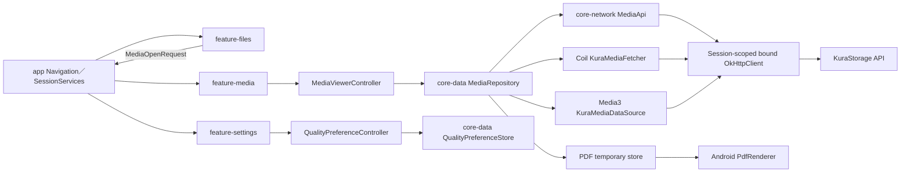

# Android写真・PDFビューアー／動画・音声プレイヤー 設計書

## 1. 設計方針

既存Androidの単方向データフロー、Feature Module、`SessionServices`、`AuthenticatedRequestExecutor`、接続経路別`OkHttpClient`を維持する。新規`feature-media`はViewer／Playerと画面状態、`feature-settings`は品質設定画面を担当し、Network、認証、永続設定、File取得を`core-network`、`core-data`、`core-model`へ分離する。

画像はCoilの独自Model／Fetcher、動画・音声はMedia3 ExoPlayerの独自`DataSource`、PDFはApp private一時FileとAndroid `PdfRenderer`を使用する。どの経路も同じ認証SessionとNetwork bindingを使用し、URLへTokenを含めない。未生成の低／中品質を元画質へ自動Fallbackせず、Serverの永続Media Jobを状態の正とする。



## 2. スコープと依存関係

### 2.1 Module依存

| Module | 追加責務 | 依存先 |
| --- | --- | --- |
| `core-model` | Media品質、Variant、Job、Viewer／Player共通値 | なし |
| `core-network` | Media API契約、Content URL構築、Range／HEAD／Job DTO | `core-model`、OkHttp、Retrofit |
| `core-data` | Media Repository、品質設定、PDF一時Store、認証付き取得調停 | `core-model`、`core-network` |
| `feature-media` | Thumbnail Component、写真／PDF Viewer、動画／音声Player、ViewModel | `core-model`、`core-data`、`core-ui` |
| `feature-settings` | 品質・通信量設定画面とViewModel | `core-model`、`core-data`、`core-ui` |
| `feature-files` | File選択を`MediaOpenRequest`としてAppへ通知 | `core-model`、`core-ui` |
| `app` | Navigation、Session scope、Coil／Media3／Repository組立 | 全FeatureとCore |

- Feature間を直接依存させない。
- `feature-files`はViewerを直接呼ばず、File IDと閲覧ContextをApp callbackへ返す。
- `feature-media`はRetrofit、OkHttp、DataStore実装を直接参照しない。
- `app`は接続Routeまたは認証Sessionが変わるたびにMedia依存を作り直し、旧scopeを閉じる。

### 2.2 Server契約

新しいPlayback SessionやHLS Endpointは作らない。次の既存契約へ統一する。

```http
GET  /api/v1/files/{fileId}/content?variant={variant}&disposition=inline
HEAD /api/v1/files/{fileId}/content?variant=original&disposition=inline
GET  /api/v1/media-jobs/{jobId}
POST /api/v1/media-jobs/{jobId}/retry
```

- `variant`: `thumbnail`、`image-low`、`image-medium`、`video-low`、`video-medium`、`original`。
- 写真・Thumbnailは`image/webp`、動画Low／Mediumは完成済み`video/mp4`、元Fileは登録MIMEを返す。
- ContentはRangeなし`200`、単一Range`206`、不正Range`416`を返す。
- 派生データ未準備は`202 Accepted`とJob状態を返す。
- 音声とPDFは`original`だけを使用する。
- `playback-sessions`、`.m3u8`、生成途中FileはAndroidから使用しない。

## 3. Domain model

### 3.1 品質とVariant

```kotlin
enum class MediaQuality { LOW, MEDIUM, ORIGINAL }

enum class MediaVariant(val wireValue: String) {
    THUMBNAIL("thumbnail"),
    IMAGE_LOW("image-low"),
    IMAGE_MEDIUM("image-medium"),
    VIDEO_LOW("video-low"),
    VIDEO_MEDIUM("video-medium"),
    ORIGINAL("original"),
}

enum class MediaKind { IMAGE, PDF, VIDEO, AUDIO }

@JvmInline value class ByteCount(val value: Long)
@JvmInline value class MediaPositionMs(val value: Long)
@JvmInline value class PlaybackRate(val value: Float)
```

- `ByteCount`は非負だけを許可する。
- `PlaybackRate`は0.5〜3.0を許可し、UIで0.25刻みを提供する。
- 短いSkipは動画・音声とも3,000ms、長いSkipは10,000msとする。
- `MediaVariantResolver`はKindとQualityの組合せを型付きで解決する。
- Audio／PDFとLOW／MEDIUMの組合せは生成せず、Validation errorにする。
- 未知のServer enumは`UNKNOWN`へ変換し、自動通信を開始しない。

### 3.2 Network quality context

```kotlin
enum class NetworkQualityContext {
    LOCAL_DIRECT,
    REGISTERED_REMOTE_WIFI,
    UNREGISTERED_REMOTE_WIFI,
    REMOTE_MOBILE,
}
```

`NetworkQualityContextResolver`は`ConnectionRoute`、Androidのactive Network transport、`RegisteredWifiSource`を入力とする。

- `LOCAL_DIRECT`は常に`LOCAL_DIRECT`。
- `REMOTE_SECURE`かつCellular transportは`REMOTE_MOBILE`。
- `REMOTE_SECURE`かつWi-Fiは登録状態で2種類へ分ける。
- Wi-Fi登録機能が未導入の場合、Productionの`RegisteredWifiSource`はfail-closedに未登録を返す。
- TestではFakeを注入し、4環境の初期品質を検証する。
- 将来の許可Wi-Fi機能は`RegisteredWifiSource`だけを置換し、Media Featureを変更しない。

### 3.3 Media状態

```kotlin
sealed interface MediaLoadState {
    data object Idle : MediaLoadState
    data object ConfirmingTransfer : MediaLoadState
    data object Loading : MediaLoadState
    data class Generating(val job: MediaJobSnapshot) : MediaLoadState
    data class Ready(val source: ReadyMediaSource) : MediaLoadState
    data class Failed(val error: MediaUiError) : MediaLoadState
}

data class MediaJobSnapshot(
    val jobId: String,
    val status: MediaJobStatus,
    val progressPercent: Int?,
    val queuePosition: Int?,
    val retryAfterSeconds: Int,
    val retryable: Boolean,
)
```

- ViewModelごとに単調増加`requestGeneration`を持つ。
- File、Version、品質、Page、前後移動の応答は、開始時Generationが現在値と一致する場合だけ反映する。
- Job IDだけでFileを復元せず、File ID／Version／現在権限を再取得してからJobを照会する。
- 画面離脱でClientのRequest／Pollingを取消しても、Server Job取消APIは呼ばない。

## 4. Network・認証設計

### 4.1 Session-scoped client

`ServiceContainer.sessionServices(route)`で作る既存のRoute別`OkHttpClient`をMediaにも渡す。次を含む`MediaSessionScope`を追加する。

```kotlin
data class MediaSessionScope(
    val scopeId: String,
    val mediaRepository: MediaRepository,
    val imageLoader: ImageLoader,
    val playerFactory: MediaPlayerFactory,
    val temporaryPdfStore: TemporaryPdfStore,
) : Closeable
```

- `scopeId`はSession開始時のrandom UUIDで、Cache keyの先頭へ使う。TokenやUser情報は含めない。
- Logout、Route変更、Session失効時は`close()`し、Player、Request、PDF一時File、Session cacheを破棄する。
- Process起動時は前Processが残したMedia一時Directoryを清掃してから新Sessionを開始する。
- HTTP Hostは`BuildConfig.API_HOSTNAME`固定とし、Server応答のabsolute URLをそのまま信頼しない。

### 4.2 Media API

`core-network`へ`MediaApi`を追加する。

```kotlin
interface MediaApi {
    suspend fun headOriginal(accessToken: String, fileId: String): OriginalMetadataDto
    suspend fun mediaJob(accessToken: String, jobId: String): MediaJobDto
    suspend fun retryMediaJob(accessToken: String, jobId: String): MediaJobDto
    fun contentRequest(
        accessToken: String,
        fileId: String,
        variant: MediaVariant,
        range: String? = null,
    ): Call
}
```

- JSON APIは既存`AuthenticatedRequestExecutor`で401時に単一Flight refreshして1回だけ再試行する。
- Binary／Range取得はRaw OkHttp `Call`を返し、Response Bodyを呼出側が`use`で閉じる。
- File ID、Job IDは型付きIDからURL segmentへencodeし、Path、Query、Hostを外部入力で上書きさせない。
- `Retry-After`は1〜30秒へclampする。欠落または不正値は写真2秒、動画3秒を既定値にする。
- Job Pollingは1回ずつ完了するRequestとし、画面表示中だけ次回をscheduleする。全体Job時間で固定Timeoutを設けない。

### 4.3 Coil認証

Coilへ`KuraMediaImage` Modelと`KuraMediaFetcher.Factory`を登録する。

```kotlin
data class KuraMediaImage(
    val scopeId: String,
    val fileId: String,
    val fileVersion: Long,
    val variant: MediaVariant,
)
```

Fetcherは次の順で処理する。

1. `AuthenticationRepository.refresh()`で有効Token snapshotを得る。
2. `MediaApi.contentRequest`を実行する。
3. `200`／`206`はResponse BodyをCoilの`SourceFetchResult`へ渡す。
4. `202`はbounded JSONを解析し、`MediaGeneratingException(job)`を返す。
5. `401`は拒否されたTokenを指定してrefreshし、同じRequestを1回だけ再実行する。
6. `403`／`404`／`416`／`5xx`を型付きErrorへ変換する。
7. Redirect先が信頼済みHost以外なら追従しない。

Cache keyは`scopeId:fileId:fileVersion:variant`とする。File名と物理Pathを含めない。

- Memory cacheは利用可能Heapの10%、上限64MiB。
- Disk cacheは`cacheDir/media-images/<scopeId>`、上限256MiB。
- Logout／Session変更でSession directoryを削除する。
- 起動時に前Processの全Session directoryを削除する。
- Fetcherで`Content-Length`、実読取Byte数、Decode結果を検証し、途中切断画像を成功扱いにしない。
- Thumbnail並列取得は8、写真Viewerの表示取得は1、隣接写真の先読みは各方向1までとする。
- Mobileで元画質の隣接写真を先読みしない。

### 4.4 Media3認証と401回復

Media3へ`KuraMediaDataSource.Factory`を追加し、`MediaApi.contentRequest`をRange対応`DataSource`として包む。

- `DataSpec.position`と`length`から単一`Range: bytes=start-end`を生成する。
- `200`はRangeなしまたはServerが全体応答した場合、`206`は`Content-Range`を検証して読み取る。
- `202`はBodyを最大64KiBで解析し、`MediaGeneratingException`としてPlayer adapterへ通知する。
- `416`は`RangeNotSatisfiable`へ変換し、同じPositionの無限再試行をしない。
- Response Body、Call、DataSourceを`close()`で必ず解放する。
- TokenはMediaSource作成時のsnapshotをHeaderへ設定する。
- 401はPlayer adapterが検出し、Coroutineで`refreshAfterUnauthorized`を1回だけ行い、新TokenのMediaSourceへ現在位置と再生状態を引き継ぐ。
- 2回目の401、Device／Session失効、権限消失はPlayerを停止して認証Errorへ遷移する。
- Redirectは同一HTTPS Hostだけを許可し、別HostへAuthorizationを転送しない。

## 5. 品質・通信量設計

### 5.1 品質設定Store

`DataStore<Preferences>`を`media_quality_preferences`としてCredential metadataから分離する。

```kotlin
data class QualityPreferences(
    val localDirect: MediaQuality = ORIGINAL,
    val registeredRemoteWifi: MediaQuality = MEDIUM,
    val unregisteredRemoteWifi: MediaQuality = LOW,
    val remoteMobile: MediaQuality = LOW,
)
```

- 品質設定は端末内の全KuraStorage利用者で共有する非秘密の端末設定とする。
- 未知文字列、欠落、破損は環境ごとの既定値へ戻す。
- AudioとPDFへ品質設定を適用しない。
- 閲覧開始時にだけ現在環境の初期値を解決し、閲覧中のNetwork変化で品質を自動変更しない。
- 手動選択は全接続環境でLOW／MEDIUM／ORIGINALを許可する。

### 5.2 通信量確認

`TransferConfirmationPolicy`は写真Original、動画Original、音声Original、PDF本文に適用する。

1. 現在のFile詳細からFile Versionを取得し、`HEAD ...?variant=original`で`Content-Length`、MIME、`Accept-Ranges`を取得する。
2. `Content-Length`を全File取得時の上限目安としてIEC単位で表示する。
3. 動画・音声はRange再生により実受信量が少なくなる可能性がある旨を表示する。
4. Size不明またはHEAD失敗時は「通信量を確認できません」を表示し、追加確認なしにContentを開始しない。
5. 利用者が承認したFile ID、Version、Variant、SizeをViewModel内に保持する。
6. File Version、Variant、Sessionが変われば承認を破棄して再確認する。
7. Cancel時はContent、Coil、Player、PDF Downloadを開始しない。

Low／Mediumは選択後のResponse `Content-Length`を実績表示へ使えるが、取得前Size APIがないため事前確認を必須にしない。

## 6. 一覧Thumbnail設計

`feature-media`に再利用可能な`FileThumbnail` Composableを置く。`app`が`FileBrowserScreen`のThumbnail slotへComposable lambdaとして渡し、`feature-files`から`feature-media`への直接依存を作らない。

- GridはThumbnailを表示する。
- Listは写真／動画／PDFだけ48dp Thumbnail、その他は種類Iconを表示する。
- ThumbnailはContent scale crop、角丸8dp、最低48dp touch targetとする。
- Folder、非対象、Loading、Generating、Failed、MISSINGをIcon、Text／Semantics、色の組合せで区別する。
- `LazyList` item keyはFile ID、Image keyはFile ID＋Version＋Variant＋Session scopeとする。
- `AsyncImagePainter.State.Error`のcauseが`MediaGeneratingException`なら、Item単位の`ThumbnailStateHolder`がRetry-After後に最大1回ずつ再Compose tokenを更新する。
- ItemがComposition外になればPolling Jobをcancelする。Server Jobはcancelしない。
- 同時に表示中のGenerating Thumbnailは中央`ThumbnailRefreshCoordinator`が8並列以内で再取得する。

## 7. 写真Viewer設計

### 7.1 画面状態

```kotlin
data class PhotoViewerUiState(
    val file: FileEntry,
    val quality: MediaQuality,
    val loadState: MediaLoadState,
    val connectionContext: NetworkQualityContext,
    val originalSize: ByteCount?,
    val zoom: Float,
    val canGoPrevious: Boolean,
    val canGoNext: Boolean,
)
```

- `PhotoViewerViewModel`が品質、Job Polling、Transfer confirmation、前後移動を所有する。
- ComposableはGestureの一時Offsetを所有し、File／品質変更時にZoom 1.0、Offset 0へ戻す。
- Decode sizeはViewportとDevice densityから決め、長辺最大4096px、Bitmap見積り32MiBを超えない。
- Zoomは1〜4倍、Double tapは1倍と2倍を切り替える。
- Animated形式は先頭Frame表示を最低保証とし、Animation可否はCoil／Platform Decoderの対応に従う。

### 7.2 前後移動

`MediaBrowseContext`はAppが生成する一時Context IDと、順序付きの閲覧可能File IDを持つ。

- Folder、Search、Recent、Favorites、Sharedの現在表示順をAppがContextとして登録する。
- Viewer routeには`contextId`と`fileId`だけを渡し、File名やURLを含めない。
- Process deathでContextを失った場合は現在Fileだけを復元し、詳細から得たParent IDで再取得可能なFolderだけ再構築する。
- Candidateを開く直前にFile詳細と権限を再取得する。
- Folder、非画像、MISSING、TRASHED、閲覧不可を前後候補から除外する。

## 8. PDF Viewer設計

### 8.1 一時File制約

`TemporaryPdfStore`は`cacheDir/media-pdf/<scopeId>/`だけを使用する。

| 項目 | 値 |
| --- | --- |
| 1 File上限 | 256MiB |
| Session合計上限 | 512MiB |
| Download前の最低空き容量 | `Content-Length + 64MiB` |
| 未参照File TTL | 最終アクセスから1時間 |
| 一時名 | SHA-256(scopeId, fileId, version)＋`.pdf.part`／`.pdf` |

- 256MiB超過PDFはViewerでは開かず、既存SAF Downloadを案内する。
- HEADでSize不明の場合はPDF Viewerを開始せず、既存Downloadを案内する。
- `.part`へ64KiB bufferでStreamingし、`Content-Length`一致と`%PDF-` signatureを確認後に同一Directoryでrenameする。
- Cancel、通信切断、短いBody、容量不足、検証失敗時は対象`.part`だけを削除する。
- File名、Server path、User入力を一時Pathに使用しない。
- 起動、Session開始、Viewer終了、Logout、Route変更、容量超過時にTTL／LRU清掃する。
- 有効な`ParcelFileDescriptor`を持つFileはLease mapへ登録し、閉じるまで清掃対象外にする。

### 8.2 PdfRenderer

`PdfDocumentController`が`ParcelFileDescriptor`、`PdfRenderer`、現在`Page`を所有する。

- Pageは1枚ずつ開き、Page移動前に閉じる。
- BitmapはViewportに必要なSizeで生成し、長辺4096px、1 Bitmap 32MiBを上限とする。
- 隣接Pageは低解像度Previewを各方向1枚だけMemory cacheできる。
- Zoomは1〜4倍とし、表示解像度変更が必要な場合はdebounce 150ms後に再Renderする。
- `pageCount <= 0`、暗号化、破損、Page open／render例外を`PdfUnsupported`または`PdfCorrupt`へ変換する。
- `ViewModel.onCleared`とScreen disposeの両方を冪等closeへ接続する。

## 9. 動画・音声Player設計

### 9.1 Player所有権

`MediaPlayerController`がMedia3 `ExoPlayer`を1 instance所有し、ViewModelは純粋な`PlayerUiState`とActionを扱う。Android Framework PlayerをViewModelへ直接保持しない。

- Player instanceはPlayer画面Composition開始時に作成し、disposeでreleaseする。
- Configuration changeは`rememberSaveable`／`SavedStateHandle`にFile ID、Version、品質、Position、Rate、playWhenReadyを保存し、新Playerへ復元する。
- App background時は再生をpauseする。Background audio、Foreground Service、通知Controlは本スコープ外とする。
- Audio focus loss transientはpause、gain後は利用者が再開する。自動再開しない。
- Headset切断は即時pauseする。

### 9.2 BufferとRange

Media3 `DefaultLoadControl`を次の初期値で構成する。

| 環境 | minBuffer | maxBuffer | playbackBuffer | rebufferBuffer |
| --- | ---: | ---: | ---: | ---: |
| LOCAL_DIRECT／Wi-Fi | 15秒 | 50秒 | 1.5秒 | 3秒 |
| Mobile | 5秒 | 15秒 | 1.5秒 | 3秒 |

- Byte数ではなく時間基準を初期値とし、実機通信Byte測定後に設計値を更新する。
- Playlistは1 itemだけとし、次Mediaを準備しない。
- Seekは0〜Durationへclampし、Serverへ単一Rangeを再要求する。
- 3秒／10秒戻る・進むは同じclamp規則を使用する。
- Seek不能MediaではSkip／Seekをdisabledにし、無効操作を送信しない。

### 9.3 品質変更

1. 現在Position、playWhenReady、Rateをsnapshotする。
2. 新Qualityを選択状態にするが、旧Sourceは新SourceがReadyになるまで保持する。
3. OriginalならTransfer confirmationを完了する。
4. 新VariantのDataSourceをprepareする。
5. `202`なら旧Sourceを維持してGenerating UIを表示する。
6. Ready後、Positionを`0..newDuration`へclampしてseekする。
7. RateとplayWhenReadyを復元する。
8. 失敗またはCancel時は旧Quality表示と旧Sourceへ戻し、元画質へFallbackしない。

### 9.4 変換Job

- QUEUEDはQueue位置を任意表示する。
- RUNNINGは進捗がある場合だけPercentと処理時間を表示する。
- READYは選択VariantのContentを再取得する。
- FAILEDはretryableの場合だけRetry buttonを表示する。
- UNKNOWN、Version mismatch、権限消失は破壊的操作とRetryを無効にする。
- 「完了まで待つ」はScreen表示中だけPollingする。
- 「バックグラウンドで続ける」はPollingを止めてNavigation backするだけで、WorkManagerを登録しない。
- 再訪時はContentを再要求し、返された最新Job状態を表示する。

### 9.5 Player UI

- 共通Control: 再生／一時停止、Seek bar、3秒戻る／進む、10秒戻る／進む、0.5〜3.0倍速、現在時間／総時間。
- 動画: `PlayerSurface`、Aspect fit、Control overlay、品質、Job、通信量確認を表示する。
- 音声: 種類Artwork、File名、Size、共通Controlを表示し、品質選択とJob UIを表示しない。
- 速度は0.5、0.75、1.0、1.25、1.5、1.75、2.0、2.5、3.0から選択する。
- 3秒／10秒Buttonは内容と移動方向をTalkBack labelへ含める。
- Codec非対応、Decoder error、Network error、Auth error、Generatingを同じ再試行表示へ潰さない。

## 10. Navigation設計

`core-ui.AppDestination`へ次を追加する。

```text
media/photo/{contextId}/{fileId}
media/pdf/{fileId}
media/video/{contextId}/{fileId}
media/audio/{contextId}/{fileId}
settings/media-quality
```

- Route argumentはUUID等のopaque IDだけとし、Token、URL、File名、MIMEを入れない。
- AppがFile詳細を再取得し、MIME、Status、PermissionからDestinationを確定する。
- Logout、Session失効、Route変更は`popUpTo(0)`とMedia scope closeを同じ処理で行う。
- Viewer／Playerの詳細・Download ActionはFile IDと選択VariantだけをApp callbackへ返す。

## 11. Error設計

### 11.1 Error分類

```kotlin
sealed interface MediaUiError {
    data object AuthenticationRequired : MediaUiError
    data object PermissionLost : MediaUiError
    data object FileUnavailable : MediaUiError
    data object SourceVersionChanged : MediaUiError
    data object NetworkDisconnected : MediaUiError
    data object RangeNotSatisfiable : MediaUiError
    data object UnsupportedFormat : MediaUiError
    data object UnsupportedCodec : MediaUiError
    data object CorruptMedia : MediaUiError
    data object PdfEncrypted : MediaUiError
    data object PdfTooLarge : MediaUiError
    data object InsufficientStorage : MediaUiError
    data object GenerationFailed : MediaUiError
    data object UnknownServerState : MediaUiError
}
```

### 11.2 HTTP／Player mapping

| 入力 | UI状態 | 自動処理 |
| --- | --- | --- |
| 202 | Generating | Retry-After後に表示中だけ再取得 |
| 401初回 | Loading | Token refresh後1回再試行 |
| 401再発／Token失効 | AuthenticationRequired | 再生停止、Login導線 |
| 403／404 | PermissionLost／FileUnavailable | Cache破棄、Back導線 |
| 409 Version不一致 | SourceVersionChanged | 詳細再取得、確認破棄 |
| 416 | RangeNotSatisfiable | 同一Rangeを再試行しない |
| 429 | Failed | Retry-After前の操作を抑止 |
| 5xx／I/O | NetworkDisconnected | 利用者の再試行、上限1回の自動再接続 |
| Decoder error | UnsupportedCodec／CorruptMedia | 自動再試行なし |
| 未知Status | UnknownServerState | 追加通信・Retryを無効化 |

- Error messageに物理Path、Token、Job内部Error、FFmpeg出力を含めない。
- LogはFile／Jobのopaque IDを必要最小限にし、URL QueryとHeaderを記録しない。

## 12. Test設計

### 12.1 JVM Unit Test

- `MediaVariantResolver`: Image／Video各品質、Audio／PDF不正品質。
- `NetworkQualityContextResolver`: LOCAL、登録Wi-Fi、未登録Wi-Fi、Mobile、transport不明。
- `QualityPreferenceStore`: 既定値、保存、破損値、Migration。
- `TransferConfirmationPolicy`: Sizeあり／なし、Cancel、Version／Session変更。
- `MediaViewerController`: request generation競合、202、Polling、Retry、画面離脱、非Fallback。
- `PhotoViewerViewModel`: 前後移動、品質変更、元画質確認、古い応答破棄。
- `PdfViewerViewModel`: Size上限、容量、Page境界、清掃。
- `PlayerViewModel`: 再生、Pause、Seek、±3秒、±10秒、Rate、品質変更位置維持。
- `MediaJobMapper`: Queue／進捗nullable、Retryable、UNKNOWN。

### 12.2 MockWebServer Test

- Authorization Header、固定Host、Variant、Disposition、Range生成。
- 200／202／206／401 refresh／403／404／409／416／429／5xx。
- `Content-Range`開始・終了・全体Size、短いBody、Content-Length不一致。
- Redirect先Host変更時にAuthorizationを転送しない。
- Coil FetcherのReady／Generating／破損画像／取消。
- Media3 DataSourceの初回Range、Seek Range、401後の再構築、202、416、close。
- PDF Downloadの64KiB Streaming、Cancel、容量不足、atomic rename、部分削除。

### 12.3 Instrumented Test

- Compose: Thumbnail状態、写真Zoom／品質確認、PDF Page、Player Control、Job、Error、TalkBack Semantics。
- Android Framework: `PdfRenderer` Page lifecycle、DataStore、Cache／File permission、Process再生成。
- Media3: 実MP4／音声Fixture、Seek、3秒／10秒、Rate、Audio focus、Headset disconnect。
- Android 10と現行Androidで対象MIME／Codecの代表Fixtureを確認する。

### 12.4 E2E・性能

- 実Raspberry Pi、5GHz Wi-Fi、Android実機でThumbnail、写真、PDF、動画、音声を確認する。
- LOCAL_DIRECT、REMOTE_SECURE、Mobile相当をNetwork shapingして実通信Byteを測定する。
- 1,000件Folder、巨大写真、256MiB境界PDF、長時間動画、破損Fixtureを確認する。
- Cache済み写真2秒、Cache済み動画・音声3秒、未生成状態1秒の目標を測定する。
- Memory profiler、StrictMode、FileDescriptor countでOOM、ANR、Main thread I/O、Leakがないことを確認する。

## 13. 依存Library

| Library | Version | Artifact | 用途 |
| --- | --- | --- | --- |
| Coil | 3.5.0 | `io.coil-kt.coil3:coil-compose` | Compose画像表示 |
| Coil GIF | 3.5.0 | `io.coil-kt.coil3:coil-gif` | GIF decode |
| AndroidX Media3 | 1.11.0 | `androidx.media3:media3-exoplayer` | 動画・音声再生 |
| Media3 OkHttp | 1.11.0 | `androidx.media3:media3-datasource-okhttp` | OkHttp Range DataSource基盤 |
| Media3 Compose | 1.11.0 | `androidx.media3:media3-ui-compose` | Compose Player surface／state |
| Android PdfRenderer | OS標準 | 外部依存なし | PDF描画 |

- Media3 1.11.0は2026-08-05公開の安定版を固定する。
- Coil 3.5.0はKotlin language version 2.2で公開されており、現行Project Kotlin 2.3.21で利用できる。3.6.0はKotlin 2.4.10へ更新されているため、本機能ではToolchainを変更せず3.5.0を固定する。
- Kotlin、AGP、Compose BOMの更新を本機能PRへ混在させない。
- HLS、DASH、Cast、Session、WorkManager、Room、第三者PDF Libraryを追加しない。
- Gradle Version Catalogと全対象Moduleのdependency lockを更新する。

## 14. Directory構造

```text
apps/android/
├── core-model/src/main/kotlin/com/kurastorage/core/model/media/
│   ├── MediaModels.kt
│   ├── MediaErrors.kt
│   ├── QualityPreferences.kt
│   └── MediaOpenRequest.kt
├── core-network/src/main/kotlin/com/kurastorage/core/network/media/
│   ├── MediaApi.kt
│   ├── MediaContracts.kt
│   ├── MediaContentUrlFactory.kt
│   └── KuraMediaDataSource.kt
├── core-data/src/main/kotlin/com/kurastorage/core/data/media/
│   ├── MediaRepository.kt
│   ├── QualityPreferenceStore.kt
│   ├── NetworkQualityContextResolver.kt
│   ├── KuraMediaFetcher.kt
│   └── TemporaryPdfStore.kt
├── feature-media/
│   ├── build.gradle.kts
│   └── src/
│       ├── main/kotlin/com/kurastorage/feature/media/
│       │   ├── thumbnail/FileThumbnail.kt
│       │   ├── photo/PhotoViewerScreen.kt
│       │   ├── photo/PhotoViewerViewModel.kt
│       │   ├── pdf/PdfViewerScreen.kt
│       │   ├── pdf/PdfViewerViewModel.kt
│       │   ├── pdf/PdfDocumentController.kt
│       │   ├── player/MediaPlayerScreen.kt
│       │   ├── player/MediaPlayerViewModel.kt
│       │   └── player/MediaPlayerController.kt
│       ├── test/kotlin/com/kurastorage/feature/media/
│       └── androidTest/kotlin/com/kurastorage/feature/media/
├── feature-settings/
│   ├── build.gradle.kts
│   └── src/
│       ├── main/kotlin/com/kurastorage/feature/settings/media/
│       │   ├── MediaQualitySettingsScreen.kt
│       │   └── MediaQualitySettingsViewModel.kt
│       ├── test/kotlin/com/kurastorage/feature/settings/
│       └── androidTest/kotlin/com/kurastorage/feature/settings/
└── app/src/main/kotlin/com/kurastorage/app/
    ├── MainActivity.kt
    ├── ServiceContainer.kt
    ├── ViewModelFactory.kt
    └── MediaNavigationContextStore.kt
```

- 実装時に必要なFileだけを作り、空Directoryは作らない。
- 実際の配置確定後に`docs/repository-structure.md`を更新する。

## 15. 実装順序

1. 正式文書の音声品質、Playback契約、PDF通信量確認を本設計へ統一する。
2. `core-model`へMedia型、品質設定、Errorを追加する。
3. `core-network`へContent、HEAD、Media Job、Range DataSourceを追加する。
4. `core-data`へMedia Repository、Quality Store、Coil Fetcher、PDF Storeを追加する。
5. `feature-media`と`feature-settings`のModule、Navigation、Session scopeを追加する。
6. 品質設定と共通`MediaViewerController`を実装する。
7. 一覧Thumbnailと写真Viewerを実装する。
8. PDF Download、一時Store、`PdfRenderer` Viewerを実装する。
9. Media3動画・音声Player、3秒／10秒Skip、速度、Rangeを実装する。
10. 動画Job、品質変更時Position維持、Error／再接続を実装する。
11. JVM、MockWebServer、Instrumented、実機E2E、性能測定を完了する。
12. 正式文書、運用手順、tasklist、Pull Request完了記録を更新する。

## 16. Security考慮事項

- TokenはHeaderだけで送り、URL、Query、Cache key、File名、Logへ含めない。
- 認証Headerは同一HTTPS Hostにだけ送り、Redirect先Host変更を拒否する。
- Session scope終了でCoil Disk cache、PDF一時File、Player、Job状態を破棄する。
- File ID／Version／権限をContent、Job、再訪、品質変更の各境界で再確認する。
- `ADMIN`へ暗黙の他User閲覧権限を与えない。
- Serverが返すFile名、Path、URLをLocal pathとして使用しない。
- PDF一時DirectoryでSymlink、Directory traversal、特殊Fileを拒否する。
- Error Body、画像、PDF、Media metadataの読み取り量に上限を設ける。
- Screenshot禁止は家庭内利用とAccessibilityへの影響が大きいため初期実装では強制しない。機密File向けPolicy追加時に別要求で扱う。

## 17. Performance考慮事項

- Network、Decode、PDF Render、File I/OをMain threadで実行しない。
- Lazy listのThumbnail Requestを可視範囲中心にし、並列8を上限にする。
- Coil Memory 64MiB、Disk 256MiB、写真Bitmap 32MiB、PDF Bitmap 32MiBを上限にする。
- PDFは1 Pageずつ開き、Session一時File 512MiBを上限にする。
- Media3は1 Player／1 itemだけを生成し、Mobile bufferを15秒以内にする。
- Progress updateで全Screenを過剰Recomposeせず、必要なstate fieldだけを更新する。
- File全体をMemoryへ読み込まず、Image／PDF／Mediaの各経路でStreamingまたはbounded decodeする。

## 18. 将来の拡張性

- 音声派生品質は`MediaVariantResolver`とServer契約を追加する別Steeringで拡張できる。
- 許可Wi-Fi機能は`RegisteredWifiSource`実装の差替えで統合できる。
- Background audio、通知Control、Picture-in-Pictureは`MediaPlayerController`の所有scopeをForeground Serviceへ移す別設計で追加できる。
- PDF Tile renderingや注釈は`PdfDocumentController`のRenderer境界を差し替えて追加できる。
- HLS／DASHは現在の完成済みMP4契約を置換せず、別Variant／Playback契約として追加する。

## 19. 参照

- `.steering/20260829-android-media-viewers-players/requirements.md`
- `.steering/20260829-android-media-viewers-players/tasklist.md`
- `.steering/20260829-thumbnail-derivative-worker-infrastructure/design.md`
- `docs/product-requirements.md`
- `docs/functional-design.md`
- `docs/architecture-design.md`
- `docs/repository-structure.md`
- `docs/development-guidelines.md`
- AndroidX Media3 release notes: `https://developer.android.com/jetpack/androidx/releases/media3`
- Coil changelog: `https://coil-kt.github.io/coil/changelog/`
