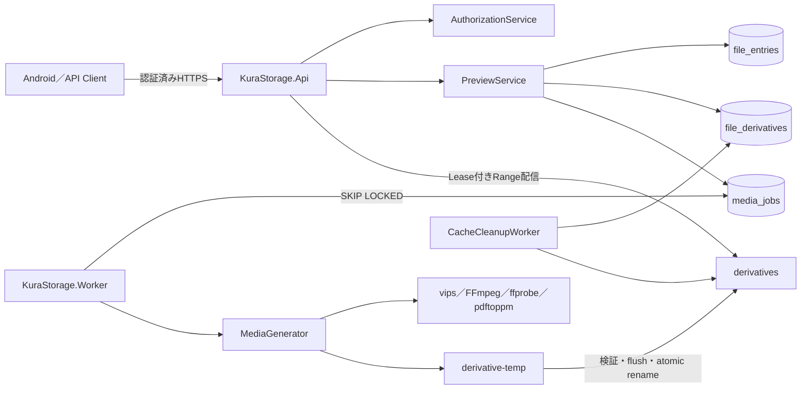

# サムネイル・派生データ・Worker基盤 設計書

## 1. アーキテクチャ概要

既存Clean Architectureと独立`KuraStorage.Worker`を拡張する。APIは認証・認可、派生Key解決、Job登録、短時間待機、状態照会、Lease付きRange配信を担当し、Media変換を実行しない。WorkerはPostgreSQL永続Queueを正としてJobを排他取得し、HDD上の一時Fileへ生成して、検証とatomic rename後にだけ公開する。

派生データは元ファイルから再生成可能なCacheであり、元ファイルを変更しない。DBとHDDを単一Transactionにできないため、Job・Derivative状態、Worker token、Lease、決定的Pathにより、再実行しても同じ安全状態へ収束させる。



依存方向は次を維持する。

```text
KuraStorage.Api / KuraStorage.Worker
                  ↓
        KuraStorage.Application
                  ↓
          KuraStorage.Domain

KuraStorage.Infrastructure ── Application／Domainのinterfaceを実装
```

- DomainはEF Core、ASP.NET Core、PostgreSQL、HDD、外部Processへ依存しない。
- Applicationは状態遷移、認可、Lock、Job登録、Retry、Cleanup順序を制御する。
- InfrastructureはEF Core、PostgreSQL Queue、Storage、Process起動、Probe、Metricを実装する。
- APIとWorkerは入力／出力、DI、Hosted Service登録だけを担当する。

## 2. 主要な設計決定

### 2.1 汎用Media Job

承認済み要求に従い、公開APIと内部概念を`MediaJob`へ統一する。`TranscodeJob`という動画専用名は新規実装に使用しない。正式文書の`transcode_jobs`と`/api/v1/transcode-jobs/{jobId}`は、PR1で`media_jobs`と`/api/v1/media-jobs/{jobId}`へ修正する。

`FileDerivative`は現在の生成結果、`MediaJob`は実行履歴を表す。1つのDerivativeに複数の完了・失敗Job履歴を許可するが、`QUEUED`または`RUNNING`の有効Jobは最大1件とする。

### 2.2 全生成を独立Workerで実行

写真処理もAPI Processでは実行しない。APIはJob作成後、DB状態を最大2秒間だけ非占有Pollingする。Workerが2秒以内に完了すれば同じ要求で配信し、未完了なら`202 Accepted`を返す。HTTP取消と生成Processを分離し、画像DecoderもAPI Processから隔離する。

### 2.3 Media Tool

Managed Media libraryをDomain／Applicationへ導入せず、Infrastructureの限定Process Adapterから次を使用する。

| Tool | 用途 | Debian 12 Package | 境界 |
| --- | --- | --- | --- |
| `vips` | 写真Thumbnail、Low／Medium、WebP encode | `libvips-tools` | 固定操作と検証済みPathだけを引数配列で渡す |
| `ffmpeg` | 動画Frame抽出、動画Low／Medium生成 | `ffmpeg` | 固定Profile、`-nostdin`、進捗pipe、単一動画Job |
| `ffprobe` | 動画入力・出力検証 | `ffmpeg` | JSON出力をboundedに解析する |
| `pdftoppm` | PDF先頭PageのRaster化 | `poppler-utils` | 先頭Page、固定解像度、Timeout付き |

正確なPackage versionは対象PiのDebian 12 repositoryで解決した値をDeployment Test時に記録し、Release／SBOM／運用記録へ固定する。実行時にInternetからBinaryやCodecをDownloadしない。`verify.sh`はBinary、Version、必要Loader／Encoder、arm64実行を確認する。

`vips`がJPEG、PNG、WebP、GIF、BMP、HEIF loaderまたはWebP saverを提供しない環境はMedia WorkerをReadyにしない。PDFと動画のTool不足も管理状態へ出すが、APIの元ファイル配信は停止しない。

### 2.4 Storage配置

```text
<storage-root>/
├── users/
├── upload-temp/
├── upload-sessions/
├── derivatives/
│   └── <owner-user-id>/
│       └── <source-file-id>/
│           └── <source-version>/
│               └── <profile-version>/
│                   ├── thumbnail.webp
│                   ├── pdf-thumbnail.webp
│                   ├── image-low.webp
│                   ├── image-medium.webp
│                   ├── video-low.mp4
│                   └── video-medium.mp4
└── derivative-temp/
    └── <job-id>/
        └── <attempt-token>.part
```

- IDはlowercase `N`形式、Versionは正の10進数、種別と拡張子はServer固定値とする。
- 元File名、Client入力、MIME文字列をPathへ含めない。
- 一時Fileと正式Fileを同一exFAT Volumeへ置き、renameをatomicにする。
- `relative_path`はStorage Root相対でDBへ保存し、API、通常Log、Metricへ公開しない。
- 起動時清掃でStorage Root全走査を行わず、DB上のstale Job候補から一時Pathを導出する。

## 3. Domain設計

### 3.1 FileDerivative

```csharp
public enum DerivativeType
{
    Thumbnail,
    PdfThumbnail,
    ImageLow,
    ImageMedium,
    VideoLow,
    VideoMedium,
}

public enum DerivativeStatus
{
    Pending,
    Running,
    Ready,
    Failed,
    BlockedSourceMissing,
    Deleting,
}
```

| Property | 型 | 規則 |
| --- | --- | --- |
| `Id` | UUID | Server生成 |
| `SourceFileId` | UUID | `file_entries.id`、Fileだけを許可 |
| `SourceVersion` | bigint | 1以上 |
| `DerivativeType` | enum | 6種別 |
| `ProfileVersion` | int | 1以上、設定Profileに対応 |
| `RelativePath` | string | Server決定、Storage Root相対 |
| `Size` | bigint | `READY`だけ正数、他状態は0 |
| `Status` | enum | 下表の遷移だけを許可 |
| `LastAccessedAt` | UTC nullable | Low／Mediumの完成・配信時に設定 |
| `ExpiresAt` | UTC nullable | Low／Mediumだけ設定、Thumbnailはnull |
| `LeaseUntil` | UTC nullable | active Leaseの最大期限を投影 |
| `ErrorCode` | string nullable | allow-listされたCode |
| `Revision` | bigint | 条件付き更新用、更新ごとに増加 |
| `CreatedAt`／`UpdatedAt` | UTC | Server時刻 |

許可する主な状態遷移。

| From | To | 条件 |
| --- | --- | --- |
| 新規 | `PENDING` | 論理Key、Path、Profileが有効 |
| `PENDING` | `RUNNING` | Workerが有効Jobを排他取得 |
| `RUNNING` | `READY` | Source／Profile再確認、検証、flush、atomic rename完了 |
| `RUNNING` | `FAILED` | 恒久失敗またはRetry上限到達 |
| `RUNNING` | `PENDING` | Retry可能失敗またはstale回収、Worker token一致 |
| `FAILED` | `PENDING` | 認可済み明示Retry、現Source／Profile一致 |
| 任意の非削除状態 | `BLOCKED_SOURCE_MISSING` | `MISSING`確定 |
| `READY`／`FAILED`／`BLOCKED_SOURCE_MISSING` | `DELETING` | CleanupまたはLifecycle削除権取得 |
| `DELETING` | 削除 | 物理File削除済み |

`READY`の物理File欠損または検証失敗は配信せず、旧行を`DELETING`経由で整理して同じ論理Keyを再生成可能にするApplication操作へ収束させる。

### 3.2 MediaJob

```csharp
public enum MediaJobStatus
{
    Queued,
    Running,
    Completed,
    Failed,
    Cancelled,
}
```

| Property | 型 | 規則 |
| --- | --- | --- |
| `Id` | UUID | Server生成 |
| `DerivativeId` | UUID | `file_derivatives.id` |
| `JobType` | DerivativeType | Derivativeと一致 |
| `Status` | enum | Queue状態 |
| `RequestedByUserId` | UUID | 認証Contextから取得 |
| `AttemptCount` | int | 0〜3、取得時に増加 |
| `AvailableAt` | UTC | Backoff後の取得可能時刻 |
| `WorkerToken` | UUID nullable | 現行実行所有者 |
| `HeartbeatAt` | UTC nullable | Running中10秒ごとに更新 |
| `ProgressPercent` | int nullable | 0〜100、算出不能時null |
| `ProcessedDurationMs`／`TotalDurationMs` | bigint nullable | 非負、動画で利用 |
| `StartedAt`／`CompletedAt` | UTC nullable | 状態に応じて設定 |
| `ErrorCode` | string nullable | allow-list Code |
| `CreatedAt`／`UpdatedAt` | UTC | Server時刻 |

- 初回を含む実行回数上限は3回、自動Retryは最大2回、Backoffは30秒、2分とする。
- 手動Retryでは監査可能な新しいJob行を作成する。
- terminal Jobは既定7日保持し、Job履歴CleanupでBatch削除する。
- `CANCELLED`はSource Version変更、Purge、機能上不要になったJobにだけ使用し、Client切断では使用しない。
- Queue位置は取得可能な`QUEUED`の`created_at, id`順で算出し、`RUNNING`ではnullとする。

### 3.3 DerivativeLease

複数同時Range配信と生成Leaseを正しく所有するため、所有者別Tableを使用する。

| Property | 型 | 規則 |
| --- | --- | --- |
| `Id` | UUID | Lease ID |
| `DerivativeId` | UUID | 対象Derivative |
| `LeaseType` | `GENERATION`／`DELIVERY` | 用途を限定 |
| `OwnerToken` | UUID | Worker tokenまたは配信token |
| `ExpiresAt` | UTC | 現在時刻より後 |
| `CreatedAt`／`UpdatedAt` | UTC | Server時刻 |

- `(derivative_id, lease_type, owner_token)`を一意とする。
- CleanupとLifecycle削除は有効Leaseが1件でもあれば削除権を取得できない。
- `file_derivatives.lease_until`はactive Lease最大値の保守的な投影とし、正の判定はLease Tableの`EXISTS`を使用する。
- 配信終了時は所有Leaseだけを削除し、残るLeaseの最大期限を再計算する。
- 異常終了時は期限切れ行だけをBatch削除し、旧Owner tokenの更新を条件付きUPDATEで拒否する。

## 4. PostgreSQL設計

### 4.1 `file_derivatives`

- Primary Key: `id`。
- FK: `source_file_id -> file_entries(id) ON DELETE CASCADE`。
- Unique: `(source_file_id, source_version, derivative_type, profile_version)`。
- Check: Version 1以上、Size 0以上、Revision 1以上、Thumbnailの`expires_at IS NULL`、`READY`の`size > 0`、`FAILED`のError必須。
- Index: `(source_file_id, status)`、`(status, expires_at, last_accessed_at, id)`、`(derivative_type, status, last_accessed_at, id)`、`(status, lease_until)`。

### 4.2 `media_jobs`

- Primary Key: `id`。
- FK: `derivative_id -> file_derivatives(id) ON DELETE CASCADE`。
- FK: `requested_by_user_id -> users(id) ON DELETE CASCADE`。
- Partial unique: `derivative_id WHERE status IN ('QUEUED', 'RUNNING')`。
- Check: Attempt 0〜3、Progress 0〜100、Duration非負、状態ごとの時刻／token整合。
- Index: `(status, available_at, created_at, id)`、`(status, completed_at, id)`、`(derivative_id, created_at DESC, id DESC)`。

Queue取得は単一SQLで候補選択と更新を行う。

```sql
WITH candidate AS (
    SELECT id
    FROM media_jobs
    WHERE status = 'QUEUED'
      AND available_at <= @now
    ORDER BY created_at, id
    FOR UPDATE SKIP LOCKED
    LIMIT 1
)
UPDATE media_jobs AS job
SET status = 'RUNNING',
    worker_token = @workerToken,
    attempt_count = attempt_count + 1,
    started_at = COALESCE(started_at, @now),
    heartbeat_at = @now,
    updated_at = @now
FROM candidate
WHERE job.id = candidate.id
RETURNING job.*;
```

Heartbeat、進捗、完了、失敗は`id + RUNNING + worker_token`を条件にする。stale回収はHeartbeatが2分以上古く、有効生成LeaseがないJobをBatch lockし、Retry可能なら`QUEUED`、上限到達なら`FAILED`へ変更する。

### 4.3 `derivative_leases`

- Primary Key: `id`。
- FK: `derivative_id -> file_derivatives(id) ON DELETE CASCADE`。
- Unique: `(derivative_id, lease_type, owner_token)`。
- Index: `(derivative_id, expires_at)`、`(expires_at, id)`。
- 注入した`ISystemClock.UtcNow`をTransaction内で一度取得し、比較時刻を統一する。

### 4.4 Migration

- 新規3 TableとIndexだけを追加し、既存`file_entries`をBackfillしない。
- Up、Down、再Up、Model snapshot一致をPostgreSQL 17 Testcontainersで検証する。
- DownはHDD派生Fileを自動削除しない。Rollback前にWorker停止と専用Cleanup／Backupを必須とする。
- 適用順はWorker停止、API停止、DB Backup、Migration、API起動、Worker起動とする。

## 5. Applicationコンポーネント

### 5.1 `PreviewService`

**責務**:

- File ID、Variant、Disposition、認証Actorを認可済み配信または生成状態へ変換する。
- Source File、Version、Profileに一致するDerivativeを再利用する。
- Jobを冪等作成し、写真系だけ最大2秒待機する。
- Job状態照会と明示Retryを処理する。

**処理境界**:

1. File／祖先を最大64段で取得し、`AuthorizationService`で`VIEW`を要求する。
2. File、`ACTIVE`、未完了操作なし、Storage利用可能、VariantとMIMEを検証する。
3. Source File ID由来の既存mutation advisory lockを取得する。
4. File、権限、状態、Versionを再読込する。
5. 論理Key一致のDerivativeを取得する。
6. `READY`なら物理存在を確認し、配信Lease取得へ進む。
7. `PENDING`／`RUNNING`なら既存Jobを返す。
8. 未生成またはRetry可能`FAILED`ならDerivativeとJobを同一Transactionで作成する。
9. 写真／Thumbnailは2秒まで状態をPollingし、動画は直ちに`202`を返す。

### 5.2 `MediaJobRunner`

- QueueからJobを1件取得し、Source再検証、Lease、生成、検証、公開、状態更新を制御する。
- Tool AdapterをJob種別にDispatchし、Retry可能性とError Codeを決定する。
- Worker Loopは各Jobで新しいDI Scopeを作成し、処理中に次Jobを取得しない。
- 初期実装は全Media Jobを直列処理する。Pi実測後も動画はSemaphore 1を通し、画像専用並列度だけを1〜2で設定可能にする。

### 5.3 `CacheCleanupService`

- 期限切れLow／Mediumを30分ごとにBatch削除する。
- 通常Cacheが10GBを超えた場合、LRU順で6GB以下まで削除する。
- Thumbnail、非`READY`、active Leaseを除外する。
- 候補取得と`DELETING`遷移を短いTransactionで行い、Transaction外で物理削除し、別Transactionで行を削除する。
- 物理削除失敗は条件更新で`READY`へ戻し、物理Fileが既にない場合は冪等成功とする。

### 5.4 `DerivativeLifecycleParticipant`

`IPermanentDeleteParticipant`と`IFileIndexDeletionParticipant`へ参加する。

- Permanent Deleteの物理Phaseでは対象TreeのDerivative相対Pathだけを列挙する。
- DB Phaseでは対象Source File IDのDerivative、Lease、Jobだけを削除する。
- `MISSING`一覧削除では元ファイルへ触れず、派生物理Fileと管理情報だけを削除する。
- TrashではThumbnailを保持し、Low／Mediumを削除する。
- Restoreでは現Version Thumbnailを再利用する。
- `MISSING`確定ではJobを`CANCELLED`、Derivativeを`BLOCKED_SOURCE_MISSING`へ変更する。

## 6. Infrastructureコンポーネント

### 6.1 `PostgreSqlMediaRepository`

- Derivative検索・作成、Queue排他取得、条件更新、Lease、Cleanup Batch、容量集計を実装する。
- EF Core追跡更新と必要なNpgsql SQLを同一Repository境界に閉じ込める。
- unique violationは既存行再取得へ収束し、Constraint名をAPIへ返さない。

### 6.2 `DerivativeFileStore`

- 決定的Path生成、Root内解決、Directory作成、一時File、flush、atomic rename、限定削除、存在・Size確認、read streamを提供する。
- `IFileStore`を肥大化させず、`IDerivativeFileStore`として分離する。
- `StorageGuard`と同じMount、Storage ID、read-only、Symlink検証を再利用する。
- 正式Pathを上書きせず、同Jobの回復か競合かをDB状態とSize／Probeで判定する。

### 6.3 Process Adapter

- `IMediaProcessRunner`が`ProcessStartInfo.ArgumentList`、標準入出力redirect、Timeout、取消、Process tree終了を共通実装する。
- Working directoryをJob専用一時Directoryに固定する。
- Environmentをallow-listし、Shell、User指定Environment、未検証PATH検索を使用しない。
- stdout／stderrは各1MiB上限のRing bufferで読み、Error responseへProcess出力を含めない。

個別Adapterは次とする。

- `VipsImageGenerator`: autorotate、page 0、thumbnail、WebP encode、dimension検証。
- `FfmpegVideoThumbnailGenerator`: Probe後のFrame時刻算出、単一Frame、WebP出力、再Probe。
- `PopplerPdfThumbnailGenerator`: 先頭PageをPNGへRaster化し、VipsでWebPへ変換。
- `FfmpegVideoTranscoder`: Low／Medium固定Profile、`-progress pipe:1`解析、MP4出力。
- `FfprobeMediaInspector`: JSONをstrict modelへ変換し、未知／欠落必須値を失敗させる。

### 6.4 Hosted Services

- `MediaGenerationWorker`: Queue取得と`MediaJobRunner`呼出し。
- `MediaRecoveryWorker`: 起動時と1分ごとにstale Job、期限切れLease、DB候補に対応する一時Fileを回収。
- `CacheCleanupWorker`: 起動時と30分ごとに`CacheCleanupService`を実行。
- `MediaJobHistoryCleanupWorker`: 1日ごとに7日超過のterminal JobをBatch削除。

既存`TrashPurgeWorker`と同じScope／Delay Patternを再利用し、APIへHosted Serviceを登録しない。

## 7. API設計

### 7.1 Content API

```http
GET /api/v1/files/{fileId}/content?variant=thumbnail&disposition=inline
GET /api/v1/files/{fileId}/content?variant=image-low&disposition=inline
GET /api/v1/files/{fileId}/content?variant=image-medium&disposition=attachment
GET /api/v1/files/{fileId}/content?variant=video-low&disposition=inline
GET /api/v1/files/{fileId}/content?variant=video-medium&disposition=inline
```

`variant`省略時は既存互換の`original`とする。VariantとSource MIMEが不一致なら`MEDIA_VARIANT_UNSUPPORTED`を返す。

```json
{
  "status": "GENERATING",
  "jobId": "uuid",
  "jobStatusUrl": "/api/v1/media-jobs/uuid",
  "retryAfterSeconds": 2
}
```

- 生成開始または継続中は`202`と`Retry-After` Headerを返す。
- `READY`は既存単一Range規則を再利用し、`Accept-Ranges: bytes`を返す。
- 派生Download名は最新名称のbaseへ`_thumbnail`、`_low`、`_medium`を付け、実拡張子を使用する。
- Thumbnailと写真は`image/webp`、動画は`video/mp4`を返す。

### 7.2 Job API

```http
GET /api/v1/media-jobs/{jobId}
POST /api/v1/media-jobs/{jobId}/retry
```

```json
{
  "status": "GENERATING",
  "progressPercent": 46,
  "processedDurationMs": 276000,
  "totalDurationMs": 600000,
  "queuePosition": null,
  "retryAfterSeconds": 3,
  "contentUrl": null
}
```

- 内部`QUEUED`／`RUNNING`は`GENERATING`、`COMPLETED`かつDerivative `READY`は`READY`、`FAILED`は`FAILED`へ変換する。
- `READY`時だけ`contentUrl`を返す。算出不能な進捗・Queue位置はnullとする。
- Retryは`FAILED`かつRetry可能、Source `ACTIVE`、現在Version／Profile一致の場合だけ`202`で新Jobを返す。
- 同時RetryはPartial uniqueで1件へ収束する。
- 他Userまたは閲覧不可Jobは既存方針に合わせて`404`へ正規化する。

### 7.3 Lease付きRange配信

`LeasedFileResult : IResult`を追加する。

1. 認可とDerivative検証後、`DELIVERY` Leaseを2分で取得する。
2. Lease取得後に物理Fileを開き、Sizeを再確認する。
3. 単一Rangeを解析し、64KiB bufferで指定範囲だけをStreamする。
4. 30秒ごとに同じOwner tokenのLeaseを2分先へ更新する。
5. 正常終了、Client取消、例外の`finally`で所有Leaseを解放する。
6. 配信開始時にLow／Mediumの`lastAccessedAt`と`expiresAt = now + 24時間`を更新する。ThumbnailはExpiryを設定しない。

## 8. データフロー

### 8.1 Thumbnail／写真要求

```text
1. APIが認証、閲覧権限、ACTIVE、MIME、Storageを検証する。
2. Source ID lock内で現Version／ProfileのDerivativeを検索する。
3. READYならDELIVERY Leaseを取得して配信する。
4. 未生成ならDerivative(PENDING)とMediaJob(QUEUED)を同一Transactionで作成する。
5. WorkerがJobを排他取得し、GENERATION Leaseを取得する。
6. Workerが一時Fileへ生成し、出力をProbeする。
7. flushとatomic rename後、DerivativeをREADY、JobをCOMPLETEDへ更新する。
8. APIは最大2秒待機し、READYなら配信、未完了なら202を返す。
```

### 8.2 動画要求

```text
1. APIが認証・認可・Source状態を検証する。
2. READYならLease付きRange配信する。
3. 未生成ならDerivativeとJobを冪等作成し、直ちに202を返す。
4. WorkerがQueue順に1件取得し、一時MP4へ全体変換する。
5. Workerは10秒ごとにHeartbeat、解析可能時は進捗も更新する。
6. ffprobe検証、flush、atomic rename後だけREADY／COMPLETEDへ変更する。
7. ClientはJob APIを再照会し、READY後にcontent APIを要求する。
```

### 8.3 TTL／LRU清掃

```text
1. Workerが期限切れREADY Low／Mediumを100件ずつ取得する。
2. active Leaseなしを再確認してDELETINGへ条件付き更新する。
3. 物理Fileを冪等削除し、管理行を削除する。
4. 通常Cache容量をREADY Low／MediumのDB size合計で再計算する。
5. 10GB超過時だけLRU候補を100件ずつ処理する。
6. 6GB以下になったら終了する。
```

### 8.4 stale Job回復

```text
1. heartbeatが2分以上古いRUNNINGを安定順で取得する。
2. Job、Derivative、GENERATION Lease、Source Versionをlock内で再読込する。
3. 正式Fileが存在し検証成功ならREADY／COMPLETEDへ確定する。
4. 一時Fileだけなら削除し、試行回数内はBackoff付きQUEUEDへ戻す。
5. 上限到達または恒久失敗はFAILEDへ変更する。
6. 旧Worker tokenによる後続更新を拒否する。
```

## 9. Error設計

| Error Code | HTTP | 意味 |
| --- | ---: | --- |
| `MEDIA_VARIANT_UNSUPPORTED` | 400 | MIMEとVariantの組合せが非対応 |
| `MEDIA_SOURCE_NOT_ACTIVE` | 409 | Trash、Missing、未完了操作中 |
| `MEDIA_GENERATION_FAILED` | 409 | 恒久失敗、詳細は非公開 |
| `MEDIA_RETRY_NOT_ALLOWED` | 409 | 状態、Version、Retry可否が不一致 |
| `MEDIA_TOOL_UNAVAILABLE` | 503 | 必要Tool／codecが利用不可 |
| `MEDIA_WORKER_UNAVAILABLE` | 503 | Worker異常が確定 |
| `STORAGE_UNAVAILABLE` | 503 | 既存共通Errorを再利用 |
| `STORAGE_CAPACITY_INSUFFICIENT` | 507 | 安全余裕を満たさない |
| `RANGE_NOT_SATISFIABLE` | 416 | 既存共通Errorを再利用 |

- Retry可能: DB接続断、一時HDD I/O、Tool一時起動失敗、Worker kill、条件付き更新競合。
- 恒久失敗: Unsupported codec、破損Input、暗号化PDF、Profile不適合、出力Probe不合格。
- Source失効: Version変更、Trash、Missing、Purge。Jobは`CANCELLED`、DerivativeはLifecycle規則へ従う。
- 容量不足: Backoff付きRetry対象とし、3回後は`FAILED`。元ファイルは不変。
- Process stderr、Path、Command、Constraint名、Stack traceをResponseへ含めない。

## 10. 設定設計

`Media`型付きOptionsをAPIとWorkerで共有し、起動時検証する。

```json
{
  "Media": {
    "DerivativeRoot": "derivatives",
    "TemporaryRoot": "derivative-temp",
    "ImageWaitMilliseconds": 2000,
    "ThumbnailProfileVersion": 1,
    "ImageProfileVersion": 1,
    "VideoProfileVersion": 1,
    "ThumbnailMaxDimension": 512,
    "ThumbnailWebpQuality": 75,
    "JobPollMilliseconds": 500,
    "JobHeartbeatSeconds": 10,
    "StaleJobSeconds": 120,
    "MaximumAttempts": 3,
    "GenerationLeaseSeconds": 120,
    "DeliveryLeaseSeconds": 120,
    "DeliveryLeaseRenewalSeconds": 30,
    "CacheTtlHours": 24,
    "CacheHighWatermarkBytes": 10737418240,
    "CacheLowWatermarkBytes": 6442450944,
    "CleanupIntervalMinutes": 30,
    "CleanupBatchSize": 100,
    "TerminalJobRetentionDays": 7,
    "VipsPath": "/usr/bin/vips",
    "FfmpegPath": "/usr/bin/ffmpeg",
    "FfprobePath": "/usr/bin/ffprobe",
    "PdftoppmPath": "/usr/bin/pdftoppm"
  }
}
```

- Rootは相対・単一Top-level segmentとし、既存Rootとの重複、`..`、separator、absolute pathを拒否する。
- Low watermarkはHigh watermark未満、Lease renewalはLease期限未満、Heartbeatはstale期限未満とする。
- 動画並列数は固定1とし、設定で増やせない。
- Binary pathはabsolute、root所有、通常Userから書込み不可、実行可能であることをDeploymentで確認する。

## 11. Test戦略

### 11.1 Unit Test

- Derivative／Jobの許可・不許可状態遷移、Version、Profile、時刻、Size、Error不変条件。
- Variant／MIME、Profile選択、Download名、公開Status、Error分類。
- 同時要求の再利用、2秒待機、取消、Retry、stale回復。
- Owner、直接共有、継承共有、権限失効、Admin暗黙権限なし、Source全状態。
- TTL 23:59:59／24:00:00、10GB境界、LRU tie-break、Thumbnail・Lease除外。

### 11.2 PostgreSQL統合Test

- Migration Up／Down／再Up、Constraint、Partial unique、Index、Cascade。
- 複数Connectionでの`SKIP LOCKED`、同一Job二重取得なし、Queue順。
- Worker token条件更新、stale回収、同時Retry、Lease取得・更新・解放。
- 30万件条件でQueue取得、状態照会、Cleanup Batch、容量集計の実行計画と時間。

### 11.3 Storage／Process統合Test

- Test RootでPath traversal、absolute path、Symlink、特殊File、read-only、容量不足を確認する。
- 実`vips`、`ffmpeg`、`ffprobe`、`pdftoppm`で代表・破損Fixtureを処理する。
- EXIF回転、Alpha、Animated先頭Frame、動画Frame位置、PDF先頭Page、各Profile、拡大なしを検証する。
- Timeout、Process kill、出力超過、取消、HDD切断、atomic rename後DB失敗を注入する。
- Fixtureは自作または再配布可能な小容量Fileとし、出典とLicenseを記録する。

### 11.4 API／Pi E2E

- `200`、`202`、`206`、`400`、`401`、`404`、`409`、`416`、`503`、`507`とOpenAPI一致。
- Range、RFC 5987名、MIME、Retry-After、Job URL、進捗／Queue位置null。
- 配信取消、複数Range、Lease更新・解放、Cleanup競合、API再起動後のJob継続。
- Piで生成時間、CPU、Memory、I/O、出力Size、動画同時1件、Queue順を測定する。
- Worker／API／PostgreSQL／Pi再起動、HDD切断、read-only、容量不足、Rollback。
- LAN／ZeroTier、共有権限、Rename／Move／内容更新／Trash／Restore／Purge／Missing。
- 30万件Thumbnail容量推定、10GB／6GB Cleanup、Log／Metric非漏えい。

CoverageはDomain／Application全体80%以上、追加状態遷移・Validation・認可境界95%以上とする。

## 12. 依存関係

Media処理専用NuGet packageは追加しない。既存.NET BCL、EF Core、Npgsql、Hostingを使用する。OS Packageは`libvips-tools`、`ffmpeg`、`poppler-utils`を使用する。

Test用Packageが必要な場合はTest project限定とし、Product codeへ伝播させずLicenseとSBOMを確認する。Install／Upgrade Scriptは無断で`apt upgrade`せず、必要Packageの存在と互換性を検証する。

## 13. ディレクトリ構造

```text
server/src/
├── KuraStorage.Domain/Media/
│   ├── DerivativeEnums.cs
│   ├── FileDerivative.cs
│   ├── MediaJob.cs
│   └── DerivativeLease.cs
├── KuraStorage.Application/
│   ├── Abstractions/MediaAbstractions.cs
│   └── Media/
│       ├── MediaContracts.cs
│       ├── PreviewService.cs
│       ├── MediaJobRunner.cs
│       ├── MediaRecoveryService.cs
│       ├── CacheCleanupService.cs
│       └── DerivativeLifecycleParticipant.cs
├── KuraStorage.Infrastructure/
│   ├── Configuration/MediaOptions.cs
│   ├── Media/
│   │   ├── DerivativeFileStore.cs
│   │   ├── MediaProcessRunner.cs
│   │   ├── VipsImageGenerator.cs
│   │   ├── FfmpegVideoThumbnailGenerator.cs
│   │   ├── PopplerPdfThumbnailGenerator.cs
│   │   ├── FfmpegVideoTranscoder.cs
│   │   └── FfprobeMediaInspector.cs
│   └── Persistence/
│       ├── PostgreSqlMediaRepository.cs
│       └── Configurations/
├── KuraStorage.Api/Media/LeasedFileResult.cs
└── KuraStorage.Worker/Workers/
    ├── MediaGenerationWorker.cs
    ├── MediaRecoveryWorker.cs
    ├── CacheCleanupWorker.cs
    └── MediaJobHistoryCleanupWorker.cs

server/tests/KuraStorage.Domain.Tests/Media/
server/tests/KuraStorage.Application.Tests/Media/
server/tests/KuraStorage.IntegrationTests/Media/
contracts/openapi/kurastorage-api.yaml
deployment/config/server/appsettings.Production.json.template
deployment/config/systemd/kurastorage-worker.service.template
deployment/raspberry-pi/
docs/operations/media-worker.md
docs/testing/20260829-media-worker-*.md
```

空Directoryや将来用Projectは作成しない。実装時に既存Projectの責務と300行目安に合わせて分割する。

## 14. 実装順序

1. PR1: Domain、3 Table、Migration、PostgreSQL Queue、Derivative Storage、Options、Lifecycle Participant。
2. PR2: Process共通境界、Thumbnail／写真生成、PreviewService、Content／Media Job API、Lease付き配信。
3. PR3: FFmpeg動画Low／Medium、進捗、stale回復、Worker配置、Metric。
4. PR4: TTL／LRU Cleanup、Job履歴Cleanup、Pi性能・障害E2E、運用・Release文書。

各PRは実装・Test・正式文書・OpenAPI・tasklist更新を含め、先行PR Merge後に開始する。PR作成後はMergeせず停止する。

## 15. Security考慮事項

- Client指定のUser、Owner、File Path、Derivative Path、Profile、Binary、Process引数を使用しない。
- Sourceは認可済み`FileEntry`から解決し、Toolへread-only入力として渡す。
- Binaryはabsolute pathとroot所有・非writableを検証し、Shellを起動しない。
- 既存systemd hardening、`NoNewPrivileges`、`PrivateNetwork`、Capabilityなし、Storage Root限定writeを維持する。
- PDF／画像／動画を不信Inputとして扱い、Dimension、Page、Duration、出力、Timeout、Memory／Task上限を適用する。
- Symlinkを辿らず、Root外Pathと既存File上書きを拒否する。
- Job ID、File ID、Path、File名、User名、Process出力をMetric labelへ含めない。
- Error responseと通常LogへPath、Command、stderr、Token、Constraintを含めない。
- 認可はJob作成時だけでなく、状態照会、Retry、配信、Lock取得後に再評価する。

## 16. Performance考慮事項

- API要求でProcessを実行せず、2秒待機は500ms DB Polling最大4回とする。
- Queue取得とCleanupは複合Index、安定順Keyset、Batch 100を使用する。
- 30万行をMemoryへ全保持せず、容量はDBの`READY` Low／Medium `size`合計で算出する。
- 元ファイルと派生Fileは64KiB bufferでStreamingし、全体Byte arrayへ変換しない。
- Process出力はbounded、動画進捗更新は最短5秒間隔にcoalesceする。
- Pi初期値は全Media直列、動画並列1とし、既存APIとIndex WorkerからResourceを奪わない。
- Thumbnail容量はCleanup対象外だがMetricと30万件容量計画で監視する。
- Queue位置Queryは認可済み単一Jobに限定し、全Job一覧APIを追加しない。

## 17. 障害回復・Rollback

- atomic rename後DB更新失敗では、stale回復が正式Fileを再Probeして`READY`へ確定する。
- DBだけ`RUNNING`で一時Fileなしの場合はRetryまたは`FAILED`へ収束する。
- 一時Fileだけ残る場合はDB Job IDとattempt tokenから限定削除する。
- 正式File欠損の`READY`は配信せず、再生成可能状態へ修復する。
- Worker停止は元ファイルAPIを止めず、新規派生要求はQueueへ残す。
- RollbackはWorker停止、Queue状態記録、DB／Storage Backup、旧Binary、前方互換Migrationの順で行う。
- Migration Downは物理派生Fileを削除しないため、専用Runbookで限定Pathを清掃してから実施する。

## 18. 将来の拡張性

- Android UIは`variant`とMedia Job APIだけに依存し、Worker実装や物理Pathを知らない。
- Profile変更は`profileVersion`を増加させ、旧Cacheを即時破壊せず通常Cleanupへ委ねる。
- 将来画像Workerだけ並列度を増やせるが、動画並列1とQueue永続性を維持する。
- HLS、音声派生、OCR、AI処理は別Derivative Type、別Profile、別Steeringで追加し、初期APIへ予約値を追加しない。
- 将来別Worker Nodeを追加しても`SKIP LOCKED`、Worker token、Leaseで重複実行を防止できる。Phase 1では単一Piだけを対象とする。

## 19. 参照ドキュメント

- `.steering/20260829-thumbnail-derivative-worker-infrastructure/requirements.md`
- `.steering/20260829-thumbnail-derivative-worker-infrastructure/tasklist.md`
- `docs/product-requirements.md` 7.11
- `docs/functional-design.md` 5.4、6.2.7〜6.2.9、7.3〜7.5、8.5、18.2 Server Step 7
- `docs/architecture-design.md` 8.6〜8.7、11.3〜11.4、15.2
- `docs/repository-structure.md`
- `docs/development-guidelines.md`
