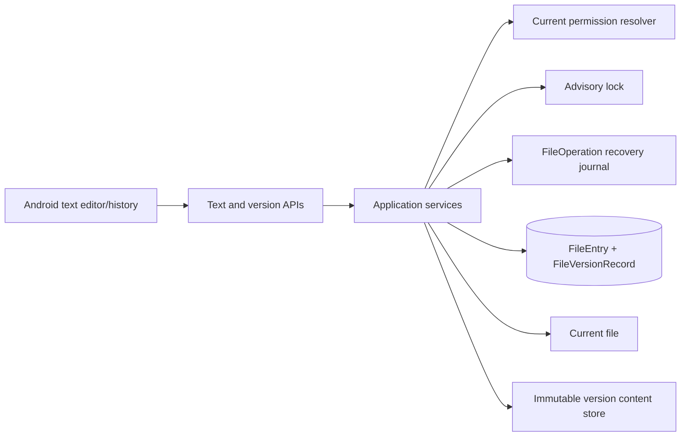

# テキスト表示・編集／ファイルバージョン 設計書

## 1. 設計方針

既存Clean Architecture、File認可、PostgreSQL advisory lock、`FileOperation` journal、HDDを現在内容の正とする原則を維持する。`FileEntry.fileVersion`を現行内容の単調増加番号として残し、各版の不変metadataをPostgreSQL、本文をHDD上のKuraStorage管理領域へ保存する。

## 2. Domain・永続化

`FileVersionRecord`は`Id`、`FileEntryId`、`Version`、`Size`、`Sha256`、`ContentRelativePath`、`ChangeKind`（`UPLOAD`、`TEXT_EDIT`、`EXTERNAL_CHANGE`、`RESTORE`）、`ActorUserId?`、`ActorDeviceId?`、`CreatedAt`を持つ。`(file_entry_id, version)`を一意とし、`(file_entry_id, version DESC)`を一覧Indexにする。

本文は`versions/{ownerUserId}/{fileId}/{version}/{sha256}.bin`相当の導出可能な相対Pathへ保存し、File名やClient入力をPathへ使用しない。内容は公開後に変更しない。Purge時だけ対象Fileのversion directoryを回復可能な手順で削除する。

既存Fileへ最初のversion recordがない移行状態では、対応テキストに対する最初の履歴対応操作時にadvisory lock後で現行内容を検証し、現在の`fileVersion`番号でlazy baselineを作る。MigrationやAdmin CLIで全件HDD走査を行わない。

## 3. 書込・回復境界

保存・復元は次の順で行う。

1. File IDのadvisory lockを取得し、Entry、現在権限、`ACTIVE`、未完了操作、`expectedVersion`を再検証する。
2. 現行内容とbaseline recordを検証し、不足時はimmutable storeへ安全に発行する。
3. 新内容を一時Fileへstreaming書込し、size、UTF-8、SHA-256、空き容量を検証する。
4. `FileOperation`へ旧版・新版・一時Path・最終Pathを記録する。
5. 新版本文をimmutable storeへatomic publishし、現行Fileをatomic renameで置換する。
6. DB transactionで`FileVersionRecord`、`FileEntry`のsize／mtime／`fileVersion + 1`、必要なActivity／Auditを更新する。
7. journalを完了し、一時資材を限定清掃する。

電源断・DB失敗後はjournalとchecksumから再実行またはrollbackし、応答済みの版を失わない。同一内容でも利用者が明示保存・復元して状態が変わった場合は新しい版を作るが、同じ冪等operation IDの再送は重複版を作らない。

## 4. Application・API

- `GET /api/v1/files/{fileId}/text`: 内容、UTF-8、`fileVersion`、size、checksumを返す。
- `PUT /api/v1/files/{fileId}/text`: `content`、`expectedVersion`、`operationId`を受け、成功時に新version metadataを返す。
- `GET /api/v1/files/{fileId}/versions?page=&pageSize=`: metadataを`version DESC`で返す。
- `GET /api/v1/files/{fileId}/versions/{version}/text`: 過去版本文とmetadataを返す。
- `POST /api/v1/files/{fileId}/versions/{version}/restore`: `expectedVersion`、`operationId`を受け、新しい現行版を作る。

本文取得は1 MiBに限定し、物理Pathを返さない。File不存在・権限なしは存在秘匿404へ統一し、不正MIME／encoding／size、version競合、Storage不足、HDD unavailable、履歴破損を型付きErrorへ変換する。履歴・本文取得ごとに現在権限を再評価する。

## 5. Android設計

既存`core-model`、`core-network`、`core-data`を拡張し、`feature-text`を追加する。FeatureはNetwork実装へ直接依存せず、App callbackでFile一覧／詳細からNavigationする。

`TextEditorViewModel`は`Loading`、`Viewing`、`Editing(dirty)`、`Saving`、`Conflict`、`Error`を持つ。編集中のcontentとbase versionを`SavedStateHandle`へ上限付きで保存する。競合時は現在版を別stateで取得し、再読込、行単位比較、別名Upload導線を提供する。強制保存は送らない。

`VersionHistoryViewModel`はPaging、Refresh、選択版preview、Restore confirmation、Restore conflictを管理する。Session／Route／File変更時は旧requestをcancelし、本文をdisk cacheへ永続保存しない。

## 6. セキュリティ・性能

- Actor User／DeviceはSecurity Contextから取得し、Client入力を信用しない。
- version本文、編集本文、File名、物理PathをLog、Metric、例外、Auditへ含めない。
- checksumは整合性確認用であり認可tokenとして扱わない。
- 一覧はmetadataだけをpage取得し、本文をN+1で取得しない。
- 内容は1 MiB上限でstreamingし、Server／Androidとも複数版本文を同時にmemory保持しない。
- 30万FileEntry・版100万件条件でIndex、Purge、一覧性能を測定する。

## 7. テスト戦略

- Domain/Application: MIME、UTF-8、size、permission、version競合、冪等性、version単調性。
- PostgreSQL/HDD Integration: Migration、baseline、atomic publish、DB失敗、電源断段階、recovery、Purge。
- API Contract: 全Endpoint、Error、body上限、認証・認可、OpenAPI。
- Android: state、dirty離脱、SavedState、競合選択、履歴Paging、復元確認、未知値fail-closed。
- E2E: 2端末競合、共有権限変更、LAN／ZeroTier、実HDD、Purge、外部変更。

## 8. 実装順序

1. 正式文書とServerのversion store／migration／回復処理。
2. Server text・history・restore APIと自動Test。
3. Android text editor・history UIと実機E2E。

新規外部依存は原則追加しない。Androidの差分表示は既存Kotlin／Composeで有界な行比較を実装し、大規模merge libraryは導入しない。
