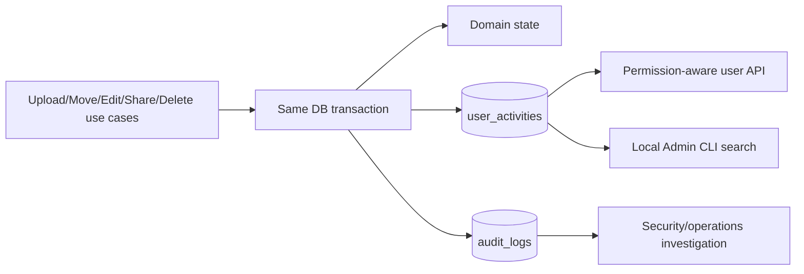

# ユーザー向け操作履歴 設計書

## 1. 設計方針

利用者表示用`UserActivity`とセキュリティ調査用`AuditLog`を別aggregate・別table・別query contractとして維持する。対象use caseだけが成功状態変更と同じDB transactionで両者を必要に応じて追記する。

## 2. Domain・Schema

`UserActivity`は固定列として`Id`、`OperationId`、`ActivityType`、`OccurredAt`、`ActorUserId?`、`ActorDisplayName`、`ActorDeviceName?`、`TargetEntryId?`、`TargetType`、`TargetName`、`OwnerUserId?`、`OwnerDisplayName`、`ParentEntryId?`、`DetailKind`を持つ。型付きdetail tableまたは制約付きnullable列で次だけを表す。

- Move: source／destination Folder ID?・名前snapshot。
- Edit: resulting file version、`TEXT_SAVE`／`VERSION_RESTORE`。
- Share: recipient User ID?・表示名snapshot、permission、`CREATED`／`UPDATED`／`REVOKED`。
- Delete: `TRASHED`／`PURGED`。
- Upload: resulting file version。

自由形式JSONへ秘密情報を混入させない。`operation_id`を一意にしてretry時の重複を防ぐ。参照FKはFile／User削除でActivityを消さないようnullable `ON DELETE SET NULL`または非FK snapshot IDとする。

主要Indexは`(actor_user_id, occurred_at DESC, id DESC)`、`(owner_user_id, occurred_at DESC, id DESC)`、`(target_entry_id, occurred_at DESC, id DESC)`、`(activity_type, occurred_at DESC, id DESC)`とする。pageはkeyset cursorを用いる。

## 3. 記録境界

Activity factoryをApplicationへ置き、各use caseで状態変更の確定後に追加する。Uploadは正式FileEntry公開、Moveは親変更、Editは新version確定、Shareは実状態変更、Trashは状態遷移、PurgeはFileEntry削除前snapshot取得後に記録する。

FileOperationを伴う操作はjournal recoveryでも同じ`operationId`を使い、再実行で重複Activityを作らない。失敗・rollback・no-opはActivityを残さない。Auditが必要な操作は同じtransactionへ追加し、いずれかの永続化失敗で状態変更もrollbackまたはjournal recovery対象にする。

## 4. 利用者Query・API

`GET /api/v1/activities?type=&cursor=&pageSize=`を追加する。Security ContextのActorだけを入力とし、Client指定User／Ownerは受けない。

SQL段階で次の和集合を作る。

1. `actor_user_id = current user`。
2. 現在のOwner、直接Share、祖先Folder Shareにより対象を閲覧可能。
3. Purge済みActivityはactorまたはsnapshot ownerだけ。

現在targetが存在する行は既存の深度64 permission CTEを再利用し、`TRASHED`、未完了操作、共有失効を考慮する。Page後にApplicationでfilterしない。Responseはdisplay snapshot、操作種別、発生日時、表示可能なdetailだけを返し、内部ID・Audit列を除外する。

## 5. Admin CLI検索

`KuraStorage-admin activity search`を追加し、`--actor-user`、`--owner-user`、`--type`、`--from`、`--to`、`--file-id`、`--limit`、`--cursor`、`--json`を提供する。ローカルCLIから共通Application queryを呼び、DBを直接無秩序に検索しない。

User selectorは既存管理CLI規約に従い、曖昧名を拒否する。既定limit 100、最大1000、UTC期間の最大幅を365日とし、安定cursorを返す。検索実行は条件の分類と件数だけをAuditへ記録し、検索語・File名・結果本文を記録しない。

## 6. Android設計

`feature-activity`を追加し、`core-model`、`core-network`、`core-data`、`core-ui`へ契約を分離する。HomeまたはProfileから履歴一覧へNavigationし、type filter、Paging、明示的なRefresh操作、Empty、Loading、Error、行detailを提供する。

未知Activity／detail enumはfail-closedな「未対応の操作」として機微なraw値を表示しない。対象が現在アクセス可能な場合だけ既存File詳細への導線を表示し、404／権限失効後はsnapshot表示だけに戻す。Session変更時に旧UserのPageを破棄する。

## 7. セキュリティ・性能

- 一般APIとAdmin CLI repository interfaceを分離し、Admin filterをHTTP endpointへ流用しない。
- Actor・閲覧範囲はServerで確定し、Android filterを認可境界にしない。
- Display snapshotは長さ・Unicode・control characterを既存User／File名規則で正規化する。
- File本文、物理Path、Token、Request ID、OS User、失敗理由をActivityへ保存しない。
- 100万件seedでkeyset pagination、permission CTE、admin filterのQuery plan、p50／p95を測定する。
- Activity table増加率、Backup容量、Migration／Index作成時間を実測し、無制限offsetを使用しない。

## 8. テスト戦略・実装順序

1. 正式文書、Domain、Migration、記録factory、対象use case統合。
2. 利用者Query／API、Admin CLI、OpenAPI、性能・security test。
3. Android履歴UI、実機E2E。

Domain/Application testでは型別detail、no-op、rollback、冪等retryを確認する。PostgreSQL testでは認可和集合、共有変更、Move、Trash、Purge、100万件queryを確認する。E2EではUser A/B、共有対象、管理者CLI、LAN／ZeroTier、Session失効を確認する。新規外部依存は追加しない。
