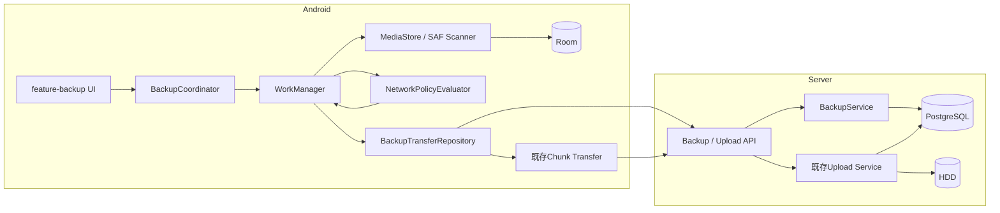

# Android自動バックアップ 設計書

## アーキテクチャ概要

既存のServer側File操作・分割Upload基盤へBackup固有の比較とReceipt確定を追加し、Android側はRoomを永続状態の正、WorkManagerを実行予約、MediaStore／SAFをSourceとして構成する。Scanner、Policy判定、転送、UIを分離し、Android Framework依存は`core-database`、`core-data`のAndroid実装、`feature-backup`へ閉じ込める。

ScannerはRule単位で一意に実行し、検出結果をRoomへ収束させる。実転送はUser・Device・Server接続先を表すAccount Scope単位で1本のWork chainへ直列化し、複数Ruleや複数起動契機による二重Compare・二重Uploadを防ぐ。Serverはすべての確定時に認証、Device、Session、Folder権限、File状態、Versionを再評価し、Clientの過去のCompare結果を権限根拠にしない。



## 設計原則

1. Backupは端末からServerへの一方向処理とし、端末削除をServer削除へ変換しない。
2. Serverの`BackupReceipt`とAndroidの`LocalSyncItem`は役割を分離する。ReceiptはServer確定事実、LocalSyncItemは端末上の検出・実行状態である。
3. Compareは助言であり確定権限ではない。Upload開始・完了時にServer状態を再評価する。
4. Local DirectはSSIDに依存せず、外部Wi-Fiだけを明示的な登録対象にする。
5. WorkManagerの`CONNECTED`制約だけで許可を判断せず、Worker内でNetwork Policyを毎回評価する。
6. Source本文、Token、Wi-Fi識別情報をRoom、Work input、Log、Metric labelへ保存・出力しない。
7. すべてのQueue更新、claim、lease、完了、cleanupを冪等にし、Process境界をまたぐ推測を避ける。

## Serverコンポーネント設計

### 1. BackupReceipt Domain Model

**責務**:

- 認証済みUser・Deviceの端末文書と、確定済みFileEntryの対応を保持する。
- 次回Compareで不要な再Uploadと変更対象Fileを判断できる情報を提供する。

**データ**:

```text
BackupReceipt
├── Id: UUID
├── UserId: UUID
├── DeviceId: UUID
├── LocalDocumentKey: string
├── RemoteFileId: UUID
├── RelativePath: string
├── Size: long
├── SourceModifiedAt: UTC instant
├── Checksum: nullable SHA-256
├── RemoteFileVersion: long
├── UploadedAt: UTC instant
└── UpdatedAt: UTC instant
```

**制約**:

- `(user_id, device_id, local_document_key)`を一意にする。
- `DeviceId`が`UserId`に属することをApplication層で検証し、Client入力から設定しない。
- `RemoteFileId`はFileEntryへ外部Keyを持ち、完全削除・MISSING索引削除ではReceiptも同じ管理処理で削除する。
- User／Deviceの完全削除時は関連Receiptを削除する。Device失効だけではReceiptを削除せず、再有効化せずとも重複判定の履歴として維持する。
- Relative Pathは表示・対応確認用Metadataであり、Server物理Path解決に使用しない。

### 2. BackupService

**責務**:

- Compare候補をReceipt、FileEntry、Folder権限と比較する。
- Backup付きUpload Sessionの開始条件と完了条件を検証する。
- Receiptの新規作成・更新をUpload確定transactionへ参加させる。

**Compare判定**:

```text
Receiptなし
  └─ NEW

Receiptあり + FileEntry ACTIVE + Size/modified/checksumが完了記録と一致
  └─ ALREADY_UPLOADED

Receiptあり + FileEntry ACTIVE + Source metadataまたはchecksumが変化
  └─ CHANGED(remoteFileId, expectedRemoteVersion)

Receiptあり + FileEntryがTRASHED/MISSING_CANDIDATE/MISSINGまたは権限失効
  └─ BLOCKED_CURRENT_STATE
```

- Compare requestは最大100項目とし、重複`localDocumentKey`、不正Path、過大文字列、負Size、未知Checksumをrequest全体の`400`とする。
- Responseは入力Keyごとに結果が一意になる構造とし、公開値は`NEW`、`CHANGED`、`ALREADY_UPLOADED`、`BLOCKED_CURRENT_STATE`と操作可能なErrorだけに限定する。
- `CHANGED`はReceiptが保持するRemote FileとVersionを返すが、Upload Session開始時に同じ関係を再照会する。
- ReceiptがPurgeにより削除された後、Androidの既存`COMPLETED`項目はSourceが変化しない限り再Queueしない。Source変更またはLocal DB再構築後にReceiptがなければ`NEW`として扱う。Server削除を永続tombstone化する機能は追加しない。

### 3. Backup対応Upload Session

**責務**:

- 既存Upload SessionへBackup Contextを付加し、Chunk受付、offset再開、Checksum、期限、取消を再利用する。
- 同じUser・Device・端末文書の並行Backup Sessionを1件へ収束させる。

```text
BackupUploadContext
├── LocalDocumentKey
├── RelativePath
├── SourceModifiedAt
├── SourceChecksum: nullable
├── Decision: NEW | CHANGED
├── ExpectedRemoteFileId: nullable
└── ExpectedRemoteFileVersion: nullable
```

- Upload SessionのUserとDeviceはSecurity Contextから取得する。
- Backup ContextはSession作成後に変更できない。
- 有効なBackup Sessionに対する部分一意Indexを`(actor_user_id, device_id, local_document_key)`へ設定する。
- 同じIdempotency Keyの再送は既存Sessionを返す。別Keyの並行開始は既存有効Sessionの識別可能な競合を返す。

### 4. Backup確定Coordinator

**NEW確定**:

1. Upload Session、Device、Session、Folder権限、Storage状態、Source metadataを再検証する。
2. 既存Uploadと同じ一時File検証、Storage Guard、FileOperationを使用する。
3. FileEntry、索引情報、`UPLOAD` UserActivity、BackupReceiptを同じDB transactionへ確定する。
4. DB確定失敗時は既存journal recoveryへ戻し、Receiptだけを残さない。

**CHANGED確定**:

1. ReceiptのRemote Fileと期待Version、現在権限、`ACTIVE`状態をmutation lock内で再検証する。
2. 検証済み一時Fileを既存Fileへatomic replaceする。
3. File ID、名前、親、Share、Favorite、Tag、Recentを維持する。
4. File Versionを1増加し、内容Checksum、Size、更新日時、検索Metadata、派生状態、Version履歴を既存契約どおり更新する。
5. `EDIT` UserActivityとReceipt更新を同じDB transactionへ確定する。
6. File Version競合、Move、Trash、MISSING、Purge、権限失効時は公開せず、Clientへ再Compareを要求する。

**復旧**:

- HDD replace後・DB確定前の停止はFileOperationから再開し、同じoperation IDでActivityとReceiptを一意に収束させる。
- DB確定後のresponse喪失はSession再照会で`COMPLETED`とReceiptを返し、再確定しない。
- 取消・期限切れ・Source変更では暗黙に新Sessionを作成しない。

### 5. Backup API

```text
POST /api/v1/backup/compare
POST /api/v1/upload-sessions        既存Endpointへbackup objectを追加
GET  /api/v1/upload-sessions/{id}   既存状態照会を再利用
PUT  /api/v1/upload-sessions/{id}/chunks
POST /api/v1/upload-sessions/{id}/complete
DELETE /api/v1/uploads/sessions/{id}
```

- Endpoint名は実装時の既存OpenAPIを正として合わせ、Backup専用Chunk Endpointは作らない。
- Compare、Session開始、完了のすべてでUser、Device、Session、Folder／File権限を確認する。
- Errorは既存Error envelopeとRequest IDを使用し、相対Path、document key、File名をError detailへechoしない。
- Rate Limitは既存Upload系Policyを再利用し、Compareの件数・body size上限を別途設定する。

## Androidコンポーネント設計

### 6. Account Scope

**責務**:

- Room row、Repository、Work名、UI状態をServer identity・User・Device単位で隔離する。

```text
accountScopeId = SHA-256(serverIdentityKey | userId | deviceId)
```

- Host文字列だけでなく既存の検証済みServer identity keyを使用する。
- `accountScopeId`は秘密ではないがLogへ出さない。
- LogoutやSession更新ではQueueを別Userへ再利用しない。通常Logoutでは同じAccount Scopeの未完了状態を保持し、再Login後に認証を再確認する。
- Device失効または接続先削除時のLocal data削除は、明示確認または承認済みcleanup規則に従う。

### 7. core-database

**責務**:

- Rule、Wi-Fi Policy、端末文書索引、Queue、transfer checkpoint、scan checkpoint、履歴をRoomへ永続化する。
- claim、lease回復、状態集計、cleanupをtransactionで提供する。

**主要Table**:

```text
backup_rules
  id, account_scope_id, source_type, tree_uri/collection,
  display_name, remote_folder_id, enabled, network_mode,
  requires_charging_for_initial_run, minimum_battery_percent,
  initial_run_completed_at, paused_at, created_at, updated_at

local_sync_items
  id, account_scope_id, rule_id, local_document_key,
  source_locator, relative_path, display_name,
  size, modified_at, checksum, source_fingerprint,
  remote_file_id, remote_file_version,
  lifecycle_state, wait_reason, failure_reason,
  retry_count, next_attempt_at,
  lease_owner, lease_expires_at,
  upload_session_id, idempotency_key, confirmed_offset,
  first_seen_at, last_seen_at, last_attempt_at, completed_at

external_wifi_policies
  id, account_scope_id, display_name,
  normalized_ssid, normalized_bssid,
  treat_as_metered, enabled, created_at, updated_at

scan_checkpoints
  rule_id, media_store_version, generation,
  full_scan_token, last_completed_at, updated_at
```

**制約とIndex**:

- `local_sync_items(account_scope_id, rule_id, local_document_key)`を一意にする。
- Queue claim用に`(account_scope_id, lifecycle_state, next_attempt_at, first_seen_at, id)`をIndex化する。
- Wi-Fi Policyは`(account_scope_id, normalized_ssid, normalized_bssid)`を一意にする。BSSIDなしを1つの明示値へ正規化する。
- `source_locator`はContentResolverで開くために必要な最小URI／IDで、UIやLogへ出さない。File本文と物理Pathは保存しない。
- Database、WAL、schema exportをAndroid Auto Backup／端末移行から除外する。

**状態モデル**:

```text
DISCOVERED/PENDING
  ├─ claim -> COMPARING -> READY_TO_UPLOAD -> UPLOADING -> COMPLETED
  ├─ policy不成立 -> PENDING + wait_reason
  ├─ 回復可能失敗 -> PENDING + next_attempt_at
  ├─ 要操作失敗 -> FAILED
  └─ Source消失 -> LOCAL_MISSING
```

- lifecycleとwait reasonを分離し、接続待ち等で状態Enumを無制限に増やさない。
- claimはlease ownerとexpiryを条件付きUPDATEで取得する。
- Process終了後は期限切れleaseをPENDINGへ戻す前に、Upload SessionがあればServer状態を再照会する。
- `COMPLETED`／`FAILED`だけを90日または最新10,000件へcleanupし、PENDING、UPLOADING、認証待ち、LOCAL_MISSINGの対応索引は削除しない。

### 8. LocalDocumentIdentityStore

**責務**:

- MediaStore／SAFのProvider固有識別子をServerへ直接公開せず、Device名前空間内のopaque keyへ変換する。
- ID再利用とSource再出現を可能な範囲で区別する。

**方式**:

- 初回観測時にrandom UUIDを割り当て、RoomのSource identity mappingとして保存する。
- MediaStoreはvolume、media type、row ID、generation addedを候補identityに使う。generationが利用できないAndroid 10ではrow ID、date added、size、MIMEの組と既存mappingを使う。
- SAFはauthority、document ID、Tree内相対関係と既存mappingを使う。
- 削除後に同じProvider IDが再利用されたと判断した場合は新しいUUIDを割り当てる。
- DB再構築やアプリデータ消去でmappingを失った場合は新しいKeyとなり、Server Compareだけで同一性を推測しない。アプリデータ消去はCredential／Device再登録境界として扱う。
- `localDocumentKey`、Raw URI、Provider IDをLogへ出さない。

### 9. MediaStoreScanner

**責務**:

- 写真、動画、音声の新規・変更・消失候補を検出し、RoomへBatch反映する。

**実装**:

- MediaStore versionとgenerationが利用可能なら前回完走値以降を問い合わせる。
- version変更、generation rollback、権限変更、query失敗後はcheckpointを破棄してfull scanへ戻す。
- ContentObserverは起動契機だけに使用し、変更事実の確定根拠にしない。
- projectionはID、collection、display metadata、size、modified、generation等の必要列だけに限定する。
- CursorをStreaming処理し、500件単位でRoom transactionへ反映する。
- metadata不変項目は本文を開かない。ChecksumはServer CompareまたはSource曖昧性の解消に必要な候補だけ計算する。
- full scan完走後だけ未観測項目を`LOCAL_MISSING`へ変更し、Server削除要求は作らない。

### 10. SafTreeScanner

**責務**:

- Persistable permissionを持つTreeを定期走査し、Room索引との差分を検出する。

**実装**:

- DocumentsContractを使用して子をStreaming列挙し、DocumentFileによるN+1 queryを避ける。
- 1 Directoryずつbounded queueで処理し、本文やTree全体をMemoryへ保持しない。
- Providerが返すdocument IDでcycleを検出し、深度64、1回の走査100万項目をhard limitとする。上限到達は完走扱いにしない。
- 相対Pathは表示・Server metadata用に正規化し、`..`、絶対Path、NUL、制御文字を拒否する。
- metadata不変項目は本文を開かず、変更候補だけContentResolver streamからSHA-256を計算する。
- 途中取消、SecurityException、RemoteException、read errorではcheckpointと未観測判定を進めない。
- アプリ起動、許可Network到達、「今すぐ」、6時間周期から同じRule単位Scannerへ収束する。

### 11. ExternalWifiPolicyRepository

**責務**:

- 現在接続中の外部Wi-Fiだけを利用者の明示操作で登録する。
- Android version別のWi-Fi情報権限と取得不能を安全側へ変換する。

**実装**:

- Android 10〜12はLocation関連条件、Android 13以降はNearby Wi-Fiと対象APIのLocation条件を実際のSDK契約に従って分岐する。
- unknown SSID、未接続、Mobile、権限なし、OSによる情報非公開は登録不可とする。
- SSIDは引用符等のOS表現を除いて完全一致用に正規化し、BSSIDはlowercase colon形式へ正規化する。
- BSSID制限なしはSSID一致だけをPolicy候補にするが、Server信頼・Route・認証確認は省略しない。
- `treatAsMetered=true`または`enabled=false`は自動実行不可とする。

### 12. NetworkPolicyEvaluator

**責務**:

- Rule、基盤Network、Connection Route、外部Wi-Fi、Power、Storage、認証を統合し、実行可否と待機理由を返す。

```text
PolicyDecision
├── ALLOWED(route, boundNetwork)
├── WAITING_NETWORK
├── WAITING_ALLOWED_WIFI
├── WAITING_ZEROTIER
├── WAITING_POWER
├── WAITING_STORAGE
├── WAITING_AUTH
├── WAITING_PERMISSION
└── BLOCKED_RULE
```

**判定順序**:

1. Rule有効・一時停止・Source permissionを確認する。
2. User、Device、Session、HDD状態を確認する。
3. Batteryと初回Charging条件を確認する。
4. 基盤NetworkがWi-Fi／Ethernetか確認し、Mobileを拒否する。
5. ConnectionCoordinatorをrefreshする。
6. `LOCAL_DIRECT`なら登録Wi-Fiに依存せずRule modeに従って許可する。
7. `REMOTE_SECURE`ならWi-Fi情報権限、登録Policy、BSSID、従量制、ZeroTier経路を確認する。
8. 返されたNetwork handleをUploadへ渡し、開始直前にも同じ世代の接続であることを確認する。

- ConnectionCoordinatorが行うTLS、Hostname、Server identity、非ZeroTier基盤Network bindingを再利用する。
- 判定中のNetwork generationが変わった場合は結果を破棄して再評価する。
- Policy不成立はWorkManagerの無限retryへ変換せず正常終了し、Network callback／定期Work／User操作が再enqueueする。

### 13. BackupCoordinator・WorkManager

**Work構成**:

```text
backup-scan:{hash(accountScopeId, ruleId)}
  └─ Rule単位のunique one-time work / 6時間periodic work

backup-transfer:{hash(accountScopeId)}
  └─ Account Scope単位のunique one-time chain
```

- Work名には生のUser、Device、Host、Rule名を入れない。
- Scannerは同じRuleで`KEEP`またはgeneration付き置換Policyを使い、同時走査を防ぐ。
- TransferはAccount Scope単位で`APPEND_OR_REPLACE`相当の既存project方針に合うPolicyを選び、同時Workerを1つにする。
- Work inputにはAccount Scope hashとRule IDだけを入れ、URI、SSID、BSSID、Token、File名を入れない。
- WorkManager制約は`CONNECTED`を最低条件とし、ChargingはRule全体を混在させるためWorker内でも再評価する。

**Batch**:

- Compareは同じ保存先Folderごとに最大100件へまとめる。
- Transferは100 File、合計2GB、20分の最初に達した上限で停止し、残件があれば次Workをenqueueする。
- Uploadは1 Account Scopeにつき1 Fileずつ処理し、既存Chunkの最大1 ChunkだけをMemoryへ保持する。
- pending合計が100MiB以上、単一Fileが100MiB以上、または実行が通常Worker制限を超えると予測した場合、Foreground Workerへ切り替える。実機測定で閾値を正式文書と定数へ同時反映する。

**再試行**:

- Network不許可、Power待ち、HDD待ちはItemのwait reasonを更新して`Result.success()`とする。
- 429、一時503、timeout、通信結果不明はServer再照会後、Roomの`retryCount`と`nextAttemptAt`を指数backoff＋jitterで更新する。
- 回復可能失敗は最大10回で`FAILED`へ移し、User retryでcountをresetする。
- 401は既存Refreshを1回だけ行い、再失敗、Session期限切れ、Device失効は`WAITING_AUTH`または要Loginへ移す。
- Permission喪失、Source変更、Version競合、破損Sourceは自動retryせず操作可能なErrorにする。

### 14. BackupTransferRepository

**責務**:

- Room候補をCompareし、既存Chunk TransferへBackup Contextを渡し、状態を永続化する。
- Process再生成後にServer状態を再照会して再開・完了を収束させる。

**処理**:

1. DAOからlease付きで候補をclaimする。
2. Source fingerprintを再取得し、走査時から変化していればPENDINGへ戻す。
3. 同じ保存先の候補をCompareする。
4. `ALREADY_UPLOADED`をCOMPLETEDへ更新する。
5. `NEW`／`CHANGED`はSession開始情報をRoomへcommitしてからChunk送信する。
6. 各Chunk前後でPolicy generation、Source fingerprint、Worker停止を確認する。
7. response不明時はSession照会を行い、confirmed offsetをServer値へ合わせる。
8. complete後にServerの完了状態とRemote File／Versionを取得してRoomをCOMPLETEDへする。

- Server responseの未知Enum、入力にないKey、重複Key、欠落Key、Remote File不一致はProtocol errorとしてfail-closedにする。
- Source streamは必要時に開き直せるようURIとoffsetを使い、全FileをMemoryまたは一時Diskへ複製しない。

### 15. feature-backup

**画面**:

- Backup overview
- Rule list／editor
- Device source picker連携
- Server destination picker連携
- Allowed Wi-Fi list／editor
- Item history／failure detail

**状態管理**:

- ViewModelはAccount Scopeをkeyに生成し、Logout、User／Server切替時にBack Stackと旧状態を破棄する。
- DAOのFlowをRule別／全体集計へ変換し、Loading、Empty、Content、Errorを明示する。
- 「今すぐ」はScannerとTransferを一意enqueueし、連打でWorkを増やさない。
- 一時停止はRuleまたはAccount Scopeの`pausedAt`を更新し、実行中Workerへ停止signalを送る。Server FileやReceiptは変更しない。
- File名は端末UI内表示に必要な範囲で扱うが、Notificationは件数とByteだけを表示し、Lock screenへFile名を出さない。
- 強制停止中はOS上で実行不能である説明をSettingsに常設する。

**Accessibility**:

- 状態を色だけで表現せず、文字、icon description、semanticsを併用する。
- 48dp target、font scale 2.0、dark mode、長文、省略、TalkBack読み順をInstrumented Testで確認する。

## データフロー

### 新規ファイルの自動バックアップ

```text
1. MediaStore通知またはSAF定期WorkがRule Scannerを一意enqueueする。
2. Scannerがmetadata差分をRoomへPENDINGとしてupsertする。
3. BackupCoordinatorがAccount Scope transfer Workを一意enqueueする。
4. WorkerがNetwork Policyを評価し、許可時だけItemをclaimする。
5. Androidが最大100候補をPOST /backup/compareへ送る。
6. ServerがNEWを返す。
7. AndroidがBackup Context付きUpload Sessionを作成し、Session情報をRoomへ保存する。
8. 既存Chunk Transferで送信し、中断時はServer確定offsetを再照会する。
9. ServerがFileEntry、Activity、BackupReceiptを確定する。
10. AndroidがServer完了状態を確認し、LocalSyncItemをCOMPLETEDへ変更する。
```

### 変更ファイルの更新

```text
1. ScannerがSize／modifiedの変化を検出し、必要時だけChecksumを計算する。
2. CompareがReceiptからCHANGEDとRemote File／Versionを返す。
3. Upload Session開始時にServerがReceipt、Version、権限を再確認する。
4. Chunk完了後、Serverがmutation lock内で状態を再確認する。
5. 検証済み一時Fileをatomic replaceし、Version／索引／派生状態／Activity／Receiptを確定する。
6. Androidが新しいRemote VersionをRoomへ保存する。
```

### 端末削除

```text
1. full scan完走時に既存LocalSyncItemが観測されない。
2. AndroidはItemをLOCAL_MISSINGへ変更する。
3. Delete、Trash、Receipt削除APIは呼ばない。
4. Server Fileと関連管理情報は維持する。
5. Sourceが再出現した場合はidentityとmetadataを再評価し、必要ならCompareする。
```

### Network切替・Process終了からの復旧

```text
1. Chunk境界でNetwork generation変更またはWorker停止を検出する。
2. 現在のSession ID、Source fingerprint、既知offsetをRoomへ保存する。
3. Workerを安全に終了し、Itemを接続待ちへ戻す。
4. 許可接続到達時にTransfer Workを再enqueueする。
5. Server Sessionを照会し、Server確定offsetを正としてRoomを補正する。
6. Source fingerprintが一致する場合だけ同じSessionを再開する。
```

## 競合・整合性設計

### Server競合

- Compare後のRename／MoveはFile IDで追従するが、権限と親状態を完了時に再評価する。
- Compare後の内容変更はVersion不一致として拒否し、Clientへ再Compareを要求する。
- Trash、MISSING、Purgeは自動復元せず、状態別Errorにする。
- 共有解除・権限低下は開始済みSessionであっても完了前に拒否する。
- 同じdocumentの並行SessionはDB一意制約とApplication conflictで1件へ収束する。

### Android競合

- ScannerとWorkerはDAO transactionだけを通して状態を変更する。
- UPLOADING中のSource変更は現在Sessionを停止し、Serverへ取消可能なら取消し、新しいfingerprintをPENDINGへ戻す。
- Rule無効化・一時停止は新しいclaimを停止し、実行中WorkerをChunk境界で終了させる。
- 同じSourceを複数Ruleが選択した場合、Ruleごとに別`localDocumentKey`対応を持つ。保存先が同じでも暗黙dedupeせず、Rule設定を尊重する。

## エラーハンドリング戦略

### Error分類

| 分類 | 例 | Android動作 |
| --- | --- | --- |
| 待機 | 未登録Wi-Fi、Mobile、Battery、Charging、HDD unavailable | wait reasonを保存し正常終了、条件変化で再予約 |
| 一時失敗 | timeout、429、一時503、response不明 | Server照会、指数backoff＋jitter、最大10回 |
| 認証待ち | Refresh期限切れ、Device／Session失効 | 自動Upload停止、再Login／Device案内 |
| Source要操作 | SAF権限喪失、File変更中、読取不能 | FAILED、Source再選択／再試行を表示 |
| Server競合 | Version、Move、Trash、MISSING、Purge、共有解除 | 再Compareまたは保存先再選択。自動上書きしない |
| Protocol／Security | 未知Enum、改ざんKey、別User、TLS失敗 | fail-closed、retry loopに入れず安全なError |

### 秘密情報を含まないError

- 永続化する`failureReason`は固定Enumと低Cardinality codeだけにする。
- Server message、URI、SSID、BSSID、Path、File名をRoomやLogへそのまま保存しない。
- UI文言は固定Error codeから生成し、必要なFile表示名はUI表示時に端末Repositoryから取得する。

## Migration設計

### PostgreSQL

- `backup_receipts`とUpload SessionのBackup Context列／Tableを1つの論理MigrationとしてPR1で追加する。
- 一意制約、外部Key、Check制約、IndexをUp／Down／再Upで検証する。
- API起動時に自動Migrationせず、既存Admin CLI運用を使用する。
- Migration前後のBackup、Rollback、Model Snapshot、pending modelなしをPRへ記録する。

### Room

- `core-database`初回Schemaをversion 1としてexportし、Test資材へ保持する。
- 後続PRで列を追加する場合もMigration pathを追加し、`fallbackToDestructiveMigration`をProductionで使用しない。
- Database open失敗をServer状態変更へつなげず、利用者へLocal state再構築の確認を求める。

## テスト戦略

### Server Unit Test

- Receipt validation、一意性、CompareのNEW／CHANGED／ALREADY／BLOCKED。
- User・Device導出、Folder認可、Version／状態競合、Backup Context不変条件。
- NEW／CHANGED確定、Activity種別、Receipt upsert、retry冪等性。
- 不正Path、過大Request、重複Key、未知Checksum、Clientなりすまし。

### Server Integration Test

- PostgreSQL Migration Up／Down／再Up、制約、Index、Cascade／明示cleanup。
- 実一時HDDでChunk中断・再開、atomic publish／replace、DB rollback、journal recovery。
- 同時Compare／Session開始／complete、response喪失、API再起動、HDD unavailable。
- Share、Move、Rename、Trash、Restore、MISSING、Purge、Version、Search、Favorite、Tag、Recent、Activity回帰。
- Raspberry Pi相当でCompare latency、Receipt容量、Index、HDD I/Oを測定する。

### Android JVM Unit Test

- Network Policy全判定表、Rule validation、Wi-Fi正規化、Error mapping。
- Scanner差分、generation reset、checkpoint、identity、Room状態遷移。
- Coordinator、Batch、retry、lease、Session再照会、response strict mapping。
- ViewModelのLoading／Empty／Content／Error、Session scope、重複操作防止。

### Android Instrumented Test

- Room DAO、transaction、Migration、Process再生成、cleanup、Auto Backup除外。
- MediaStore／SAF query、権限拒否・再付与、ContentObserver、Provider error。
- WorkManager Test Driver、一意Work、periodic Work、停止、Foreground notification。
- Compose Navigation、Rule／Wi-Fi設定、進捗・履歴、TalkBack、font scale 2.0、dark mode。

### 実機・E2E

- Android 10と現行AndroidでMediaStore／SAF、Process kill、端末再起動、Doze、強制停止案内。
- Local Direct、登録済み外部Wi-Fi＋ZeroTier、未登録・従量制Wi-Fi、Mobile＋ZeroTier、転送中切替。
- 実Raspberry Pi、PostgreSQL、HDDで新規、変更、重複、端末削除、共有、状態競合、API／DB再起動、unmount／remount。
- Release APK、Logcat、Notification、Room、API／Nginx／DB Log、Artifactの秘密情報非漏えい。

### Coverage・品質Gate

- Network Policy、Receipt／Compare、Queue状態遷移、Transfer Controllerはline 95%以上。
- Android／ServerのDomain・Application全体はline 80%以上。
- `verify-server.sh`、`verify-android.sh`、`verify-config.sh`、`verify-security.sh`、`verify-deployment.sh`、OpenAPI、Migration、SBOM、format、Lint、静的解析、`git diff --check`を成功させる。

## 依存ライブラリ

- AndroidX Room Runtime、KTX、Compilerをversion catalogへ追加する。
- AndroidX WorkManager KTXとWorkManager Testingをversion catalogへ追加する。
- SQLite／Room Migration Test用AndroidX Test依存を追加する。
- 既存Coroutines、Flow、Retrofit、OkHttp、Compose、Navigationを再利用する。
- Background Upload専用SDK、独自VPN SDK、ZeroTier SDK、別Checksum Libraryは追加しない。
- Versionは直接この文書へ固定せず、実装時のAndroid Gradle Plugin／Kotlin／compileSdkとの公式互換版をversion catalogで一元管理し、SBOMへ反映する。

## ディレクトリ構造

```text
server/src/
├── KuraStorage.Domain/Backups/
├── KuraStorage.Application/Backups/
├── KuraStorage.Infrastructure/Persistence/Backups/
└── KuraStorage.Api/Endpoints/Backups/

server/tests/
├── KuraStorage.Domain.Tests/Backups/
├── KuraStorage.Application.Tests/Backups/
└── KuraStorage.IntegrationTests/Backups/

apps/android/
├── core-model/src/main/.../backup/
├── core-network/src/main/.../backup/
├── core-data/src/main/.../backup/
├── core-database/
│   └── src/main/.../
│       ├── dao/
│       ├── entity/
│       ├── mapper/
│       ├── migration/
│       └── transaction/
├── feature-backup/
│   └── src/main/.../
│       ├── navigation/
│       ├── rules/
│       ├── wifi/
│       ├── status/
│       ├── history/
│       └── components/
└── app/src/main/.../navigation/

docs/testing/
└── YYYYMMDD-android-auto-backup-prN.md
```

- 実装前に現在のNamespaceと既存類似配置を確認し、上記概念配置をRepositoryの実名へ合わせる。
- `feature-backup`から他Featureへ直接依存せず、Server Folder picker等はApp callbackで接続する。
- Android Testは対象Moduleの`src/test`／`src/androidTest`へ置く。

## Pull Request単位と実装順序

1. **PR1: Server側BackupReceipt・比較・Upload確定**
   - Domain、Migration、Compare API、Upload Session Backup Context、NEW／CHANGED transaction、OpenAPI、Server Test。
2. **PR2: Android Room・Rule・外部Wi-Fi Policy**
   - `core-database`、Account Scope、Room Schema、Rule Repository、Wi-Fi登録・権限、Migration Test。
3. **PR3: MediaStore・SAF差分検出**
   - Local identity、Scanner、checkpoint、Queue反映、取りこぼし回復、1万件測定。
4. **PR4: Network Policy・WorkManager・分割Upload連携**
   - Policy、unique Work、Compare client、Process境界再開、Batch、retry、進捗集計。
5. **PR5: UI・実機E2E・全体安定化**
   - Rule／Wi-Fi／状態／履歴UI、Accessibility、実機Network matrix、Raspberry Pi E2E、性能・Security。

- 各PRは先行PRが`main`へMergeした後に最新`main`から開始する。
- 各PRで実装と対応Test、正式文書、testing記録、Commit、Push、英語PR、必須CI、モード3-A記録を完了して停止する。
- 全PRと全task完了後だけモード3-Bの全体振り返りを記録する。

## セキュリティ考慮事項

- User／DeviceはAccess TokenとServer Sessionから導出し、Client入力を受けない。
- `localDocumentKey`はopaque UUIDとし、Raw URI、Provider ID、物理PathをServerへ送らない。
- Relative PathとFile名は業務DataとしてAPIに必要だが、Log、Metric label、Error detailへ出さない。
- Local DirectとRemote Secureは既存TLS、Hostname、Server identity検証を通し、SSID／BSSIDを信頼根拠にしない。
- Room、WAL、Work inputをAndroid Auto Backup／端末移行から除外し、Token／Password／ZeroTier秘密情報を保存しない。
- Notificationは件数・Byte・状態だけを表示し、Lock screenへFile名やWi-Fi名を出さない。
- ProductionでTrust-all TLS、Hostname bypass、destructive Room migration、debuggable Releaseを禁止する。
- Backup APIにも既存認証、Rate Limit、Request ID、Error envelope、Storage Guard、symlink拒否を適用する。

## パフォーマンス考慮事項

- MediaStore Cursor、SAF Tree、Compare候補、Room更新はStreaming／Batch処理し、全件materializeしない。
- metadata不変Fileを開かず、Checksumは必要な候補だけ計算する。
- Scanner Room transactionは初期500件単位、Compareは最大100件、Uploadは1 Account Scopeで1件ずつとする。
- File本文は既存Chunk上限の最大1 ChunkだけをMemoryへ保持する。
- Workは100 File、2GB、20分で分割し、Raspberry PiのHDD I/Oを長時間占有しない。
- Room IndexはQueue claim、Rule identity、履歴pagingを支え、cleanupでCOMPLETED／FAILEDの増加を抑える。
- 1万件端末測定とRaspberry Pi Compare／Receipt測定により、500件Batch、100MiB Foreground閾値、履歴上限を正式文書と同時に調整する。

## 正式文書へ反映する設計差異

- `BackupReceipt`の一意性を`(userId, deviceId, localDocumentKey)`へ統一し、`architecture-design.md`のIndex表を修正する。
- Androidの履歴保持を90日または最新10,000件、回復可能retryを10回として追記する。
- ScannerのRoom Batch 500件、SAF深度64、走査hard limit 100万件を安全上限として追記する。
- Work構成をRule単位ScannerとAccount Scope単位Transferへ分離して記載する。
- Foreground Workerの初期閾値を100MiBとし、実機測定による変更手順を記載する。
- Server Purge後はReceiptを保持せず、既存Android完了項目はSource変化まで再Queueしない境界を記載する。

## 将来の拡張性

- `BackupSourceScanner`をinterface化し、将来の追加Media collectionやDocument Providerを既存Queueへ接続できるようにする。
- `NetworkPolicyEvaluator`は結果と理由の型付き契約を維持し、将来Policyを追加してもWorkerがSSID等を直接判定しないようにする。
- ReceiptとUpload SessionはAndroid Frameworkへ依存させず、将来Desktop等が同じServer契約を利用可能にする。ただし本作業ではAndroid以外を実装しない。
- 双方向同期を追加する場合は削除tombstone、conflict resolution、Server change feedを別仕様・別Steeringで設計し、今回の一方向契約を暗黙に拡張しない。
- 履歴上限、Batch、Foreground閾値は設定可能定数として集約するが、利用者がMobile自動実行禁止を解除できる設定は提供しない。
