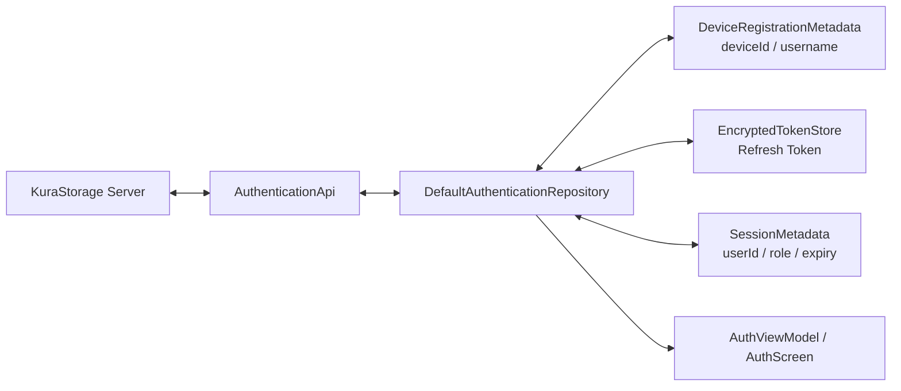

# ログアウト後の端末登録維持 設計書

## アーキテクチャ概要

現行のAndroid認証構成とServer API契約を維持し、Android内の永続状態を「端末登録」と「認証Session」に分離する。通常ログアウトはSessionだけを破棄し、Device失効または登録情報消失時だけ端末登録を破棄する。



Server側の`register-device`、`login`、`refresh`、`logout`契約とDeviceモデルは変更しない。修正の中心はAndroidの`core-model`、`core-data`、`feature-auth`とし、既存Server Testで「LogoutはSessionだけを失効しDeviceは有効のまま」という前提を回帰確認する。

## 認証状態モデル

### 端末登録Metadata

```kotlin
data class DeviceRegistrationMetadata(
    val deviceId: DeviceId,
    val username: String?,
)
```

- `deviceId`はServerが発行した非秘密の識別子とする。
- `username`は前回入力値の利便性用Metadataとして保持し、「Sign in」画面へ初期入力する。Passwordや認証成功の根拠には使用しない。
- 現行アプリはBuildで検証済みAPI Hostnameを1つ持つため、端末登録も現行Hostnameに対する1件とする。将来の複数Server対応ではServer identityごとのStoreへ拡張する。

### Session Metadata

```kotlin
data class SessionMetadata(
    val userId: String,
    val role: UserRole,
    val refreshTokenExpiresAt: Instant,
)
```

- Refresh Token本体は従来どおりAndroid Keystoreで暗号化する`EncryptedTokenStore`にのみ保存する。
- `userId`、`role`、有効期限は認証済みSessionのMetadataとし、Logout、期限切れ、Token喪失で破棄する。
- メモリ上の`AuthSession`は現行構造を維持し、Logoutで即時`null`にする。

### 起動時状態

| 端末登録 | 有効なRefresh Credential | 表示・処理 |
| --- | --- | --- |
| なし | なし | Local Directなら`Register this device`、それ以外はLocal Direct案内 |
| あり | なし | `Sign in`。保持Usernameを初期入力 |
| あり | あり | Refreshを試行し、成功時は認証済み画面へ遷移 |
| あり | あり、ただし期限切れまたはSession失効 | Sessionを破棄し`Sign in` |
| あり | Device失効 | Sessionと端末登録を破棄し、再登録フロー |

## コンポーネント設計

### 1. `CredentialMetadataStore`

**責務**:

- DataStore内の端末登録MetadataとSession Metadataを別々に読み書きする。
- 通常LogoutでSession keyだけを削除する。
- Device失効と明示的な登録破棄で全keyを削除する。

**実装の要点**:

- 新規ライブラリやRoom Migrationは追加せず、現行Preferences DataStoreのkeyを再構成する。
- `device_id`と`last_username`を端末登録key、`user_id`、`role`、`refresh_token_expires_at`をSession keyとする。
- `clearSession()`はSession keyだけ、`clearRegistration()`は登録・Session両方のkeyを単一DataStore transactionで削除する。
- 既存の全keyが揃う端末は追加Migrationなしで登録とSessionを復元できる。旧版Logoutで既に全keyが削除された端末はDevice IDを復元できないため、アップデート後の初回だけ従来どおり再登録が必要になる。

### 2. `DefaultAuthenticationRepository`

**責務**:

- 端末登録とSessionを別々に取得・破棄する。
- Loginで有効なRefresh Tokenではなく、保存済み端末登録の`deviceId`を使用できるようにする。
- Error codeごとにSessionだけを破棄するか、端末登録も破棄するかを固定する。

**実装の要点**:

- `storedCredential()`とは別に`storedRegistration()`を公開し、Refresh可能性と端末登録有無を混同しない。
- `login()`は`storedRegistration().deviceId`を`LoginRequestDto`へ渡し、Refresh Tokenがない通常Logout後も動作させる。
- `register()`成功時は端末登録、暗号化Refresh Token、Session Metadataの順で保存し、失敗時は中途のSession秘密値を残さない。
- `persist()`はLogin・Register・Refresh成功時にServer応答のUser IDとDevice IDを検証する。Login・Refresh応答のDevice IDは保存済み登録と一致することを要求する。
- `logout()`はServer requestの成否にかかわらず`clearSession()`を呼び、端末登録は保持する。
- `AUTHENTICATION_REQUIRED`、Refresh Token期限切れ、`REFRESH_TOKEN_REUSED`はSessionだけを破棄する。`DEVICE_REVOKED`は端末登録も破棄する。
- ログアウト直後にメモリ上のAccess Token、Role、User ID、Device ID accessorが認証済み値を返さないことを維持する。永続登録のDevice IDは`storedRegistration()`からのみ取得する。

### 3. `AuthViewModel` / `AuthScreen`

**責務**:

- 起動時に端末登録とSession Credentialを別々に評価する。
- 未登録だけをRegistration、登録済み・未認証をSign inと表示する。
- Sessionが無効化された場合に操作可能なSign in画面へ収束させる。

**実装の要点**:

- `load()`は登録なしだけ`registrationState()`を返す。登録がありCredentialがない場合は`Form(registration = false)`を返す。
- 保持したUsernameをSign inの初期値とする。Passwordは常に空とし、保存しない。
- RefreshがSession系Errorで失敗した場合は、固定Error画面で止めずSign inフォームへ遷移する。Device失効の場合だけ再登録へ遷移する。
- 現行スコープでは「この端末の登録を解除」導線を追加せず、1端末1アカウントの前提を維持する。

### 4. `MainActivity` / Session Scope

**責務**:

- Logout後に前SessionのDI container、Back Stack、Media、Backup UI状態を破棄する。
- Connection確認後に新しい`AuthViewModel`が保持済み端末登録を再読込できる導線を維持する。

**実装の要点**:

- 現行の`services.close()`、Media context破棄、Backup UI破棄、Connection画面へのNavigationを維持する。
- 端末登録Metadataは次SessionのRepository instanceから再取得し、閉じた前Repositoryのメモリ状態を流用しない。

## データフロー

### 通常ロアウトと再ログイン

```text
1. SettingsからLogoutを実行する。
2. Repositoryが現在のAccess Token、Device ID、Refresh TokenでPOST /auth/logoutを試行する。
3. ServerがRefresh Session系列を失効する。DeviceはACTIVEを維持する。
4. AndroidはfinallyでメモリSession、暗号化Refresh Token、Session Metadataを破棄する。
5. AndroidはDeviceRegistrationMetadataを保持する。
6. UIは保護NavigationとSession scopeを破棄する。
7. 次回の認証画面は「Sign in」を表示する。
8. Password入力後、保持したDevice IDでPOST /auth/loginを実行する。
9. ServerはPassword、Device所有User、Device ACTIVEを検証し、新しいSessionだけを作成する。
10. Androidは新しいSession Credentialを保存する。
```

### Refresh失敗

```text
1. 保存済みRefresh Tokenの期限切れまたはSession失効を検出する。
2. AndroidはRefresh Token、Session Metadata、メモリSessionを破棄する。
3. DeviceRegistrationMetadataは保持する。
4. UIは「Sign in」を表示する。
```

### Device失効

```text
1. LoginまたはRefreshがDEVICE_REVOKEDを返す。
2. AndroidはSessionとDeviceRegistrationMetadataをすべて破棄する。
3. Local Directなら「Register this device」、外部接続ならLocal Directが必要と表示する。
```

## エラーハンドリング戦略

| 条件 | 永続状態 | UI |
| --- | --- | --- |
| Logout API通信失敗 | Session秘密値を破棄、端末登録は保持 | Sign in |
| Refresh Token期限切れ | Session秘密値を破棄、端末登録は保持 | Sign in |
| `AUTHENTICATION_REQUIRED` | Session秘密値を破棄、端末登録は保持 | Sign in |
| `REFRESH_TOKEN_REUSED` | Session秘密値を破棄、端末登録は保持 | セキュリティ理由を表示したSign in |
| `DEVICE_REVOKED` | Sessionと端末登録を破棄 | 再登録またはLocal Direct案内 |
| Keystore Token読取失敗 | Session MetadataとTokenを破棄、端末登録は保持 | Sign in |
| DataStoreのDevice ID不正 | 全認証・登録状態を破棄 | 再登録またはLocal Direct案内 |

新しい公開API Error codeは追加しない。既存の`AUTHENTICATION_REQUIRED`、`REFRESH_TOKEN_REUSED`、`DEVICE_REVOKED`のクライアント状態遷移を修正する。

## 旧バージョンからの移行

- アップデート時にDataStoreを破壊的にclearしない。
- 既存の`device_id`、`last_username`、`user_id`、`role`、`refresh_token_expires_at`と暗号化Refresh Tokenが揃う場合は、従来どおり自動Refreshできる。
- 旧版でLogout済みの端末は`device_id`が既に消えているため復元しない。最初の1回だけLocal Directで再登録し、その後のLogoutから新動作を適用する。
- 過去に作成されたServer側の重複Deviceは自動判定で削除しない。必要な場合は管理CLIで対象UserのDevice一覧を確認し、古いDeviceを個別失効する。

## テスト戦略

### JVM Unit Test

- `CredentialMetadataStoreTest`で端末登録とSessionの独立read/write/clear、旧key互換を確認する。
- `AuthRepositoryTest`でLogout成功・通信失敗後のToken破棄とDevice ID保持、保持Device IDによるLogin、Device失効時の全破棄を確認する。
- Refresh期限切れ、`AUTHENTICATION_REQUIRED`、`REFRESH_TOKEN_REUSED`、Keystore喪失がSign inへ収束することを確認する。
- `AuthViewModelTest`で未登録、登録済み・未認証、有効Session、Refresh失敗、Device失効の表示状態を確認する。

### Android Instrumented / Compose Test

- Preferences DataStoreで通常Logout後にDevice IDとUsernameだけが残ることを確認する。
- 「Register this device」と「Sign in」の分岐、Username初期入力、Password非保持をCompose Testで確認する。
- Logout後に前SessionのBack Stack、Media context、保護画面が再利用されないことを確認する。

### Server / Contract Test

- 既存のRegister、Login、Refresh、Logout契約を回帰実行する。
- Logout後もDeviceがACTIVEで、同じDevice IDとPasswordでLoginするとDeviceを増やさずSessionだけを作成することを確認する。
- Device失効後は同じDevice IDでのLoginが`DEVICE_REVOKED`になることを確認する。

### 実機E2E

1. Local Directで新規Deviceを1回登録する。
2. ServerのDevice一覧と件数を記録する。
3. AndroidでLogoutし、アプリ強制終了・再起動後に「Sign in」とUsername初期値を確認する。
4. Passwordで再Loginし、以前のFile、共有、設定へ正常にアクセスできることを確認する。
5. Logout・再Loginを3回繰り返し、ServerのDevice IDとDevice件数が不変であることを確認する。
6. Refresh Token期限切れとServer側Device失効を限定試験Deviceで確認する。
7. Logout後の端末にToken、Role、User ID、前Sessionの画面・Media状態が残っていないことを確認する。

## 依存ライブラリ

新しい依存ライブラリは追加しない。既存のPreferences DataStore、Android Keystore、Coroutines、ViewModel、Compose、Retrofit/OkHttpを使用する。

## 変更対象

```text
apps/android/
├── core-model/
│   └── .../AuthModels.kt
├── core-data/
│   ├── .../CredentialMetadataStore.kt
│   ├── .../AuthRepository.kt
│   ├── .../AuthRepositoryTest.kt
│   └── .../CredentialMetadataStoreTest.kt
├── feature-auth/
│   ├── .../AuthViewModel.kt
│   ├── .../AuthScreen.kt
│   ├── .../AuthViewModelTest.kt
│   └── .../AuthScreenTest.kt
└── app/
    ├── .../MainActivity.kt
    └── .../ServiceContainer.kt

docs/
├── product-requirements.md
├── functional-design.md
├── architecture-design.md
└── development-guidelines.md
```

ServerのApplication・API本体は原則変更せず、既存Testで契約を確認する。回帰Testが不足する場合だけServer Testを追加する。

## 実装の順序

1. 正式文書のLogout・Device登録契約を更新する。
2. `core-model`と`CredentialMetadataStore`で端末登録とSession Metadataを分離する。
3. `DefaultAuthenticationRepository`のLogin、Refresh、Logout、Error別破棄処理を更新する。
4. `AuthViewModel`と`AuthScreen`の起動時分岐とSign in表示を更新する。
5. Session scope、Media、Backup、NavigationのLogout回帰を確認・必要に応じて修正する。
6. JVM、Instrumented、Contract、Serverの回帰Testを実行する。
7. Android実機と実ServerでLogout・再起動・再Login・Device件数不変を確認する。

## セキュリティ考慮事項

- PasswordとAccess Tokenは永続化しない。Refresh TokenはAndroid Keystore暗号化Storeのみに保存し、Logoutで必ず削除する。
- `deviceId`は識別子であり秘密値ではないが、Log、Crash出力、UIへ不要に表示しない。
- LoginはPassword、UserとDeviceの所有関係、Device状態をServerで必ず検証する。
- Logout API失敗後はローカルTokenを残さない。Server側Tokenは最大24時間で失効する現行契約を維持する。
- Session失効とDevice失効を混同せず、Session失効だけでLocal Directの再登録を要求しない。
- Logout後は前UserのSession scopeと保護画面を破棄し、保持UsernameとDevice ID以外のUser Metadataを別Userへ流用しない。

## パフォーマンス考慮事項

- DataStoreの読み書き回数は現行と同程度とし、LogoutのSession key削除を1 transactionで実行する。
- 起動時に追加Server requestを行わず、有効Credentialがある場合だけ従来どおりRefreshする。
- 通常Logout後のSign inは既存Login APIを1回呼び出す。

## 将来の拡張性

- 「この端末の登録を解除」を追加する場合は、認証中にServer Deviceを失効させてからローカル登録を破棄する別Use Caseとする。
- 複数アカウントまたは複数Serverを1端末で利用する場合は、Server identityとUserによる登録namespace、選択UI、個別Token Storeを別仕様で追加する。
- 既存の重複Deviceは、最終使用時刻と監査履歴を確認できる管理機能を先に用意し、自動統合や物理端末推測は行わない。
