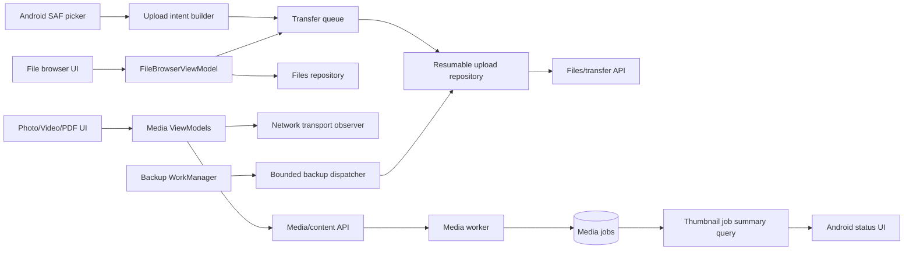

# Androidアップロード・メディア・バックアップ操作性改善 設計書

## アーキテクチャ概要

既存のAndroid `app`、`feature-*`、`core-*`境界とServerのDomain/Application/Infrastructure/API/Worker境界を維持する。画面固有の表示状態は各FeatureのViewModel、SAF・Network・APIアクセスはCore、Job集計と実行制御はServer側Application/Infrastructureに配置する。

今回の変更は1本のPull Requestにまとめるが、実装は小さい検証可能な単位で進める。各単位で回帰Testを通してから次へ進み、最後に統合Test、実機E2E、性能測定、安全なテストデータ清掃を行う。



## 設計判断

### 1. Pull Request構成

全機能、正式文書、Test、測定結果、清掃記録をPR 1に含める。Tasklist上では実装順をフェーズ分けするが、途中でPull Requestを作成しない。全タスク完了後にだけCommit、Push、英語Pull Request作成、PR完了記録、全体振り返りを行う。

### 2. 既存仕様の変更

- 写真はLow、Medium、Originalの既存品質選択を維持する。
- 動画はOriginalだけを選択する。Androidから動画品質選択UIと動画派生待機フローを外し、Serverは動画Low/Mediumの新規Job要求を拒否または作成しない。
- 既存の動画派生DB rowと物理Fileは今回の切替時に一括削除しない。通常の既存Cleanup契約に従う。
- Backupと手動UploadはAndroid側の共通転送枠を共有し、手動操作を優先する。既存Server全体Upload同時数2を測定開始値とし、並列数1・2・4、必要なら6・8を実測する。Server limiterとAndroid共通枠を対応させ、安全に有効な最大値を正式値として確定する。
- Thumbnail生成は動画派生変換と別の実行枠に分け、並列数1・2・4、必要なら6・8をRaspberry Piで実測し、安全に有効な最大値を確定する。
- 採用値は単独benchmarkの最大throughputではなく、Upload・Thumbnail・一覧API・動画Range再生の混合負荷でForeground性能と資源余力を満たす最大値とする。

## コンポーネント設計

### 1. Upload selectionとTransfer queue

**責務**:

- 複数File選択とFolder選択を別のSAF契約として起動する。
- 選択結果を共通の`UploadSelection`へ正規化する。
- Folder treeを安全に走査し、相対Path、Folder、File metadataをUpload計画へ変換する。
- 複数Transferの状態と画面表示対象を管理する。

**実装の要点**:

- 複数Fileは`ActivityResultContracts.OpenMultipleDocuments`を使用する。
- Folderは`ActivityResultContracts.OpenDocumentTree`と`DocumentFile`または`DocumentsContract`を使用し、取得したURI permissionを必要な期間だけ保持する。
- Folder walkerは選択Rootからの相対segmentだけを扱い、空名、`.`、`..`、区切り文字、循環または同一Document IDの再訪を拒否する。
- Upload計画は親Folderを先に作り、Fileを既存のresumable uploadへ投入する。空Folderも明示的な作成項目として保持する。
- 選択したFileは安定順にQueueへ積み、個々に一意な`operationId`を付ける。同じURIが1回の選択結果へ重複しても二重投入しない。
- `FileBrowserUiState`は単一Transferではなく、active、action-required failure、recent completionを区別できるCollectionを持つ。
- `Transfer status`はactiveまたは利用者操作を要する失敗が1件以上の場合だけCompositionする。最後の成功はSnackbarで通知し、成功済み項目は状態保持期限後または通知完了時に除去する。
- 一部失敗時も成功済み結果をrollbackしない。Retryは失敗したQueue項目だけへ新しいrequest generationで実行する。

### 2. File browser layoutとパンくず

**責務**:

- 現在Folderの確定済みID列からパンくずを表示する。
- 任意の祖先Folderへの直接Navigationを受け付ける。
- Headerの縦領域を減らして一覧領域を広げる。

**実装の要点**:

- 既存`BrowserBreadcrumb(id, label)`をLink UIへ渡し、押下時はlabelからPathを組み立てず`id`をViewModelへ渡す。
- ViewModelは対象IDが現在の確定済みbreadcrumb chainに存在する場合だけ遷移を開始し、それより後ろの候補stateを切り落とす。
- 既存のFolder transition generationと同じ排他・stale response抑止を使用する。
- Rootだけの通常Headerは単一Top app bar高を維持し、子FolderではTop app bar下の折り返し可能なパンくず領域に全階層を表示する。祖先は48dp touch targetとcontent descriptionを持つLink、現在地は非活性表示とする。
- Top app bar、パンくず、補助説明の重複を整理し、余白とTypographyをTheme token内で縮小する。system bar insetと主要Actionのtouch targetは維持する。
- 一覧の`LazyListState`はFolder ID、Sort、Filterを含む`FileListContextKey`ごとに保持する。離脱時に先頭可視File ID、index、scroll offsetを`FileListScrollAnchor`として保存する。
- 詳細/Viewerから同じ一覧へBackした場合、安定File IDのkeyを優先してanchorを解決し、同じoffsetへ復元する。anchorが消えた場合だけ保存indexを現在のitem範囲へclampして近傍へ戻す。
- 別Folder、Sort、Filterへの明示変更は別contextとして扱う。単なる再Composition、詳細往復、通常Refreshでは同じcontextの位置を失わない。
- ViewModel/SavedStateHandleにはcontextごとの小さいanchorだけを保持し、一覧全体やComposable stateを保存しない。

### 3. App shell Navigation

**責務**:

- Searchを含む任意のTop-level destinationからHomeを選択したとき、Homeを前面へ戻す。
- Top-level destinationの重複stackを防ぐ。

**実装の要点**:

- Bottom navigation選択は画面固有callbackではなく単一のTop-level navigation関数へ集約する。
- Home選択時はHome graphへ`popUpTo`、`launchSingleTop`、必要なstate restorationを適用し、Searchのnested routeを確実に除く。
- Home再選択、Search→Home、Viewerを閉じた後のHomeについてNavigation Testを追加する。

### 4. Photo Viewer

**責務**:

- 通常表示と全画面表示を切り替える。
- 画像の縦横比と基準表示Sizeを維持する。
- zoom/pan stateとlifecycleを管理する。

**実装の要点**:

- 通常表示・全画面表示とも`ContentScale.Fit`を固定し、Container constraintと画像intrinsic sizeから縦横同一の基準Scaleを計算する。画面と画像の比率が異なる場合はletterbox/pillarboxの余白を許容し、Cropや非等方scaleを使用しない。
- 小さい画像は既定表示で元pixel相当を超えて拡大しない。利用者が明示的にpinch zoomした場合だけ基準Scaleを超える拡大を許可するが、zoom中も縦横へ必ず同一倍率を適用する。
- 全画面は専用stateでsystem barsとApp chromeを切り替え、画像surfaceを利用可能領域全体へ配置する。
- file ID、version、displayed variantが変わった場合だけzoom/panをresetし、単なる再Compositionではresetしない。

### 5. Thumbnail job summary

**責務**:

- Thumbnail Jobを状態別に集計する。
- Androidへ待機中、生成中、失敗の件数と取得時刻を返す。
- 低負荷で画面状態を更新する。

**実装の要点**:

- Application queryを追加し、`THUMBNAIL`と`PDF_THUMBNAIL`だけを`QUEUED`、`RUNNING`、`FAILED`別に集計する。
- Queryは現在Userがread可能なFileに絞る。集計値だけを返し、File ID、名前、他UserのJob状態を含めない。
- `GET /api/v1/media/thumbnail-jobs/summary`を追加し、`queuedCount`、`runningCount`、`failedCount`、`observedAt`を返す。OpenAPIとError文書を同時更新する。
- Android Repositoryは画面表示中のみ間隔を空けてPollingし、request generationが一致する応答だけを採用する。全件が0になった場合はPolling頻度を落とすか停止する。
- API失敗は最後の正常値と更新失敗表示を分け、File browserの利用を妨げない。

### 6. Bounded Thumbnail generation dispatcher

**責務**:

- 独立したThumbnail Jobを設定上限内で並列claim・生成する。
- Job Lease、元File version、temporary output、READY公開をJob単位で分離する。

**実装の要点**:

- `THUMBNAIL`と`PDF_THUMBNAIL`専用の同時実行設定を追加し、最小1と運用上限を起動時検証する。1・2・4を測定し、4でも改善が続いて資源に余裕があれば6・8まで測定する。
- Workerは安定順と`FOR UPDATE SKIP LOCKED`を維持して実行枠数までclaimし、各Jobへ固有worker tokenとLeaseを持たせる。
- 同一File ID、version、derivative typeのunique/既存冪等性契約を維持し、別workerによる重複生成をREADYへ公開しない。
- 各Jobは専用temporary outputへ生成し、元versionとLeaseを再確認した後だけatomic publishする。
- 1 Jobのretryable failureは他Jobのcoroutineをcancelしない。Host停止では新規claimを止め、実行中Jobをgraceful cancellationまたはstale recovery可能な状態にする。
- 動画Low/Medium派生Jobはこのdispatcherへ含めず、新規作成もしない。
- 実行枠が埋まっている場合はDB Queueで待機させ、未制限のTask、Process、FFmpeg、Rendererを生成しない。

### 7. Video Original再生と通信確認

**責務**:

- Original動画だけを準備・再生する。
- 現在のNetwork transportとOriginal sizeに基づいてモバイル通信警告を制御する。
- 通常/全画面で共通の操作Overlayを提供する。

**実装の要点**:

- `MediaVariantResolver`は動画に対して常にOriginalを返す専用経路へ変更し、写真の品質解決とは分離する。
- 動画ViewModelから`selectQuality`と派生Job polling stateを除き、PlayerへOriginal `ReadyMediaSource`だけを渡す。
- Serverのvariant request validatorは動画Low/Mediumの新規要求を明確な4xx契約で拒否する。Thumbnail生成は継続する。
- `ConnectivityManager`のactive network capabilitiesからWi-Fi、Ethernet、Cellular、Other/Unknownを監視する。Trusted Wi-Fi登録状態を動画警告判定には使用しない。
- CellularかつOriginalが1 MiB以上なら、HEAD相当metadata取得後に確認Dialog stateへ進む。1 MiB未満なら直接準備する。Size不明はSize不明の警告を出す。
- DialogでCancelした場合はPlayerへSource URIを渡さず、GET/Range requestを開始しない。許可はfile IDとversionに紐付け、対象が変わったら破棄する。
- Player surfaceは通常表示・全画面表示とも動画metadataの元の縦横比を固定し、`Fit`で配置する。画面と動画の比率が異なる場合はletterbox/pillarboxの余白を許容し、Crop、`FillBounds`、縦横別倍率を使用しない。
- OverlayはPlayer surface全体のtapで表示をtoggleし、再生/停止、戻る、進む、seek、速度、時刻、全画面を同じComposableで提供する。操作中は自動hide timerを延長する。
- ExoPlayer instanceとMediaItemはfile ID、version、resolved routeが変わる場合だけ作り直す。Compose state更新で再prepareしない。
- 既存のRange対応DataSource、buffer、cache、lifecycleを計測し、frame dropまたはrebufferの原因となる設定だけを調整する。

### 8. Trusted Wi-Fi detection

**責務**:

- 現在接続しているWi-FiのSSID/BSSID取得結果を型付き状態で返す。
- 登録Formへの自動入力と権限案内を行う。

**実装の要点**:

- Android versionごとの権限差を吸収する`CurrentWifiSource`を`core-network`または既存Network責務へ置く。
- Android 13以降の`NEARBY_WIFI_DEVICES`、対象versionで必要なlocation permission、位置情報Service状態、Wi-Fi transportを順に確認する。
- `Available(ssid, bssid?)`、`PermissionRequired`、`LocationServicesDisabled`、`NotConnected`、`Unavailable`を区別する。
- `UNKNOWN_SSID`、空値、masked BSSIDを登録候補として扱わない。
- Settings画面表示または`現在のWi-Fiを使用`操作でFormへ反映し、Repositoryへの保存は既存の明示的Save操作だけで行う。
- SSID/BSSIDはBackup policy照合専用とし、TLS、Server identity、User/Device/Session認証を省略しない。

### 9. Settings color修正

**責務**:

- Settingsと下位画面のSurface、Text、Input、Dialogの色をThemeから一貫して取得する。
- Light/Dark themeと各UI stateで判読可能にする。

**実装の要点**:

- hard-coded color、背景と同じ`contentColor`、透明Surface上の不適切なText colorを検索してTheme tokenへ置換する。
- disabled、error、selected、focused状態を含めたcontrastを確認する。
- PreviewまたはCompose UI TestにLight/Dark、360dp、Landscape、fontScale 2.0の代表状態を追加する。

### 10. Bounded backup dispatcher

**責務**:

- 1回のBackup run内で独立したQueue項目を上限付きで並列処理する。
- Lease、checkpoint、receipt、再試行状態を項目単位で確定する。

**実装の要点**:

- WorkManager自体をFile件数分起動せず、既存run/scan後のQueue処理内に固定worker poolまたは`Semaphore`付きcoroutine並列処理を導入する。
- 手動Uploadと自動Backupを同じ端末内の優先度付き共通転送dispatcherへ接続し、合計同時数を型付き設定で制限する。手動Uploadを待機中Backupより先に割り当てるが、実行中のBackupを途中で破棄しない。
- 既存値2から測定を始め、1・2・4、必要なら6・8を比較する。Android共通枠の既定値をServer Upload limiterより大きくせず、より高い値を採用する場合はServer limiterも同じ検証で調整する。
- Queue claimはTransaction内で行い、同一itemを複数coroutineが処理しない。Fileごとのupload session、operation ID、expected versionを共有しない。
- 1件のretryable failureはその項目へ記録し、他項目をcancelしない。認証失効、Storage不足などrun全体を止めるべきerrorだけを共有停止条件にする。
- Network constraint喪失またはWorker cancellationでは新規claimを止め、実行中項目を既存の中断・再開契約で確定する。
- 件数1、2、上限超過、部分失敗、同一File重複候補、process再開をdeterministic dispatcher Testで検証する。

### 11. PDF Viewer recovery

**責務**:

- PDF取得・一時保存・Renderの各段階を追跡し、原因別状態を表示する。
- 正常PDFを確実にアプリ内表示する。

**実装の要点**:

- 前回実装のmetadata確認、256 MiB/File、512 MiB/Session、一時領域、部分File削除を維持する。
- 実機で発生する入力を使い、Content-Type parameter、HEAD/Range応答、空File、seekable file descriptor、`PdfRenderer` lifecycleを再確認する。
- Download完了前にRendererを開かず、close済みまたは部分Fileを再利用しない。
- file ID/version/request generationごとに一時Fileを分離する。cancel、route変更、logoutで該当SessionのFileだけを閉じて削除する。
- Authentication、Network、HTTP、TooLarge、InsufficientStorage、Interrupted、Corrupt、Encrypted、RenderUnsupportedへ分類し、retry可能性を状態へ含める。

## データフロー

### 複数File Upload

```text
1. 利用者が複数File pickerを開く。
2. URI一覧を重複除去し、metadataを検証してQueue項目を作る。
3. 各項目を既存resumable uploadへ渡す。
4. Transfer eventを項目IDごとにstateへ反映する。
5. active/要対応failureが0件になったらTransfer statusを消し、完了Snackbarを出す。
```

### Folder Upload

```text
1. 利用者がFolder pickerでRoot URIを選ぶ。
2. Root配下だけを走査し、相対PathとDocument IDを検証する。
3. 親Folder優先の作成計画とFile Upload計画を作る。
4. Folder作成結果のServer IDを子項目へ渡し、FileをQueue処理する。
5. 読取不能または失敗した項目を個別表示し、成功済み項目を維持する。
```

### モバイル通信での動画再生

```text
1. File metadataとOriginal content metadataを取得する。
2. active transportを判定する。
3. CellularかつSize >= 1 MiB、またはSize不明なら確認Dialogを表示する。
4. CancelではSourceをPlayerへ渡さない。
5. 許可または警告対象外の場合だけOriginalをRange再生する。
```

### Backup並列処理

```text
1. Backup runが差分scanを完了する。
2. dispatcherが同時実行枠の範囲でQueue項目をclaimする。
3. 各workerが独立したupload sessionで送信し、receipt/checkpointを確定する。
4. 完了枠へ次の項目を投入する。項目失敗は他workerを停止しない。
5. run全体の件数と最終状態を、全claim済み項目の結果から集計する。
```

### File一覧から詳細を開いて戻る

```text
1. 一覧はFolder ID、Sort、Filterからcontext keyを作る。
2. Fileを開く直前に先頭可視File ID、index、pixel offsetをanchorとして保存する。
3. 詳細/ViewerからBackして同じcontextへ戻る。
4. 最新一覧でanchor File IDを検索し、存在すればそのindexと保存offsetへ復元する。
5. anchorが存在しなければ保存indexを現在範囲へ補正し、最も近い位置へ復元する。
```

## API・契約変更

### Thumbnail job summary

```http
GET /api/v1/media/thumbnail-jobs/summary
Authorization: Bearer <token>
```

```json
{
  "queuedCount": 12,
  "runningCount": 1,
  "failedCount": 0,
  "observedAt": "2026-09-06T10:00:00Z"
}
```

- Countは0以上の整数とし、現在Userが閲覧可能なFileのThumbnail/PDF Thumbnail Jobだけを含む。
- 非認証、無効Sessionは既存認証Error契約に従う。
- API契約追加時はOpenAPI、Server contract test、Android DTO mapping testを同時更新する。

### 動画variant

- Androidは動画Contentへ`variant=original`だけを要求する。
- 動画に対する`video-low`、`video-medium`等の新規派生要求は、後方互換性を確認したうえで既存Error envelopeによる4xxを返す。
- 写真Low/Medium、写真・動画・PDF ThumbnailのAPI契約は維持する。

## 状態モデル

### Transfer表示状態

```text
Idle
  -> Active(items)
  -> NeedsAttention(failedItems)
  -> CompletedNotice
  -> Idle
```

- `Transfer status`をCompositionするのは`Active`と`NeedsAttention`だけとする。
- `CompletedNotice`はSnackbar eventとして消費し、画面常設stateにしない。

### 動画再生準備状態

```text
MetadataLoading
  -> ConfirmationRequired(size)
  -> PreparingOriginal
  -> ReadyOriginal
  -> Playing/Paused
  -> Failure(reason, retryable)
```

- file ID、version、route generationを各非同期結果に持たせ、古い結果を破棄する。
- Confirmation前にはPlayer engineへ再生URIを渡さない。

### Wi-Fi検出状態

```text
Loading
  -> Available(ssid, bssid?)
  -> PermissionRequired
  -> LocationServicesDisabled
  -> NotConnected
  -> Unavailable(reason)
```

## エラーハンドリング戦略

- Upload selectionとFolder traversalのErrorは項目単位と全体停止を分ける。Root permission喪失は全体停止、子Document読取不能は該当項目だけ失敗とする。
- Duplicate name、Folder作成競合、Upload session expiryは既存のtyped outcomeへmappingし、再試行可能性を表示する。
- Thumbnail summary取得失敗は非Blocking状態として扱う。
- Thumbnail生成失敗は失敗数を保ったまま利用者がバナーをDismissできる。失敗数0の新しいsummaryを受けた時はDismiss状態を解除し、次回の新規失敗を再び案内できるようにする。
- 動画はmetadata取得失敗、通信確認取消、Range非対応、Network切断、codec非対応を分ける。
- Backupは項目単位Errorとrun停止Errorをsealed resultで区別し、structured concurrencyで予期しない例外だけをrun failureへ昇格する。
- PDFは取得とRenderのresourceを`try/finally`で閉じ、失敗段階に応じたtyped errorを返す。
- UI文言は内部例外、URI、Token、物理Pathを表示しない。診断Logには相関IDを使用し、秘密情報を含めない。

## テスト戦略

### 高速な検証順序

1. 変更対象のpure Kotlin/C# Unit TestをClassまたはModule単位で実行する。
2. 関連Android FeatureのUnit Test、Compose UI Test、Server Application/Integration Testを実行する。
3. API契約、Android build/lint、Server build/format/testを変更範囲に応じて実行する。
4. EmulatorでNavigation、Theme、picker結果、Viewer UIを確認する。
5. 実機と実ServerでSAF、Wi-Fi、Cellular、Media/PDF、Backup性能を確認する。
6. 最後にRepository標準verify scriptを必要な範囲で実行する。

失敗時は原因に近い最小Testへ戻り、修正後に失敗した層から上だけを再実行する。同じ変更がない状態で成功済みの重いTestを繰り返さない。

### Unit Test

- Transfer表示対象のactive/failure/completed state遷移。
- 複数URIの重複除去、Folder相対Path検証、親優先計画、一部失敗。
- パンくずID遷移とstale response抑止。
- Top-level Search→Home route生成。
- Photo基準Scale、縦横比、明示zoom。
- Thumbnail job queryのtype/status/authorization filterとDTO mapping。
- Thumbnail dispatcherの最大同時数、claim/Lease分離、部分失敗、cancel/stale recovery、atomic publish。
- File list context key、ID anchor、offset復元、anchor消失時のclamp。
- 動画Original固定、1 MiB境界、Network transport、確認取消時の未prepare。
- Overlay visibility、自動hide、Player再利用条件。
- Videoの通常/全画面、Portrait/Landscape、回転時の元縦横比維持と余白配置。
- Wi-Fi検出結果mapping。
- Backup dispatcherの同時数、重複claim、部分失敗、cancel/restart。
- PDF error分類と一時resource清掃。

### Android UI/Integration Test

- 複数File pickerとFolder pickerの結果を受けたUpload Queue表示。
- 全Transfer完了後のstatus非表示。
- パンくずLink、Search→Home、Header寸法。
- 一覧をscrollして詳細/Viewerを開いた後のBack、Refresh、rotation/process recreationでの位置復元。
- 写真全画面と縦横比、動画Overlay、モバイル警告Dialog。
- 縦長・横長・正方形に近い写真と動画について、通常/全画面のScreenshot上でCrop・stretchがないこと。
- Settings全下位画面のLight/DarkとfontScale 2.0。
- Trusted Wi-Fi権限分岐とForm反映。
- 正常・破損・暗号化PDFのViewer lifecycle。

### Server Integration/Contract Test

- Thumbnail summaryの認証、権限filter、status集計、同時更新時のsnapshot整合。
- Thumbnail dispatcherの上限、排他的claim、Lease、重複抑止、atomic publish、部分失敗。
- 動画Low/Medium新規生成拒否とOriginal/Thumbnail継続。
- 並列Upload時のsession limiter、冪等性、同名競合、部分失敗。

### 実機E2E・性能測定

- Android実機で複数File、入れ子Folder、空FolderをUploadする。
- Wi-FiとCellularで1 MiB境界の動画通信開始有無をproxy/server logとPlayer状態で確認する。
- 基準動画についてstartup time、rebuffer count/time、dropped frames、端末PSS、Server CPU/networkを修正前後で記録する。
- Backup fixtureを1、2、並列上限超過の件数で実行し、総所要時間、成功/失敗件数、Server CPU/memory、429発生数を記録する。
- Thumbnail fixtureを1、2、並列上限超過の件数で実行し、直列/並列の待ち時間・総所要時間、Server CPU/memory/I/O、重複生成数を記録する。
- Trusted Wi-Fi登録、PDF表示、Settings visibilityを対象Android versionで確認する。

## テストデータ管理と清掃

- 作業IDを`ks-20260906-ux-`とし、作成可能なUser名、Folder/File名、operation IDのlabelへ付与する。
- E2E開始前に、作成予定対象を空のmanifestへ記録する。作成API応答で返ったUser/File/Folder/Job等の実IDだけを逐次追記する。
- CleanupはmanifestのIDを1件ずつ再取得し、作業IDまたは作成時metadataと一致することを確認してから削除する。
- 名前の部分一致、親Folderの再帰削除、Database全件削除、Storage directory一括削除を使用しない。
- User、File、Folder、Upload session、Backup run/item、Media job/derivative、Tag/Favorite/Share/Recent/Activity、一時Fileのうち今回作成したものだけを対象にする。
- 清掃後はmanifest全IDが存在しないことを確認し、作業開始前に取得した既存データのID/countまたはspot-check対象が残ることを確認する。
- 自動Testがtransaction rollbackまたは隔離Storeを使える場合はそれを優先し、永続データ作成量を減らす。

## 依存ライブラリ

原則として新しい外部Libraryは追加せず、既存のAndroidX Activity Result、SAF、Coroutines、WorkManager、Media3、Compose、ServerのEF Coreを使用する。Folder tree処理で既に`androidx.documentfile`が利用可能なら使用し、未導入の場合は既存依存関係とAPK影響を確認して追加可否を判断する。

## 想定する変更範囲

```text
apps/android/
├── app/                       # picker launcher、Top-level navigation、DI
├── core-data/                 # transfer queue、media summary、backup dispatcher
├── core-model/                # typed state/DTO model
├── core-network/              # API contract、Network/Wi-Fi transport取得
├── feature-files/             # Upload UI、パンくず、Header、Transfer status
├── feature-media/             # Photo/Video/PDF Viewer
├── feature-settings/          # ThemeとTrusted Wi-Fi登録UI
└── feature-backup/            # bounded parallel run state

server/src/
├── KuraStorage.Application/   # Thumbnail summary query、variant policy
├── KuraStorage.Infrastructure/# 集計query、Job/Upload実装
├── KuraStorage.Api/           # summary endpoint/contract
└── KuraStorage.Worker/        # 動画派生生成抑止の防御

contracts/openapi/             # API契約
docs/                          # 正式な動画・Backup・Thumbnail仕様と検証結果
.steering/20260906-android-upload-media-backup-usability/
```

実際の配置は既存Module責務と類似実装を確認して確定し、不要なModule追加や大規模移動は行わない。

## 実装の順序

1. Baseline、再現条件、テストデータmanifest、対象Testを確定する。
2. Transfer state、複数File picker、Folder walker、Folder Uploadを実装する。
3. パンくず、Search→Home、File browser Headerを修正する。
4. Thumbnail job summaryのServer/API/Android表示と上限付き並列生成を実装する。
5. 動画Original固定、Cellular警告、共通Overlay、Player性能を実装する。
6. 写真全画面とscale、PDF Viewerを修正する。
7. Trusted Wi-Fi detectionとSettings Themeを修正する。
8. Backup bounded parallel dispatcherを実装し、負荷測定で既定値を確定する。
9. File一覧のcontext別scroll anchor保存・復元を実装する。
10. 正式文書とAPI契約を最終実装へ一致させる。
11. 対象TestからRepository標準検証まで段階的に実行する。
12. 実機E2Eと性能測定を行い、今回作成したテストデータだけを清掃する。
13. 差分review後、全変更を1本の英語Pull Requestとして作成し、完了記録と全体振り返りを反映する。

## セキュリティ考慮事項

- SAFで利用者が選択したURI treeの外へアクセスしない。
- Folder名とFile名をServer側でも検証し、Path traversalを許可しない。
- Thumbnail件数は現在Userのread権限内だけを集計し、個別Job情報を漏らさない。
- Cellular警告前に動画Content GETを開始せず、HEAD/metadataだけを取得する。
- Wi-Fi情報を認証情報として扱わず、TLS、Server identity、User/Device/Session認証を維持する。
- Backup並列化でも既存のoperation ID、version競合、upload limiter、暗号化通信を維持する。
- 清掃はmanifestの実IDに限定し、既存データを削除しない。

## パフォーマンス考慮事項

- Folder treeを全件同時にmemoryへ読み込む必要がある場合は上限と段階処理を設け、大量FolderでUI threadを塞がない。
- Transfer進捗更新を適切に集約し、大量項目でComposeを毎byte再Compositionしない。
- Thumbnail summary queryにtype/status/authorization条件に合うindexがあるか実行計画で確認し、Polling間隔を固定下限未満にしない。
- Thumbnail並列数は1・2・4、必要なら6・8を比較し、画像・動画・PDF混在時のCPU、memory、I/O、待ち時間、Foreground操作への影響から確定する。
- 動画はOriginal固定により変換負荷を削減する一方、Network転送量が増えるためCellular警告とRange/Buffer制御を必須にする。
- Backup/手動Upload共通枠は1・2・4、必要なら6・8を比較し、Server limiter、CPU、memory、I/O、429、所要時間、Foreground操作への影響から確定する。
- 混合負荷の目安として、継続CPUに25%以上の余力を残し、swap増加・OOM・thermal throttlingを発生させず、I/O waitを継続的に20%以上へ張り付かせず、一覧APIのp95を並列数1の基準から20%以上悪化させない。動画rebufferが増える値は採用しない。
- 環境差により目安を満たせない場合は並列数を下げ、測定結果と採用理由を記録する。設定上限を超えた処理は拒否せずQueueで待機させる。
- PDF Bitmapは表示pageに限定し、page移動時に前Bitmap/resourceを解放する。

## 将来の拡張性

- Upload selectionをFile/Folder共通計画へ正規化し、将来のdrag-and-dropや共有Intentでも同じQueueを利用できるようにする。
- Thumbnail summary DTOは詳細なFile情報を持たず、将来Job種別を追加しても権限境界を維持できる形にする。
- 動画品質派生のDomain型を直ちに破壊的削除せず、将来adaptive streamingを別契約で設計できる余地を残す。
- Backup dispatcherの並列数を型付き設定にし、端末/Server性能測定に基づいて安全に変更できるようにする。
