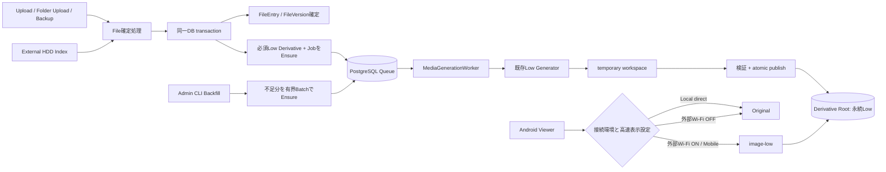

# 写真高速表示・Low派生永続化 設計書

## 1. 設計目的

写真の`IMAGE_LOW`を短期Cacheから、Originalと同じFile lifecycleに追従する必須の永続派生へ変更する。新規・更新写真ではOriginalの確定と同じDB transaction内でLow生成Jobを登録し、既存写真は再開可能なAdmin CLIから補完する。

Androidでは技術的な品質名を利用者へ見せず、写真表示を「高速表示（省通信）」と「Original」の2状態にする。Local directはOriginal、VPN経由の外部Wi-FiとMobileは既定で高速表示を使用する。

本設計は、次の既存資産を維持して変更量と移行リスクを抑える。

- `IMAGE_LOW` / `image-low`の内部・API識別子
- 長辺最大1,280 px、WebP品質70、拡大なしのLow profile
- `FileDerivative`、`MediaJob`、generation/delivery lease
- `ExternalMediaGenerator`、専用temporary workspace、出力検証、atomic publish
- WorkerのCPU quota、並列上限、stale recovery、最大3回retry
- Androidの認証済みMedia取得、Coil memory/disk cache、File Versionを含むcache key

## 2. アーキテクチャ概要

debug buildは既定では既存のtest endpoint/test Root CAを使う。`kurastorage.debugRootCaCertificate`が明示された場合だけ、生成resource overlayで公開Root CAと指定hostnameを使う。hostname、LAN IP、ZeroTier IPも明示指定を必須とし、意図しないproduction接続を防ぐ。



設計上、Originalの物理書込み完了とDB確定は引き続き既存のUpload/Index transaction境界で管理する。Lowの変換完了はUpload responseを待たせない。一方、Lowの`FileDerivative`と`MediaJob`の登録はFile確定と同じDB transactionに含め、Originalだけ確定してJobが失われる状態を作らない。

## 3. ドメイン設計

### 3.1 永続派生の判定

`FileDerivative`へ、期限の有無を`IsThumbnail`だけで判定しない派生lifecycle分類を導入する。

| Derivative type | 最終状態 | `expires_at` | `last_accessed_at` | 容量LRU対象 |
|---|---|---:|---:|---:|
| `THUMBNAIL` | 永続 | `NULL` | `NULL` | 対象外 |
| `PDF_THUMBNAIL` | 永続 | `NULL` | `NULL` | 対象外 |
| `IMAGE_LOW` | 永続 | `NULL` | `NULL` | 対象外 |
| `IMAGE_MEDIUM` | 移行後廃止 | 移行中のみ旧値を許容 | 移行中のみ旧値を許容 | 移行専用削除のみ |
| `VIDEO_LOW` / `VIDEO_MEDIUM` | 本作業で新規生成しないlegacy | 移行中のみ旧値を許容 | 移行中のみ旧値を許容 | 移行専用削除のみ |

`FileDerivative.MarkReady`は`DerivativeLifecycle.IsPersistent(type)`を使用し、永続派生では期限を禁止する。`RecordAccess`は期限型派生だけに限定し、Low配信では呼ばない。DB check constraintも同じ規則へ変更する。

Lowの論理的一意性は既存どおり次の組で保証する。

```text
(source_file_id, source_version, derivative_type=IMAGE_LOW, profile_version)
```

現行Low profile versionは既存設定値を維持する。将来、解像度または圧縮品質を変更するときはprofile versionを上げ、新旧を別の論理派生として扱う。

### 3.2 必須Low登録Service

Application層に`IRequiredPhotoDerivativeProvisioner`を追加する。

```text
EnsureLowAsync(FileEntry source, MediaJobOrigin origin, DateTimeOffset now)
```

責務は次のとおりとする。

- Sourceが写真、現在Version、生成対象MIME、`ACTIVE`またはUpload確定直前の有効状態であることを判定する。
- 現在Version/Profileの`IMAGE_LOW`が`READY`、`PENDING`、`RUNNING`なら再利用する。
- `FAILED`で自動retry上限に達した行は勝手に無限再登録せず、status/backfill結果へ型付き失敗として出す。明示的なretry操作だけで再開する。
- 対象行がなければ`FileDerivative`と`MediaJob`をstageする。
- 自身では`SaveChanges`またはtransaction commitを行わず、呼出元の`KuraStorageDbContext`に追加する。これによりFile確定とJob登録をatomicにする。
- DB一意制約競合は、並行実行で既存行が作成された成功ケースとして再読込する。

既存の`IMediaRepository.GetOrCreateRequestAsync`は、この共通Ensure処理を使用する形へ縮小する。通常のLow要求は事前生成済み`READY`を読む。欠落時だけself-healingとしてLow JobをEnsureし、Originalへfallbackせず従来どおり生成中応答を返す。

### 3.3 Job優先度と発生元

大量backfillが新規Uploadと閲覧要求を占有しないよう、`MediaJob`に次を追加する。

- `Origin`: `INTERACTIVE_REPAIR`、`INGEST`、`BACKFILL`
- `Priority`: `INTERACTIVE_REPAIR` > `INGEST` > `BACKFILL`

Queue claim順は、同一Job type lane内で`priority ASC, available_at ASC, id ASC`とする。既存Jobはmigrationで`INTERACTIVE_REPAIR`相当の通常優先度へ設定する。Thumbnail専用laneと非Thumbnail lane、CPU quotaは維持する。backfill用に無制限の並列laneは追加しない。

Priorityは再試行回数や認可を変更しない。低優先度Jobもstarvationしないよう、一定時間待機したJobを1段階ずつagingするか、一定claim回数ごとにbackfill枠を1件確保する。実装では決定的にテスト可能なaging方式を採用する。

### 3.4 Source状態とLow lifecycle

- Rename/Move: File ID、File Version、内容が変わらないため同じLowを維持する。
- 内容更新: File Version更新transactionで新VersionのLowをEnsureする。旧Versionは配信対象から外し、leaseがないことを確認後、maintenance処理で物理データと管理行を安全に削除する。
- Trash: Lowを削除せず、配信認可はFileのTrash状態によって拒否する。
- Restore: File IDとVersionが同じならLowを再利用する。欠落している場合だけEnsureする。
- `MISSING`: Lowを保持するが配信と新規生成を停止する。同一File ID、同一Version、同一のindex content identityで復旧した場合だけ再利用する。内容同一性を証明できない場合はFile Versionを更新し、旧Lowを使わない。
- Purge / 安全なindex管理情報削除: 既存`MediaDeletionParticipant`でLowを含む全派生directory、Job temporary directory、Job/Lease/Derivative管理行を対象にする。物理削除確認前に管理行を失わない既存削除手順を維持する。

旧Version派生の削除は容量LRUではなくSource lifecycle maintenanceであり、Lowの期限切れ削除とは扱わない。

## 4. Low登録経路

### 4.1 Upload、Folder Upload、自動Backup

これらは共通のUpload session完了処理を通るため、`UploadSessionService`の新規`FileEntry`作成および既存File更新の各確定pathにProvisionerを挿入する。

```text
1. Originalを既存の安全な手順で物理保存する。
2. FileEntryを新規作成、または内容更新してFile Versionを確定する。
3. 同じDbContextでEnsureLowAsync(..., INGEST)を呼ぶ。
4. FileEntry、Derivative、MediaJobを同時にSaveChangesする。
5. DB transactionをcommitする。
6. Upload完了を返す。Low変換完了は待たない。
```

Upload recovery pathも通常完了pathと同じProvisionerを呼び、crash recovery後にJobだけ欠落しないようにする。

### 4.2 外部HDD Index

`IndexEventService`の単一event reconciliationと`IndexScanService`のscan reconciliationの両方で、写真の新規発見または内容更新を確定する前にProvisionerを呼ぶ。Rename/Moveだけの場合はFile Versionが不変なので新しいJobを作らない。

Batch scanではFileEntryとLow Jobを同じ有界batch transactionで保存する。1件の非対応形式または重複Ensureはbatch全体を壊さず、型付き結果として集計する。Storageが`MISSING`、read-only、identity不一致の場合は既存のIndex安全規則を優先し、新規生成を開始しない。

### 4.3 その他の内容更新経路

File Versionを更新できる処理を検索可能な一覧としてテストに固定し、将来追加される写真内容更新はProvisioner呼出しを必須にする。少なくともUpload recovery、外部変更検出、version restoreで写真が対象になり得る場合を検証する。

## 5. Worker・保存設計

### 5.1 生成

`MediaJobRunner`は`IMAGE_LOW`完了時に`expiresAt = null`を渡す。画像処理は既存`ExternalMediaGenerator`のLow branchをそのまま使用する。

```text
Original read
  -> 専用temporary workspaceへdecode/resize/WebP encode
  -> MIME、pixel bounds、非0 byte、出力sizeを検証
  -> Derivative Root内の正式pathへatomic rename
  -> DBをREADYへ更新
```

正式pathは現在のDerivative Root配下とし、temporary rootから分離する。atomic rename可能な同一filesystem境界、mount identity、書込み権限、最低空き容量を起動時と生成直前に確認する。

### 5.2 永続Lowの保守

従来の`MediaCleanupWorker`をCache容量管理としては廃止し、必要な復旧処理だけを`MediaMaintenanceWorker`へ分離する。

維持する処理:

- stale generation Jobのrecovery
- retention経過後のterminal Job履歴削除
- generation失敗またはprocess crash後のtemporary directory削除
- `DELETING`状態の再開
- SourceがPurge済み、または旧Version/Profileで不要になったorphan派生の安全な削除
- legacy Mediumの明示的な移行削除

廃止する処理:

- `expires_at`に基づくLow/Medium削除
- `last_accessed_at`更新と24時間延命
- 10 GiB high watermarkから6 GiB low watermarkまでのLRU削除
- 定期・手動の一般Cache cleanup run

maintenanceは任意の空き容量回収機能ではなく、参照整合性と途中状態の回復だけを扱う。永続Lowを容量都合で削除しない。

## 6. Backfill設計

### 6.1 Admin CLI

`KuraStorage.AdminCli`に次のcommand groupを追加する。

```text
kurastorage-admin media low status
kurastorage-admin media low backfill --dry-run [--batch-size 100]
kurastorage-admin media low backfill --enqueue [--batch-size 100] [--max-items N]
kurastorage-admin media low retry-failed --dry-run|--enqueue [--error-code CODE]
kurastorage-admin media medium purge --dry-run|--apply [--batch-size 100]
```

通常運用でraw SQLやDerivative Root全走査を要求しない。candidateはDBから`File ID ASC`の安定順で抽出する。

### 6.2 対象判定

Backfill対象は次をすべて満たすものとする。

- `ACTIVE`のFile
- serverがLow生成をsupportする画像MIME
- 現在のFile Version
- 現在のLow profile version
- 同じ論理keyの有効な`READY` / `PENDING` / `RUNNING`が存在しない

`READY`で物理ファイル欠落または検証不一致の行は再利用せず、repair対象として表示する。`FAILED`は自動で新しい重複Jobを作らず、failure countとerror codeを表示する。

### 6.3 Dry-runと容量予測

Dry-runは個人情報を出さず、次を表示する。

- 対象写真数
- 現行Low `READY`、生成待ち、実行中、失敗、欠落の件数
- 再利用件数と新規enqueue予定件数
- 既存Lowの総bytes、平均、p50、p95
- Original総bytesと、既存sample比率から求めた追加容量の範囲
- Derivative volumeの空き容量、設定済み保護領域、予測後の残容量
- Storage identity、read-only状態、Worker設定

sample不足時は推定精度が低いことを明示し、Original比率と1件当たり実績の保守的な大きい方を予約量に使う。推定値だけでfilesystem予約を行わず、各生成前のStorage guardも必須とする。

### 6.4 再開性と負荷制御

1 batchごとに不足分を再照会し、Provisionerでidempotentに登録してcommitする。CLI process内に全件cursorをSource of Truthとして保持しない。中断後は同じcommandを再実行すれば、既に存在する論理keyを飛ばして次の不足分から再開する。

`--batch-size`には安全な上限を設け、`--max-items`で1回のenqueue量を制限できる。CLIは生成用processを起動せず既存Worker Queueを利用する。停止は新規enqueueを止めることで行い、登録済みJobは通常どおり安全に完了する。緊急時のpauseはWorkerの既存運用停止手順を使用し、running processを強制killして部分出力を正式公開しない。

### 6.5 完了照合

`media low status`は、現在の対象母数に対して`READY / QUEUED / RUNNING / FAILED / MISSING`、Low総bytes、不正な重複数を集計する。完了条件は不足と重複が0件であり、変換非対応またはterminal failureはFileを特定しない型付き件数として明示する。

## 7. Medium廃止と互換展開

Mediumは一度に物理削除せず、次のgateで段階的に廃止する。

### Stage A: Server先行互換

- Serverは新しい`IMAGE_MEDIUM` Derivative/Jobを作らない。
- 旧Androidからの`image-medium`要求は移行期間だけ`image-low`へ正規化する。Low未準備時はLow JobをEnsureして生成中を返し、Originalへfallbackしない。
- OpenAPIでは`image-medium`をdeprecatedとして示し、新Android契約からは削除する。
- 既存Cache cleanupを呼べる期間も`IMAGE_LOW`を削除対象から即時除外する。

### Stage B: Android更新

- AndroidからMedium enum、設定選択肢、request生成を削除する。
- 旧保存値`MEDIUM`は高速表示ONへmigrationする。
- 新しいAndroid buildが実ServerでLow/Original両方を利用できることを確認する。

### Stage C: Legacy削除

- Backfill完了、新Android配布、旧Android requestが観測期間中0件であることをgateにする。
- `media medium purge --dry-run`でMediumだけのDB/物理対象を照合する。
- `--apply`はdelivery/generation leaseを確認し、既存の安全な削除状態遷移でMedium物理ファイル、Derivative、Job、Leaseを削除する。
- Android、OpenAPI、通常のServer生成pathからMediumを除く。1回だけのPull Requestで安全に展開するため、Server内部には旧Androidの`image-medium`をLowへ正規化する非公開互換parserと、purge用のlegacy discriminatorだけを残す。これはMedium生成・保存を行わず、利用状況をmetricで確認できる。

Original、Low、Thumbnail、PDF thumbnailはMedium purge queryに型条件を設けて対象外とする。apply前後で各typeの件数とbytesを照合する。

## 8. Admin API再設計

最終状態ではAdmin Media Cache APIと手動Cache cleanupを廃止し、read-onlyの永続派生statusへ置き換える。

```text
GET /api/v1/admin/media-derivatives
```

主なresponse項目:

- 現在の対象写真数
- Low `READY / PENDING / RUNNING / FAILED / MISSING`件数
- Low総bytes
- 現行profile version
- 重複・旧Version・orphan件数
- 最終集計時刻

新APIはUser名、File名、pathを返さずAdmin roleを要求する。破壊操作はAPIに設けず、backfillとlegacy purgeはServer console上のAdmin CLIに限定する。

移行期間は旧`GET /api/v1/admin/media-cache`をlegacy Cacheだけの互換表示として維持する。旧manual cleanupはLowを除外し、legacy Medium等だけを扱う。Android更新後に旧GET/POST、`MediaCleanupRun`、watermark設定、Cache management画面を削除する。terminal Job保守は新status APIにcleanup runとして見せない。

## 9. Android設計

### 9.1 表示mode model

写真の利用者向けmodelを3段階の`MediaQuality`から次の2状態へ変更する。

```kotlin
enum class PhotoDisplayMode {
    FAST,
    ORIGINAL,
}
```

wire上の対応は`FAST -> image-low`、`ORIGINAL -> original`である。動画・PDFのvariant modelと混同させない。

### 9.2 接続環境別の初期値

| 接続環境 | 初期表示 | 設定 |
|---|---|---|
| `LOCAL_DIRECT` | Original固定 | Viewer内の一時切替のみ |
| VPN + 登録済み外部Wi-Fi | 高速表示、既定ON | ON/OFF保存 |
| VPN + 未登録外部Wi-Fi | 高速表示、既定ON | ON/OFF保存 |
| Mobile + VPN | 高速表示 | 既存の通信確認規則を維持 |

`QualityPreferenceStore`はschema versionを上げ、旧`LOW`と`MEDIUM`を`FAST=true`、旧`ORIGINAL`を`FAST=false`へ一度だけmigrationする。不明値や未保存値は安全側の高速表示ONとし、意図しないOriginal通信を起こさない。

Viewerでの一時切替は画面stateだけを変更し、接続環境別Preferenceを書き換えない。次の写真またはViewer再表示では、その時点の接続環境に応じて初期modeを解決する。

### 9.3 UI

設定画面にはswitch rowとして「高速表示（省通信）」と説明文を表示する。Viewerには現在の「高速表示」または「Original」を文字で示し、操作で2状態を切り替える。

Iconは新規bitmapを持ち込まず、既存Compose/vector方針に合わせた「荷物を運ぶ動き＋速度線」または視認性の高い「稲妻＋速度線」を採用する。最終形は小サイズで判読できる単純なvectorとし、Text labelとTalkBack content descriptionを必ず併用する。ON/OFFを色だけで表さない。

横360 dp、Landscape、font scale 2.0でTextが切れないよう、Viewer操作は必要に応じてwrapまたはoverflow menuへ移す。Light/Dark双方でtheme colorを使い、固定色を使わない。

### 9.4 Low未準備時

- APIが生成待ちならThumbnailを維持し「高速表示を準備しています」を表示する。
- retry可能failureでは間隔を制限した再確認と手動retryを提供する。
- terminal failureでは型付きmessageを表示する。
- いずれも自動的にOriginalを取得しない。Originalへの切替は利用者操作と既存通信確認を経る。

### 9.5 Android端末Cache

Coilの有界memory 64 MiB / disk 256 MiB cacheは維持する。cache keyは少なくとも次を含む。

```text
server/account scope + file ID + file version + variant
```

現在のapp process初期化時に全previous media cacheを消す処理は廃止し、同一scopeのcacheをapp再起動後も利用可能にする。Logout、Account切替、Server identity変更時には対象scopeを削除する。容量上限によるCoil evictionとOSによる削除は許容し、Android cache消失時はServerの永続Lowから再取得する。

### 9.6 フォルダ一覧の連続スクロール

現行`FileBrowserScreen`は、scroll観測から`BrowserScrollAnchor`を保存するたびに`state.scrollAnchors`が更新される一方、anchor復元用`LaunchedEffect`も`savedAnchor`をkeyに含む。このfeedback loopは利用者のdrag/fling中にも`scrollToItem`を再実行し、慣性scrollを打ち消す可能性がある。また、次pageは末尾の`Load more`操作に依存するためpage境界で連続閲覧が止まる。

次のように責務を分離する。

```text
通常scroll
  -> first visible stable ID/index/offsetを保存
  -> 復元処理は起動しない

画面・Folder context生成時
  -> 保存anchorを一度だけresolve
  -> 初期Lazy stateまたは一度限りのscrollToItemへ適用
  -> restored flagを立て、その後の利用者scrollを上書きしない

末尾手前へ到達
  -> canLoadMore && !loading && !requestInFlightを確認
  -> 次pageを1回だけ取得
  -> 既存項目へstable keyでappend
```

List/Gridそれぞれの`LazyListState` / `LazyGridState`に対し、`layoutInfo.visibleItemsInfo`から末尾までの残item数を`snapshotFlow`と`distinctUntilChanged`で観測する。prefetch thresholdへ入ったときだけ`onLoadMore`を呼ぶ。ViewModel/`FilePager`側もpage単位のin-flight guardと期待page番号を持ち、recompositionや複数collectorによる重複取得を拒否する。

取得失敗時は既存`items`、page、anchorを維持し、末尾itemを自動再試行ではなく明示的なRetryへ変える。成功後は次pageをappendし、現在のLazy stateを作り直さない。既存の`Load more` buttonは通常時の必須操作から外し、error時およびAccessibility上のfallbackとして使用する。

Thumbnail decode、network処理、format処理がMain thread上で各frameに走らないこともMacrobenchmarkまたはCompose計測で確認する。ただし本変更で全件一括loadは行わず、既存Server paginationを維持する。

### 9.7 Photo Viewerからの復帰target

`MediaNavigationContextStore`のcontextを単なるFile ID listから、起点一覧と現在表示写真を追跡するNavigation contextへ拡張する。

```text
MediaNavigationContext
  contextId
  sourceDestinationKey
  orderedFileIds
  initialFileId
  currentFileId
```

`PhotoViewerViewModel`が写真を正常に切り替えるたび、route層から`currentFileId`をcontextへ反映する。Back時は`currentFileId`を一度だけ消費できる`MediaReturnTarget`として起点destinationへ渡してから`popBackStack`する。

Folder一覧はreturn targetを受けると、現在のlayout ID列から対象写真のindexを求め、該当Folder/List/Grid contextの`BrowserScrollAnchor`を更新して一度だけ表示位置へ移動する。通常Backは一覧だけを表示し、detail sheetは開かない。Viewerの「詳細」操作は同じreturn targetに`openDetails=true`を付け、scroll完了後に対象写真のsheetを開く。

Viewer候補は起動時に一覧へ読込み済みのID snapshotであるため、通常は対象が現在page集合に存在する。更新、削除、権限変更等で見つからない場合は追加の無制限page探索を行わず、直前のBrowser anchorを維持する。return targetにはsource destinationとaccount/server scopeを含め、別一覧へ適用せず一度消費後に削除する。

この復元は9.6のone-shot restorationと同じcoordinatorを使用し、保存anchor更新によるfling中断を再導入しない。

### 9.8 Home容量表示

既存`AdminStorageService`は容量に加えてTrash/Purge情報を返し、`AdminOnly`で保護されている。Home用にはこれを一般公開せず、容量読取りだけを共有componentへ抽出する。

Server Application層へ`StorageCapacityService`を追加し、既存`IStorageGuard.InspectAsync(StorageIntent.Read)`と`IFileStore.GetCapacityAsync`を再利用する。認証済み全role向けに次を追加する。

```text
GET /api/v1/storage/capacity

{
  "storage": "AVAILABLE",
  "totalBytes": 4000000000000,
  "usedBytes": 1500000000000,
  "availableBytes": 2500000000000
}
```

`usedBytes`はServer側でcheckedに`totalBytes - availableBytes`として算出する。`total < 0`、`available < 0`、`available > total`は正常値として返さず、型付きunavailable応答またはServer errorとして扱う。値はKuraStorage mount全体のfilesystem使用量であり、KuraStorage管理Fileだけの論理合計ではない。

Endpointは通常の認証を必須にし、Anonymous health APIへbytesを追加しない。Admin専用のTrash容量、Purge履歴、warning thresholdは含めない。既存`/admin/storage`は同じcapacity readerを再利用しつつ、Admin専用情報を加える。

Androidでは`HomeViewModel`へ容量repositoryを注入し、Home表示時に1回取得する。手動Retry/Refreshと接続回復後の再取得は許可するが常時pollしない。Homeには「使用済み / 合計」のText、bounded progress、空き容量を表示する。Unavailable/error時は未知値を0%として描かず独立したerror cardを表示し、Recent/Backup等の他sectionを維持する。

## 10. API・Error設計

追加・使用する代表的な型付きerror:

| Code | 用途 |
|---|---|
| `MEDIA_LOW_PENDING` | LowがQueue待ちまたは生成中 |
| `MEDIA_LOW_GENERATION_FAILED` | Low生成がterminal failure |
| `MEDIA_SOURCE_MISSING` | Originalが`MISSING`または物理的に読めない |
| `MEDIA_STORAGE_UNAVAILABLE` | identity不一致、unmount、read-only等 |
| `MEDIA_STORAGE_CAPACITY_GUARD` | 最低空き容量条件により停止 |
| `MEDIA_VARIANT_UNSUPPORTED` | 移行完了後のMedium等の非対応variant |
| `STORAGE_CAPACITY_UNAVAILABLE` | Home容量取得時にStorageまたは容量値を利用できない |

既存の生成中HTTP statusとpoll契約を優先して再利用し、同じ意味の新statusを増やさない。OpenAPI変更時はServer integration testとAndroid contract testを同時に更新する。

## 11. Database migration

Migrationはデータ破壊を伴わない順序で行う。

1. `media_jobs`へ`origin`と`priority`を追加し、既存rowを既定値でbackfillする。
2. `file_derivatives`のcheck constraintを、`IMAGE_LOW`の`expires_at` / `last_accessed_at`が`NULL`となる規則へ置き換える。
3. 既存`READY IMAGE_LOW`の期限列を`NULL`へ更新する。論理key、relative path、size、statusは変更しない。
4. Lowを除外したlegacy cleanupを展開する。
5. `MediaCleanupRun`関連table/index/configを削除する。物理Medium削除はmigration SQLでは行わず、Merge後の専用CLIで行う。

Migration前にLowの期限切れcleanupが同時実行されないようWorker展開順を固定する。down migrationで消した物理派生を復元できるとは仮定しないため、Medium物理削除は明示的な運用gate後だけ実行する。

## 12. Observability・運用

Metrics/logはID、File名、User名、pathをlabelへ入れない。

主なmetrics:

- Low Job enqueue / claim / ready / failed件数（origin別）
- Queue ageと最古待機時間（priority別）
- Low生成時間、出力bytes、Original比率
- 現行写真に対するLow coverage率
- Storage空き容量、capacity guard停止回数
- duplicate Ensure競合、orphan、旧Version件数
- `image-medium`互換request件数
- AndroidでLow/Original取得bytesと表示開始時間の計測可能な範囲

Backfill中はAPI latency、Original配信、Upload、Backup、Worker CPU、HDD IO wait、PostgreSQL connection/lockを観測する。安全基準を超えた場合は新規enqueueを停止し、batch sizeまたはWorker quotaを下げる。実Serverの最終容量と性能測定値は正式運用文書へ記録する。

## 13. Security・Privacy

- Low配信はOriginalと同じ認証、User/Device/Session、Server identity、TLS、File閲覧権限を通す。
- `File ID`を知っているだけではLowを取得できない。
- Trash、`MISSING`、Purge、権限失効、旧File Versionを認可・状態検証で拒否する。
- Backfill CLIとMedium purgeはServer consoleと管理用設定を必要とし、一般APIから起動できない。
- Status、metrics、通常logにFile名、User名、物理pathを出さない。
- temporary/Derivative Rootのpath検証とsymlink防御、mount identity検証を既存Storage boundaryのまま維持する。
- Android cacheはServer/account scopeを跨いで再利用せず、Logout等で該当scopeを削除する。

## 14. テスト戦略

### 14.1 Domain / Unit test

- `IMAGE_LOW`は期限なしで`READY`になり、accessで期限更新されない。
- 同一論理keyのEnsureがDerivative/Jobを重複作成しない。
- `FAILED`の無限自動retryを作らない。
- Job priority、aging、最大retryが期待順で動作する。
- Rename/Move/Trash/Restore/Missing recovery/version更新の再利用・無効化規則。
- 旧`MEDIUM` preference migrationと接続環境別mode解決。
- Viewerの一時切替が保存済み設定を書き換えない。
- Browser anchor保存がone-shot復元を再起動しない。
- Paginationのin-flight guard、期待page、error retryが重複取得を防ぐ。
- Media navigation contextが最後に表示した写真と起点一覧を分離して保持する。
- Capacityの`used = total - available`、invalid range、unavailable mapping。

### 14.2 Server integration test

- Upload、Folder Upload、Backup相当のUpload session、external event、full scan、recoveryの各経路でFile確定とLow Job登録がatomicである。
- transaction rollback時にFileだけ、またはJobだけが残らない。
- Worker restart、stale claim、HDD切断、read-only、容量不足、変換失敗で部分出力を公開しない。
- Low配信がTTLを更新せず、maintenance/LRUで削除されない。
- Trash中は配信不可、Restoreで再利用、Purgeで物理・管理データを削除する。
- Backfill dry-run、bounded enqueue、中断再実行、並行実行で不足・重複が0へ収束する。
- Admin derivative statusが正しい集計を返し、非Adminを拒否し、個人情報を返さない。
- Medium互換alias期間と最終unsupported契約。
- Medium purgeがMedium以外を変更しない。
- 一般容量APIが認証済み全roleへ最小限の値だけを返し、AnonymousとAdmin専用情報を拒否する。

### 14.3 Android test

- Local direct、登録済み/未登録外部Wi-Fi、Mobileで期待variantを要求する。
- 外部Wi-Fiの既定ON、ON/OFF保存、旧Low/Medium/Original値のmigration。
- Low pending/failureでOriginal requestが発生しない。
- Viewer切替、通信確認、次写真での既定値再解決。
- account/server/version/variant違いでcache keyが分離される。
- app再起動では同一scope cacheを保持し、Logout/account/server切替では対象scopeを削除する。
- List/Gridのflingをanchor保存が中断せず、末尾prefetchがpageを一度だけappendする。
- Pagination失敗後もitemsと位置を保持しRetryできる。
- Viewerで複数写真を移動した後、通常Backと詳細Backが現在写真を正しい一覧contextへ返す。
- Home容量のloading/available/unavailable/error/invalid value表示。
- 360 dp、Landscape、font scale 2.0、Light/Dark、TalkBack semanticsのCompose UI test。

### 14.4 実環境検証

- 実データdry-runで9,233件の母数を再確認する。
- Backfill前後のOriginal/Low/Thumbnail/Medium件数、bytes、空き容量を集計する。
- Backfillを中断し、WorkerまたはPi再起動後に再実行して重複なしで再開する。
- 承認済みVPN＋外部Wi-Fi環境で事前生成LowとOriginalのcold/warm表示開始時間、転送bytesを比較する。
- Backfill中の通常閲覧、Upload、自動Backupが安全域内で動くことを確認する。
- 大きなFolderでList/Gridを連続flingし、page境界、Thumbnail更新、Viewer復帰後も引っかからないことを確認する。
- Admin/一般UserのHomeで容量を確認し、未認証状態ではbytesが公開されないことを確認する。

## 15. 依存ライブラリ

新規外部libraryは追加しない。Serverは既存.NET / EF Core / PostgreSQL / image processing toolchain、Androidは既存Kotlin / Compose / Coilを使用する。Iconもrepo内のvector/Compose実装とし、bitmap asset依存を追加しない。

## 16. 主な変更配置

```text
server/src/
├── KuraStorage.Domain/Media/
│   ├── FileDerivative.cs                 # 永続lifecycle規則
│   └── MediaJob.cs                       # origin / priority
├── KuraStorage.Application/Media/
│   ├── RequiredPhotoDerivativeProvisioner.cs
│   ├── PreviewService.cs                 # Low read/self-healing、期限更新削除
│   ├── MediaJobRunner.cs                 # Low expiresAt=null
│   └── AdminMediaDerivativeService.cs    # read-only coverage/status
├── KuraStorage.Infrastructure/
│   ├── Persistence/                      # Ensure、claim、status、migration
│   └── Media/ExternalMediaGenerator.cs   # 既存Low branch再利用、Medium削除
├── KuraStorage.Worker/Workers/
│   └── MediaMaintenanceWorker.cs         # 整合性・途中状態の保守
├── KuraStorage.AdminCli/
│   └── Program.cs                        # low status/backfill/retry、medium purge
└── KuraStorage.Api/Program.cs             # admin media-derivatives

apps/android/
├── core-model/.../media/                  # PhotoDisplayMode、Medium削除
├── core-data/.../media/                   # preference migration、resolver、cache scope
├── core-network/.../media/                # Medium契約と旧Cache API削除
├── feature-media/.../photo/               # 高速表示/Original UI
├── feature-files/.../                      # one-shot anchor、連続pagination
├── feature-settings/                      # 高速表示設定、派生status画面
└── app/                                   # Viewer復帰target、Home容量、cache初期化

contracts/openapi/kurastorage-api.yaml
docs/product-requirements.md
docs/functional-design.md
docs/architecture-design.md
docs/repository-structure.md
docs/development-guidelines.md
```

実装時は既存命名とmodule境界を確認し、実際に不要な新規fileは作らず既存componentへ責務を統合する。

## 17. 実装・展開順序

### 単一Pull Request

本作業のSource変更は次の順で同一Branch上に実装し、全実装・検証・文書更新後にPull Requestを1回だけ作成する。

1. Domain/DBの永続Low、Job origin/priority、migrationを実装する。
2. 共通ProvisionerをUpload/Backup/Index/recoveryへ接続する。
3. Workerを期限なしLowへ変更し、TTL/LRU Cacheを整合性Maintenanceへ置き換える。
4. Backfill/status/retry/Medium purge CLI、Admin derivative status、一般容量APIを実装する。
5. Androidの`PhotoDisplayMode`、高速表示UI、Preference migration、cache scopeを実装する。
6. Folder一覧のone-shot anchor復元、末尾prefetch、error retryを実装する。
7. Viewerの現在写真を起点一覧へ返すNavigation contextを実装する。
8. Home容量表示を実装する。
9. Server/Android/OpenAPI/正式文書を最終状態へ更新し、全自動・手動testを実施する。
10. 差分review後に1つのPull Requestを作成する。公開Root CAと明示接続先を注入したdebug APKで物理端末の接続経路を検証する。release keystore・password file・署名fingerprint・version codeを必要とする正式署名APKの生成、固定名配置、upgrade installは、2026-09-08のユーザー承認によりMerge後の実運用gateで実施する。

### Merge後の運用作業

1. Server backup、Database backup、Storage identity、空き容量を確認する。
2. Serverを展開しmigrationを適用する。
3. Backfill dry-run後、小batchから全Lowを生成して件数・容量・負荷を照合する。
4. release signing資材で新Android APKを生成し、固定名、SHA-256、package/version/SDK/署名を記録してupgrade installする。paginationを発生させる十分な認証済み実データで、高速表示、一覧scroll、Viewer復帰、Home容量を実機確認する。
5. Medium purge dry-run/applyを行い、Mediumだけが0件になったことを照合する。

Merge後の運用でSource不具合が見つかった場合は、本タスクを完了扱いにせず、修正の扱いをユーザーと確認する。通常の計画上は追加Pull Requestを前提にしない。

## 18. 設計上の非採用案

- Android端末だけに全Lowを保持する案: 端末cache消去、複数端末、再installで再生成待ちが戻るため採用しない。
- LowをUpload response内で同期生成する案: 大きな画像でUpload/Backup完了時間とfailure couplingが増えるため採用しない。
- Derivative Rootを直に全件走査して作るscript: DB lifecycle、認可、logical key、atomic publishを迂回するため採用しない。
- Mediumを高速表示として名前だけ変更する案: 容量と選択肢を減らす目的を満たさないため採用しない。
- Server Low永続化に伴ってAndroid cacheも削除する案: VPN越しの再転送とdecodeが毎回発生し、体感速度を悪化させるため採用しない。
