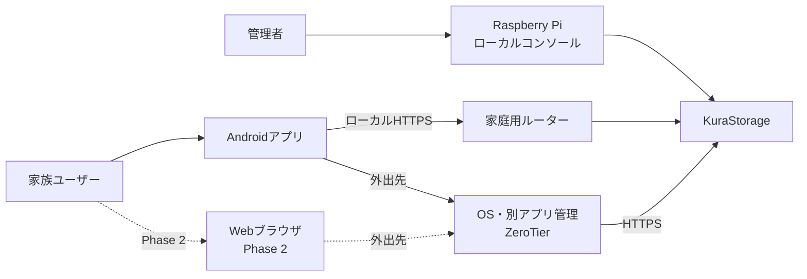
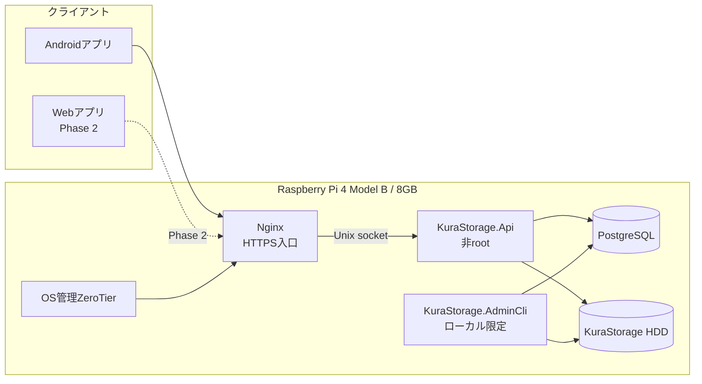
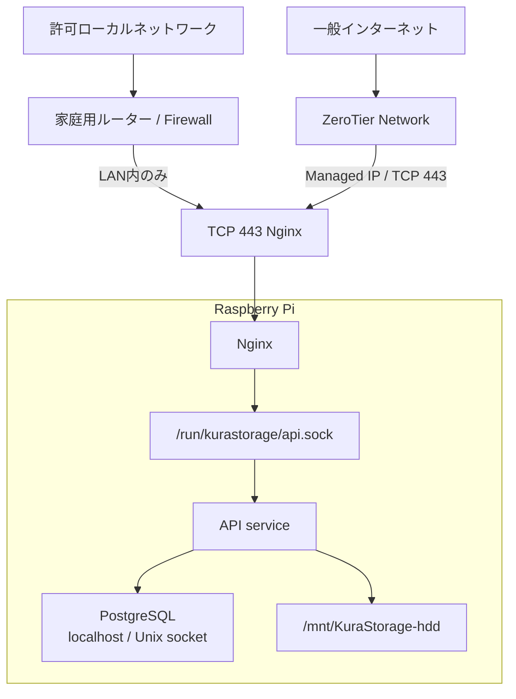
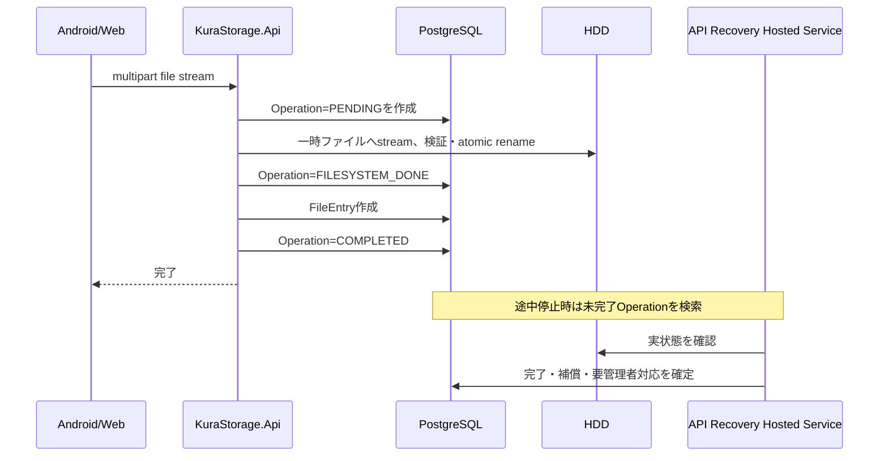
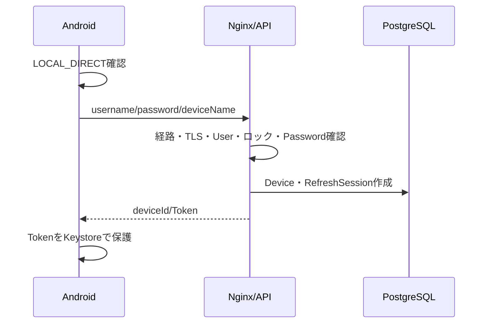
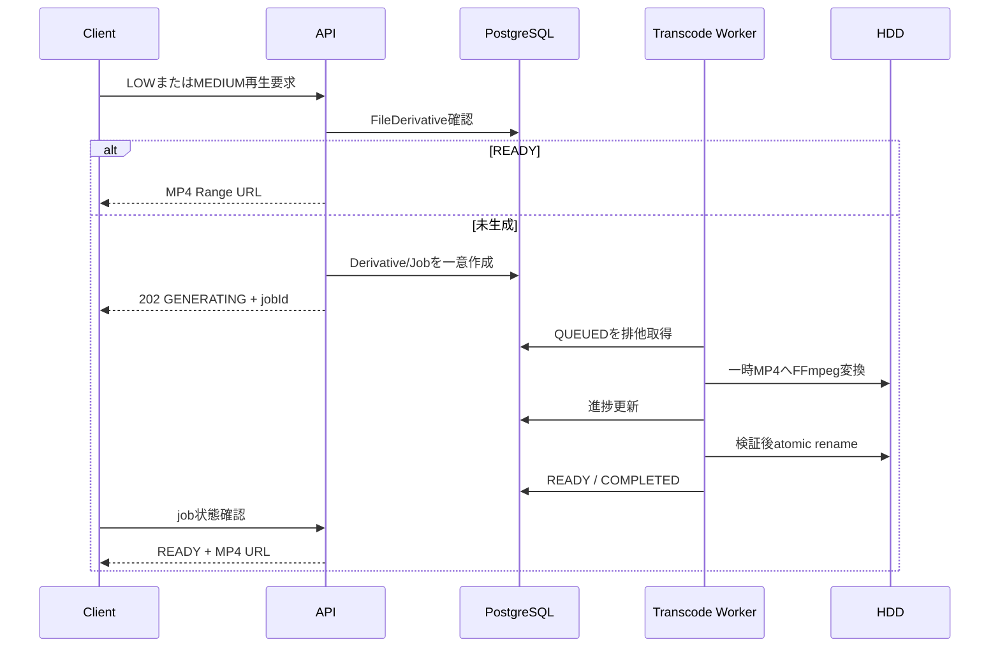

# アーキテクチャ設計書（Architecture Design Document）

## 文書情報

| 項目 | 内容 |
| --- | --- |
| プロダクト名 | KuraStorage |
| 文書種別 | Architecture Design Document |
| バージョン | 0.3.0 Draft |
| 作成日 | 2026-07-11 |
| 参照文書 | `docs/product-requirements.md` Version 1.0.0 Draft |
| 参照文書 | `docs/functional-design.md` Version 0.9.0 Draft |
| 対象フェーズ | Phase 1: Androidアプリ＋Raspberry Piバックエンド |
| 次期フェーズ | Phase 2: Webアプリ |

---

## Phase 1 ZeroTierアーキテクチャ

Phase 1では、OSまたは別アプリが管理するZeroTierをリモート通信路とする。ZeroTier daemonはKuraStorageのApplication Hostに含めず、Domain、DB、管理CLI、Androidアプリから操作しない。

- Nginx 443だけを`NET-LAN-CIDR`と`NET-ZEROTIER-CIDR`へ公開する。
- APIはUnix Socket、PostgreSQLと管理Serviceは非公開を維持する。
- 固定`NET-API-HOSTNAME`をLANでは`NET-LAN-API-IP`、ZeroTierでは`NET-ZEROTIER-API-IP`へアプリ内解決する。
- KuraStorage Device／Session失効とZeroTier Member失効を独立した防御境界として扱う。
- ZeroTier Network ID、Node Identity、認可情報、秘密鍵をSource、DB、APK、Log、Artifactへ保存しない。

将来の自己管理WireGuard、VPSを介したVPN、その他の安全なオーバーレイ方式は拡張候補とする。方式を変更する際は、`REMOTE_SECURE`、NginxのHTTPS入口、TLS、KuraStorage認証・認可の境界を維持し、接続方式固有の設計を別途行う。

---

## MVPアーキテクチャ境界

MVPの実行構成は、Androidアプリ、Nginx、`KuraStorage.Api`、`KuraStorage.AdminCli`、PostgreSQL 17、専用HDD、OS・別アプリ管理ZeroTierだけとする。

- APIはNginxのUnix Socketからだけ受信し、非rootで動作する。
- MVPでは独立`KuraStorage.Worker`を配置しない。API内の期限付きHosted Serviceは、未完了Uploadの清掃と`FileOperation`の起動時・定期復旧だけを担当する。
- AndroidはRoom、WorkManager、Media3、Coil、PDF LibraryをMVP依存へ追加しない。ファイルはSAFで手動選択・保存し、アプリ内Media表示は行わない。
- DBのMVP TableはUser、Device、Refresh Session、Authentication Attempt、Audit Log、File Entry、File Operationに限定する。
- UploadはStreaming Multipartを同一Filesystem上の一時ファイルへ書き、検証後にatomic renameする。Downloadは元ファイルのHTTP Range配信だけとする。
- TrashとRestoreは`FileOperation`でDB・HDD間の途中状態を管理し、復元競合では上書きしない。
- 自動Backup、共有、検索、Rename・Move、Permanent Delete、Chunk Upload、Media変換、派生データ、外部変更監視はMVP後に別Steeringで追加する。

後続節に記載したこれらの将来設計は拡張時の参考であり、MVPのHost、Module、Migration、依存、配置Unitへ先行投入しない。

---

## 1. 目的と対象範囲

本書は、プロダクト要求定義書および機能設計書で定義されたKuraStorageを実現するために、システムの技術構造、コンポーネント境界、依存方向、実行プロセス、データ永続化、通信、セキュリティ、性能、信頼性、運用、テスト方針を定義する。

本書の対象は次のとおり。

- Androidネイティブアプリ
- Raspberry Pi上のKuraStorage API
- Raspberry Pi上のAPI内限定Hosted Service（独立WorkerはMVP後）
- Raspberry Pi上の管理CLI
- Nginx、PostgreSQL、OS管理ZeroTier、HDDを含む実行環境
- ローカル直接接続および外部管理ZeroTier経由のHTTPS通信
- ファイル転送、検索、プレビュー、変換、自動バックアップ、索引整合性
- ログ、メトリクス、障害復旧、バックアップ、デプロイ

Phase 2のWebアプリは実装対象外だが、同じApplication層とHTTP APIを利用できる構造をPhase 1から維持する。

### 1.1 アーキテクチャ目標

1. 家族利用規模で安定して動作し、30万件のファイル索引を扱えること。
2. Android、将来のWeb、管理CLIが、同じ業務ルールを再利用できること。
3. HDD上の実ファイルとPostgreSQLの管理情報を明確に分離すること。
4. ファイルシステムとDBをまたぐ処理が途中失敗しても復旧できること。
5. ZeroTier固有の管理機能をKuraStorageのドメインへ持ち込まないこと。
6. 動画変換などの高負荷処理がAPI応答を停止させないこと。
7. 外部クラウドや一般公開Webサービスを前提とせず、自宅サーバーとして運用できること。
8. Phase 2のWebアプリ追加時に、バックエンドのドメインロジックを作り直さないこと。

### 1.2 設計対象外

- 一般インターネットへ直接公開するWebサービス
- 複数サーバーへ水平分散するクラスタ構成
- オブジェクトストレージへのファイル保存
- 外部クラウドとの双方向同期
- HLSによる生成途中動画の配信
- iOSクライアント
- マルウェア検知基盤
- KuraStorage自身による第二媒体への完全自動バックアップ

### 1.3 参照文書内の整合性判断

参照文書内に表現差がある箇所は、上位の設計原則とMVP確定事項に基づき、次のとおり統一する。

| 項目 | 本書で採用する判断 |
| --- | --- |
| `LOCAL_DIRECT` | Android端末とKuraStorageエンドポイントが管理者設定の同一IPサブネットに属し、非ZeroTier経路へバインドしたHTTPS確認、TLS証明書・ホスト名検証、期待するAPI応答に成功した場合だけ成立する。異なるサブネットからZeroTierなしで到達できても`LOCAL_DIRECT`にはしない。 |
| 動画派生形式 | MVPでは動画派生データを生成しない。完成済みMP4方式はMVP後のMedia設計候補とする。 |
| Refresh Session件数 | Deviceはローテーション履歴として複数の`RefreshSession`行を持てる。ただし、失効・使用済み・置換済みでない有効SessionはDeviceごとに原則1件とする。 |
| サムネイル保持 | MVP対象外。Preview機能追加時に保持方針を再確認する。 |
| 完全削除後の索引 | MVP対象外。MVPは`ACTIVE`と`TRASHED`だけを扱う。 |

---

## 2. 主要アーキテクチャ決定

| ID | 決定 | 理由 |
| --- | --- | --- |
| ADR-001 | Phase 1はモジュラーモノリスとする | 家族向け単一サーバーであり、マイクロサービスの複雑性を増やさず、モジュール境界を維持できる。 |
| ADR-002 | バックエンドはASP.NET CoreとC#を使用する | 認証、HTTP Range、ストリーミング、バックグラウンド処理、CLI、Linux systemd連携を同一言語・ランタイムで実装できる。 |
| ADR-003 | MVP AndroidはKotlin、Jetpack Compose、SAF、Keystoreを使用する | 手動ファイル操作と秘密情報保護を最小依存で実現する。RoomとWorkManagerはMVP後とする。 |
| ADR-007 | Phase 1のリモートアクセスは外部管理ZeroTierとする | Public Portを開けず、KuraStorageへネットワーク資格情報の管理責務を追加せずにリモート到達性を確保できる。 |
| ADR-004 | HDD上の実ファイルをファイル存在・内容・階層の正とする | KuraStorage外からの変更を検知・再索引でき、DB障害だけで実ファイルを失わない。 |
| ADR-005 | PostgreSQLを管理情報、索引、操作ジャーナルの正とする | 認証、所有権、排他制御、状態遷移、再試行を一貫して扱える。 |
| ADR-006 | 独立Workerと永続Media QueueはMVP後とする | MVPの復旧処理はAPI Hosted Serviceで足り、実行プロセスを増やす必要がない。 |
| ADR-008 | APIは専用非rootユーザーで動作する | ファイル・DB・ネットワークへの権限を必要最小限にする。 |
| ADR-010 | Nginxを唯一のHTTPS入口とする | TLS終端、要求サイズ・タイムアウト制御、Range配信、アクセスログ、将来のWeb静的配信を一元化する。 |
| ADR-012 | ファイルシステムとDBをまたぐ更新には操作ジャーナルと補償処理を使用する | 両者を単一トランザクションにできないため、途中状態を記録してAPI起動時・期限付きHosted Serviceで復旧する。 |
| ADR-013 | Access Tokenは署名付き短寿命Token、Refresh Tokenはランダムな不透明Tokenとする | API要求の検証を軽量化しつつ、Refresh Tokenを端末単位でローテーション・失効・再利用検知できる。 |
| ADR-014 | Androidと将来のWebは物理パスを扱わず、IDベースAPIだけを使用する | パストラバーサルを防ぎ、HDDマウント先変更や内部ディレクトリ再編成をクライアントから隠蔽できる。 |
| ADR-015 | 動画派生データは全体生成、検証、atomic rename後に公開する | 生成途中または破損した動画を利用者へ公開しない。 |
| ADR-016 | `FileEntry`を完全削除後の論理削除行として残さない | ゴミ箱内では`TRASHED`として復元情報を保持するが、完全削除完了時は実体と関連管理情報を削除する。履歴が必要な場合はファイル索引から分離した監査ログを使用する。 |

---

## 3. システムコンテキスト

### 3.1 利用者と外部境界



### 3.2 コンテナ構成



### 3.3 配置構成



### 3.4 信頼境界

| 境界 | 信頼しない入力 | 検証 |
| --- | --- | --- |
| Android/Web → Nginx | HTTPヘッダー、Token、本文、ファイル名、Range、サイズ | TLS、要求上限、認証、構文・型・範囲検証 |
| Nginx → API | プロキシヘッダー、接続元情報 | 信頼するプロキシをNginxのUnixソケットに限定し、任意クライアントから転送ヘッダーを受けない |
| API → Application | userId、deviceId、fileId、共有権限 | 認証コンテキストをサーバー側で生成し、クライアント指定値を認可根拠にしない |
| Application → HDD | 相対パス、ファイル名、MIME、操作種別 | StorageGuard、実パス確認、シンボリックリンク拒否、専用ルート制約 |
| OS管理ZeroTier → Nginx | ZeroTier経路からのHTTP要求 | `NET-ZEROTIER-CIDR`からNginx 443へのみ許可し、TLSとKuraStorage認証・認可を必須とする |
| MVP後Worker → Media Processor | メディア入力 | 導入時に引数、時間、メモリ、画素数、出力上限を検証する |

---

## 4. アーキテクチャパターン

### 4.1 モジュラーモノリス

KuraStorageのバックエンドは、1つのリポジトリと共有ドメインモデルを持つモジュラーモノリスとする。MVPの実行HostはAPIとAdmin CLIで、業務ルールは同じApplication層を使用する。

```text
Presentation / Host
├─ KuraStorage.Api
├─ KuraStorage.AdminCli
          ↓
Application
├─ Identity
├─ Authorization
├─ Files
├─ Transfer
├─ Administration
└─ Audit
          ↓
Domain
├─ Entities
├─ Value Objects
├─ Policies
├─ State Machines
└─ Domain Errors
          ↓
Infrastructure
├─ PostgreSQL
├─ File System
├─ Token / Password Hashing
├─ FFmpeg / Image Processing
├─ systemd Integration
└─ Logging / Metrics
```

### 4.2 依存方向

```text
API / CLI → Application → Domain
Infrastructure ───────────→ Application / Domainの定義したinterfaceを実装
Domain ───────────────────→ 外部ライブラリへ依存しない
```

#### Presentation層

- HTTP、CLI、API Hosted Serviceの起動契機を受け付ける。
- 入力形式を検証し、Application CommandまたはQueryへ変換する。
- DBやHDDへ直接アクセスしない。
- 業務判断を実装しない。

#### Application層

- ユースケースを実行する。
- 認証後のUser、Device、Session、権限、ストレージ状態を組み合わせる。
- トランザクション境界と操作ジャーナル状態を制御する。
- Infrastructureのinterfaceへ依存する。

#### Domain層

- 共有権限、状態遷移、キャッシュ有効性、Token系列などの純粋なルールを実装する。
- ASP.NET Core、EF Core、Android等へ依存しない。

#### Infrastructure層

- PostgreSQL、HDD、暗号、FFmpeg/Poppler、systemd、時刻、UUID生成等を実装する。
- Domainの業務判断を重複実装しない。

### 4.3 コマンド・クエリ分離

完全なCQRS基盤は導入しないが、Application内では更新処理と参照処理を分ける。

- Command: 登録、ログイン、アップロード確定、移動、削除、共有更新、失効等
- Query: 一覧、詳細、検索、状態、変換進捗等

これにより、更新処理のトランザクションと、一覧・検索の読み取り最適化を分離する。

---

## 5. テクノロジースタック

具体的なパッチバージョンは実装開始時にロックファイルとビルド定義へ固定する。メジャーバージョン変更はアーキテクチャレビュー対象とする。

### 5.1 サーバー

| 技術 | 基準バージョン | 用途 | 選定理由 |
| --- | --- | --- | --- |
| ASP.NET Core | .NETと同一 | REST API、認証、Range配信、Health Check | ストリーミング、認証ミドルウェア、構造化ログ、バックグラウンド処理との統合が容易。 |
| Entity Framework Core | .NETと同一メジャー | DBアクセス、Migration | 型付きモデル、トランザクション、楽観ロック、Migrationを統一できる。 |
| Npgsql | EF Core対応版 | PostgreSQL接続 | PostgreSQL固有機能、配列、`jsonb`、トランザクションを扱える。 |
| PostgreSQL | 17系を基準 | 管理情報、検索索引、ジョブ、監査 | 30万件規模の検索、排他、再帰CTE、部分Index、`pg_trgm`を利用できる。 |
| Nginx | OS安定版 | TLS終端、リバースプロキシ | APIを外部へ直接公開せず、TLSと要求制御を一元化する。 |
| FFmpeg / FFprobe | MVP後 | 写真縮小、動画変換、メタデータ確認 | Media機能追加時に導入する。 |
| Poppler `pdftoppm` | MVP後 | PDF先頭ページ描画 | Preview機能追加時に導入する。 |
| Argon2idライブラリ | 実装時に保守状況を確認して固定 | パスワードハッシュ | Argon2id v1.3と自己記述形式を扱い、独自暗号実装を避ける。 |
| OpenTelemetry SDK | .NET対応安定版 | メトリクス、トレース | API時間、DB、ジョブ、変換を共通形式で計測できる。 |

### 5.2 Android

| 技術 | 基準 | 用途 | 選定理由 |
| --- | --- | --- | --- |
| Android | `minSdk 29` | 対応OS | Android 10以降に限定し、ZeroTier、ストレージ、バックグラウンド処理の分岐を抑える。 |
| Kotlin | 2.x系 | アプリ実装 | Android APIとCoroutineを型安全に扱える。 |
| Jetpack Compose | BOMで固定 | UI | 単一方向データフローと状態別画面を実装しやすい。 |
| Coroutines / Flow | Kotlin対応版 | 非同期処理、状態通知 | 接続、転送、変換進捗、Roomを一貫して扱える。 |
| Room | MVP後 | 端末内DB | 自動Backup・Offline機能追加時に導入する。 |
| WorkManager | MVP後 | 自動バックアップ | 自動Backup追加時に導入する。 |
| Android Keystore | OS標準 | 秘密情報保護 | 取り出し不可鍵、StrongBox、AES-GCMを利用できる。 |
| OkHttp | 安定版固定 | HTTPS、Range、アップロード | ネットワークへの明示バインド、Interceptor、ストリーミングを実装しやすい。 |
| Retrofit 3 | 安定版固定 | 型付きAPIクライアント | API DTOとエラー変換を`core-network`へ集約し、OkHttpのNetwork bindingと組み合わせる。 |
| Media3 ExoPlayer | MVP後 | 動画・音声再生 | Media機能追加時に導入する。 |
| Coil | MVP後 | 写真・サムネイル表示 | Preview機能追加時に導入する。 |
| Android PdfRenderer | MVP後 | PDF表示 | アプリ内PDF表示追加時に導入する。 |

### 5.3 開発・品質管理

| 技術 | 用途 | 選定理由 |
| --- | --- | --- |
| Git | ソース管理 | 変更履歴、レビュー、リリースタグを管理する。 |
| Gradle Version Catalog | Android依存管理 | ライブラリバージョンを一元管理する。 |
| NuGet lock file | .NET依存管理 | 復元結果を固定し、環境差を防ぐ。 |
| xUnit | .NETユニット・統合テスト | Application、Domain、APIのテストを統一する。 |
| Testcontainers for .NET | PostgreSQL統合テスト | 実DBの制約、Index、Transactionを検証する。 |
| JUnit / AndroidX Test / Compose UI Test | Androidテスト | Repository、Worker、画面状態、操作を検証する。 |
| k6 | API性能試験 | Range、一覧、検索、アップロードの測定を自動化する。 |
| ShellCheck | 配置・運用スクリプト検査 | systemd補助スクリプト等の誤りを検出する。 |

---

## 6. バックエンド構成

### 6.1 Solution構成

```text
server/src/
├─ KuraStorage.Domain/
├─ KuraStorage.Application/
├─ KuraStorage.Infrastructure/
├─ KuraStorage.Api/
├─ KuraStorage.AdminCli/

server/tests/
├─ KuraStorage.Domain.Tests/
├─ KuraStorage.Application.Tests/
├─ KuraStorage.Infrastructure.IntegrationTests/
├─ KuraStorage.Api.IntegrationTests/
└─ KuraStorage.E2ETests/
```

### 6.2 Applicationモジュール

| モジュール | 主な責務 |
| --- | --- |
| Identity | User認証、Argon2id、Device、Refresh Session、Token系列、認証失敗ロック |
| Authorization | MVPは所有User境界。共有権限はMVP後 |
| Files | 一覧、詳細、Folder作成、Trash、Restore |
| Transfer | Streaming Multipart Upload、検証、Range Download |
| Audit | 監査イベント、認証試行、セキュリティ操作記録 |

Sharing、Media、Backup、IndexingはMVP後に必要になった時点で追加する。

モジュール間の直接DB更新は禁止し、Application serviceまたは明示したinterfaceを介する。

### 6.3 KuraStorage.Api

- NginxからUnixソケットで要求を受ける。
- `/api/v1`配下のREST APIを提供する。
- 認証不要エンドポイントを明示的に限定する。
- Bearer Token検証後、User、Device、Sessionの有効状態をDBで確認する。
- ファイル一覧・詳細はDBから返す。
- 元ファイルだけをRange対応でストリーム配信する。
- Upload清掃と`FileOperation`復旧だけを期限付きHosted Serviceで行う。
- API要求内で長時間のHDD全体走査を行わない。

#### HTTPパイプライン

```text
Nginx
  ↓
RequestId
  ↓
Forwarded Header検証
  ↓
Rate Limit
  ↓
Authentication
  ↓
User / Device / Session有効性確認
  ↓
Endpoint入力検証
  ↓
Application Command / Query
  ↓
共通Error変換
  ↓
構造化Access Log
```

### 6.4 MVP後: KuraStorage.Worker

1つのWorker実行ファイル内に複数のHosted Serviceを置くが、各処理は独立したジョブ種別として扱う。

- `MediaTranscodeWorker`
- `ImageDerivativeWorker`
- `CacheCleanupWorker`
- `IndexEventWorker`
- `FullRescanWorker`
- `OperationRecoveryWorker`
- `TrashPurgeWorker`
- `ExpiredUploadCleanupWorker`
- `AuditRetentionWorker`

動画変換はグローバル同時実行数1とする。その他の軽量ジョブは個別の同時実行上限を持つ。

### 6.5 KuraStorage.AdminCli

- Raspberry Piローカルコンソールからだけ実行する。
- rootまたは限定sudoユーザーだけが起動できる。
- Application層を呼び出し、直接SQLで状態を変更しない。
- パスワードは非表示の対話入力とし、コマンド引数へ渡さない。
- すべての高権限操作を監査ログへ記録する。
- DB Migrationは管理CLIの明示コマンドで実行し、API起動時の自動Migrationは行わない。

追加する運用コマンド例。

```bash
sudo KuraStorage-admin database migrate
sudo KuraStorage-admin storage verify
sudo KuraStorage-admin index rescan
sudo KuraStorage-admin operation recover
```

---

## 7. Androidアプリアーキテクチャ

### 7.1 全体構造

Androidは単一Activity、Jetpack Compose、単一方向データフローを基本とする。

```text
Compose UI
   ↓ Intent
ViewModel / State Holder
   ↓ Use Case
Domain / Repository Interface
   ↓
Data Sources
├─ Remote API
├─ SAF
├─ SecureCredentialStore
```

Room、WorkManager、MediaStore差分取得はMVP後の自動Backup追加時に導入する。


### 7.2 推奨モジュール構成

```text
apps/android/
├─ app/
├─ core-model/
├─ core-network/
├─ core-data/
├─ core-security/
├─ core-ui/
├─ feature-connection/
├─ feature-auth/
└─ feature-files/
```

`core-database`、`core-testing`、Media・Sharing・Backup・Settings Featureは、必要となるMVP後の変更で追加する。

### 7.3 状態管理

各画面は次の状態を明示する。

- `Loading`
- `Content`
- `Empty`
- `Generating`
- `Disconnected`
- `AuthenticationRequired`
- `DeviceRevoked`
- `StorageUnavailable`
- `RecoverableError`
- `FatalError`

接続経路、認証、Device、HDDを単一の`connected: Boolean`へ潰さず、独立した状態として保持する。

### 7.4 ネットワーク経路の選択

Androidは同じHTTPSホスト名を使用し、接続経路に応じて解決先IPを切り替える。TLSのSNIとホスト名検証は常に同じホスト名で行う。

1. 基盤Wi-FiまたはEthernetのIPとプレフィックスを取得する。
2. 管理者設定のローカルKuraStorage IPが同一サブネットか確認する。
3. 同一サブネットの場合、対象`Network`へOkHttp通信を明示的にバインドしてHealth APIを確認する。
4. 成功時は`LOCAL_DIRECT`とする。
5. 失敗時、`NET-API-HOSTNAME`を`NET-ZEROTIER-API-IP`へ解決してHTTPS到達性を確認する。
6. 成功時は`REMOTE_SECURE`、両方失敗時は`DISCONNECTED`とする。

SSIDとBSSIDは外部Wi-Fiで自動バックアップを許可するポリシーにだけ使用し、接続先サーバーの本人確認には使用しない。

### 7.5 SecureCredentialStore

- StrongBox対応時はRefresh Token保護用のStrongBox-backed AES-256鍵を優先する。
- AES-GCMでRefresh Tokenを暗号化する。
- 暗号文、IV、必要な付随情報だけをアプリ専用領域へ保存する。
- Android自動バックアップと端末移行から除外する。
- Access Tokenは原則メモリだけで保持する。
- ログアウト、Device失効、登録失敗時に対象秘密情報を削除する。

### 7.6 MVP後: 自動バックアップ実行モデル

- MediaStore変更通知とgeneration差分を優先する。
- SAFはアプリ起動時、許可ネットワーク到達時、定期Workerで走査する。
- Roomへ保留キューを永続化する。
- WorkManagerの一意なWork名で重複起動を防ぐ。
- Worker開始後にネットワークポリシーを再評価する。
- モバイル通信、未登録Wi-Fi、ZeroTier未接続の外部Wi-Fiでは短時間で終了する。
- 端末側削除をサーバー削除へ変換しない。

---

## 8. データアーキテクチャ

### 8.1 データの正

| データ | 正とする場所 | 補足 |
| --- | --- | --- |
| ファイル本体、内容、物理階層 | HDD | DBだけを根拠に存在を断定しない。 |
| ファイル検索索引、共有、状態 | PostgreSQL | HDDとの差異を再スキャンで修復する。 |
| 低・中画質派生状態 | PostgreSQL＋HDD | DB状態と実ファイルの両方が揃った場合だけ`READY`とする。 |
| Androidバックアップ保留状態 | Room | サーバー完了後にBackupReceiptと対応付ける。 |

### 8.2 PostgreSQLスキーマ方針

- テーブル名、列名は`snake_case`とする。
- IDはサーバー生成UUIDとする。
- 日時は`timestamp with time zone`で保存し、UTCとして扱う。
- 列挙値はApplication enumとDB制約を対応させる。
- 主要テーブルに`created_at`、`updated_at`を持たせる。
- 状態更新には楽観ロック用Version列または条件付きUPDATEを使用する。
- 論理的に一意な関係にはDB一意制約を必ず設定する。
- Migrationはコードレビュー対象とし、前方移行を基本とする。
- `file_entries`はゴミ箱内の`TRASHED`までを管理対象とし、完全削除後の行を保持しない。
- 完全削除時は、関連テーブルを明示的なApplication処理または適切な外部キー制約で整理してから`FileEntry`を削除する。監査ログは削除対象の業務データから独立させる。

### 8.3 主要Index

| 対象 | Index方針 |
| --- | --- |
| `file_entries` | `(parent_id, status, name)`、`(owner_user_id, status)`、`relative_path`一意、`updated_at` |
| 名前検索 | `pg_trgm`を有効化し、正規化した`lower(name)`へGIN trigram Index |
| `share_members` | `(user_id, share_id)`、`(share_id, user_id)`一意 |
| `file_derivatives` | `(source_file_id, source_version, derivative_type, profile_version)`一意、`status`、`expires_at`、`last_accessed_at` |
| `transcode_jobs` | `(status, created_at)`、`derivative_id` |
| `refresh_sessions` | `token_hash`一意、`family_id`、`device_id`、現在Session行の部分一意Index |
| `upload_sessions` | `(status, expires_at)`、`device_id` |
| `backup_receipts` | `(device_id, local_document_key)`一意 |
| `audit_logs` | `occurred_at`、`event_type`、`user_id`、`device_id` |

### 8.4 Refresh Sessionモデル

Tokenローテーション履歴を保持するため、1台のDeviceに複数の行を許可する。

```text
Device
  └─ RefreshSession A  USED / replaced by B
       └─ RefreshSession B  USED / replaced by C
            └─ RefreshSession C  ACTIVE
```

有効Sessionの条件。

```text
revoked_at IS NULL
AND used_at IS NULL
AND replaced_by_session_id IS NULL
AND expires_at > now()
```

Deviceごとに上記条件を満たす行は原則1件とする。DBの部分一意Indexは時刻条件を含めず、`revoked_at IS NULL AND used_at IS NULL AND replaced_by_session_id IS NULL`の現在Session行をDeviceごとに1件へ制限する。期限切れ行が残っている場合は、再ログインまたはRefresh処理のトランザクション内で先に失効させてから新しい行を作成する。Refresh処理は次を同一DBトランザクションで行う。

1. Tokenハッシュ行を排他取得する。
2. User、Device、Session、有効期限を確認する。
3. 旧Sessionを`used_at`付きで使用済みにする。
4. 新Sessionを作成する。
5. `replaced_by_session_id`を設定する。
6. 新Refresh Tokenを返す。

使用済みTokenが再提出された場合は同じ`family_id`の未失効Sessionをすべて失効する。

### 8.5 ファイル階層

- `FileEntry`でFILEとFOLDERを共通管理する。
- `parent_id`で隣接リストを構成する。
- 祖先共有権限は再帰CTEで解決する。
- 循環を防ぐため、フォルダ移動前に移動先が自分自身または子孫でないことを検証する。
- 最大階層深度は設定値で制限し、MVP初期値を64とする。
- `relative_path`は索引・復旧用に保持するが、クライアントへ公開しない。

### 8.6 MVP後: 派生データの識別

派生データの論理キーは次とする。

```text
sourceFileId
+ sourceVersion
+ derivativeType
+ profileVersion
```

- 名前変更と移動では`sourceVersion`を変更しない。
- 元ファイル内容が変化した場合だけ`sourceVersion`を増加させる。
- 変換設定が変わった場合は`profileVersion`を増加させる。
- ダウンロード名は常に現在の`FileEntry.name`から生成する。

### 8.7 MVP後: PostgreSQL永続ジョブキュー

Workerは次の形式でジョブを取得する。

```sql
SELECT id
FROM transcode_jobs
WHERE status = 'QUEUED'
ORDER BY created_at
FOR UPDATE SKIP LOCKED
LIMIT 1;
```

取得したトランザクション内で`RUNNING`へ変更してから処理を開始する。Worker停止で`RUNNING`のまま残ったジョブは、heartbeatまたは`started_at`の期限超過を基に再試行可能状態へ戻す。

`LISTEN/NOTIFY`は待機時間短縮に使用できるが、通知自体を信頼できるキューとして扱わない。ジョブの正はテーブルとする。

---

## 9. HDDストレージアーキテクチャ

### 9.1 ファイルシステム

KuraStorage専用HDDはLinux上で信頼性が高いファイルシステムを使用し、MVP基準を`ext4`とする。HDDを他OSへ直接接続して編集する運用は前提としない。

推奨マウントオプション。

```text
nodev,nosuid,noexec
```

マウントはデバイス名ではなくUUIDでsystemd mount unitまたは`/etc/fstab`へ定義する。APIとWorkerはマウント確認が完了するまで起動しない。

### 9.2 物理構造

```text
/mnt/KuraStorage-hdd/KuraStorage/
├── .storage-identity
├── users/
│   └── <user-id>/
│       ├── files/
│       └── trash/
└── upload-temp/
    └── <user-id>/
```

`.storage-identity`にはランダムな`storageId`とフォーマットバージョンを保存する。起動時に設定値と一致しない場合はストレージを`UNAVAILABLE`とする。
共有、外部取り込み、サムネイル、派生キャッシュ、過去Versionの物理領域は、MVP後の各機能を追加する変更で設計・作成する。

### 9.3 ストレージ利用可否

書き込み前に次を検証する。

1. 設定パスが実際のマウントポイント配下である。
2. `.storage-identity`が存在し、期待する`storageId`と一致する。
3. 実パスが設定済みルートと一致する。
4. 読み取り・書き込みテストに成功する。
5. ファイルシステムが読み取り専用でない。
6. 安全余裕を差し引いた空き容量が要求サイズ以上である。

HDDが利用不可の場合、Raspberry Pi本体側に同名ディレクトリを作って処理を継続してはならない。

### 9.4 安全なパス解決

- クライアントから物理パスを受け取らない。
- DBの`relative_path`を正規化する。
- 絶対パス、`..`、NUL、代替区切り文字を拒否する。
- 結合後に`realpath`相当でルート配下か再確認する。
- 経路中および対象のシンボリックリンクを拒否する。
- 書き込み時はTOCTOUを考慮し、可能な範囲でディレクトリハンドル基準の安全な操作を使用する。

### 9.5 atomic操作

- アップロードは`upload-temp`へ保存する。
- サイズ・チェックサム・形式検証後、同一ファイルシステム内でatomic renameする。
- MVP後の名前変更・移動を追加する場合も同一ファイルシステム内のrenameを基本とする。
- MVPは同名項目を上書きしない。将来の置換APIは別途atomic replace設計を必要とする。
- DBを更新する前後の段階を`FileOperation`へ記録する。

---

## 10. 整合性とトランザクション

### 10.1 基本原則

PostgreSQLトランザクションとHDD操作を単一のACIDトランザクションにはできない。そのため、操作ジャーナルを使用した段階的確定と復旧を行う。

### 10.2 ファイル操作ジャーナル

```text
PENDING
  ↓
FILESYSTEM_DONE
  ↓
COMPLETED
```

失敗時は`RECOVERY_REQUIRED`へ遷移する。

### 10.3 アップロード確定



正式配置前のファイルを通常一覧へ表示しない。

### 10.4 Device登録

1. `LOCAL_DIRECT`をサーバー側で確認する。
2. User、ロック、パスワード、Device上限を確認する。
3. DeviceとRefresh Sessionを同一DBトランザクションで作成する。
4. 成功時だけ`deviceId`、Access Token、Refresh Tokenを返す。
5. ZeroTier Network ID、Managed IP、Node Identity、Member情報は登録処理で読み書きしない。


### 10.5 冪等性

- 同じUser・`Idempotency-Key`・同じMetadataのUpload再送は既存結果を返す。異なるMetadataは`IDEMPOTENCY_CONFLICT`とする。
- File Commandは対象File・Folder ID単位のPostgreSQL advisory lockで直列化する。
- Device失効は複数回実行しても同じ最終状態とする。
- TrashとRestoreの再試行は既存の`FileOperation`と実状態を確認して同じ最終状態へ収束させる。

---

## 11. 主要処理フロー

### 11.1 初回Device登録



### 11.2 保護APIの認証・認可

1. NginxがHTTPSを終端する。
2. APIがAccess Tokenの署名、有効期限、Issuer、Audienceを検証する。
3. Tokenの`sub`、`device_id`、`session_family_id`を取得する。
4. DBでUser、Device、および`session_family_id`に対応するRefresh Session系列が失効していないか確認する。Tokenローテーションで旧行が使用済みになっても、同じ系列に現在Sessionが存在する限り既発行Access Tokenは有効期限まで利用できる。
5. ファイル操作では対象FileEntryの所有者・共有権限を解決する。
6. 必要権限を満たす場合だけHDDへアクセスする。

Access Tokenが署名上有効でも、User無効化、Device失効、Session失効の場合は拒否する。

### 11.3 MVP後: 写真派生データ

1. FileEntryと権限を確認する。
2. 対応する派生キーを検索する。
3. `READY`かつ実ファイルが存在すれば配信する。
4. なければ重複生成を排除して生成を開始する。
5. 短い待機閾値内に完了すれば配信する。
6. 閾値を超えた場合は`202 Accepted`と状態URLを返す。
7. 完成後に一時出力をatomic renameし、DBを`READY`へ変更する。

### 11.4 MVP後: 動画派生データ



再生URLは完成済みMP4を返す。`.m3u8`は使用しない。

### 11.5 MVP後: 自動バックアップ

1. AndroidがMediaStore/SAF差分をRoomへ記録する。
2. NetworkPolicyEvaluatorが実行可否を判定する。
3. `POST /backup/compare`でサーバー側Receiptと比較する。
4. 必要な項目だけ、認証済みUser/Deviceと端末文書情報を関連付けた通常のUpload Sessionを作成する。
5. チャンク送信し、中断時は受信済み範囲から再開する。
6. 新規内容は新しいFileEntryへ公開し、変更内容は検証済み一時ファイルを既存FileEntryへatomic replaceする。
7. FileEntry、Upload Session、操作ジャーナル、BackupReceiptを同じDBトランザクションで確定する。
8. Androidが保留キューを完了へ変更する。

端末側で消えた項目は、サーバーへ削除要求を送らない。
保留中Backup Uploadは`userId`、認証済み`deviceId`、`localDocumentKey`ごとに1件へ制限し、
完了Receiptも同じ組で一意にする。

### 11.6 MVP後: `MISSING`判定

- HDDが`AVAILABLE`の場合だけ個別ファイル不存在を評価する。
- 初回不存在で`MISSING_CANDIDATE`へ変更する。
- 別時刻の再確認でも存在しなければ`MISSING`へ変更する。
- HDD全体が未マウント・読取不可の場合はFileEntry状態を変更しない。
- `MISSING`項目の管理情報削除はユーザーまたは管理者の明示操作で行う。

---

## 12. APIアーキテクチャ

### 12.1 基本契約

- Base path: `/api/v1`
- Content-Type: `application/json`、ファイル本文は適切なMIME
- 認証: `Authorization: Bearer <access-token>`
- Request ID: APIが生成し、レスポンスとログへ記録する
- 日時: ISO 8601、タイムゾーン付き
- ID: UUID文字列
- ページサイズ: 初期100、最大500

### 12.2 共通エラー

```json
{
  "code": "STORAGE_UNAVAILABLE",
  "message": "ストレージを利用できません。",
  "requestId": "uuid",
  "details": {}
}
```

- `code`はクライアント分岐に使用する安定した値とする。
- `message`は利用者向けで、内部例外・物理パス・SQLを含めない。
- `details`は上限値、再試行秒数、競合Version等の安全な情報だけを含める。

### 12.3 匿名API

匿名許可は次に限定する。

- `GET /api/v1/system/health`
- `POST /api/v1/auth/register-device`
- `POST /api/v1/auth/login`
- `POST /api/v1/auth/refresh`

`register-device`と`login`は匿名HTTPであっても、TLS、経路判定、Rate Limit、Userロック、監査の対象とする。

### 12.4 ファイル配信

- 全体をメモリへ読み込まず、ストリームで返す。
- MVPの元ファイルはHTTP Rangeに対応する。
- `Accept-Ranges: bytes`を返す。
- `Content-Disposition`は現在のFileEntry名から生成する。
- 非ASCII名は`filename*`を使用する。
- 派生データ配信はMVP後とする。

### 12.5 API互換性

- 破壊的変更は`/api/v2`で行う。
- v1内では任意項目追加を許可する。
- enum追加時に古いクライアントが安全に未知値を扱える設計にする。
- Androidは`protocolVersion`をHealth APIで確認し、非互換時は更新要求を表示する。

---

## 13. セキュリティアーキテクチャ

### 13.1 ネットワーク

- ZeroTier Memberから許可する宛先はKuraStorage HTTPSだけとする。
- SSH、PostgreSQL、SMB、他LAN端末、他ZeroTier端末への転送をnftablesで拒否する。
- PostgreSQLはlocalhostまたはUnixソケットだけで待ち受ける。
- APIはUnixソケットでNginxからのみ接続可能にする。

### 13.2 TLSとサーバー本人確認

Phase 1は公開ドメインと公開CAを使用せず、Git管理外の`docs/environment-info.md`にある`NET-API-HOSTNAME`とKuraStorage専用プライベートCAを使用する。NginxをTLS終端とし、LAN接続時とZeroTier接続時のURLを同じHostnameへ統一する。公開項目定義は`docs/environment-info.example.md`を参照する。

- Phase 1のCA階層はRoot CAからサーバー証明書を直接発行する。Root CAは`basicConstraints = critical, CA:TRUE, pathlen:0`および`keyUsage = critical, keyCertSign, cRLSign`を持つ。
- サーバー証明書は`subjectAltName = DNS:<NET-API-HOSTNAME>`、`basicConstraints = critical, CA:FALSE`、`extendedKeyUsage = serverAuth`、RSAに適したcritical Key Usageを持ち、SHA-256以上で署名する。
- Root CA秘密鍵はRSA 4096-bit、パスフレーズ付きとし、オフライン管理端末で保持する。証明書発行後はKuraStorageサーバーへ常設せず、Repository、Androidアプリ、配布物へ含めない。
- サーバー秘密鍵はRSA 3072-bitとし、Nginx専用の制限された配置先で管理する。Root CA公開証明書はAndroidアプリのTrust Anchorとして使用する。
- AndroidのNetwork Security Configurationは`TLS-ROOT-CA-CERT-PATH`から同梱したRoot CA公開証明書を`NET-API-HOSTNAME`の値だけで信頼する。Production Buildでは証明書検証またはホスト名検証を無効化できない。
- 発行と更新はPhase 1ではOpenSSLスクリプトによる手動運用とする。Root CAを10年、サーバー証明書を397日で発行し、サーバー証明書は失効30日前までに新しい秘密鍵とともに更新する。
- 生成後はChain、SAN、Root/Leaf CA制約、Key Usage、Extended Key Usage、秘密鍵と証明書の公開鍵一致、期限、署名Algorithm、鍵長を自動検証する。
- 常時稼働CAは導入しない。将来step-ca等へ移行するときも、CA署名環境、NginxのLeaf証明書配置、AndroidのTrust Anchorという責務境界を維持する。

### 13.3 Access Token

- 署名方式は非対称鍵を使用し、MVP基準をECDSA P-256、JOSE Algorithmを`ES256`とする。APIの検証側も`ES256`だけを許可する。
- 有効期限は15分。
- Claimsは必要最小限とする。

```text
sub         User ID
jti         Token ID
device_id   Device ID
session_family_id  Refresh Token family ID
role        ADMIN / MEMBER
iss / aud / iat / exp
```

署名秘密鍵はコード、DB、ログへ保存せず、Repository外のPKCS#8またはSEC1 PEMとして
`/etc/kurastorage/secrets/jwt-signing-key.pem`へ配置する。Production起動時は
`KuraStorage:Identity:JwtSigningKeyPath`を必須とし、秘密鍵を含むP-256鍵でない場合は起動を拒否する。
DevelopmentとTestingでPathを省略した場合だけ、Process内に一時的なP-256鍵を生成する。Pi上では
`root:kurastorage-secrets`所有、Directory mode `0750`、File mode `0640`とする。
`kurastorage-secrets`には非rootのKuraStorage実行ユーザーだけを参加させ、Nginxの`www-data`は参加させない。
鍵ローテーション時は`kid`で複数公開鍵を一時併用する。

### 13.4 Refresh Token

- 256-bit以上の暗号学的乱数を使用する。
- DBにはToken本文ではなく、鍵付きハッシュまたは安全な一方向ハッシュだけを保存する。
- 発行・ローテーションから24時間で期限切れとする。
- 使用ごとに必ずローテーションする。
- 再利用検知時はToken familyを失効する。
- AndroidではKeystoreで保護する。
- Phase 2 Webでは`HttpOnly`、`Secure`、`SameSite` Cookieを使用し、localStorageへ保存しない。

### 13.5 パスワード

- Argon2id v1.3（`v=19`）
- Salt: 16バイトの暗号学的乱数
- Memory: 19MiB以上
- Iterations: 2以上
- Parallelism: 1以上
- 自己記述形式だけをDBへ保存する
- 認証成功時に弱い旧設定を現在設定へ再ハッシュする
- パスワード本文をログ、監査、例外、コマンド引数へ残さない

### 13.6 UserロックとRate Limit

- User単位で15分以内に10回連続失敗するとセキュリティロックする。
- 正常ログイン時に失敗回数と計測期間をリセットする。
- ロック解除は管理CLIだけで行う。
- Userロックとは別に、Nginx/APIで接続元IP単位の短時間Rate Limitを行う。
- Userの存在有無が推測できる応答差を作らない。

### 13.7 認可

- すべての保護APIで認証コンテキストを作成する。
- ファイルごとに所有者、直接共有、祖先フォルダ共有を解決する。
- 複数経路がある場合は最も強い権限を採用する。
- 検索ではSQL段階で権限条件を適用し、取得後にクライアントで隠さない。
- `CONTRIBUTOR`はフォルダ共有だけに許可する。
- `ADMIN` RoleもファイルAPIでは暗黙の横断権限を持たず、所有者または明示的な共有権限として評価する。
- クライアント指定の`userId`、`ownerUserId`、`deviceId`を信用しない。

### 13.8 ファイルとメディア

- ファイル名とMIMEを検証する。
- 拡張子だけを実ファイル形式の根拠にしない。
- アップロード先は実行不可マウントとする。
- FFmpegや画像処理へシェル文字列を渡さず、引数配列で起動する。
- 入力ピクセル数、処理時間、出力サイズに上限を設定する。
- 破損メディアの失敗で元ファイルを変更しない。

### 13.9 OS権限

| OS主体 | 主な権限 |
| --- | --- |
| `kurastorage-api` | API Unixソケット、必要なHDD領域、API用DBロール、固定systemd unit起動 |
| `kurastorage-admin` | 管理CLI実行、管理用DBロール、必要なHDD管理操作 |
| `postgres` | PostgreSQLデータディレクトリ |
| `nginx` | TLS秘密鍵読取、API Unixソケット接続 |


---

## 14. 性能設計

### 14.1 基準測定環境

| 項目 | 基準 |
| --- | --- |
| サーバー | Raspberry Pi 4 Model B、8GB RAM、64-bit OS |
| ファイルストレージ | USB 3接続HDD、ext4 |
| DB | Raspberry Piのシステムストレージ。耐久性のためSSDを推奨 |
| ネットワーク | Raspberry Piは有線1Gbps、Androidは5GHz Wi-Fi |
| データ量 | FileEntry 30万件、家族ユーザー10名、Device 20台 |
| フォルダ | 1フォルダ1,000件以下を通常ケースとする |

### 14.2 応答目標

| 操作 | 目標 | 測定方法 |
| --- | --- | --- |
| Health API | p95 300ms以内 | 連続100回、TLSを含む |
| ホーム主要情報 | 通常2秒以内 | Android起動後、必要API完了まで |
| 1,000件以下のフォルダ一覧 | 通常2秒以内 | DB30万件、pageSize 100から段階表示 |
| 名前検索 | 通常2秒以内 | 30万件、権限条件込み、代表クエリ20種 |
| キャッシュ済み写真 | 通常2秒以内に表示開始 | 5GHz Wi-Fi、サムネイル/派生取得 |
| 未生成写真 | 通常1秒以内に生成中状態 | APIが202または生成結果を返すまで |
| キャッシュ済み動画・音声 | 通常3秒以内に再生開始 | 初回Range取得から再生開始まで |
| 未生成動画 | 通常1秒以内にジョブ状態 | ジョブ登録と202応答まで |
| Token Refresh | p95 500ms以内 | DB状態確認とローテーション込み |

動画変換完了時間は固定SLAとしない。

### 14.3 DB最適化

- 一覧・検索でHDD全体を走査しない。
- 必要な列だけをProjectionする。
- `AsNoTracking`相当を読み取りQueryで使用する。
- N+1 Queryを禁止し、SQLと実行計画を統合テストで確認する。
- 30万件データで`EXPLAIN ANALYZE`を保存し、主要QueryのIndex利用を確認する。
- DB Connection Poolは初期値20以下とし、Pi実機測定で調整する。

### 14.4 ストリーミング

- ファイル全体をメモリへ読み込まない。
- Range要求を直接FileStreamへ接続する。
- Stream Bufferは64KiBから1MiBの範囲で実機測定して決定する。これはProtocol上のChunkではない。
- Upload中断時は同じIdempotency Keyで先頭から全体再試行する。
- 同時Upload数は初期値2とし、設定で制御する。

### 14.5 CPU・メモリ保護

- MVPはAPI、PostgreSQL、Nginx、Androidの実測値を記録し、Upload同時数とRequest Buffering無効化を確認する。
- 動画・画像変換のCPU・メモリ上限はMVP後のMedia機能追加時に定義する。
- FFmpegの進捗出力間隔は1秒とする
- FFmpeg Workerは低いCPU/IO優先度で動作させる
- Workerはsystemdの`MemoryMax=3G`、`CPUWeight=50`、`IOWeight=50`でAPIより低い
  相対優先度と十分なMemory余裕を確保する
- 画像の最大デコードピクセル数とテキスト編集サイズ上限を設定する

Raspberry Pi 4実機で完全20秒の単一Thread 1080p→720p H.264変換を測定した結果、
FFmpegのpeak working setは126.04MiB、CPU時間は37.41秒、生成出力は3.69MiBだった。
変換中の認証済みAPI応答は平均59.90ms、最大183.11msで、全標本が1秒未満だった。
Worker本体、最大割当、画像処理、将来のLibrary差分を含む余裕を維持するため、Workerの
`MemoryMax`は初期目安3GBを正式値として維持する。

| プロセス | Memory上限目安 | 備考 |
| --- | --- | --- |
| API | 768MB | ファイル全体を保持しないことを前提 |
| Worker | 3GB | Raspberry Pi 4のFFmpeg実測後に確定 |
| Admin CLI | 256MB | バッチ処理はページングする |

---

## 15. キャッシュ・保持期間

### 15.1 MVP後: 低・中画質キャッシュ

- 最終アクセスから24時間保持する。
- 合計10GBを超えた場合、LRU順に6GB以下まで削除する。
- 清掃は30分ごと、および上限超過検知時に実行する。
- `PENDING`、`RUNNING`、`DELETING`、`leaseUntil > now`は削除しない。
- 配信中はLeaseを取得する。
- 削除失敗は記録し、次回再試行する。

### 15.2 MVP後: サムネイル

- 写真・動画サムネイルは元ファイルの完全削除まで保持する。
- TTLと容量上限を設けない。
- 元ファイル内容変更時は新`sourceVersion`のサムネイルを作成し、旧版を安全に削除する。
- 容量は監視対象とし、30万件時の必要容量を導入前に見積もる。

### 15.3 ゴミ箱

- 元の相対パスと名前を保持する。
- 復元時の同名競合は上書きせず`FILE_RESTORE_CONFLICT`を返す。
- MVPは保持期限、自動清掃、完全削除を提供しない。30日保持とPurge WorkerはMVP後に別途設計する。

### 15.4 MVP後: Resumable Upload Session

- 未完了Sessionに有効期限を設定する。
- 期限切れ後に一時ファイルを削除する。
- 転送中断時の再開情報を保持する。
- Device失効時は対象Deviceの未完了Sessionを停止・失効する。
- Androidは通信再試行時に同じPayloadと`Idempotency-Key`を再利用し、別名保存でPayloadを変更する場合は新しいKeyを発行する。
- Phase 1の現行Upload契約は既存項目の原子的置換を提供しないため、同名競合時の上書きは無効表示し、既存ファイルを先に削除せず別名保存または取消を選択させる。

---

## 16. 信頼性と障害復旧

### 16.1 障害分類

| 障害 | 動作 |
| --- | --- |
| HDD未マウント | APIはファイル書込・MISSING判定を停止し、`STORAGE_UNAVAILABLE`を返す |
| HDD読み取り専用 | 閲覧可能な範囲は継続し、更新操作を拒否する |
| PostgreSQL停止 | APIは保護操作を失敗させ、ファイルをDBなしで直接公開しない |
| Recovery Hosted Service停止 | API再起動時に未完了`FileOperation`を再照合する |
| Nginx停止 | クライアントは未接続状態となる。APIを直接公開しない |
| ZeroTier切断 | 実行中Uploadは失敗とし、Clientは同じIdempotency Keyで全体再試行する |
| プロセス強制終了 | 操作ジャーナルとジョブ状態から復旧する |

### 16.2 起動時復旧

API起動時に次を実行する。

1. DB Migration Versionを確認する。
2. HDDマウントとstorageIdを確認する。
3. 未完了FileOperationを検出する。
4. 期限切れのUpload一時ファイルを照合・清掃する。
5. 判断できない状態を`RECOVERY_REQUIRED`として管理者確認対象にする。

### 16.3 データ破損防止

- 重要な書き込みは一時ファイル、fsync、atomic renameを使用する。
- アップロード完了時にサイズを必ず確認する。
- チェックサム指定がある場合は一致確認する。
- DBバックアップとファイルバックアップは同一時点に近づけるため、運用バックアップ時に書込抑制またはスナップショットを利用する。

---

## 17. バックアップと復元

KuraStorageのMVP機能は第二媒体バックアップを自動提供しないが、運用アーキテクチャとして次を定義する。

### 17.1 PostgreSQL

- 毎日`pg_dump`を実行する。
- 保存先はKuraStorage管理HDDとは異なる第二媒体または別ホストを推奨する。
- 保持例: 日次7世代、週次4世代、月次3世代。
- バックアップファイルを暗号化し、アクセスを管理者に限定する。
- 月1回以上、別DBへの復元試験を実施する。

### 17.2 実ファイル

- 第二HDD、NAS、またはオフライン媒体へ別運用でコピーする。
- 同じHDD内の別ディレクトリは障害対策バックアップとみなさない。
- DB索引だけをバックアップしてもファイル本体は復元できない。
- ランサムウェア対策として常時書込可能でない世代を持つことを推奨する。

### 17.3 設定と鍵

バックアップ対象。

- `/etc/kurastorage/`の非秘密設定
- TLS証明書更新設定
- Access Token署名鍵
- storageId情報
- systemd unitとnftables設定

秘密鍵バックアップは暗号化し、通常のファイルバックアップと分離して保管する。

### 17.4 復元順序

1. OSと必要パッケージを構築する。
2. KuraStorageの設定、TLS証明書、Token署名鍵、systemd、Firewall設定を復元する。
3. KuraStorage HDDを接続し、storageIdを確認する。
4. PostgreSQLを復元する。
5. DB Migrationを適用する。
6. MVPではKuraStorage APIとNginxを起動する。WorkerはMVP後に導入した場合だけ起動する。
7. 索引整合性スキャンを実行する。
8. ZeroTier daemon、Network参加、Member認可、Managed IPをKuraStorageと独立した運用で復元・確認する。
9. Androidからローカル直接接続とZeroTier接続を確認する。

---

## 18. 可観測性

### 18.1 構造化ログ

JSON形式でjournaldへ出力する。

主な項目。

- timestamp
- level
- service
- version
- requestId
- traceId
- userId
- deviceId
- sessionId
- connectionRoute
- operation
- fileId
- jobId
- resultCode
- elapsedMs
- bytesTransferred
- cacheResult

記録禁止。

- パスワード
- Access Token本文
- Refresh Token本文
- ファイル本文
- OS絶対パス
- Authorizationヘッダー

### 18.2 監査ログ

監査ログは通常アプリログと分離し、PostgreSQLへ保存する。

- Login成功・失敗・ロック
- Device登録・失効
- Session発行・再利用検知・失効
- Admin CLIコマンド
- User作成・無効化・パスワード再設定・ロック解除
- 共有権限変更
- 完全削除
- 復旧操作

監査ログは追記専用とし、通常のAPIから削除できない。

### 18.3 メトリクス

- API要求数、エラー率、p50/p95/p99
- DB Query時間、Connection Pool使用率
- HDD空き容量、読取・書込失敗
- Upload/Download量
- ジョブキュー長、待機時間、変換時間
- Cache使用量、Hit率、削除量
- `MISSING`件数
- Backup成功・失敗・保留件数
- Login失敗、Userロック、Token再利用検知

`/metrics`は一般クライアントへ公開せず、localhostまたは管理ネットワークだけに限定する。

### 18.4 Health Check

| Check | 匿名Health | 認証後詳細Health |
| --- | --- | --- |
| APIプロセス | AVAILABLEのみ | Version、uptime |
| PostgreSQL | 非公開 | 接続可否、Migration Version |
| HDD | 非公開 | AVAILABLE/READ_ONLY/UNAVAILABLE、空き容量 |
| Worker | 非公開 | heartbeat、queue length |

匿名HealthはOS、DB、HDD、物理パスを返さない。

---

## 19. デプロイ・運用

### 19.1 配置パス

```text
/opt/kurastorage/
├── releases/<version>/
├── current -> releases/<version>/
└── tools/

/etc/kurastorage/
├── appsettings.Production.json
└── secrets/

/run/kurastorage/
└── api.sock

/var/lib/kurastorage/
└── local-state/

/var/log/
└── journaldで管理
```

### 19.2 systemd units

```text
kurastorage-api.service
kurastorage-tls-renew.timer
kurastorage-db-backup.timer
```

APIには次を設定する。

- `User=`専用非rootユーザー
- `Group=kurastorage`
- `RequiresMountsFor=/mnt/KuraStorage-hdd/KuraStorage`
- `NoNewPrivileges=true`
- `PrivateTmp=true`
- `ProtectSystem=strict`
- `ProtectHome=true`
- `ReadWritePaths=`を必要範囲へ限定
- `Restart=on-failure`
- `RestartSec=`で再起動ループを抑制

### 19.3 リリース方式

- .NETは`linux-arm64` self-containedで発行する。
- Releaseごとに不変ディレクトリへ展開する。
- DBバックアップ後、明示Migrationを実行する。
- `current`シンボリックリンクを切り替える。
- APIを再起動する。
- Health、ログイン、一覧、Streaming Upload、Range Downloadを確認する。
- 不具合時はアプリバイナリを前Versionへ戻す。ただしDB Migrationの後方互換性を事前に確認する。

### 19.4 Migration方針

- API起動時に自動Migrationしない。
- 破壊的変更はExpand-and-Contract方式を使用する。
- 大きなIndex作成は可能な限りオンライン方式を使用する。
- 列削除は少なくとも1リリース後に行う。
- Migration前にDBバックアップを作成する。

### 19.5 設定

設定値は次の優先順位で解決する。

```text
安全な環境変数 > root管理Secret file > appsettings > コード既定値
```

パスワード、Token署名秘密鍵、TLS秘密鍵、DB PasswordをGitへ保存しない。

---

## 20. スケーラビリティと拡張性

### 20.1 想定規模

- User: 2〜10
- Device: 2〜20
- FileEntry: 最大30万件
- 同時利用: 数名
- 動画変換: 同時1
- 単一Raspberry Pi、単一PostgreSQL、単一HDD

### 20.2 データ増加対策

- 一覧と検索をページングする。
- 名前検索へtrigram Indexを使用する。
- 監査ログと認証試行に保持期間・アーカイブを設定する。
- 完了済みTranscode JobとUpload Sessionを定期整理する。
- サムネイル容量を監視し、HDD容量計画へ含める。
- 全体スキャンを差分化し、進捗を永続化する。

### 20.3 将来拡張

#### Phase 2 Web

- React＋TypeScriptから同じ`/api/v1`を使用する。
- Domain/Applicationは変更しない。
- WebのRefresh TokenはHttpOnly Cookieへ保存する。
- CORSは許可Originを明示する。
- Web静的ファイルはNginxから配信できる。

#### OCR・全文検索

- 新しいBackground Job種別として追加する。
- 抽出テキストを別テーブルへ保存する。
- 元ファイルと派生データの正を変更しない。

#### HLS

HLSは次の条件を満たした場合だけ別ADRで導入する。

- 完成済みMP4方式では利用体験を満たせない実測結果がある。
- Raspberry Pi上のセグメント生成負荷を許容できる。
- 生成途中データ公開に伴う整合性・清掃設計を追加できる。

#### 複数サーバー化

Phase 1では対象外。将来必要になった場合、次の分離が前提となる。

- ファイル保存を共有ストレージまたはオブジェクトストレージへ変更
- Worker Leaseと分散Lock
- Token署名鍵共有
- Job Queueの専用基盤化
- Nginx/load balancer

---

## 21. テスト戦略

### 21.1 ユニットテスト

#### Domain / Application

- パス正規化と領域外拒否
- フォルダ循環移動拒否
- 所有者・直接共有・継承共有の権限解決
- 最強権限選択
- ファイル共有への`CONTRIBUTOR`拒否
- Refresh Tokenローテーションと再利用検知
- Deviceごとの有効Session一意性
- Userロック、15分Window、成功時リセット
- Argon2id生成・検証・再ハッシュ判定
- FileEntry状態遷移（`ACTIVE`から`TRASHED`、復元、完全削除時の行削除。`DELETED`状態を作成しないこと）
- 名前変更・移動で`fileVersion`を変更しないこと
- 派生キーとprofileVersion
- LRU清掃とLease除外
- バックアップ差分判定
- 端末削除をサーバー削除へ変換しないこと

カバレッジ目標。

- Domain/Application全体: 80%以上
- 認証、認可、状態遷移、パス処理: 95%以上

数値だけを目的にせず、境界値と失敗系を優先する。

### 21.2 統合テスト

- PostgreSQLの一意制約、部分Index、再帰CTE
- 実HDD相当の一時ext4領域を使うファイル操作
- Upload中断・再開・確定
- atomic rename後のDB失敗と復旧
- HDD未マウント時の誤保存防止
- `MISSING_CANDIDATE`二段階判定
- ゴミ箱完全削除後に実ファイル、`FileEntry`、共有・同期・派生データが残らず、監査ログだけが独立して残ること
- 完全削除の物理削除後にDB失敗した場合のジャーナル復旧
- Range Request
- 動画ジョブ重複排除
- Worker停止後のジョブ回復
- 検索の権限SQL適用
- キャッシュ生成後の名前変更と再利用

### 21.3 Androidテスト

- 同一サブネット＋非ZeroTier HTTPS成功で`LOCAL_DIRECT`
- 異なるサブネットからZeroTierなしで到達できても`LOCAL_DIRECT`にしない
- 同一SSIDでもAP isolation時に`LOCAL_DIRECT`にしない
- ZeroTier経由成功で`REMOTE_SECURE`
- ZeroTier中でも基盤ネットワークへの直接確認を正しく分離する
- TLS証明書・ホスト名失敗を拒否する
- モバイル通信、未登録Wi-Fiで自動バックアップしない
- 登録済み外部Wi-FiでもZeroTierなしで実行しない
- WorkManager再実行とRoom保留キュー復元
- Device失効時にKuraStorageのTokenを削除し、ZeroTier Member失効が別途必要であることを案内する
- 低・中画質未準備時に元画質へ自動フォールバックしない
- 品質変更時に再生位置を維持する

### 21.4 E2E

実機Raspberry PiとAndroid端末で次を検証する。

1. LOCAL_DIRECTから初回Device登録する。
2. ZeroTierから登録済みDeviceでログインする。
3. ZeroTier経由の新規Device登録を拒否する。
4. 個人領域の一覧、詳細、Folder作成を行い、他Userからの操作を拒否する。
5. SAFからStreaming Uploadし、中断後に同じIdempotency Keyで全体再試行する。
6. 元ファイルをRange DownloadしてSAFへ保存する。
7. File・FolderをTrashへ移動し、元PathへRestoreする。競合時は上書きしない。
8. HDDを外し、OS Rootへの誤保存を防止する。
9. Upload途中でAPIを停止し、再起動後に`FileOperation`から復旧または管理者確認状態へ移行する。
10. Device失効後もZeroTier参加状態とは独立してRefreshと保護APIを拒否する。
11. ZeroTier MemberからHTTPS以外へ到達できないことを確認する。
14. DBバックアップから復元し、HDDとの再索引を確認する。

### 21.5 性能試験

- 30万件のFileEntryダミーデータを作成する。
- 代表的なフォルダ一覧・検索・共有権限Queryを測定する。
- k6で一覧、検索、Range、Token Refresh、Uploadを負荷試験する。
- FFmpeg変換中にAPI p95が目標を維持するか確認する。
- Android Macrobenchmark等で起動と一覧表示を測定する。

### 21.6 セキュリティ試験

- パストラバーサル、URLエンコード二重化、NUL、シンボリックリンク
- 不正JWT、期限切れJWT、失効Device、失効Session
- Refresh Token再利用
- User存在推測
- ファイル権限IDOR
- Range異常値
- 巨大画像、破損動画、FFmpeg引数注入
- Nginx経由以外のAPI到達
- ZeroTierからSSH、DB、SMB、他端末への到達拒否
- systemd unit起動権限の逸脱

---

## 22. 依存関係管理

### 22.1 バージョン方針

| 種類 | 方針 |
| --- | --- |
| .NET SDK / ASP.NET / EF Core | 同一メジャーへ固定し、`global.json`とlock fileで再現する |
| NuGet本番依存 | 原則完全固定またはlock file固定。自動更新PRをテスト後に採用する |
| Android Gradle Plugin / Kotlin | 対応表を確認し、同時に更新する |
| Compose / AndroidX | BOMまたはVersion Catalogで固定する |
| OSパッケージ | セキュリティ更新を適用し、メジャー更新前に実機回帰テストする |

### 22.2 更新運用

- 依存更新は機能変更と分けたPull Requestにする。
- CVE対応を優先する。
- Release artifactにはSBOMを生成する。
- 未使用依存を定期削除する。

---

## 23. 技術的制約と残存決定事項

### 23.1 確定制約

- Raspberry Pi 4 Model B、8GB RAMを基準とする。
- Android 10、API Level 29以上。
- APIは一般インターネットへ直接公開しない。
- ZeroTier Network内でもHTTPSを使用する。
- TLS固定ホスト名は`docs/environment-info.md`の`NET-API-HOSTNAME`とし、専用プライベートRoot CAから直接発行した証明書を使用する。
- 動画変換同時数は1。
- 動画派生は完成済みMP4、H.264＋AAC。
- HDD実ファイルが正、PostgreSQLは索引・管理情報。
- Refresh Tokenは24時間、使用ごとにローテーション。
- Device有効上限はUserあたり10台。
- Cacheは24時間、10GB超過時6GBまで清掃。
- サムネイルは全件保持。
- ゴミ箱は30日。
- テキスト取得・編集はUTF-8のみ、最大1 MiB。許可MIMEは`text/plain`、`text/markdown`、`text/csv`、`application/json`、`application/xml`、`application/yaml`。
- Androidの画像閲覧MIMEは`image/jpeg`、`image/png`、`image/webp`、`image/gif`、`image/bmp`、`image/heic`、`image/heif`。
- Androidの動画再生MIMEは`video/mp4`、`video/webm`、`video/3gpp`。音声再生MIMEは`audio/mpeg`、`audio/mp4`、`audio/aac`、`audio/ogg`、`audio/opus`、`audio/flac`、`audio/wav`、`audio/3gpp`、`audio/amr`、`audio/amr-wb`。
- MIMEが保証対象でも端末のMediaCodecが内部コーデックを再生できない場合は、実行時に非対応形式として扱う。Android 14以降を必要とするAVIF等は`minSdk 29`のMVP保証対象に含めない。

### 23.2 実機検証後に確定する値

- Transcode Job保持期間
- 同時アップロード・ダウンロード数
- APIのsystemd MemoryMax
- SAF定期走査間隔
- 監査ログ保持期間
- サムネイル1件あたりの標準サイズとHDD容量計画

### 23.3 プロダクト判断が必要な事項

- 第二バックアップ媒体と保持世代
- Phase 2 Webの提供時期

---

## 24. 要件トレーサビリティ

| PRD・機能設計領域 | 主なアーキテクチャセクション |
| --- | --- |
| 接続・ZeroTier | 3、7.4、11.1、13.1、13.2、19 |
| 認証・User・Device・Session | 6.2、8.4、10.4、11.2、13.3〜13.7 |
| ファイル閲覧・操作 | 6.2、8.5、9、10、12 |
| ファイル・フォルダ共有 | 6.2、8.5、13.7 |
| アップロード・ダウンロード | 9.5、10.3、12.4、14.4 |
| 写真・動画・音声 | 6.4、8.6、11.3、11.4、15 |
| 自動バックアップ | 7.6、11.5、16 |
| HDDと索引整合性 | 8.1、9、10、11.6、16 |
| キャッシュ | 8.6、15 |
| セキュリティ | 3.4、9.4、13、21.6 |
| パフォーマンス | 14、21.5 |
| 可観測性 | 18 |
| テスト | 21 |
| Phase 2拡張 | 4、7、12.5、20.3 |

---

## 25. アーキテクチャ完了チェックリスト

- [x] 技術選定と理由を定義した
- [x] モジュールとレイヤーの依存方向を定義した
- [x] Android、API、API Hosted Service、CLI、OS管理ZeroTierのMVP境界を定義した
- [x] HDDとPostgreSQLの正を定義した
- [x] DBとファイルシステムをまたぐ復旧方式を定義した
- [x] Refresh Sessionの履歴と有効件数を定義した
- [x] ローカル直接接続とZeroTier接続の判定を定義した
- [x] TLS、Token、パスワード、秘密鍵の保護方式を定義した
- [x] 測定環境と性能目標を定義した
- [x] キャッシュ、サムネイル、ゴミ箱の保持方式を定義した
- [x] ログ、監査、メトリクス、Health Checkを定義した
- [x] デプロイ、Migration、バックアップ、復元を定義した
- [x] ユニット、統合、Android、E2E、性能、セキュリティテストを定義した
- [x] Phase 2 Webへ拡張可能な境界を定義した
- [ ] 実機検証値と残存プロダクト判断を確定する
