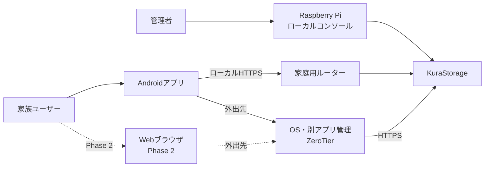
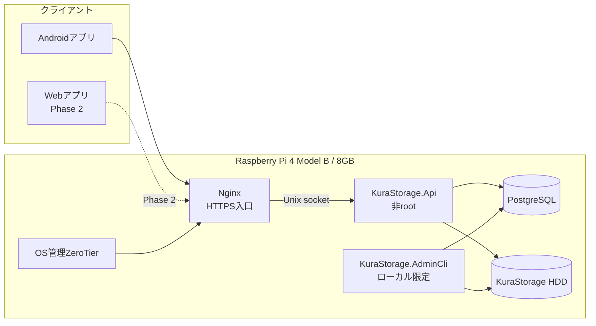
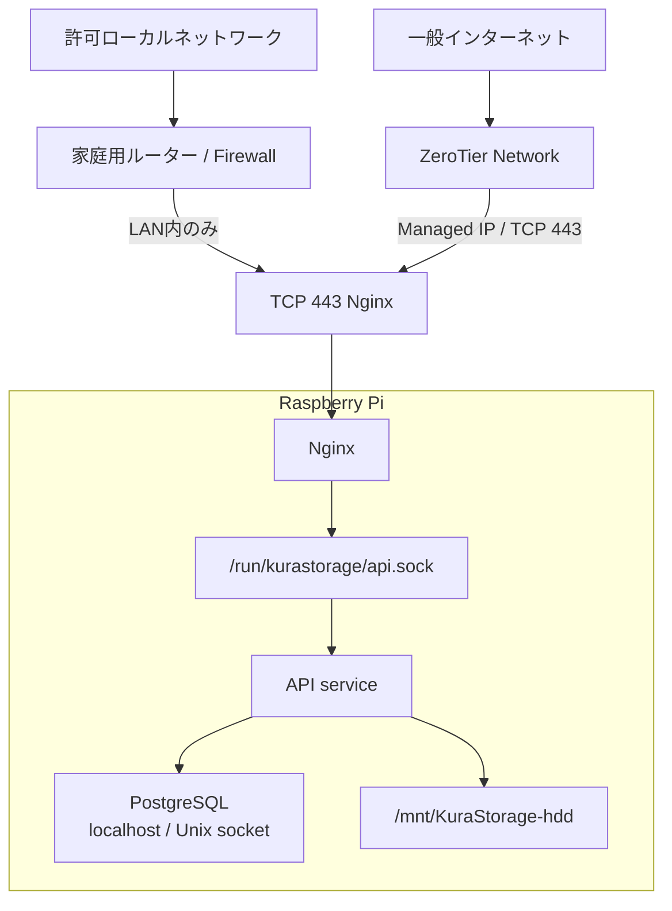
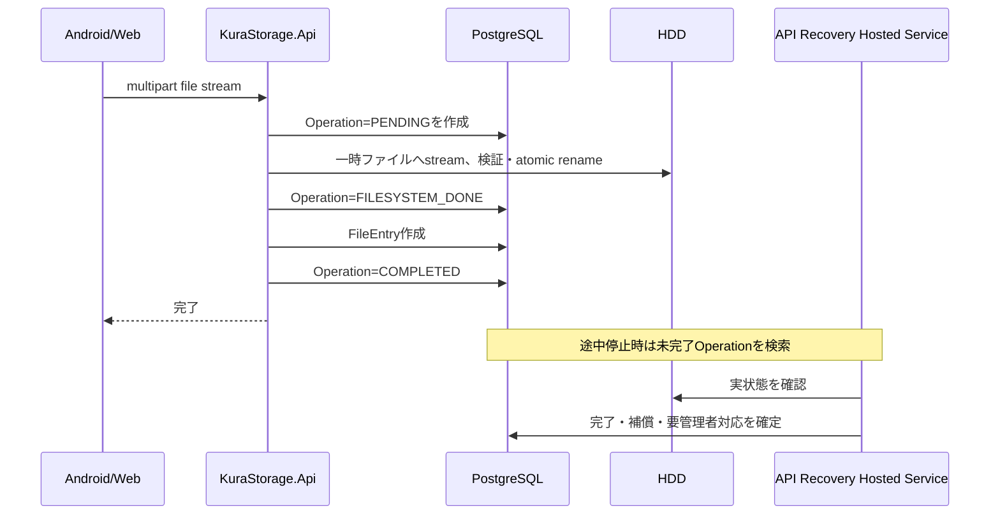
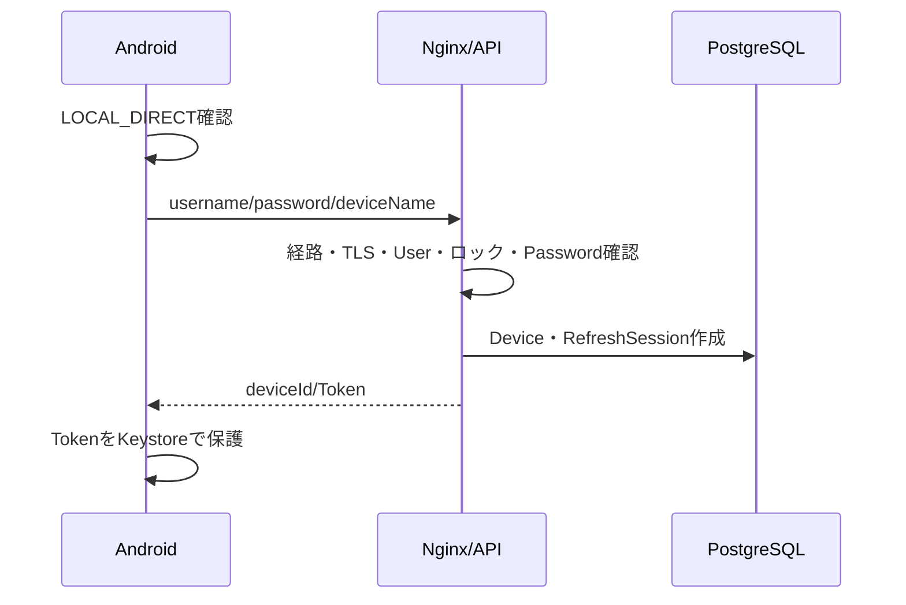
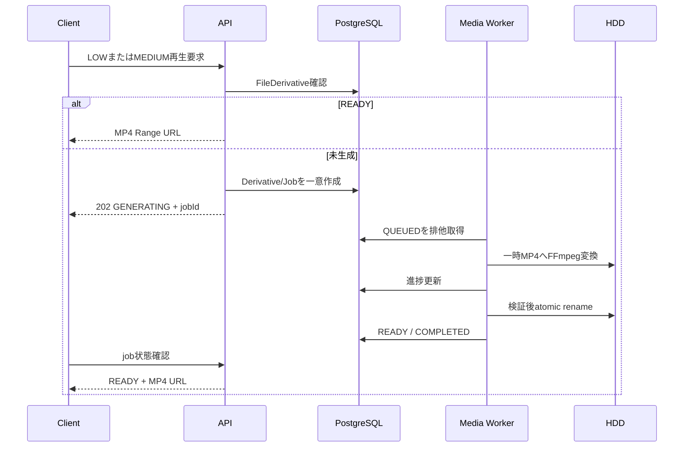
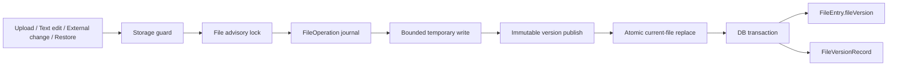
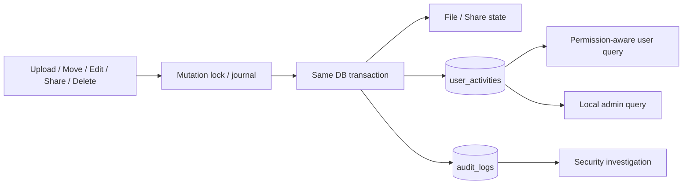

# アーキテクチャ設計書（Architecture Design Document）

## 文書情報

| 項目 | 内容 |
| --- | --- |
| プロダクト名 | KuraStorage |
| 文書種別 | Architecture Design Document |
| バージョン | 0.3.0 Draft |
| 作成日 | 2026-07-11 |
| 参照文書 | `docs/product-requirements.md` Version 1.0.0 Draft |
| 参照文書 | `docs/functional-design.md` Version 0.9.0 Draft |
| 対象フェーズ | Phase 1: Androidアプリ＋Raspberry Piバックエンド |
| 次期フェーズ | Phase 2: Webアプリ |

---

## Phase 1 ZeroTierアーキテクチャ

Phase 1では、OSまたは別アプリが管理するZeroTierをリモート通信路とする。ZeroTier daemonはKuraStorageのApplication Hostに含めず、Domain、DB、管理CLI、Androidアプリから操作しない。

- Nginx 443だけを`NET-LAN-CIDR`と`NET-ZEROTIER-CIDR`へ公開する。
- APIはUnix Socket、PostgreSQLと管理Serviceは非公開を維持する。
- 固定`NET-API-HOSTNAME`をLANでは`NET-LAN-API-IP`、ZeroTierでは`NET-ZEROTIER-API-IP`へアプリ内解決する。
- KuraStorage Device／Session失効とZeroTier Member失効を独立した防御境界として扱う。
- ZeroTier Network ID、Node Identity、認可情報、秘密鍵をSource、DB、APK、Log、Artifactへ保存しない。

将来の自己管理WireGuard、VPSを介したVPN、その他の安全なオーバーレイ方式は拡張候補とする。方式を変更する際は、`REMOTE_SECURE`、NginxのHTTPS入口、TLS、KuraStorage認証・認可の境界を維持し、接続方式固有の設計を別途行う。

---

## MVPアーキテクチャ境界

現在のPhase 1拡張を含む実行構成は、Androidアプリ、Nginx、`KuraStorage.Api`、`KuraStorage.Worker`、`KuraStorage.AdminCli`、PostgreSQL 17、共有exFAT HDD、OS・別アプリ管理ZeroTierとする。

- APIはNginxのUnix Socketからだけ受信し、非rootで動作する。
- 基本MVPでは独立Workerを配置しないが、現在のPhase 1拡張では完全削除、Media生成、Media Cache清掃を行う`KuraStorage.Worker`を配置する。API内の期限付きHosted Serviceは、未完了Uploadの清掃と`FileOperation`の起動時・定期復旧を引き続き担当する。
- AndroidはRoom、WorkManager、Media3、Coil、PDF LibraryをMVP依存へ追加しない。ファイルはSAFで手動選択・保存し、アプリ内Media表示は行わない。
- Phase 1のAndroid自動バックアップ拡張では、端末内の永続状態を`core-database`のRoom 2.8.4へ隔離し、実行予約にWorkManager 2.11.2を使用する。DB、WAL、Schema情報はAndroid Auto Backupと端末移行から除外し、TokenやSource本文を保存しない。
- DBのMVP TableはUser、Device、Refresh Session、Authentication Attempt、Audit Log、File Entry、File Operationに限定する。
- UploadはStreaming Multipartを同一Filesystem上の一時ファイルへ書き、検証後にatomic renameする。Downloadは元ファイルのHTTP Range配信だけとする。
- Trash、Restore、Rename、Moveは`FileOperation`でDB・HDD間の途中状態を管理し、同名競合では上書きしない。
- Rename・MoveはMVP完成後の現行Phase 1拡張として既存API・Hosted Service内へ追加する。自動Backup、共有、検索、Permanent Delete、Chunk Upload、Media変換、派生データ、外部変更監視はMVP後に別Steeringで追加する。

後続節に記載したこれらの将来設計は拡張時の参考であり、MVPのHost、Module、Migration、依存、配置Unitへ先行投入しない。

---

## 1. 目的と対象範囲

本書は、プロダクト要求定義書および機能設計書で定義されたKuraStorageを実現するために、システムの技術構造、コンポーネント境界、依存方向、実行プロセス、データ永続化、通信、セキュリティ、性能、信頼性、運用、テスト方針を定義する。

本書の対象は次のとおり。

- Androidネイティブアプリ
- Raspberry Pi上のKuraStorage API
- Raspberry Pi上のAPI内限定Hosted Serviceと、現在のPhase 1完全削除拡張で追加する保持期限清掃Worker
- Raspberry Pi上の管理CLI
- Nginx、PostgreSQL、OS管理ZeroTier、HDDを含む実行環境
- ローカル直接接続および外部管理ZeroTier経由のHTTPS通信
- ファイル転送、検索、プレビュー、変換、自動バックアップ、索引整合性
- ログ、メトリクス、障害復旧、バックアップ、デプロイ

Phase 2のWebアプリは実装対象外だが、同じApplication層とHTTP APIを利用できる構造をPhase 1から維持する。

### 1.1 アーキテクチャ目標

1. 家族利用規模で安定して動作し、30万件のファイル索引を扱えること。
2. Android、将来のWeb、管理CLIが、同じ業務ルールを再利用できること。
3. HDD上の実ファイルとPostgreSQLの管理情報を明確に分離すること。
4. ファイルシステムとDBをまたぐ処理が途中失敗しても復旧できること。
5. ZeroTier固有の管理機能をKuraStorageのドメインへ持ち込まないこと。
6. 動画変換などの高負荷処理がAPI応答を停止させないこと。
7. 外部クラウドや一般公開Webサービスを前提とせず、自宅サーバーとして運用できること。
8. Phase 2のWebアプリ追加時に、バックエンドのドメインロジックを作り直さないこと。

### 1.2 設計対象外

- 一般インターネットへ直接公開するWebサービス
- 複数サーバーへ水平分散するクラスタ構成
- オブジェクトストレージへのファイル保存
- 外部クラウドとの双方向同期
- HLSによる生成途中動画の配信
- iOSクライアント
- マルウェア検知基盤
- KuraStorage自身による第二媒体への完全自動バックアップ

### 1.3 参照文書内の整合性判断

参照文書内に表現差がある箇所は、上位の設計原則とMVP確定事項に基づき、次のとおり統一する。

| 項目 | 本書で採用する判断 |
| --- | --- |
| `LOCAL_DIRECT` | Android端末とKuraStorageエンドポイントが管理者設定の同一IPサブネットに属し、非ZeroTier経路へバインドしたHTTPS確認、TLS証明書・ホスト名検証、期待するAPI応答に成功した場合だけ成立する。異なるサブネットからZeroTierなしで到達できても`LOCAL_DIRECT`にはしない。 |
| 動画派生形式 | MVPでは動画派生データを生成しない。完成済みMP4方式はMVP後のMedia設計候補とする。 |
| Refresh Session件数 | Deviceはローテーション履歴として複数の`RefreshSession`行を持てる。ただし、失効・使用済み・置換済みでない有効SessionはDeviceごとに原則1件とする。 |
| サムネイル保持 | MVP対象外。Preview機能追加時に保持方針を再確認する。 |
| 完全削除後の索引 | MVP対象外。MVPは`ACTIVE`と`TRASHED`だけを扱う。 |

---

## 2. 主要アーキテクチャ決定

| ID | 決定 | 理由 |
| --- | --- | --- |
| ADR-001 | Phase 1はモジュラーモノリスとする | 家族向け単一サーバーであり、マイクロサービスの複雑性を増やさず、モジュール境界を維持できる。 |
| ADR-002 | バックエンドはASP.NET CoreとC#を使用する | 認証、HTTP Range、ストリーミング、バックグラウンド処理、CLI、Linux systemd連携を同一言語・ランタイムで実装できる。 |
| ADR-003 | MVP AndroidはKotlin、Jetpack Compose、SAF、Keystoreを使用する | 手動ファイル操作と秘密情報保護を最小依存で実現する。RoomとWorkManagerはMVP後とする。 |
| ADR-007 | Phase 1のリモートアクセスは外部管理ZeroTierとする | Public Portを開けず、KuraStorageへネットワーク資格情報の管理責務を追加せずにリモート到達性を確保できる。 |
| ADR-004 | HDD上の実ファイルをファイル存在・内容・階層の正とする | KuraStorage外からの変更を検知・再索引でき、DB障害だけで実ファイルを失わない。 |
| ADR-005 | PostgreSQLを管理情報、索引、操作ジャーナルの正とする | 認証、所有権、排他制御、状態遷移、再試行を一貫して扱える。 |
| ADR-006 | 永続Media Queue、直列生成、TTL／LRU清掃をPhase 1拡張の独立Workerへ分離する | 長時間変換と周期清掃をAPIの可用性・資源境界から分離し、停止後もPostgreSQL状態から再開できる。 |
| ADR-008 | APIは専用非rootユーザーで動作する | ファイル・DB・ネットワークへの権限を必要最小限にする。 |
| ADR-010 | Nginxを唯一のHTTPS入口とする | TLS終端、要求サイズ・タイムアウト制御、Range配信、アクセスログ、将来のWeb静的配信を一元化する。 |
| ADR-012 | ファイルシステムとDBをまたぐ更新には操作ジャーナルと補償処理を使用する | 両者を単一トランザクションにできないため、途中状態を記録してAPI起動時・期限付きHosted Serviceで復旧する。 |
| ADR-013 | Access Tokenは署名付き短寿命Token、Refresh Tokenはランダムな不透明Tokenとする | API要求の検証を軽量化しつつ、Refresh Tokenを端末単位でローテーション・失効・再利用検知できる。 |
| ADR-014 | Androidと将来のWebは物理パスを扱わず、IDベースAPIだけを使用する | パストラバーサルを防ぎ、HDDマウント先変更や内部ディレクトリ再編成をクライアントから隠蔽できる。 |
| ADR-015 | 動画派生データは全体生成、検証、atomic rename後に公開する | 生成途中または破損した動画を利用者へ公開しない。 |
| ADR-016 | `FileEntry`を完全削除後の論理削除行として残さない | ゴミ箱内では`TRASHED`として復元情報を保持するが、完全削除完了時は実体と関連管理情報を削除する。履歴が必要な場合はファイル索引から分離した監査ログを使用する。 |

---

## 3. システムコンテキスト

### 3.1 利用者と外部境界


```mermaid
flowchart LR
    User["家族ユーザー"]
    Admin["管理者"]
    Android["Androidアプリ"]
    Browser["Webブラウザ<br/>Phase 2"]
    ZeroTier["OS・別アプリ管理<br/>ZeroTier"]
    Console["Raspberry Pi<br/>ローカルコンソール"]
    Router["家庭用ルーター"]
    System["KuraStorage"]

    User --> Android
    User -. Phase 2 .-> Browser
    Admin --> Console
    Android -->|ローカルHTTPS| Router
    Android -->|外出先| ZeroTier
    Browser -. 外出先 .-> ZeroTier
    ZeroTier -->|HTTPS| System
    Router --> System
    Console --> System
```

### 3.2 コンテナ構成


```mermaid
flowchart LR
    subgraph Client["クライアント"]
        Android["Androidアプリ"]
        Web["Webアプリ<br/>Phase 2"]
    end

    subgraph Pi["Raspberry Pi 4 Model B / 8GB"]
        Nginx["Nginx<br/>HTTPS入口"]
        API["KuraStorage.Api<br/>非root"]
        CLI["KuraStorage.AdminCli<br/>ローカル限定"]
        ZeroTier["OS管理ZeroTier"]
        DB[("PostgreSQL")]
        HDD[("KuraStorage HDD")]
    end

    Android --> Nginx
    Web -. Phase 2 .-> Nginx
    Nginx -->|Unix socket| API
    API --> DB
    API --> HDD
    CLI --> DB
    CLI --> HDD
    ZeroTier --> Nginx
```

### 3.3 配置構成


```mermaid
flowchart TB
    Internet["一般インターネット"]
    ZTNetwork["ZeroTier Network"]
    LAN["許可ローカルネットワーク"]
    Router["家庭用ルーター / Firewall"]
    HTTPS["TCP 443 Nginx"]

    subgraph Pi["Raspberry Pi"]
        Nginx["Nginx"]
        ApiSocket["/run/kurastorage/api.sock"]
        API["API service"]
        PG["PostgreSQL<br/>localhost / Unix socket"]
        Mount["/mnt/KuraStorage-hdd"]
    end

    Internet --> ZTNetwork
    LAN --> Router
    Router -->|LAN内のみ| HTTPS
    ZTNetwork -->|Managed IP / TCP 443| HTTPS
    HTTPS --> Nginx
    Nginx --> ApiSocket
    ApiSocket --> API
    API --> PG
    API --> Mount
```

### 3.4 信頼境界

| 境界 | 信頼しない入力 | 検証 |
| --- | --- | --- |
| Android/Web → Nginx | HTTPヘッダー、Token、本文、ファイル名、Range、サイズ | TLS、要求上限、認証、構文・型・範囲検証 |
| Nginx → API | プロキシヘッダー、接続元情報 | 信頼するプロキシをNginxのUnixソケットに限定し、任意クライアントから転送ヘッダーを受けない |
| API → Application | userId、deviceId、fileId、共有権限 | 認証コンテキストをサーバー側で生成し、クライアント指定値を認可根拠にしない |
| Application → HDD | 相対パス、ファイル名、MIME、操作種別 | StorageGuard、実パス確認、シンボリックリンク拒否、専用ルート制約 |
| OS管理ZeroTier → Nginx | ZeroTier経路からのHTTP要求 | `NET-ZEROTIER-CIDR`からNginx 443へのみ許可し、TLSとKuraStorage認証・認可を必須とする |
| MVP後Worker → Media Processor | メディア入力 | 導入時に引数、時間、メモリ、画素数、出力上限を検証する |

---

## 4. アーキテクチャパターン

### 4.1 モジュラーモノリス

KuraStorageのバックエンドは、1つのリポジトリと共有ドメインモデルを持つモジュラーモノリスとする。MVPの実行HostはAPIとAdmin CLIで、業務ルールは同じApplication層を使用する。

```text
Presentation / Host
├─ KuraStorage.Api
├─ KuraStorage.AdminCli
          ↓
Application
├─ Identity
├─ Authorization
├─ Files
├─ Transfer
├─ Administration
└─ Audit
          ↓
Domain
├─ Entities
├─ Value Objects
├─ Policies
├─ State Machines
└─ Domain Errors
          ↓
Infrastructure
├─ PostgreSQL
├─ File System
├─ Token / Password Hashing
├─ FFmpeg / Image Processing
├─ systemd Integration
└─ Logging / Metrics
```

### 4.2 依存方向

```text
API / CLI → Application → Domain
Infrastructure ───────────→ Application / Domainの定義したinterfaceを実装
Domain ───────────────────→ 外部ライブラリへ依存しない
```

#### Presentation層

- HTTP、CLI、API Hosted Serviceの起動契機を受け付ける。
- 入力形式を検証し、Application CommandまたはQueryへ変換する。
- DBやHDDへ直接アクセスしない。
- 業務判断を実装しない。

#### Application層

- ユースケースを実行する。
- 認証後のUser、Device、Session、権限、ストレージ状態を組み合わせる。
- トランザクション境界と操作ジャーナル状態を制御する。
- Infrastructureのinterfaceへ依存する。

#### Domain層

- 共有権限、状態遷移、キャッシュ有効性、Token系列などの純粋なルールを実装する。
- ASP.NET Core、EF Core、Android等へ依存しない。

#### Infrastructure層

- PostgreSQL、HDD、暗号、FFmpeg/Poppler、systemd、時刻、UUID生成等を実装する。
- Domainの業務判断を重複実装しない。

### 4.3 コマンド・クエリ分離

完全なCQRS基盤は導入しないが、Application内では更新処理と参照処理を分ける。

- Command: 登録、ログイン、アップロード確定、移動、削除、共有更新、失効等
- Query: 一覧、詳細、検索、状態、変換進捗等

これにより、更新処理のトランザクションと、一覧・検索の読み取り最適化を分離する。

---

## 5. テクノロジースタック

具体的なパッチバージョンは実装開始時にロックファイルとビルド定義へ固定する。メジャーバージョン変更はアーキテクチャレビュー対象とする。

### 5.1 サーバー

| 技術 | 基準バージョン | 用途 | 選定理由 |
| --- | --- | --- | --- |
| ASP.NET Core | .NETと同一 | REST API、認証、Range配信、Health Check | ストリーミング、認証ミドルウェア、構造化ログ、バックグラウンド処理との統合が容易。 |
| Entity Framework Core | .NETと同一メジャー | DBアクセス、Migration | 型付きモデル、トランザクション、楽観ロック、Migrationを統一できる。 |
| Npgsql | EF Core対応版 | PostgreSQL接続 | PostgreSQL固有機能、配列、`jsonb`、トランザクションを扱える。 |
| PostgreSQL | 17系を基準 | 管理情報、検索索引、ジョブ、監査 | 30万件規模の検索、排他、再帰CTE、部分Index、`pg_trgm`を利用できる。 |
| Nginx | OS安定版 | TLS終端、リバースプロキシ | APIを外部へ直接公開せず、TLSと要求制御を一元化する。 |
| libvips | Debian 12系8.14 | 写真・Raster済みPDFの縮小、自動回転、WebP出力 | シェルを介さない独立Worker Processとして使用する。 |
| FFmpeg / FFprobe | Debian 12系5.1 | 動画Thumbnail Frame抽出、出力メタデータ確認 | 動画Low／Medium変換は後続フェーズで同じAdapterを拡張する。 |
| Poppler `pdftoppm` | Debian 12系22.12 | PDF先頭ページ描画 | 1ページだけを上限付きでRaster化する。 |
| Argon2idライブラリ | 実装時に保守状況を確認して固定 | パスワードハッシュ | Argon2id v1.3と自己記述形式を扱い、独自暗号実装を避ける。 |
| OpenTelemetry SDK | .NET対応安定版 | メトリクス、トレース | API時間、DB、ジョブ、変換を共通形式で計測できる。 |

### 5.2 Android

| 技術 | 基準 | 用途 | 選定理由 |
| --- | --- | --- | --- |
| Android | `minSdk 29` | 対応OS | Android 10以降に限定し、ZeroTier、ストレージ、バックグラウンド処理の分岐を抑える。 |
| Kotlin | 2.x系 | アプリ実装 | Android APIとCoroutineを型安全に扱える。 |
| Jetpack Compose | BOMで固定 | UI | 単一方向データフローと状態別画面を実装しやすい。 |
| Coroutines / Flow | Kotlin対応版 | 非同期処理、状態通知 | 接続、転送、変換進捗、Roomを一貫して扱える。 |
| Room | 2.8.4 | 端末内DB | 自動BackupのRule、差分索引、Queue、lease、Wi-Fi Policy、scan checkpointをAccount Scope別に保持する。 |
| WorkManager | 2.11.2 | 自動バックアップ | 一意Workの実装は自動BackupのWorkManager連携段階で行い、PR2ではModule依存と安定したWork名契約を導入する。 |
| Android Keystore | OS標準 | 秘密情報保護 | 取り出し不可鍵、StrongBox、AES-GCMを利用できる。 |
| OkHttp | 安定版固定 | HTTPS、Range、アップロード | ネットワークへの明示バインド、Interceptor、ストリーミングを実装しやすい。 |
| Retrofit 3 | 安定版固定 | 型付きAPIクライアント | API DTOとエラー変換を`core-network`へ集約し、OkHttpのNetwork bindingと組み合わせる。 |
| Media3 ExoPlayer | 1.11.0 | 完成済みMP4と元動画・元音声のRange再生 | Session-scoped認証DataSource、Seek、速度、品質変更時の位置維持を実装する。 |
| Coil | 3.5.0 | 写真・サムネイル表示 | Kotlin language version 2.2と現行Project Kotlin 2.3.21の互換性を維持し、独自認証Fetcherを使用する。 |
| Android PdfRenderer | OS標準（minSdk 29） | PDF表示 | App private一時Fileから1 Pageずつboundedに描画する。 |

### 5.3 開発・品質管理

| 技術 | 用途 | 選定理由 |
| --- | --- | --- |
| Git | ソース管理 | 変更履歴、レビュー、リリースタグを管理する。 |
| Gradle Version Catalog | Android依存管理 | ライブラリバージョンを一元管理する。 |
| NuGet lock file | .NET依存管理 | 復元結果を固定し、環境差を防ぐ。 |
| xUnit | .NETユニット・統合テスト | Application、Domain、APIのテストを統一する。 |
| Testcontainers for .NET | PostgreSQL統合テスト | 実DBの制約、Index、Transactionを検証する。 |
| JUnit / AndroidX Test / Compose UI Test | Androidテスト | Repository、Worker、画面状態、操作を検証する。 |
| k6 | API性能試験 | Range、一覧、検索、アップロードの測定を自動化する。 |
| ShellCheck | 配置・運用スクリプト検査 | systemd補助スクリプト等の誤りを検出する。 |

---

## 6. バックエンド構成

### 6.1 Solution構成

```text
server/src/
├─ KuraStorage.Domain/
├─ KuraStorage.Application/
├─ KuraStorage.Infrastructure/
├─ KuraStorage.Api/
├─ KuraStorage.AdminCli/

server/tests/
├─ KuraStorage.Domain.Tests/
├─ KuraStorage.Application.Tests/
├─ KuraStorage.Infrastructure.IntegrationTests/
├─ KuraStorage.Api.IntegrationTests/
└─ KuraStorage.E2ETests/
```

### 6.2 Applicationモジュール

| モジュール | 主な責務 |
| --- | --- |
| Identity | User認証、Argon2id、Device、Refresh Session、Token系列、認証失敗ロック |
| Authorization | MVPは所有User境界。共有権限はMVP後 |
| Files | 一覧、詳細、Folder作成、Trash、Restore、Rename、Move |
| Transfer | Streaming Multipart Upload、検証、Range Download |
| Audit | 監査イベント、認証試行、セキュリティ操作記録 |

Sharing、Media、Backup、IndexingはMVP後に必要になった時点で追加する。

モジュール間の直接DB更新は禁止し、Application serviceまたは明示したinterfaceを介する。

### 6.3 KuraStorage.Api

- NginxからUnixソケットで要求を受ける。
- `/api/v1`配下のREST APIを提供する。
- 認証不要エンドポイントを明示的に限定する。
- Bearer Token検証後、User、Device、Sessionの有効状態をDBで確認する。
- ファイル一覧・詳細はDBから返す。
- 元ファイルだけをRange対応でストリーム配信する。
- Upload清掃と`FileOperation`復旧だけを期限付きHosted Serviceで行う。
- API要求内で長時間のHDD全体走査を行わない。

#### HTTPパイプライン

```text
Nginx
  ↓
RequestId
  ↓
Forwarded Header検証
  ↓
Rate Limit
  ↓
Authentication
  ↓
User / Device / Session有効性確認
  ↓
Endpoint入力検証
  ↓
Application Command / Query
  ↓
共通Error変換
  ↓
構造化Access Log
```

### 6.4 KuraStorage.Worker

`TrashPurgeWorker`に加え、外部変更追従では`IndexEventWorker`と`FullRescanWorker`を配置する。1つのWorker実行ファイル内でも各処理は独立したHosted Service、DI Scope、例外境界、再試行周期を持ち、相互に不要な直列化を行わない。

- `MediaGenerationWorker`
- `ImageDerivativeWorker`
- `MediaCleanupWorker`
- `IndexEventWorker`
- `FullRescanWorker`
- `OperationRecoveryWorker`
- `TrashPurgeWorker`（現在のPhase 1拡張）
- `ExpiredUploadCleanupWorker`
- `AuditRetentionWorker`

動画変換はグローバル同時実行数1とする。その他の軽量ジョブは個別の同時実行上限を持つ。

### 6.5 KuraStorage.AdminCli

- Raspberry Piローカルコンソールからだけ実行する。
- rootまたは限定sudoユーザーだけが起動できる。
- Application層を呼び出し、直接SQLで状態を変更しない。
- パスワードは非表示の対話入力とし、コマンド引数へ渡さない。
- すべての高権限操作を監査ログへ記録する。
- DB Migrationは管理CLIの明示コマンドで実行し、API起動時の自動Migrationは行わない。

追加する運用コマンド例。

```bash
sudo KuraStorage-admin database migrate
sudo KuraStorage-admin storage verify
sudo KuraStorage-admin index rescan
sudo KuraStorage-admin operation recover
```

---

## 7. Androidアプリアーキテクチャ

### 7.1 全体構造

Androidは単一Activity、Jetpack Compose、単一方向データフローを基本とする。

```text
Compose UI
   ↓ Intent
ViewModel / State Holder
   ↓ Use Case
Domain / Repository Interface
   ↓
Data Sources
├─ Remote API
├─ SAF
├─ SecureCredentialStore
```

RoomとWorkManagerはMVP後のAndroid自動Backupで導入済みである。MediaStore／SAF差分取得は`core-data`、安定したSource identity mappingと永続Queue反映は`core-database`が担う。Network Policy、Account Scope単位の一意Work chain、Compareと分割Uploadの再開、状態集計は実装済みで、プロセス再生成時はApplicationからRoom・保存認証情報・接続判定を再構成する。


### 7.2 推奨モジュール構成

```text
apps/android/
├─ app/
├─ core-model/
├─ core-network/
├─ core-data/
├─ core-security/
├─ core-ui/
├─ feature-connection/
├─ feature-auth/
└─ feature-files/
```

`core-database`と`feature-backup`はAndroid自動Backupで、Media・Sharing・Settings Featureは各MVP後変更で追加済みである。`core-testing`は必要になる変更まで追加しない。

### 7.3 状態管理

各画面は次の状態を明示する。

- `Loading`
- `Content`
- `Empty`
- `Generating`
- `Disconnected`
- `AuthenticationRequired`
- `DeviceRevoked`
- `StorageUnavailable`
- `RecoverableError`
- `FatalError`

接続経路、認証、Device、HDDを単一の`connected: Boolean`へ潰さず、独立した状態として保持する。

### 7.4 ネットワーク経路の選択

Androidは同じHTTPSホスト名を使用し、接続経路に応じて解決先IPを切り替える。TLSのSNIとホスト名検証は常に同じホスト名で行う。

1. 基盤Wi-FiまたはEthernetのIPとプレフィックスを取得する。
2. 管理者設定のローカルKuraStorage IPが同一サブネットか確認する。
3. 同一サブネットの場合、対象`Network`へOkHttp通信を明示的にバインドしてHealth APIを確認する。
4. 成功時は`LOCAL_DIRECT`とする。
5. 失敗時、`NET-API-HOSTNAME`を`NET-ZEROTIER-API-IP`へ解決してHTTPS到達性を確認する。
6. 成功時は`REMOTE_SECURE`、両方失敗時は`DISCONNECTED`とする。

`LOCAL_DIRECT`のSocket作成では接続ごとに現在の非VPN Wi-FiまたはEthernet `Network`を再取得する。Wi-Fi切断・再接続でAndroidの`Network`ハンドルが変更された後も、結果不明の再取得を新しい基盤Networkへバインドする。

SSIDとBSSIDは外部Wi-Fiで自動バックアップを許可するポリシーにだけ使用し、接続先サーバーの本人確認には使用しない。

### 7.5 SecureCredentialStore

- StrongBox対応時はRefresh Token保護用のStrongBox-backed AES-256鍵を優先する。
- AES-GCMでRefresh Tokenを暗号化する。
- 暗号文、IV、必要な付随情報だけをアプリ専用領域へ保存する。
- Android自動バックアップと端末移行から除外する。
- Access Tokenは原則メモリだけで保持する。
- ログアウト、Device失効、登録失敗時に対象秘密情報を削除する。

### 7.6 MVP後: 自動バックアップ実行モデル

- MediaStore変更通知とgeneration差分を優先する。
- MediaStore version変更、generation rollback、通知取りこぼし回復の定期確認では全件走査し、完走した場合だけcheckpointと`LOCAL_MISSING`を原子的に更新する。
- SAFはアプリ起動時、許可ネットワーク到達時、定期Workerで走査する。
- ScannerはRule単位の進行中実行を共有し、metadataが一致する項目の本文を開かず、変更候補だけをStreaming SHA-256する。
- Roomへ保留キューを永続化する。
- WorkManagerの一意なWork名で重複起動を防ぐ。
- Worker開始後にネットワークポリシーを再評価する。
- モバイル通信、未登録Wi-Fi、ZeroTier未接続の外部Wi-Fiでは短時間で終了する。
- 端末側削除をサーバー削除へ変換しない。

---

## 8. データアーキテクチャ

### 8.1 データの正

| データ | 正とする場所 | 補足 |
| --- | --- | --- |
| ファイル本体、内容、物理階層 | HDD | DBだけを根拠に存在を断定しない。 |
| ファイル検索索引、共有、状態 | PostgreSQL | HDDとの差異を再スキャンで修復する。 |
| 低・中画質派生状態 | PostgreSQL＋HDD | DB状態と実ファイルの両方が揃った場合だけ`READY`とする。 |
| Androidバックアップ保留状態 | Room | サーバー完了後にBackupReceiptと対応付ける。 |

### 8.2 PostgreSQLスキーマ方針

- テーブル名、列名は`snake_case`とする。
- IDはサーバー生成UUIDとする。
- 日時は`timestamp with time zone`で保存し、UTCとして扱う。
- 列挙値はApplication enumとDB制約を対応させる。
- 主要テーブルに`created_at`、`updated_at`を持たせる。
- 状態更新には楽観ロック用Version列または条件付きUPDATEを使用する。
- 論理的に一意な関係にはDB一意制約を必ず設定する。
- Migrationはコードレビュー対象とし、前方移行を基本とする。
- `file_entries`はゴミ箱内の`TRASHED`までを管理対象とし、完全削除後の行を保持しない。
- 完全削除時は、関連テーブルを明示的なApplication処理または適切な外部キー制約で整理してから`FileEntry`を削除する。監査ログは削除対象の業務データから独立させる。
- `shares`は`target_entry_id`を一意とし、`file_entries(id)`の削除からCascadeする。`share_members`は`(share_id, user_id)`をPrimary Keyとし、Permissionを`VIEWER`、`CONTRIBUTOR`、`EDITOR`、`MANAGER`の4値に制限する。
- `shares.owner_user_id`は対象FileEntryの所有者を重複保持し、Applicationが作成時にFileEntryから導出して一致を保証する。Client指定のOwnerは使用しない。
- Upload Sessionは操作者の`actor_user_id`と対象Treeの`target_owner_user_id`を分離する。既存行は前方MigrationでActorをTarget OwnerへBackfillし、個人Uploadの意味を維持する。
- 個人整理情報は`favorite_entries(user_id, entry_id)`、`tags(id, user_id, name_key)`、`entry_tags(tag_id, entry_id)`へFileEntryと分離して保存する。User／FileEntry／Tag外部キーはCascadeとし、Rename・MoveではEntry ID関連を維持し、Purge・索引削除・User／Tag削除では孤立行を残さない。
- Tag表示名はApplicationでtrim・NFC・Unicode code point・control categoryを検証し、NFC後の`ToUpperInvariant` NameKeyとDB一意制約を併用する。

### 8.3 主要Index

| 対象 | Index方針 |
| --- | --- |
| `file_entries` | `(parent_id, status, name)`、`(owner_user_id, status)`、`relative_path`一意、`updated_at` |
| 名前検索 | `pg_trgm`を有効化し、正規化した`lower(name)`へGIN trigram Index |
| 短い名前検索 | `lower(name) text_pattern_ops`のB-tree Index。1〜2文字は前方一致に限定する |
| `shares` | `target_entry_id`一意、`(owner_user_id, updated_at, id)` |
| `share_members` | `(user_id, share_id)`、`(share_id, user_id)`一意 |
| `file_derivatives` | `(source_file_id, source_version, derivative_type, profile_version)`一意、`status`、`expires_at`、`last_accessed_at` |
| `media_jobs` | `(status, available_at, created_at, id)`、`derivative_id`、有効Jobの部分一意Index |
| `refresh_sessions` | `token_hash`一意、`family_id`、`device_id`、現在Session行の部分一意Index |
| `upload_sessions` | `(status, expires_at)`、`device_id` |
| `backup_receipts` | `(user_id, device_id, local_document_key)`一意、`remote_file_id`、比較用Index |
| `audit_logs` | `occurred_at`、`event_type`、`user_id`、`device_id` |
| `favorite_entries` | `(user_id, favorited_at DESC, entry_id)`、`entry_id` |
| `tags` | `(user_id, name_key)`一意、`(user_id, name_key, id)` |
| `entry_tags` | `(tag_id, entry_id)`複合Primary Key、`(entry_id, tag_id)` |

### 8.4 Refresh Sessionモデル

Tokenローテーション履歴を保持するため、1台のDeviceに複数の行を許可する。

```text
Device
  └─ RefreshSession A  USED / replaced by B
       └─ RefreshSession B  USED / replaced by C
            └─ RefreshSession C  ACTIVE
```

有効Sessionの条件。

```text
revoked_at IS NULL
AND used_at IS NULL
AND replaced_by_session_id IS NULL
AND expires_at > now()
```

Deviceごとに上記条件を満たす行は原則1件とする。DBの部分一意Indexは時刻条件を含めず、`revoked_at IS NULL AND used_at IS NULL AND replaced_by_session_id IS NULL`の現在Session行をDeviceごとに1件へ制限する。期限切れ行が残っている場合は、再ログインまたはRefresh処理のトランザクション内で先に失効させてから新しい行を作成する。Refresh処理は次を同一DBトランザクションで行う。

1. Tokenハッシュ行を排他取得する。
2. User、Device、Session、有効期限を確認する。
3. 旧Sessionを`used_at`付きで使用済みにする。
4. 新Sessionを作成する。
5. `replaced_by_session_id`を設定する。
6. 新Refresh Tokenを返す。

使用済みTokenが再提出された場合は同じ`family_id`の未失効Sessionをすべて失効する。

### 8.5 ファイル階層

- `FileEntry`でFILEとFOLDERを共通管理する。
- `parent_id`で隣接リストを構成する。
- 祖先共有権限は再帰CTEで解決する。
- 循環を防ぐため、フォルダ移動前に移動先が自分自身または子孫でないことを検証する。
- 最大階層深度は設定値で制限し、MVP初期値を64とする。
- `relative_path`は索引・復旧用に保持するが、クライアントへ公開しない。

### 8.6 MVP後: 派生データの識別

派生データの論理キーは次とする。

```text
sourceFileId
+ sourceVersion
+ derivativeType
+ profileVersion
```

- 名前変更と移動では`sourceVersion`を変更しない。
- 元ファイル内容が変化した場合だけ`sourceVersion`を増加させる。
- 変換設定が変わった場合は`profileVersion`を増加させる。
- ダウンロード名は常に現在の`FileEntry.name`から生成する。

### 8.7 MVP後: PostgreSQL永続ジョブキュー

Workerは次の形式でジョブを取得する。

```sql
SELECT id
FROM media_jobs
WHERE status = 'QUEUED'
  AND available_at <= @now
ORDER BY created_at, id
FOR UPDATE SKIP LOCKED
LIMIT 1;
```

取得したトランザクション内でWorker tokenを設定して`RUNNING`へ変更してから処理を開始する。Heartbeat、進捗、完了、失敗はJob ID、`RUNNING`、Worker tokenの一致を条件に更新する。Worker停止で`RUNNING`のまま残ったJobは、Heartbeatが2分以上途絶え、有効な生成Leaseがない場合だけ回収する。Retry可能なら30秒・2分のBackoffで`QUEUED`へ戻し、初回を含む3回の実行上限到達または恒久失敗は`FAILED`とする。Source Version変更、Purge等で処理が不要になった場合はJobを`CANCELLED`とし、Client切断では取消さない。

`LISTEN/NOTIFY`は待機時間短縮に使用できるが、通知自体を信頼できるキューとして扱わない。ジョブの正はテーブルとする。

初回基盤は通知を使用せず500ms Pollingを正とする。取得時は安定順の`FOR UPDATE SKIP LOCKED`とTransaction advisory lockを併用し、全Media Jobと動画Jobの初期同時実行数をそれぞれ1に制限する。更新結果が不明な場合もJob ID、状態、Worker tokenを条件とする更新を再照会できる形に保つ。stale回収はHeartbeatが120秒を超え、activeな`GENERATION` LeaseがないJobだけを対象とする。

---

## 9. HDDストレージアーキテクチャ

### 9.1 ファイルシステム

MVPでは他用途の既存データを含むUSB HDDを再Formatせず、ファイルシステムは`exFAT`を使用する。実Mount Pointを`/mnt/KuraStorage-hdd`、KuraStorage専用Storage Rootを`/mnt/KuraStorage-hdd/KuraStorage`として分離する。

exFATはPOSIXのFile・Directory単位所有権、Mode、Journalを提供しない。このため、API Userの固定UID、共有`kurastorage` GroupのGID、`fmask=0007,dmask=0007`をMount Optionへ設定し、個別の`chmod`／`chown`には依存しない。共有Group MemberはVolume全体へアクセスできるため、APIと明示的な運用Userだけを所属させる。電源断や強制切断後はFilesystem検査とKuraStorageのDB・HDD整合性確認が完了するまで書き込みを再開しない。

推奨マウントオプション。

```text
rw,nodev,nosuid,noexec,noatime,uid=<kurastorage-api-uid>,gid=<kurastorage-shared-gid>,fmask=0007,dmask=0007,iocharset=utf8,errors=remount-ro
```

Mountはデバイス名ではなくUUIDでsystemd Mount Unitへ定義する。APIはMount Point、Device UUID、Filesystem Type、必須Option、Storage Root、`.storage-identity`の確認が完了するまで起動しない。

### 9.2 物理構造

```text
/mnt/KuraStorage-hdd/KuraStorage/
├── .storage-identity
├── users/
│   └── <user-id>/
│       ├── files/
│       └── trash/
├── upload-temp/
│   └── <user-id>/
├── derivatives/
│   └── <owner-id>/<source-id>/<source-version>/<profile-version>/<type>.<ext>
└── derivative-temp/
    └── <job-id>/<attempt>.part
```

`.storage-identity`にはランダムな`storageId`とフォーマットバージョンを保存する。起動時に設定値と一致しない場合はストレージを`UNAVAILABLE`とする。
`derivatives`と`derivative-temp`はMedia基盤が管理する限定領域であり、Server生成のID、Version、Profile、種別からだけ相対Pathを組み立てる。一時出力をFlushして検証した後、同一Filesystem内の非上書きatomic renameで正式配置する。Storage Guard、Mount identity、read-only、容量確認に失敗した場合はOS RootへFallbackしない。共有、外部取り込み、過去Versionの追加物理領域は、MVP後の各機能を追加する変更で設計・作成する。

### 9.3 ストレージ利用可否

書き込み前に次を検証する。

1. 設定Mount Pointが実際のMount Pointで、設定UUIDのDeviceをSourceとする。
2. Filesystem Typeが`exfat`である。
3. `rw,nodev,nosuid,noexec,noatime`、API UID・共有Group GID、`fmask=0007`、`dmask=0007`、`iocharset=utf8`、`errors=remount-ro`を満たす。
4. Storage Rootが設定Mount Point配下の実Pathと一致する。
5. `.storage-identity`が存在し、期待する`storageId`と一致する。
6. 読み取り・書き込みテストに成功する。
7. ファイルシステムが読み取り専用でない。
8. 安全余裕を差し引いた空き容量が要求サイズ以上である。

HDDが利用不可の場合、Raspberry Pi本体側に同名ディレクトリを作って処理を継続してはならない。

### 9.4 安全なパス解決

- クライアントから物理パスを受け取らない。
- DBの`relative_path`を正規化する。
- 絶対パス、`..`、NUL、代替区切り文字を拒否する。
- 結合後に`realpath`相当でルート配下か再確認する。
- 経路中および対象のシンボリックリンクを拒否する。
- 書き込み時はTOCTOUを考慮し、可能な範囲でディレクトリハンドル基準の安全な操作を使用する。

### 9.5 atomic操作

- アップロードは`upload-temp`へ保存する。
- サイズ・チェックサム・形式検証後、同一ファイルシステム内でatomic renameする。
- 名前変更・移動も内容を複製せず、同一ファイルシステム内のrenameを使用する。
- MVPは同名項目を上書きしない。将来の置換APIは別途atomic replace設計を必要とする。
- DBを更新する前後の段階を`FileOperation`へ記録する。

---

## 10. 整合性とトランザクション

### 10.1 基本原則

PostgreSQLトランザクションとHDD操作を単一のACIDトランザクションにはできない。そのため、操作ジャーナルを使用した段階的確定と復旧を行う。

### 10.2 ファイル操作ジャーナル

```text
PENDING
  ↓
FILESYSTEM_DONE
  ↓
COMPLETED
```

失敗時は`RECOVERY_REQUIRED`へ遷移する。

### 10.3 アップロード確定


```mermaid
sequenceDiagram
    participant C as Android/Web
    participant API as KuraStorage.Api
    participant DB as PostgreSQL
    participant FS as HDD
    participant R as API Recovery Hosted Service

    C->>API: multipart file stream
    API->>DB: Operation=PENDINGを作成
    API->>FS: 一時ファイルへstream、検証・atomic rename
    API->>DB: Operation=FILESYSTEM_DONE
    API->>DB: FileEntry作成
    API->>DB: Operation=COMPLETED
    API-->>C: 完了

    Note over R,DB: 途中停止時は未完了Operationを検索
    R->>FS: 実状態を確認
    R->>DB: 完了・補償・要管理者対応を確定
```

正式配置前のファイルを通常一覧へ表示しない。

### 10.4 Device登録

1. `LOCAL_DIRECT`をサーバー側で確認する。
2. User、ロック、パスワード、Device上限を確認する。
3. DeviceとRefresh Sessionを同一DBトランザクションで作成する。
4. 成功時だけ`deviceId`、Access Token、Refresh Tokenを返す。
5. ZeroTier Network ID、Managed IP、Node Identity、Member情報は登録処理で読み書きしない。


### 10.5 冪等性

- 同じUser・`Idempotency-Key`・同じMetadataのUpload再送は既存結果を返す。異なるMetadataは`IDEMPOTENCY_CONFLICT`とする。
- Rename・Move・Trash・Restoreは対象、source親、target親のGUIDから安定した64-bit keyを導出し、ソート後のPostgreSQL advisory lockを同一DB Connectionで取得する。要求、取消、例外、Recoveryのどの終了経路でも解放する。
- Device失効は複数回実行しても同じ最終状態とする。
- TrashとRestoreの再試行は既存の`FileOperation`と実状態を確認して同じ最終状態へ収束させる。

### 10.6 Rename・Moveの隔離と復旧

- HDD操作前にsource・target・FileEntry IDを持つ`FileOperation(PENDING)`を永続化する。
- atomic rename後は`FILESYSTEM_DONE`を永続化し、FileEntry・配下Path・成功監査・`COMPLETED`を1 DB Transactionで確定する。
- Recoveryはsource、target、DB pathの組合せを再確認し、一意に判定できる場合だけHDD renameの再実行またはDB確定を行う。両方存在、両方不存在、DB不一致は`RECOVERY_REQUIRED`とする。
- 未完了Rename・Moveの対象と子孫は通常一覧から除外し、詳細、Download、追加変更では`RECOVERY_REQUIRED`を返す。

---

## 11. 主要処理フロー

### 11.1 初回Device登録


```mermaid
sequenceDiagram
    participant A as Android
    participant N as Nginx/API
    participant DB as PostgreSQL

    A->>A: LOCAL_DIRECT確認
    A->>N: username/password/deviceName
    N->>N: 経路・TLS・User・ロック・Password確認
    N->>DB: Device・RefreshSession作成
    N-->>A: deviceId/Token
    A->>A: TokenをKeystoreで保護
```

### 11.2 保護APIの認証・認可

1. NginxがHTTPSを終端する。
2. APIがAccess Tokenの署名、有効期限、Issuer、Audienceを検証する。
3. Tokenの`sub`、`device_id`、`session_family_id`を取得する。
4. DBでUser、Device、および`session_family_id`に対応するRefresh Session系列が失効していないか確認する。Tokenローテーションで旧行が使用済みになっても、同じ系列に現在Sessionが存在する限り既発行Access Tokenは有効期限まで利用できる。
5. ファイル操作では対象FileEntryの所有者・共有権限を解決する。
6. 必要権限を満たす場合だけHDDへアクセスする。

Access Tokenが署名上有効でも、User無効化、Device失効、Session失効の場合は拒否する。

### 11.3 MVP後: 写真派生データ

1. FileEntryと権限を確認する。
2. 対応する派生キーを検索する。
3. `READY`かつ実ファイルが存在すれば配信する。
4. なければ重複生成を排除して生成を開始する。
5. 短い待機閾値内に完了すれば配信する。
6. 閾値を超えた場合は`202 Accepted`と状態URLを返す。
7. 完成後に一時出力をatomic renameし、DBを`READY`へ変更する。

### 11.4 動画派生データ


```mermaid
sequenceDiagram
    participant C as Client
    participant API as API
    participant DB as PostgreSQL
    participant W as Media Worker
    participant FS as HDD

    C->>API: LOWまたはMEDIUM再生要求
    API->>DB: FileDerivative確認
    alt READY
        API-->>C: MP4 Range URL
    else 未生成
        API->>DB: Derivative/Jobを一意作成
        API-->>C: 202 GENERATING + jobId
        W->>DB: QUEUEDを排他取得
        W->>FS: 一時MP4へFFmpeg変換
        W->>DB: 進捗更新
        W->>FS: 検証後atomic rename
        W->>DB: READY / COMPLETED
        C->>API: job状態確認
        API-->>C: READY + MP4 URL
    end
```

再生URLは完成済みMP4を返す。`.m3u8`は使用しない。Workerは起動時と1分周期に、Heartbeatが2分以上途絶え、有効な生成Leaseがない`RUNNING`だけを回収する。対象Job IDとattemptから導いた一時出力だけを削除し、atomic rename後にDB確定結果が不明になった場合は、同じSource Version・Profile・種別の正式出力を次回取得時に再利用して`READY`へ収束させる。

### 11.4.1 Android Media閲覧・再生

Androidは`feature-media`、`feature-settings`と既存Core Moduleを使用する。写真・動画のLOW／MEDIUM／ORIGINAL、音声とPDFのORIGINALを同じ認証Sessionと接続経路別`OkHttpClient`から取得する。音声にLOW／MEDIUM派生や変換Jobを作らない。

- Coilは`scopeId:fileId:fileVersion:variant`をCache keyにした独自認証Fetcherを使用する。Memory cacheはHeapの10%かつ最大64MiB、Disk cacheはSessionごとに最大256MiBとする。
- Media3は認証Header付き単一Range DataSourceを使用する。401時は既存の単一Flight Token refresh後に現在位置から1回だけ再構築し、再発時は再生を停止する。
- Playerは動画・音声とも3秒／10秒の戻る・進む、0.5〜3.0倍速を提供する。Mobileでは5〜15秒Buffer、Wi-Fiでは15〜50秒Bufferを初期値とし、Playlistは1件だけにする。
- 動画品質変更時は旧Sourceを新Sourceの準備完了まで保持し、現在位置、速度、再生状態を可能な範囲で復元する。低・中品質が未準備でも元画質へ自動Fallbackしない。
- 写真・動画の元画質、元音声、PDF本文はHEADでSizeを確認し、利用者の承認前にContentを開始しない。
- PDFはApp private一時領域へStreamingする。1 File 256MiB、Session合計512MiB、必要空き容量`Content-Length + 64MiB`、未参照TTL 1時間とする。超過時は既存SAF Downloadへ案内する。
- 写真とPDFの表示Bitmapは1枚32MiB、長辺4096pxを上限とする。PDFは1 Pageずつ開き、Page、Bitmap、FileDescriptorをLifecycle終了時に閉じる。
- Logout、Device／Session失効、接続Route変更でPlayer、Polling、Coil Session cache、PDF一時File、認証済みURLを破棄する。
- 許可Wi-Fi機能が未導入の間、REMOTE_SECUREなWi-Fiは未登録Wi-FiとしてLOWを初期値にする。将来は`RegisteredWifiSource`の実装だけを差し替える。

Android 13実機のREMOTE_SECURE Original動画再生で、Player PSS 117,912 KiB、RSS 259,820 KiB、Frame median 13 ms、p95 53 msを観測した。通信切断は自動再試行ループに入らず、再接続後のOriginal取得で再度確認を必要とした。現行のBuffer、Cache、Bitmap、PDF一時容量の初期値は維持する。詳細は`docs/testing/20260830-android-media-integration-pr4.md`を参照する。

### 11.4.2 Androidテキスト編集・version履歴

Androidは`core-model`の対応MIME・Text／version Model、`core-network`のOpenAPI一致DTO／Retrofit境界、`core-data`のSession-scoped Repository、`feature-text`のEditor／History ViewModelとCompose画面を使用する。`feature-files`は`feature-text`へ依存せず、対応FileをApp callbackへ返し、`app`がNavigationとSession dependencyを組み立てる。

- Text／version requestは既存`AuthenticatedRequestExecutor`を通し、401後は呼出元が作成した同じ`operationId`とPayloadを1回だけ再送する。
- EditorとHistoryはrequest generationとCoroutine cancellationを併用し、旧Session、旧File、旧refresh、旧previewの結果を破棄する。Session再生成時はViewModel keyも変更する。
- 保存前と復元前にFile詳細を再取得して権限を再評価する。未知Permission、未知source、未知mutation種別はfail-closedとし、履歴の未知change kindは操作を推測せず`Unknown change`と表示する。
- Text本文は永続Disk cacheへ保存しない。Editorの`SavedStateHandle`はUTF-8で64 KiBまで、API本文は1 MiBまでとし、行比較は400行、1行512文字までに制限する。
- 競合解決は最新再読込、表示用行比較、SAFで作成した別名Fileの既存Upload Session経由Uploadだけを提供する。force overwriteとClient側自動mergeは提供しない。

### 11.5 MVP後: 自動バックアップ

1. AndroidがMediaStore/SAF差分をRoomへ記録する。
2. NetworkPolicyEvaluatorが実行可否を判定する。
3. `POST /api/v1/backup/compare`でサーバー側Receiptと比較する。
4. 必要な項目だけ、認証済みUser/Deviceと端末文書情報を関連付けた通常のUpload Sessionを作成する。
5. チャンク送信し、中断時は受信済み範囲から再開する。
6. 新規内容は新しいFileEntryへ公開し、変更内容は検証済み一時ファイルを既存FileEntryへatomic replaceする。
7. FileEntry、Upload Session、操作ジャーナル、BackupReceiptを同じDBトランザクションで確定する。
8. Androidが保留キューを完了へ変更する。

新規公開・atomic replace・その復旧のいずれも、物理File公開後に`IManagedFileSystemSnapshotReader.InspectAsync`で実Size、MIME、mtime、source file keyを読み取り、FileEntryと同じ完了transactionへ反映する。mtimeはPostgreSQLのマイクロ秒精度へ正規化し、直後の索引走査がKuraStorage自身の書込みを外部変更として再発行しないようにする。公開後の観測に失敗した場合は完了扱いにせず復旧必要状態に留める。

端末側で消えた項目は、サーバーへ削除要求を送らない。
保留中Backup Uploadは`userId`、認証済み`deviceId`、`localDocumentKey`ごとに1件へ制限し、
完了Receiptも同じ組で一意にする。

### 11.6 MVP後: `MISSING`判定

- HDDが`AVAILABLE`の場合だけ個別ファイル不存在を評価する。
- 全件Snapshotは`index_scan_items`へBatch保存し、列挙完走とStorage再確認後にだけDB索引へ適用する。DRY_RUNは専用Connectionの一時Tableを使い、`IndexScanRun`を含む永続変更を残さない。
- 初回不存在でObservation ID、検出日時、最終確認日時を記録し、`MISSING_CANDIDATE`へ変更する。
- 異なるObservationかつ5分以上後の再確認でも存在しなければ`MISSING`へ変更する。
- HDD全体が未マウント・読取不可の場合はFileEntry状態を変更しない。
- `FileEntry`の管理対象Pathと同名は`ACTIVE`、`MISSING_CANDIDATE`、`MISSING`を通じて一意にし、同じPathの再発見は新規行ではなく既存IDの復帰として扱う。
- 補助同一性KeyはLinuxのdevice・inodeから生成するが、Owner、種類、Size、mtimeとの一意な組合せでだけ外部Moveへ使用する。
- FileEntry更新はPostgreSQL `xmin`の楽観的並行制御を使用し、競合時は古いSnapshotを破棄して次回照合へ戻す。
- Scan Runは開始・終了状態と件数を永続化し、Stagingは成功時または保持期限超過後に清掃する。同時全件Scanは固定advisory lockで拒否する。
- `MISSING`項目の管理情報削除はユーザーまたは管理者の明示操作で行う。
- File一覧・詳細はDB索引のみを読み、Content Openは`IManagedFileSystemSnapshotReader.InspectAsync`とStorage GuardをOpen直前に実行する。`ACTIVE`実体がない場合は同じ対象Lock内で候補化し、要求内で直接`MISSING`へ確定しない。
- 明示再確認は`MissingEntryService`へ集約し、対象・親のMutation Lock、Storage再確認、`xmin`による楽観的競合検出を通して、再発見を同じFile IDへ適用する。
- 一覧から削除は`IFileIndexDeletionParticipant`だけへ関連DB情報の整理を委譲する。この境界は物理完全削除用`IPermanentDeleteParticipant`と分離し、`IFileStore`やFilesystem participantを参照しない。
- Folder索引削除は対象と全子孫が確定`MISSING`で未完了操作がない場合だけ、子孫の深い順に同一Transactionで削除する。部分再発見・同時更新は`FILE_STATE_CONFLICT`または`INDEX_CONFLICT`で中止する。
- Linux watcherはlibcのinotifyだけを限定P/Invokeし、watch descriptorと検証済み相対DirectoryだけをProcess Memoryに保持する。file descriptorはSafeHandleで所有し、Worker停止時にcloseしてread loopを終了する。
- native Eventはbounded channelへ渡し、同じPathを500ms debounceする。Move cookieは1秒のwindowで対応付け、queue overflow、watch limit、片側Move、監視停止は全件Scanまたは個別Path再照合へ変換する。
- Worker起動時、6時間周期、overflow・監視再作成時にPR1と同じ`IndexScanService`を呼ぶ。PostgreSQL advisory lockにより管理CLIや別Workerとの重複実行を拒否する。
- Watcher稼働、最終Event、queue長、overflow、最終成功Scan、候補・欠損件数は個人識別子をLabelに含めないMetricで観測する。

---

## 12. APIアーキテクチャ

### 12.1 基本契約

- Base path: `/api/v1`
- Content-Type: `application/json`、ファイル本文は適切なMIME
- 認証: `Authorization: Bearer <access-token>`
- Request ID: APIが生成し、レスポンスとログへ記録する
- 日時: ISO 8601、タイムゾーン付き
- ID: UUID文字列
- ページサイズ: 初期100、最大500

### 12.2 共通エラー

```json
{
  "code": "STORAGE_UNAVAILABLE",
  "message": "ストレージを利用できません。",
  "requestId": "uuid",
  "details": {}
}
```

- `code`はクライアント分岐に使用する安定した値とする。
- `message`は利用者向けで、内部例外・物理パス・SQLを含めない。
- `details`は上限値、再試行秒数、競合Version等の安全な情報だけを含める。

### 12.3 匿名API

匿名許可は次に限定する。

- `GET /api/v1/system/health`
- `POST /api/v1/auth/register-device`
- `POST /api/v1/auth/login`
- `POST /api/v1/auth/refresh`

`register-device`と`login`は匿名HTTPであっても、TLS、経路判定、Rate Limit、Userロック、監査の対象とする。

### 12.4 ファイル配信

- 全体をメモリへ読み込まず、ストリームで返す。
- MVPの元ファイルはHTTP Rangeに対応する。
- `Accept-Ranges: bytes`を返す。
- `Content-Disposition`は現在のFileEntry名から生成する。
- 非ASCII名は`filename*`を使用する。
- 派生データ配信はMVP後とする。

### 12.5 API互換性

- 破壊的変更は`/api/v2`で行う。
- v1内では任意項目追加を許可する。
- enum追加時に古いクライアントが安全に未知値を扱える設計にする。
- Androidは`protocolVersion`をHealth APIで確認し、非互換時は更新要求を表示する。
- 現行AndroidとServerのFile契約は`protocolVersion: 2`とし、Protocol不一致では認証後のFile APIへ進まない。enum未知値は`UNKNOWN`へ閉じ、Download・Rename・Move・Trash・索引削除を表示しない。

---

## 13. セキュリティアーキテクチャ

### 13.1 ネットワーク

- ZeroTier MemberからPi上で許可する宛先はKuraStorage HTTPS/443だけとする。
- SSH、PostgreSQL、SMB、他LAN端末への接続・転送をPiのnftablesで拒否する。
- KuraStorage用ZeroTier Networkは外部管理者がPrivate Networkとして信頼済みMemberだけを認可・失効する。Controller Flow RulesはKuraStorageの必須構成とせず、Piを経由しないMember間通信はKuraStorageの制御対象外とする。
- 運用SSHは公開鍵認証と管理LAN CIDRからの接続に限定し、ZeroTier Interfaceからは拒否する。
- PostgreSQLはlocalhostまたはUnixソケットだけで待ち受ける。
- APIはUnixソケットでNginxからのみ接続可能にする。

### 13.2 TLSとサーバー本人確認

Phase 1は公開ドメインと公開CAを使用せず、Git管理外の`docs/environment-info.md`にある`NET-API-HOSTNAME`とKuraStorage専用プライベートCAを使用する。NginxをTLS終端とし、LAN接続時とZeroTier接続時のURLを同じHostnameへ統一する。公開項目定義は`docs/environment-info.example.md`を参照する。

- Phase 1のCA階層はRoot CAからサーバー証明書を直接発行する。Root CAは`basicConstraints = critical, CA:TRUE, pathlen:0`および`keyUsage = critical, keyCertSign, cRLSign`を持つ。
- サーバー証明書は`subjectAltName = DNS:<NET-API-HOSTNAME>`、`basicConstraints = critical, CA:FALSE`、`extendedKeyUsage = serverAuth`、RSAに適したcritical Key Usageを持ち、SHA-256以上で署名する。
- Root CA秘密鍵はRSA 4096-bit、パスフレーズ付きとし、オフライン管理端末で保持する。証明書発行後はKuraStorageサーバーへ常設せず、Repository、Androidアプリ、配布物へ含めない。
- サーバー秘密鍵はRSA 3072-bitとし、Nginx専用の制限された配置先で管理する。Root CA公開証明書はAndroidアプリのTrust Anchorとして使用する。
- AndroidのNetwork Security Configurationは`TLS-ROOT-CA-CERT-PATH`から同梱したRoot CA公開証明書を`NET-API-HOSTNAME`の値だけで信頼する。Production Buildでは証明書検証またはホスト名検証を無効化できない。
- 発行と更新はPhase 1ではOpenSSLスクリプトによる手動運用とする。Root CAを10年、サーバー証明書を397日で発行し、サーバー証明書は失効30日前までに新しい秘密鍵とともに更新する。
- 生成後はChain、SAN、Root/Leaf CA制約、Key Usage、Extended Key Usage、秘密鍵と証明書の公開鍵一致、期限、署名Algorithm、鍵長を自動検証する。
- 常時稼働CAは導入しない。将来step-ca等へ移行するときも、CA署名環境、NginxのLeaf証明書配置、AndroidのTrust Anchorという責務境界を維持する。

### 13.3 Access Token

- 署名方式は非対称鍵を使用し、MVP基準をECDSA P-256、JOSE Algorithmを`ES256`とする。APIの検証側も`ES256`だけを許可する。
- 有効期限は15分。
- Claimsは必要最小限とする。

```text
sub         User ID
jti         Token ID
device_id   Device ID
session_family_id  Refresh Token family ID
role        ADMIN / MEMBER
iss / aud / iat / exp
```

署名秘密鍵はコード、DB、ログへ保存せず、Repository外のPKCS#8またはSEC1 PEMとして
`/etc/kurastorage/secrets/jwt-signing-key.pem`へ配置する。Production起動時は
`KuraStorage:Identity:JwtSigningKeyPath`を必須とし、秘密鍵を含むP-256鍵でない場合は起動を拒否する。
DevelopmentとTestingでPathを省略した場合だけ、Process内に一時的なP-256鍵を生成する。Pi上では
`root:kurastorage-secrets`所有、Directory mode `0750`、File mode `0640`とする。
`kurastorage-secrets`には非rootのKuraStorage実行ユーザーだけを参加させ、Nginxの`www-data`は参加させない。
鍵ローテーション時は`kid`で複数公開鍵を一時併用する。

### 13.4 Refresh Token

- 256-bit以上の暗号学的乱数を使用する。
- DBにはToken本文ではなく、鍵付きハッシュまたは安全な一方向ハッシュだけを保存する。
- 発行・ローテーションから24時間で期限切れとする。
- 使用ごとに必ずローテーションする。
- 再利用検知時はToken familyを失効する。
- AndroidではKeystoreで保護する。
- Phase 2 Webでは`HttpOnly`、`Secure`、`SameSite` Cookieを使用し、localStorageへ保存しない。

### 13.5 パスワード

- Argon2id v1.3（`v=19`）
- Salt: 16バイトの暗号学的乱数
- Memory: 19MiB以上
- Iterations: 2以上
- Parallelism: 1以上
- 自己記述形式だけをDBへ保存する
- 認証成功時に弱い旧設定を現在設定へ再ハッシュする
- パスワード本文をログ、監査、例外、コマンド引数へ残さない

### 13.6 UserロックとRate Limit

- User単位で15分以内に10回連続失敗するとセキュリティロックする。
- 正常ログイン時に失敗回数と計測期間をリセットする。
- ロック解除は管理CLIだけで行う。
- Userロックとは別に、Nginx/APIで接続元IP単位の短時間Rate Limitを行う。
- Userの存在有無が推測できる応答差を作らない。

### 13.7 認可

- すべての保護APIで認証コンテキストを作成する。
- ファイルごとに所有者、直接共有、祖先フォルダ共有を解決する。
- 複数経路がある場合は最も強い権限を採用する。
- 検索ではSQL段階で権限条件を適用し、取得後にクライアントで隠さない。
- `CONTRIBUTOR`はフォルダ共有だけに許可する。
- `ADMIN` RoleもファイルAPIでは暗黙の横断権限を持たず、所有者または明示的な共有権限として評価する。
- クライアント指定の`userId`、`ownerUserId`、`deviceId`を信用しない。
- 認可候補はActor User IDと対象Entry ID群からBatch取得し、直接Shareと祖先Folder Shareを最大深度64の有界な再帰Queryまたは同等のQueryで解決する。File一覧の各行で個別Queryを実行しない。
- 複数経路の最強権限が同値な場合、説明用の権限元は直接Share、最も近い祖先Folder Shareの順に優先する。
- 認可結果は要求を超えてCacheせず、Share解除やPermission変更の次要求で再評価する。
- File mutationは対象と必要な親FolderのMutation Lockを安定順で取得し、Reload後かつHDD変更前に権限を再評価する。

#### Search／Recent Query

- SearchはPostgreSQL固有の読み取りQueryとしてInfrastructureへ配置し、所有、直接共有、祖先Folder共有を最大深度64で解決してからFilter、順位、count、offset、limitまでSQL内で処理する。
- 1〜2文字の名前検索は`lower(name) LIKE query || '%'`とB-tree `text_pattern_ops`、3文字以上は`lower(name) LIKE '%' || query || '%'`とGIN `gin_trgm_ops`を使用する。LIKE wildcardはApplicationでliteral escapeし、すべてparameterized SQLで渡す。
- qありは完全一致、前方一致、trigram similarity、`updated_at DESC`、`id ASC`、Filterのみは`updated_at DESC`、`id ASC`で決定的に並べる。
- Search／Recentは必要列だけをprojectionし、HDD走査、`SELECT *`、Page内N+1、無制限再帰、認可後のClient非表示を使用しない。
- `recent_files`は`(user_id, file_id)`複合Primary Key、User／FileEntryへのCascade、`(user_id, opened_at DESC, file_id)`Indexを持つ。記録はServer時刻の単一Statement upsert、一覧は現在権限を毎要求で再評価する。
- お気に入り登録とTag付与はEntry／祖先とUser organization keyを同じ64-bit key空間で昇順lockし、lock後に階層、`ACTIVE`、未完了操作、現在権限、Tag ownership、件数上限を再評価する。解除はActor行だけの条件付きDELETEとし、権限失効や`MISSING`後もcleanupできる。
- Favorites一覧はActor関連を起点に最大深度64の所有・直接・継承共有をSQL内でrankし、状態、count、offset、limitまでDBで確定する。Tag検索は指定時だけRepeatable Read snapshotを使い、本人Tag確認とTag一致集合を同じsnapshotで適用する。1 Tagは`entry_tags(tag_id, entry_id)`から直接取得し、2〜10 Tagは`GROUP BY/HAVING count(DISTINCT tag_id)`でAND条件を解決する。Tag一致集合とTag指定後のeligible集合は1要求内でMaterializeしてOwner／Shared認可分岐から共有し、TagなしSearchは従来どおり`NOT MATERIALIZED`でFilterをbase tableへ押し込む。Tag検索だけ`SET LOCAL work_mem = '16MB'`を同じTransactionへ適用し、DB全体またはTagなしSearchの設定は変更しない。
- お気に入り、Tag一覧、Entry organization、Tag検索はPage内N+1、HDD走査、Client後Filter、長期Permission cacheを使用しない。Tag名、検索語、File名、User名、物理PathをAccess Log、Metric label、例外へ含めない。
- `pg_trgm`と名前Indexは明示Migrationで適用する。大TableへのIndex作成前にBackup、空き容量、Lock時間を確認し、Downでは本機能のIndexだけを削除して共有Extensionを無条件削除しない。
- Search query、File名、User名、共有元名、物理PathをAccess Log、Metric label、例外へ含めない。Nginxは`$uri`を使用し、`$request`、`$request_uri`、`$args`を記録しない。
- 30万FileEntry、家族User 10名、代表20検索でwarm-up後のp50／p95、最大値、Error率、CPU、Memory、Index size、`EXPLAIN (ANALYZE, BUFFERS)`を記録し、通常2秒以内を確認する。

### 13.8 ファイルとメディア

- ファイル名とMIMEを検証する。
- 拡張子だけを実ファイル形式の根拠にしない。
- アップロード先は実行不可マウントとする。
- FFmpegや画像処理へシェル文字列を渡さず、引数配列で起動する。
- 入力ピクセル数、処理時間、出力サイズに上限を設定する。
- 破損メディアの失敗で元ファイルを変更しない。

### 13.9 OS権限

| OS主体 | 主な権限 |
| --- | --- |
| `kurastorage-api` | API Unixソケット、必要なHDD領域、API用DBロール、固定systemd unit起動 |
| `kurastorage-admin` | 管理CLI実行、管理用DBロール、必要なHDD管理操作 |
| `postgres` | PostgreSQLデータディレクトリ |
| `nginx` | TLS秘密鍵読取、API Unixソケット接続 |


---

## 14. 性能設計

### 14.1 基準測定環境

| 項目 | 基準 |
| --- | --- |
| サーバー | Raspberry Pi 4 Model B、8GB RAM、64-bit OS |
| ファイルストレージ | USB 3接続HDD、exFAT、`/mnt/KuraStorage-hdd/KuraStorage` |
| DB | Raspberry Piのシステムストレージ。耐久性のためSSDを推奨 |
| ネットワーク | Raspberry Piは有線1Gbps、Androidは5GHz Wi-Fi |
| データ量 | FileEntry 30万件、家族ユーザー10名、Device 20台 |
| フォルダ | 1フォルダ1,000件以下を通常ケースとする |

### 14.2 応答目標

| 操作 | 目標 | 測定方法 |
| --- | --- | --- |
| Health API | p95 300ms以内 | 連続100回、TLSを含む |
| ホーム主要情報 | 通常2秒以内 | Android起動後、必要API完了まで |
| 1,000件以下のフォルダ一覧 | 通常2秒以内 | DB30万件、pageSize 100から段階表示 |
| 名前検索 | 通常2秒以内 | 30万件、権限条件込み、代表クエリ20種 |
| キャッシュ済み写真 | 通常2秒以内に表示開始 | 5GHz Wi-Fi、サムネイル/派生取得 |
| 未生成写真 | 通常1秒以内に生成中状態 | APIが202または生成結果を返すまで |
| キャッシュ済み動画・音声 | 通常3秒以内に再生開始 | 初回Range取得から再生開始まで |
| 未生成動画 | 通常1秒以内にジョブ状態 | ジョブ登録と202応答まで |
| Token Refresh | p95 500ms以内 | DB状態確認とローテーション込み |

動画変換完了時間は固定SLAとしない。

### 14.3 DB最適化

- 一覧・検索でHDD全体を走査しない。
- 必要な列だけをProjectionする。
- `AsNoTracking`相当を読み取りQueryで使用する。
- N+1 Queryを禁止し、SQLと実行計画を統合テストで確認する。
- 30万件データで`EXPLAIN ANALYZE`を保存し、主要QueryのIndex利用を確認する。
- DB Connection Poolは初期値20以下とし、Pi実機測定で調整する。

### 14.4 ストリーミング

- ファイル全体をメモリへ読み込まない。
- Range要求を直接FileStreamへ接続する。
- Stream Bufferは64KiBから1MiBの範囲で実機測定して決定する。これはProtocol上のChunkではない。
- Upload中断時は同じIdempotency Keyで先頭から全体再試行する。
- 同時Upload数は初期値2とし、設定で制御する。

### 14.5 CPU・メモリ保護

- MVPはAPI、PostgreSQL、Nginx、Androidの実測値を記録し、Upload同時数とRequest Buffering無効化を確認する。
- 動画・画像変換は独立Workerで直列実行し、下記のsystemd上限を適用する。
- FFmpegの進捗出力間隔は1秒とする
- FFmpeg Workerは低いCPU/IO優先度で動作させる
- Workerはsystemdの`MemoryMax=3G`、`CPUWeight=50`、`IOWeight=50`でAPIより低い
  相対優先度と十分なMemory余裕を確保する
- 画像の最大デコードピクセル数とテキスト編集サイズ上限を設定する

Raspberry Pi 4実機で完全20秒の単一Thread 1080p→720p H.264変換を測定した結果、
FFmpegのpeak working setは126.04MiB、CPU時間は37.41秒、生成出力は3.69MiBだった。
変換中の認証済みAPI応答は平均59.90ms、最大183.11msで、全標本が1秒未満だった。
Worker本体、最大割当、画像処理、将来のLibrary差分を含む余裕を維持するため、Workerの
`MemoryMax`は初期目安3GBを正式値として維持する。

| プロセス | Memory上限目安 | 備考 |
| --- | --- | --- |
| API | 768MB | ファイル全体を保持しないことを前提 |
| Worker | 3GB | Raspberry Pi 4のFFmpeg実測後に確定 |
| Admin CLI | 256MB | バッチ処理はページングする |

---

## 15. キャッシュ・保持期間

### 15.1 MVP後: 低・中画質キャッシュ

- 最終アクセスから24時間保持する。
- 合計10GBを超えた場合、LRU順に6GB以下まで削除する。
- 清掃はWorker起動時と30分ごとに実行し、その各Runで期限と容量上限を確認する。
- `PENDING`、`RUNNING`、有効Lease付きCacheは通常候補にしない。`DELETING`は専用復旧経路だけで再開する。
- 配信中はLeaseを取得する。
- 削除失敗は記録し、次回再試行する。
- 固定PostgreSQL advisory lockで同時清掃を1実行にし、期限切れは最大100件、LRUは削除後に容量を再集計できるよう1件ずつ処理する。
- Cache容量はDBのREADY行を集計し、HDD全走査を行わない。Workerは起動時と30分周期に実行し、terminal Media Jobは7日保持後に日次清掃する。
- Admin Cache APIは`KuraStorage.Api`の`AdminOnly`境界で`AdminMediaCacheService`を呼び、`PostgreSqlMediaCleanupRepository`によるDB集計と永続Run登録だけを行う。HTTP Processは`IDerivativeStore`と`IMediaCleanupService`を介した物理削除を行わない。
- `media_cleanup_runs`はmanual/scheduled、pending/running/completed/failed、requesting Admin ID、Idempotency key hash、payload fingerprint hash、worker token、lease、UTC日時、件数、解放Byte、残存Cache量、許可済みfailure codeを保持する。平文key、File名、物理Path、User表示名、自由形式Errorは保持しない。
- Workerは`FOR UPDATE SKIP LOCKED`でmanual pendingとlease期限切れrunningをclaimし、worker token付き更新で最終状態を確定する。新規manual runの最大受理遅延を5秒以下とし、scheduled runは30分周期のDB状態として登録する。実際の清掃は共通`IMediaCleanupService`と固定PostgreSQL advisory lockが直列化する。
- API/Worker/DBの境界は`AdminMediaCacheService -> IMediaCleanupRepository`と`MediaCleanupWorker -> IMediaCleanupService + IMediaCleanupRepository`に分ける。API統合Testで認証/認可/冪等性、PostgreSQL統合TestでMigration・集計・claim・lease回収・一意制約、Worker Testで復旧・ロック競合・失敗分類を検証する。

### 15.2 MVP後: サムネイル

- 写真・動画サムネイルは元ファイルの完全削除まで保持する。
- TTLと容量上限を設けない。
- 元ファイル内容変更時は新`sourceVersion`のサムネイルを作成し、旧版を安全に削除する。
- 容量は監視対象とし、30万件時の必要容量を導入前に見積もる。

### 15.3 ゴミ箱

- 元の相対パスと名前を保持する。
- 復元時の同名競合は上書きせず`FILE_RESTORE_CONFLICT`を返す。
- Phase 1拡張の手動PurgeはTrash RootをAggregate Rootとし、配下`FileEntry`と`users/<owner>/trash/<root-id>` Containerを同じ削除対象にする。
- `FileOperation(PURGE)`は削除後も`FileEntry`への外部キーを持たず、物理削除後のDB確定を復旧できる。
- 関連機能は`IPermanentDeleteParticipant`で物理Artifact列挙とDB管理情報削除へ参加し、DB PhaseはFile catalog削除・成功監査と同じTransactionに含める。未実装機能の空Tableは追加しない。
- Purge、Restore、Rename、Moveは対象ID由来の同じPostgreSQL advisory lockを使う。未完了Purgeと`RECOVERY_REQUIRED`は通常操作から隔離する。
- 監査は`AuditActorType`と`FILE_PURGE_MANUAL` / `FILE_PURGE_RETENTION`を使用し、対象名・相対Path・絶対Path・Size・内容を保存しない。
- 保持期間は`TrashPurge.RetentionDays`（既定30、下限30）で、`purgeEligibleAt`をServer計算する。`KuraStorage.Worker`はHTTP Listenerを持たない独立Generic Hostとして起動時と設定周期にBatch清掃し、APIと同じApplication Service、DB、Storage設定を使用する。
- `trash_purge_runs`は`RUNNING`、`COMPLETED`、`COMPLETED_WITH_ERRORS`、`FAILED`と件数・解放見込Byteを保持する。固定Global Run advisory lockでRunを直列化して稼働中Runの誤回収を防ぎ、対象単位の正当性は部分Unique Index、Target advisory lock、Lock内期限再検証で保証する。
- Admin容量APIはDB集計と検証済みStorage Rootの容量取得だけを行い、Purgeを起動しない。匿名Healthの3項目契約は変更しない。

### 15.4 MVP後: Resumable Upload Session

- 本節は初期MVP完成後のPhase 1拡張として実装する。既存Multipart Uploadと`upload-temp`は後方互換のため維持する。
- PostgreSQLの`upload_sessions`が状態、作成Device、確定済みOffset、最後のChunk検証情報、idle・絶対期限、一時相対Pathの正となる。`xmin`とSession ID由来のPostgreSQL advisory lockで複数API Processの書込みを直列化する。保存先FolderのPurgeはFKを`SET NULL`とし、SessionをCascade削除せず完了拒否と期限Cleanupへ収束させる。
- 一時ファイルは`upload-sessions/<owner>/<session>.upload`に置き、検証済みStorage Rootと相対Path境界のみを使う。Chunkは64 KiB bufferでStreamingし、SHA-256計算とdurable flush完了後にだけDB Offsetを進める。不完全書込みは確定Offsetへtruncateする。
- 公開は保存先Folder lockを加え、`FileOperation(PENDING)`、atomic rename、`FILESYSTEM_DONE`、FileEntry・Audit・Session・OperationのDB確定の順で行う。API停止後はSession復旧をFileOperation復旧より先に実行する。
- 起動時と5分ごとのRecoveryはDB Offsetと実長を照合し、長い一時ファイルはtruncate、短い・欠落・矛盾は`RECOVERY_REQUIRED`とする。Storage ID不一致や未Mount時は推測せず延期する。起動時RecoveryとCleanupはHTTP受付開始前のHosted Service `StartingAsync`で完了させる。
- Cleanupは起動時と既定15分周期に固定Global advisory lockを取り、DBから期限・ID順に100件ずつno-trackingで候補取得する。RecoveryとCleanupはSession lock取得後に権威状態を再読込し、期限とDevice状態を再確認してから一時ファイルを冪等更新・削除する。HDD全走査は行わない。
- 資源上限はFile 1 TiB、Chunk 8 MiB、同時Chunk書込み2、UserごとActive Session 10、Deviceごと5を既定とし、型付きOptionsで起動時検証する。上限到達は`429`と`Retry-After`で返し、既存Multipart UploadとLimiterを共有しない。
- 期限切れ、明示取消、Device失効は未完了Sessionを停止し、一時ファイル削除失敗を次回Cleanup対象として残す。
- Androidは通信再試行時に同じPayloadと`Idempotency-Key`を再利用し、別名保存でPayloadを変更する場合は新しいKeyを発行する。
- Phase 1の現行Upload契約は既存項目の原子的置換を提供しないため、同名競合時の上書きは無効表示し、既存ファイルを先に削除せず別名保存または取消を選択させる。

---

## 16. 信頼性と障害復旧

### 16.1 障害分類

| 障害 | 動作 |
| --- | --- |
| HDD未マウント | APIはファイル書込・MISSING判定を停止し、`STORAGE_UNAVAILABLE`を返す |
| HDD読み取り専用 | 閲覧可能な範囲は継続し、更新操作を拒否する |
| PostgreSQL停止 | APIは保護操作を失敗させ、ファイルをDBなしで直接公開しない |
| Recovery Hosted Service停止 | API再起動時に未完了`FileOperation`を再照合する |
| Nginx停止 | クライアントは未接続状態となる。APIを直接公開しない |
| ZeroTier切断 | 実行中Uploadは失敗とし、Clientは同じIdempotency Keyで全体再試行する |
| プロセス強制終了 | 操作ジャーナルとジョブ状態から復旧する |

### 16.2 起動時復旧

API起動時に次をHTTP受付開始前に実行する。定期実行と同じ候補のno-tracking取得、advisory lock、lock内再読込の順序を守る。

1. DB Migration Versionを確認する。
2. HDDマウントとstorageIdを確認する。
3. 未完了FileOperationを検出する。
4. 期限切れのUpload一時ファイルを照合・清掃する。
5. 判断できない状態を`RECOVERY_REQUIRED`として管理者確認対象にする。

### 16.3 データ破損防止

- 重要な書き込みは一時ファイル、fsync、atomic renameを使用する。
- アップロード完了時にサイズを必ず確認する。
- チェックサム指定がある場合は一致確認する。
- DBバックアップとファイルバックアップは同一時点に近づけるため、運用バックアップ時に書込抑制またはスナップショットを利用する。

---

## 17. バックアップと復元

KuraStorageのMVP機能は第二媒体バックアップを自動提供しないが、運用アーキテクチャとして次を定義する。

### 17.1 PostgreSQL

- 毎日`pg_dump`を実行する。
- 保存先はKuraStorage管理HDDとは異なる第二媒体または別ホストを推奨する。
- 保持例: 日次7世代、週次4世代、月次3世代。
- バックアップファイルを暗号化し、アクセスを管理者に限定する。
- 月1回以上、別DBへの復元試験を実施する。

### 17.2 実ファイル

- 第二HDD、NAS、またはオフライン媒体へ別運用でコピーする。
- 同じHDD内の別ディレクトリは障害対策バックアップとみなさない。
- DB索引だけをバックアップしてもファイル本体は復元できない。
- ランサムウェア対策として常時書込可能でない世代を持つことを推奨する。

### 17.3 設定と鍵

バックアップ対象。

- `/etc/kurastorage/`の非秘密設定
- TLS証明書更新設定
- Access Token署名鍵
- storageId情報
- systemd unitとnftables設定

秘密鍵バックアップは暗号化し、通常のファイルバックアップと分離して保管する。

### 17.4 復元順序

1. OSと必要パッケージを構築する。
2. KuraStorageの設定、TLS証明書、Token署名鍵、systemd、Firewall設定を復元する。
3. KuraStorage HDDを接続し、storageIdを確認する。
4. PostgreSQLを復元する。
5. DB Migrationを適用する。
6. KuraStorage API、現在のPhase 1完全削除拡張のWorker、Nginxを起動する。Worker未導入の基本MVPではAPIとNginxだけを起動する。
7. 索引整合性スキャンを実行する。
8. ZeroTier daemon、Network参加、Member認可、Managed IPをKuraStorageと独立した運用で復元・確認する。
9. Androidからローカル直接接続とZeroTier接続を確認する。

---

## 18. 可観測性

### 18.1 構造化ログ

JSON形式でjournaldへ出力する。

主な項目。

- timestamp
- level
- service
- version
- requestId
- traceId
- userId
- deviceId
- sessionId
- connectionRoute
- operation
- fileId
- jobId
- resultCode
- elapsedMs
- bytesTransferred
- cacheResult

記録禁止。

- パスワード
- Access Token本文
- Refresh Token本文
- ファイル本文
- OS絶対パス
- Authorizationヘッダー

### 18.2 監査ログ

監査ログは通常アプリログと分離し、PostgreSQLへ保存する。

- Login成功・失敗・ロック
- Device登録・失効
- Session発行・再利用検知・失効
- Admin CLIコマンド
- User作成・無効化・パスワード再設定・ロック解除
- 共有権限変更
- 完全削除
- 復旧操作

監査ログは追記専用とし、通常のAPIから削除できない。

### 18.2.1 テキスト内容バージョン基盤

対応テキストの現在内容は従来どおりHDD上の管理Fileを正とし、過去版本文は同じ検証済みStorage root内の`versions`管理領域へ不変データとして保存する。PostgreSQLの`file_version_records`は本文の所有者ではなく、File ID、version、Size、SHA-256、内部相対Path、変更契機、Actor、作成日時の索引である。


```mermaid
flowchart LR
    UseCase[Upload / Text edit / External change / Restore] --> Guard[Storage guard]
    Guard --> Lock[File advisory lock]
    Lock --> Journal[FileOperation journal]
    Journal --> Temp[Bounded temporary write]
    Temp --> Version[Immutable version publish]
    Version --> Current[Atomic current-file replace]
    Current --> Tx[DB transaction]
    Tx --> Entry[FileEntry.fileVersion]
    Tx --> Record[FileVersionRecord]
```

- `file_version_records`は`(file_entry_id, version)`を一意、`(file_entry_id, version DESC)`を一覧Indexとする。versionは1以上、Sizeは0〜1 MiB、SHA-256は64桁の小文字16進数とする。
- 内部PathはServer生成のOwner ID、File ID、version、SHA-256だけから導出する。File名、MIME文字列、Client指定Pathを使用しない。
- publishは同一内容への再送を許すが、既存Pathの内容が期待SHA-256と異なる場合は上書きせず回復必須とする。
- File mutation lockの取得後にEntry、状態、認可、現在versionを再読込する。複数Lockは既存規則どおり導出key昇順で取得する。
- Text取得、編集、履歴、過去版取得、復元は`TextFileService`を共通境界とする。`VIEWER`以上の読取と`EDITOR`以上の変更を現在の共有状態から毎回判定し、Admin roleだけではFile権限を付与しない。
- 編集と復元はClient生成`operationId`を`FileOperation`の冪等keyとして使用する。immutable version発行、現行Fileのatomic replace、`FileEntry.fileVersion`・監査ログ・journal完了のDB transactionという順序を維持する。
- Filesystem publish後にDBが失敗した場合、決定的なPathとjournalから`TEXT_EDIT`または`VERSION_RESTORE`をroll-forwardする。再実行で既存version recordを検出した場合もjournalへ発行情報を補完し、完了応答済みrecordや本文を一時File cleanupの対象にしない。
- 外部変更検出は1回の安定Snapshotで観測できた現在内容を保存する。監視イベントが合流した期間の中間内容を存在したものとして推測しない。
- 完全削除では専用`IPermanentDeleteParticipant`が対象Rootと子孫File IDのversion directoryを列挙し、物理削除後の同一DB transactionでMetadataを削除する。別File IDのdirectoryやrecordへ作用しない。
- MigrationはTableとIndexだけを追加し、HDDを走査しない。既存対応テキストは最初の履歴対応操作で現在の`fileVersion`をlazy baseline化する。
- 一覧はMetadataだけをpage取得する。本文は最大1 MiBをbounded streamingし、複数版本文や30万FileEntryをMemoryへ展開しない。
- API入口はJSON body上限を強制し、User IDをpartition keyとする固定Window（1分120要求）をText／version APIへ適用する。429応答にも本文、File名、保存Pathを含めない。
- 30万FileEntry、100万version recordでMigration、Index、一覧、Purgeを測定し、通常2秒以内を目標とする。
- 本文、File名、内部／物理Pathを構造化Log、監査ログ、Metric label、例外へ含めない。

### 18.2.2 利用者向け操作履歴

利用者向け`UserActivity`は製品UIの表示契約、`AuditLog`はSecurity・運用調査契約として、Domain model、PostgreSQL table、Repository、Queryを分離する。対象Use Caseから片方を非同期変換せず、必要な場合は同じtransactionで両recordを直接作る。


```mermaid
flowchart LR
    UseCase[Upload / Move / Edit / Share / Delete] --> Lock[Mutation lock / journal]
    Lock --> Tx[Same DB transaction]
    Tx --> State[File / Share state]
    Tx --> Activity[(user_activities)]
    Tx --> Audit[(audit_logs)]
    Activity --> UserQuery[Permission-aware user query]
    Activity --> AdminQuery[Local admin query]
    Audit --> Security[Security investigation]
```

- `user_activities.operation_id`を一意とし、FileOperation recoveryと冪等再送を同じ1件へ収束させる。no-op、rollback、失敗Security eventはActivityへ追加しない。
- ActivityはActor／Device／Target／Owner snapshotと、typeごとに制約したMove、Edit、Share、Delete、Upload detailだけを持つ。自由形式JSON、File本文、物理Path、Request ID、OS User、Tokenを持たない。
- `actor_user_id`、`owner_user_id`、`target_entry_id`は削除可能な参照として扱い、User無効化やFile完全削除でActivityをcascade削除しない。表示はsnapshotだけでも成立させる。
- 主要Indexは`(actor_user_id, occurred_at DESC, id DESC)`、`(owner_user_id, occurred_at DESC, id DESC)`、`(target_entry_id, occurred_at DESC, id DESC)`、`(activity_type, occurred_at DESC, id DESC)`とする。
- type指定のない最新順keysetとAdmin無filter検索は`(occurred_at DESC, id DESC)`Indexから走査し、必要件数に達するまでSQL内で現在認可を判定する。
- 一般利用者QueryはSecurity ContextのUserだけを入力とし、Actor本人、現在のOwner／直接・継承Share、Purge済みsnapshot ownerをSQL段階で和集合にする。Admin roleを暗黙の閲覧権限にしない。
- Admin横断検索はRaspberry PiローカルCLI専用Application／Repository境界に置き、通常HTTP APIへ公開しない。検索実行は条件分類と件数だけをSecurity Auditへ記録する。
- 100万Activityでkeyset pagination、認可Query、限定Admin filter、Index容量、insert overheadを測定し、通常2秒以内を目標とする。
- Androidは`core-model`の型付きActivity model、`core-network`のOpenAPI一致DTO／Retrofit境界、`core-data`のSession-scoped cursor repository、`feature-activity`のViewModel／Compose画面に分離する。App NavigationはHomeから履歴へ接続し、Serverが現在アクセス可能と判定して`targetEntryId`を返した行だけ既存File／Folder画面へ渡す。filter、Refresh、Session切替では旧generationを破棄し、未知enumはraw値を保持・表示しない。

### 18.3 メトリクス

- API要求数、エラー率、p50/p95/p99
- DB Query時間、Connection Pool使用率
- HDD空き容量、読取・書込失敗
- Upload/Download量
- ジョブキュー長、待機時間、変換時間
- Cache使用量、Hit率、削除量
- `MISSING`件数
- Backup成功・失敗・保留件数
- Login失敗、Userロック、Token再利用検知

`/metrics`は一般クライアントへ公開せず、localhostまたは管理ネットワークだけに限定する。

### 18.4 Health Check

| Check | 匿名Health | 認証後詳細Health |
| --- | --- | --- |
| APIプロセス | AVAILABLEのみ | Version、uptime |
| PostgreSQL | 非公開 | 接続可否、Migration Version |
| HDD | 非公開 | AVAILABLE/READ_ONLY/UNAVAILABLE、空き容量 |
| Worker | 非公開 | heartbeat、queue length |

匿名HealthはOS、DB、HDD、物理パスを返さない。

---

## 19. デプロイ・運用

### 19.1 配置パス

```text
/opt/kurastorage/
├── releases/<version>/
├── current -> releases/<version>/
└── tools/

/etc/kurastorage/
├── appsettings.Production.json
└── secrets/

/run/kurastorage/
└── api.sock

/var/lib/kurastorage/
└── local-state/

/var/log/
└── journaldで管理
```

### 19.2 systemd units

```text
kurastorage-api.service
kurastorage-tls-renew.timer
kurastorage-db-backup.timer
```

APIには次を設定する。

- `User=`専用非rootユーザー
- `Group=kurastorage`
- `RequiresMountsFor=/mnt/KuraStorage-hdd/KuraStorage`
- `NoNewPrivileges=true`
- `PrivateTmp=true`
- `ProtectSystem=strict`
- `ProtectHome=true`
- `ReadWritePaths=`を必要範囲へ限定
- `Restart=on-failure`
- `RestartSec=`で再起動ループを抑制

### 19.3 リリース方式

- .NETは`linux-arm64` self-containedで発行する。
- Releaseごとに不変ディレクトリへ展開する。
- DBバックアップ後、明示Migrationを実行する。
- `current`シンボリックリンクを切り替える。
- APIを再起動する。
- Health、ログイン、一覧、Streaming Upload、Range Downloadを確認する。
- 不具合時はアプリバイナリを前Versionへ戻す。ただしDB Migrationの後方互換性を事前に確認する。

### 19.4 Migration方針

- API起動時に自動Migrationしない。
- 破壊的変更はExpand-and-Contract方式を使用する。
- 大きなIndex作成は可能な限りオンライン方式を使用する。
- 列削除は少なくとも1リリース後に行う。
- Migration前にDBバックアップを作成する。

### 19.5 設定

設定値は次の優先順位で解決する。

```text
安全な環境変数 > root管理Secret file > appsettings > コード既定値
```

パスワード、Token署名秘密鍵、TLS秘密鍵、DB PasswordをGitへ保存しない。

---

## 20. スケーラビリティと拡張性

### 20.1 想定規模

- User: 2〜10
- Device: 2〜20
- FileEntry: 最大30万件
- 同時利用: 数名
- 動画変換: 同時1
- 単一Raspberry Pi、単一PostgreSQL、単一HDD

### 20.2 データ増加対策

- 一覧と検索をページングする。
- 名前検索へtrigram Indexを使用する。
- 監査ログと認証試行に保持期間・アーカイブを設定する。
- 完了済みMedia Jobは7日保持し、Upload Sessionとそれぞれ定期整理する。
- サムネイル容量を監視し、HDD容量計画へ含める。
- 全体スキャンを差分化し、進捗を永続化する。

### 20.3 将来拡張

#### Phase 2 Web

- React＋TypeScriptから同じ`/api/v1`を使用する。
- Domain/Applicationは変更しない。
- WebのRefresh TokenはHttpOnly Cookieへ保存する。
- CORSは許可Originを明示する。
- Web静的ファイルはNginxから配信できる。

#### OCR・全文検索

- 新しいBackground Job種別として追加する。
- 抽出テキストを別テーブルへ保存する。
- 元ファイルと派生データの正を変更しない。

#### HLS

HLSは次の条件を満たした場合だけ別ADRで導入する。

- 完成済みMP4方式では利用体験を満たせない実測結果がある。
- Raspberry Pi上のセグメント生成負荷を許容できる。
- 生成途中データ公開に伴う整合性・清掃設計を追加できる。

#### 複数サーバー化

Phase 1では対象外。将来必要になった場合、次の分離が前提となる。

- ファイル保存を共有ストレージまたはオブジェクトストレージへ変更
- Worker Leaseと分散Lock
- Token署名鍵共有
- Job Queueの専用基盤化
- Nginx/load balancer

---

## 21. テスト戦略

### 21.1 ユニットテスト

#### Domain / Application

- パス正規化と領域外拒否
- フォルダ循環移動拒否
- 所有者・直接共有・継承共有の権限解決
- 最強権限選択
- ファイル共有への`CONTRIBUTOR`拒否
- Refresh Tokenローテーションと再利用検知
- Deviceごとの有効Session一意性
- Userロック、15分Window、成功時リセット
- Argon2id生成・検証・再ハッシュ判定
- FileEntry状態遷移（`ACTIVE`から`TRASHED`、復元、完全削除時の行削除。`DELETED`状態を作成しないこと）
- 名前変更・移動で`fileVersion`を変更しないこと
- 派生キーとprofileVersion
- LRU清掃とLease除外
- バックアップ差分判定
- 端末削除をサーバー削除へ変換しないこと

カバレッジ目標。

- Domain/Application全体: 80%以上
- 認証、認可、状態遷移、パス処理: 95%以上

数値だけを目的にせず、境界値と失敗系を優先する。

### 21.2 統合テスト

- PostgreSQLの一意制約、部分Index、再帰CTE
- 実HDD相当のexFAT領域またはexFATのMount制約を再現した環境を使うファイル操作
- Upload中断・再開・確定
- atomic rename後のDB失敗と復旧
- HDD未マウント時の誤保存防止
- `MISSING_CANDIDATE`二段階判定
- ゴミ箱完全削除後に実ファイル、`FileEntry`、共有・同期・派生データが残らず、監査ログだけが独立して残ること
- 完全削除の物理削除後にDB失敗した場合のジャーナル復旧
- Range Request
- 動画ジョブ重複排除
- Worker停止後のジョブ回復
- 検索の権限SQL適用
- キャッシュ生成後の名前変更と再利用

### 21.3 Androidテスト

- 同一サブネット＋非ZeroTier HTTPS成功で`LOCAL_DIRECT`
- 異なるサブネットからZeroTierなしで到達できても`LOCAL_DIRECT`にしない
- 同一SSIDでもAP isolation時に`LOCAL_DIRECT`にしない
- ZeroTier経由成功で`REMOTE_SECURE`
- ZeroTier中でも基盤ネットワークへの直接確認を正しく分離する
- TLS証明書・ホスト名失敗を拒否する
- モバイル通信、未登録Wi-Fiで自動バックアップしない
- 登録済み外部Wi-FiでもZeroTierなしで実行しない
- WorkManager再実行とRoom保留キュー復元
- Device失効時にKuraStorageのTokenを削除し、ZeroTier Member失効が別途必要であることを案内する
- 低・中画質未準備時に元画質へ自動フォールバックしない
- 品質変更時に再生位置を維持する
- 一覧Thumbnail取得時に元ファイルを取得しない
- 元写真・元動画・元音声・PDF本文を通信量確認前に取得しない
- 動画・音声の3秒／10秒移動、0.5〜3.0倍速、Seek Rangeを確認する
- PDF 256MiB境界、空き容量不足、取消、破損、暗号化、TTL清掃を確認する
- Logout、Session失効、接続先変更後に前Sessionの画像、PDF、Player、Job状態を再利用しない
- Android 10と現行Androidで保証MIMEとCodec非対応を確認し、無限再試行しない

### 21.4 E2E

実機Raspberry PiとAndroid端末で次を検証する。

1. LOCAL_DIRECTから初回Device登録する。
2. ZeroTierから登録済みDeviceでログインする。
3. ZeroTier経由の新規Device登録を拒否する。
4. 個人領域の一覧、詳細、Folder作成を行い、他Userからの操作を拒否する。
5. SAFからStreaming Uploadし、中断後に同じIdempotency Keyで全体再試行する。
6. 元ファイルをRange DownloadしてSAFへ保存する。
7. File・FolderをTrashへ移動し、元PathへRestoreする。競合時は上書きしない。
8. HDDを外し、OS Rootへの誤保存を防止する。
9. Upload途中でAPIを停止し、再起動後に`FileOperation`から復旧または管理者確認状態へ移行する。
10. Device失効後もZeroTier参加状態とは独立してRefreshと保護APIを拒否する。
11. ZeroTier MemberからHTTPS以外へ到達できないことを確認する。
14. DBバックアップから復元し、HDDとの再索引を確認する。

### 21.5 性能試験

- 30万件のFileEntryダミーデータを作成する。
- 代表的なフォルダ一覧・検索・共有権限Queryを測定する。
- k6で一覧、検索、Range、Token Refresh、Uploadを負荷試験する。
- FFmpeg変換中にAPI p95が目標を維持するか確認する。
- Android Macrobenchmark等で起動と一覧表示を測定する。

### 21.6 セキュリティ試験

- パストラバーサル、URLエンコード二重化、NUL、シンボリックリンク
- 不正JWT、期限切れJWT、失効Device、失効Session
- Refresh Token再利用
- User存在推測
- ファイル権限IDOR
- Range異常値
- 巨大画像、破損動画、FFmpeg引数注入
- Nginx経由以外のAPI到達
- ZeroTierからSSH、DB、SMB、他端末への到達拒否
- systemd unit起動権限の逸脱

---

## 22. 依存関係管理

### 22.1 バージョン方針

| 種類 | 方針 |
| --- | --- |
| .NET SDK / ASP.NET / EF Core | 同一メジャーへ固定し、`global.json`とlock fileで再現する |
| NuGet本番依存 | 原則完全固定またはlock file固定。自動更新PRをテスト後に採用する |
| Android Gradle Plugin / Kotlin | 対応表を確認し、同時に更新する |
| Compose / AndroidX | BOMまたはVersion Catalogで固定する |
| OSパッケージ | セキュリティ更新を適用し、メジャー更新前に実機回帰テストする |

### 22.2 更新運用

- 依存更新は機能変更と分けたPull Requestにする。
- CVE対応を優先する。
- Release artifactにはSBOMを生成する。
- 未使用依存を定期削除する。

---

## 23. 技術的制約と残存決定事項

### 23.1 確定制約

- Raspberry Pi 4 Model B、8GB RAMを基準とする。
- Android 10、API Level 29以上。
- APIは一般インターネットへ直接公開しない。
- ZeroTier Network内でもHTTPSを使用する。
- TLS固定ホスト名は`docs/environment-info.md`の`NET-API-HOSTNAME`とし、専用プライベートRoot CAから直接発行した証明書を使用する。
- 動画変換同時数は1。
- 動画派生は完成済みMP4、H.264＋AAC。
- HDD実ファイルが正、PostgreSQLは索引・管理情報。
- Refresh Tokenは24時間、使用ごとにローテーション。
- Device有効上限はUserあたり10台。
- Cacheは24時間、10GB超過時6GBまで清掃。
- サムネイルは最初の要求時に必要時生成し、長辺最大512px・WebP品質75で、元ファイルの完全削除まで保持する。
- ゴミ箱は30日。
- テキスト取得・編集はUTF-8のみ、最大1 MiB。許可MIMEは`text/plain`、`text/markdown`、`text/csv`、`application/json`、`application/xml`、`application/yaml`。
- Androidの画像閲覧MIMEは`image/jpeg`、`image/png`、`image/webp`、`image/gif`、`image/bmp`、`image/heic`、`image/heif`。
- Androidの動画再生MIMEは`video/mp4`、`video/webm`、`video/3gpp`。音声再生MIMEは`audio/mpeg`、`audio/mp4`、`audio/aac`、`audio/ogg`、`audio/opus`、`audio/flac`、`audio/wav`、`audio/3gpp`、`audio/amr`、`audio/amr-wb`。
- Androidの品質選択は写真・動画だけを対象とし、音声は元ファイルだけをRange再生する。元写真、元動画、元音声、PDF本文はSizeまたは推定通信量の確認後に取得する。
- Androidの動画・音声Playerは3秒／10秒の戻る・進むと0.5〜3.0倍速を提供する。
- Android PDF Viewerは1 File 256MiB、Session一時File合計512MiB、未参照TTL 1時間とする。
- MIMEが保証対象でも端末のMediaCodecが内部コーデックを再生できない場合は、実行時に非対応形式として扱う。Android 14以降を必要とするAVIF等は`minSdk 29`のMVP保証対象に含めない。

### 23.2 実機検証後に確定する値

- Media Job保持期間は7日。Pi実機では処理時間とQueue運用閾値を検証する
- 同時アップロード・ダウンロード数
- APIのsystemd MemoryMax
- SAF定期走査間隔
- 監査ログ保持期間
- サムネイル1件あたりの標準サイズとHDD容量計画

### 23.3 プロダクト判断が必要な事項

- 第二バックアップ媒体と保持世代
- Phase 2 Webの提供時期

---

## 24. 要件トレーサビリティ

| PRD・機能設計領域 | 主なアーキテクチャセクション |
| --- | --- |
| 接続・ZeroTier | 3、7.4、11.1、13.1、13.2、19 |
| 認証・User・Device・Session | 6.2、8.4、10.4、11.2、13.3〜13.7 |
| ファイル閲覧・操作 | 6.2、8.5、9、10、12 |
| ファイル・フォルダ共有 | 6.2、8.5、13.7 |
| アップロード・ダウンロード | 9.5、10.3、12.4、14.4 |
| 写真・動画・音声 | 6.4、8.6、11.3、11.4、15 |
| 自動バックアップ | 7.6、11.5、16 |
| HDDと索引整合性 | 8.1、9、10、11.6、16 |
| キャッシュ | 8.6、15 |
| セキュリティ | 3.4、9.4、13、21.6 |
| パフォーマンス | 14、21.5 |
| 可観測性 | 18 |
| テスト | 21 |
| Phase 2拡張 | 4、7、12.5、20.3 |

---

## 25. アーキテクチャ完了チェックリスト

- [x] 技術選定と理由を定義した
- [x] モジュールとレイヤーの依存方向を定義した
- [x] Android、API、API Hosted Service、CLI、OS管理ZeroTierのMVP境界を定義した
- [x] HDDとPostgreSQLの正を定義した
- [x] DBとファイルシステムをまたぐ復旧方式を定義した
- [x] Refresh Sessionの履歴と有効件数を定義した
- [x] ローカル直接接続とZeroTier接続の判定を定義した
- [x] TLS、Token、パスワード、秘密鍵の保護方式を定義した
- [x] 測定環境と性能目標を定義した
- [x] キャッシュ、サムネイル、ゴミ箱の保持方式を定義した
- [x] ログ、監査、メトリクス、Health Checkを定義した
- [x] デプロイ、Migration、バックアップ、復元を定義した
- [x] ユニット、統合、Android、E2E、性能、セキュリティテストを定義した
- [x] Phase 2 Webへ拡張可能な境界を定義した
- [ ] 実機検証値と残存プロダクト判断を確定する
