# 機能設計書（Functional Design Document）

## 文書情報

| 項目         | 内容                                               |
| ------------ | -------------------------------------------------- |
| プロダクト名 | KuraStorage                                        |
| 文書種別     | Functional Design Document                         |
| バージョン   | 0.9.0 Draft                                        |
| 作成日       | 2026-07-10                                         |
| 参照文書     | `docs/product-requirements.md` Version 1.0.0 Draft |
| 対象フェーズ | Phase 1: Androidアプリ＋Raspberry Piバックエンド   |
| 次期フェーズ | Phase 2: Webアプリ                                 |

---

## Phase 1 ZeroTier設計

Phase 1のリモートアクセスは、KuraStorage外で管理されるZeroTierを使用する。KuraStorageはZeroTierを通信経路として利用するだけで、Network、Member、Managed IP、Node Identity、接続・切断を管理しない。

- Local Directを優先し、外部経路ではZeroTier Network上の`NET-ZEROTIER-API-IP`へ固定HostnameでHTTPS接続する。
- 登録済みDeviceのLoginはLocal DirectまたはZeroTierで許可し、新規登録はLocal Directだけを許可する。
- MVPでは自動Backupを実装しない。追加時はLocal Directまたは信頼済み外部Wi-Fi＋ZeroTierだけで許可する。
- 接続不能時はZeroTierアプリでの接続確認と再試行を案内し、KuraStorageからZeroTierを操作しない。

将来は自己管理WireGuard、VPSを介したVPN、その他の安全なオーバーレイ方式を選択可能とする。その場合も`REMOTE_SECURE`とKuraStorageの認証・認可境界は維持し、接続方式固有の設計は別の変更として行う。

---

## MVP実装境界

本書のMVP契約は、接続・認証・個人領域・一覧・詳細・フォルダ作成・単一ファイルのStreaming Upload・元ファイルのRange Download・ゴミ箱移動・復元に限定する。

| 区分 | MVP | MVP後 |
| --- | --- | --- |
| Server Data | `User`、`Device`、`RefreshSession`、`AuthenticationAttempt`、`AuditLog`、`FileEntry`、`FileOperation` | Share、Derived Asset、Media Job、Upload Session、Backup、Recent、Missing索引 |
| Android Data | Network/Auth状態と画面表示に必要な最小Repository。永続TokenはKeystore保護 | Room、WorkManager、Backup Queue、Offline Cache |
| File操作 | 一覧、詳細、Folder作成、Streaming Multipart Upload、Range Download、Trash、Restore | Rename、Move、Permanent Delete、Resumable Chunk Upload |
| 表示 | ファイル情報と転送状態。Download後はOSの対応アプリで開く | アプリ内Photo・Video・Audio・PDF・Text表示編集、Thumbnail、画質変換 |
| 実行Host | API、Admin CLI。API内の期限付きHosted ServiceはUpload清掃と`FileOperation`復旧だけを担当 | 独立Worker、自動Backup、Media変換、Index監視 |

以降に残すMVP後の詳細設計は将来拡張の設計資料であり、MVPの実装依存、DB Migration、API、画面、リリース判定へ先行投入しない。「MVP後」と明示された節が本節と競合する場合は本節を優先する。

---

## 1. 目的と設計範囲

本書は、PRDで定義したMVP機能を、実装可能な単位へ分解して機能間の責務、データモデル、API、画面、主要処理フロー、エラー処理を定義する。

対象範囲は次のとおり。

- Androidアプリ
- Raspberry Pi上の共通バックエンドAPI
- Raspberry Pi上の管理CLI
- PostgreSQLによる管理情報・索引
- HDD上のKuraStorage専用ストレージ領域
- ローカル直接接続および外部管理ZeroTier経由の接続
- 個人領域の一覧・詳細・Folder作成・手動転送・Trash・Restore
- HDDとDBをまたぐMVP操作の限定的な復旧

WebアプリはPhase 2で実装するが、同じAPIを利用できるようにAPIとドメインロジックをAndroid固有処理から分離する。

### 1.1 設計上の主要決定

1. Android・WebクライアントはHDDへ直接アクセスせず、必ずバックエンドAPIを経由する。
2. HDD上の実ファイルの存在、内容、フォルダ構造を正とする。
3. ZeroTierの構成・資格情報はKuraStorageのDomain、DB、APIで管理しない。
4. クライアントは物理パスを送信せず、ファイルIDまたはフォルダIDで操作する。
5. MVP Uploadは単一ファイルをStreaming Multipartで受信し、検証後だけatomic renameで公開する。
6. MVP Downloadは元ファイルだけをHTTP Rangeで配信する。
7. 自動Backup、派生Cache、Media表示はMVP後とし、MVP依存へ先行追加しない。
8. 接続経路は`LOCAL_DIRECT`、`REMOTE_SECURE`、`DISCONNECTED`の3状態で管理する。SSIDやBSSIDは判定条件に使用せず、`LOCAL_DIRECT`では管理者設定の同一IPサブネットに属することを必須条件とする。
9. `REMOTE_SECURE`のPhase 1実装はZeroTier経路でのHTTPS到達成功とし、KuraStorageからトンネルを操作しない。
10. 保護APIは既定で認証必須とし、匿名APIを明示的に限定する。
11. ZeroTier接続、User認証、Device・Refresh Session状態、ファイル認可を独立して評価する。
12. 新規Android Device登録は`LOCAL_DIRECT`からの初回ログイン時だけ許可し、ZeroTier経由では拒否する。
13. `deviceId`はバックエンドがUUIDで生成する識別子であり、認証秘密情報として扱わない。
14. Device・Session失効とZeroTier Member失効は独立して実行する。
15. 管理用HTTP APIとAndroid管理GUIはMVPで提供しない。
16. KuraStorage APIと管理CLIは同じApplication層のドメイン・管理処理を利用する。
17. 認証失敗はUser単位で管理し、15分以内に10回連続失敗したUserをセキュリティロックする。正常ログイン時は失敗回数を0へリセットし、ロック解除は管理CLIからだけ実行する。
18. パスワードはArgon2id v1.3（`v=19`）でハッシュ化し、ユーザーごとに暗号学的に安全な16バイトのランダムSaltを使用する。MVP初期値はメモリ19MiB、反復2回、並列度1とし、自己記述形式のハッシュ文字列だけをDBへ保存する。
19. Android最低対応はAndroid 10（API Level 29）とする。
20. Access Tokenは15分、Refresh Tokenは発行・ローテーションから24時間とし、Refresh Tokenは使用時に毎回ローテーションする。
21. 1ユーザーあたりの有効Device上限は初期値10台とする。
22. 基準ハードウェアはRaspberry Pi 4 Model B（8GB RAM）とする。
23. ゴミ箱は移動と復元だけを提供し、保持期限・完全削除はMVP後とする。
24. `FileEntry`のMVP状態は`ACTIVE`と`TRASHED`だけとする。

### 1.2 接続経路の用語

| 状態           | 定義                                                                                                                                                  | 判定要件                                                                                                        |
| -------------- | ----------------------------------------------------------------------------------------------------------------------------------------------------- | --------------------------------------------------------------------------------------------------------------- |
| `LOCAL_DIRECT` | Android端末またはWebクライアントとKuraStorageサーバーが管理者設定の同一IPサブネットに属し、ZeroTierを介さずKuraStorage HTTPSエンドポイントへ直接到達できる | 同一IPサブネット、非ZeroTier NetworkへバインドしたHTTPSヘルスチェック、TLS証明書・ホスト名検証、期待するAPI応答  |
| `REMOTE_SECURE` | Phase 1では外部管理ZeroTier経路を通じてKuraStorage HTTPSエンドポイントへ到達できる | `NET-ZEROTIER-API-IP`へのHTTPSヘルスチェック、TLS証明書・ホスト名検証、期待するAPI応答 |
| `DISCONNECTED` | いずれの経路でもKuraStorage HTTPSエンドポイントへ到達できない                                                                                         | ローカル直接確認とZeroTier経由確認の両方が失敗                                                                       |


バックエンドプロセスの`listen`状態はサーバー内部の状態であり、クライアント到達性とは分離する。クライアントはリバースプロキシのHTTPSエンドポイントへ接続し、TLSとAPI応答を含むエンドツーエンド確認で利用可否を判断する。

接続経路、ストレージ状態、User認証、Device状態、Refresh Session状態は独立して管理する。`LOCAL_DIRECT`または`REMOTE_SECURE`であっても、Deviceが`REVOKED`、Sessionが失効、HDDが`UNAVAILABLE`の場合は該当操作を拒否する。

### 1.3 MVP確定値

次の値と方式をPhase 1 MVPの初期実装基準とする。数値項目は設定変更可能にするが、初期設定、テスト、受け入れ判定は本表を基準とする。

| 項目                   | 確定内容                                                                                                                  | 設定変更                           |
| ---------------------- | ------------------------------------------------------------------------------------------------------------------------- | ---------------------------------- |
| Android最低対応        | Android 10、API Level 29（`minSdk 29`）                                                                                   | 変更時は互換テスト必須             |
| API OS権限             | 専用非rootユーザー                                                                                                        | 方式固定                           |
| リバースプロキシ       | Nginx                                                                                                                     | 方式固定                           |
| Access Token           | 15分                                                                                                                      | 設定可能                           |
| Refresh Token          | 発行・ローテーションから24時間、使用時に毎回ローテーション                                                                | 設定可能                           |
| パスワード保存         | Argon2id v1.3（`v=19`）、Salt 16バイト、メモリ19MiB、反復2回、並列度1、自己記述形式                                       | 強化可能。初期値未満への変更は禁止 |
| Userセキュリティロック | 15分以内に10回連続失敗で管理CLI解除。正常ログイン時は失敗回数を0へリセット                                                | 設定可能                           |
| Device上限             | 1ユーザー10台、`REVOKED`は除外                                                                                            | 設定可能                           |
| 基準ハードウェア       | Raspberry Pi 4 Model B、8GB RAM                                                                                           | 基準固定                           |
| Upload                 | 単一ファイルのStreaming Multipart、`Idempotency-Key`必須、中断時は全体再試行                                              | 方式固定                           |
| Upload同時数           | Server全体2                                                                                                                | 設定可能                           |
| Download               | 元ファイルのHTTP Range配信                                                                                                | 方式固定                           |
| ゴミ箱                 | ゴミ箱移動と元Pathへの復元。同名競合は上書きせず拒否                                                                     | 方式固定                           |
| `FileEntry`状態        | `ACTIVE`、`TRASHED`                                                                                                       | MVPでは固定                        |
| `FileOperation`状態    | `PENDING`、`FILESYSTEM_DONE`、`COMPLETED`、`RECOVERY_REQUIRED`                                                            | MVPでは固定                        |

## 2. システム構成図


### 2.1 利用経路と主要境界


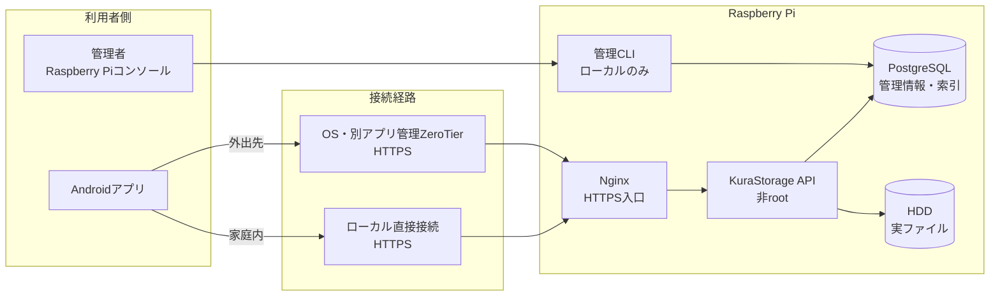

Androidアプリが接続する公開窓口はNginxだけとする。PostgreSQLとHDDはクライアントへ公開しない。

### 2.2 バックエンド内部の責務

**この図で分かること:** APIは処理内容ごとにサービスへ委譲し、各サービスが必要な管理情報をDBへ、実ファイルをHDDへ読み書きする。

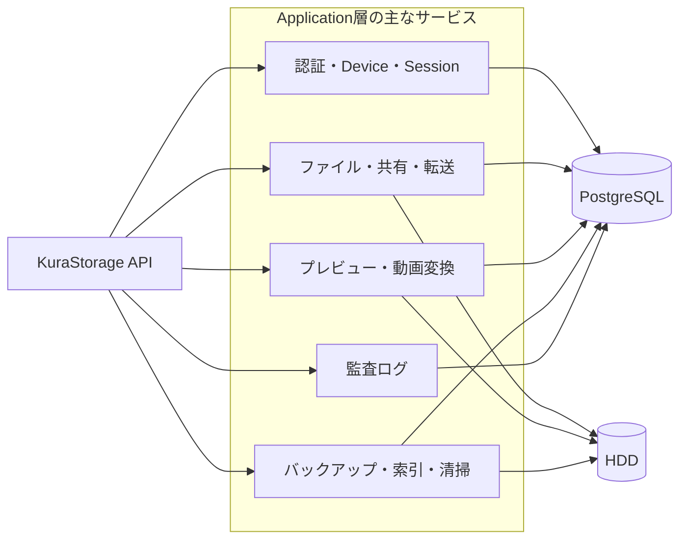

DBは認証・状態・索引などの管理情報を保持し、ファイル本体の存在と内容はHDDを正とする。


### 2.3 ZeroTier管理境界

ZeroTier daemonはOSのネットワーク機能としてKuraStorageプロセスの外側で管理する。API、Worker、管理CLI、AndroidアプリはZeroTier APIやController APIを呼び出さず、Network ID、Node Identity、Member認可情報をDBへ保存しない。

KuraStorageのDevice失効時はRefresh Sessionを失効する。ネットワークへの到達自体を無効化するには、管理者がZeroTier Centralまたは自己管理Controllerで対象Memberを別途失効する。

### 2.4 通信境界

- ZeroTier Network内でもHTTPSを使用し、TLS証明書とホスト名を検証する。
- ZeroTier Memberから許可する宛先はKuraStorage HTTPSエンドポイントだけとし、SSH、PostgreSQL、SMB、他LAN端末、他ZeroTier端末への通信をファイアウォールで拒否する。
- PostgreSQLポートとHDD共有ポートはクライアントへ公開しない。
- クライアントが接続する対象はNginxエンドポイントであり、バックエンドプロセスの内部待ち受けアドレスを直接公開しない。
- KuraStorage APIはループバック、プライベートポート、またはUNIXソケットで待ち受ける非rootプロセスとする。
- `LOCAL_DIRECT`判定では、Android端末のIPアドレスとプレフィックス、およびKuraStorageエンドポイントが解決したローカルIPアドレスが、管理者設定の同一IPサブネットに属することを確認する。その後、ZeroTier経路ではない基盤Wi-FiまたはEthernetネットワークへ通信を明示的にバインドし、リバースプロキシ経由の`GET /api/v1/system/health`を実行する。
- ローカル直接接続とZeroTier接続の両方が成功する場合、通常のAPI通信と自動バックアップは`LOCAL_DIRECT`を優先する。
- 管理CLIはRaspberry Piのローカルコンソール上でrootまたは限定sudoユーザーだけが実行でき、HTTP APIやリモート管理機能として公開しない。

## 3. 技術スタック

本節はPhase 1の推奨構成であり、ライブラリの具体的なバージョンは実装開始時に固定する。

| 分類                    | 技術                                          | 選定理由                                                                               |
| ----------------------- | --------------------------------------------- | -------------------------------------------------------------------------------------- |
| Android対応             | Android 10以降（`minSdk 29`）                 | 対象端末の権限・ストレージ・バックグラウンド制約に対する互換分岐を抑える                    |
| Android言語             | Kotlin                                        | Androidのバックグラウンド処理、MediaStore、SAF連携を直接扱える                         |
| Android UI              | Jetpack Compose                               | 状態駆動UIと画面コンポーネントの再利用がしやすい                                       |
| Android永続化（MVP後）  | Room                                          | 自動Backup追加時のRule、差分索引、Queue保存                                             |
| Androidバックグラウンド（MVP後） | WorkManager                          | 自動Backup追加時の永続処理                                                              |
| Androidメディア（MVP後） | Media3 ExoPlayer                             | アプリ内動画・音声再生追加時に導入                                                      |
| Androidファイルアクセス | Storage Access Framework                     | MVPの手動Upload元とDownload先を利用者が選択                                             |
| バックエンド            | ASP.NET Core（C#）                            | 認証、ストリーミング、Range Request、バックグラウンドサービスを統合しやすい            |
| パスワードハッシュ      | Argon2id v1.3（`v=19`）                       | メモリハードな専用パスワードハッシュを使用し、DB漏えい時のオフライン解析コストを高める |
| 基準ハードウェア        | Raspberry Pi 4 Model B、8GB RAM               | Phase 1の性能・同時実行制御の基準                                                      |
| DBアクセス              | Entity Framework Core + Npgsql                | PostgreSQLとの型安全な永続化                                                           |
| データベース            | PostgreSQL                                    | 複数端末の同時処理、検索、共有権限、ジョブ状態を扱える                                 |
| 画像変換（MVP後）       | libvips系ライブラリまたは同等実装             | Preview追加時に選定する                                                                 |
| 動画変換（MVP後）       | FFmpeg                                        | Media変換追加時に導入する                                                               |
| 変更検知（MVP後）       | Linux inotify + 定期再スキャン                | 外部変更監視追加時に導入する                                                            |
| リバースプロキシ        | Nginx                                         | HTTPS終端、リクエスト制限、静的Web配信に対応                                           |
| Web（Phase 2）          | React + TypeScript                            | 共通APIを利用するブラウザUIを構築する                                                  |

---

## 4. ストレージ構造

### 4.1 HDD上の論理構造

```text
/mnt/KuraStorage-hdd/KuraStorage/
├── private/
│   ├── user-<id>/
│   └── ...
├── shared/
├── incoming/
│   ├── device-<id>/
│   └── ...
├── trash/
│   └── file-<id>/
├── thumbnails/
│   └── <file-id>/
├── cache/
│   ├── images/
│   │   └── <file-id>/<source-version>/
│   └── videos/
│       └── <file-id>/<source-version>/
├── versions/
└── upload-temp/
```

### 4.2 ディレクトリの責務

| ディレクトリ  | 責務                                   | 正式データか |
| ------------- | -------------------------------------- | ------------ |
| `private`     | ユーザー個人領域                       | はい         |
| `shared`      | 家族共有領域                           | はい         |
| `incoming`    | Syncthing等の外部取り込み・検証前領域  | いいえ       |
| `trash`       | アプリから削除した元ファイルの一時保管 | はい         |
| `thumbnails`  | 一覧表示用の小型画像                   | 再生成可能   |
| `cache`       | 低・中画質の一時派生データ             | 再生成可能   |
| `versions`    | 過去バージョンを有効化した場合の保存先 | はい         |
| `upload-temp` | 未完了アップロード                     | いいえ       |

### 4.3 ストレージ利用可否の判定

バックエンド起動時と書き込み操作前に以下を検証する。

1. 設定されたマウントポイントが実際のマウントポイントである。
2. HDD内の識別ファイルが想定した`storageId`を持つ。
3. 読み取り・書き込みテストが成功する。
4. 空き容量が安全閾値を上回る。
5. ストレージルートの実パスが設定済みルートと一致する。

`UNAVAILABLE`の場合はファイルの`MISSING`判定、アップロード、編集、移動、削除を実行しない。

---

## 5. データモデル定義（MVPとMVP後）

MVPの永続モデルは`User`、`Device`、`RefreshSession`、`AuthenticationAttempt`、`AuditLog`、`FileEntry`、`FileOperation`だけとする。5.3、5.4、5.6、5.7およびそれらに対応する関係図はMVP後の設計であり、MVP Migrationへ含めない。5.5のUpload Session、Chunk、Backup用モデルもMVP後であり、MVPでは`FileOperation`と一時ファイルだけでStreaming Uploadを管理する。

API契約を説明するためTypeScript形式で記載する。バックエンドでは対応するC#型を定義する。

### 5.1 ユーザー・端末・Session

```typescript
type UserRole = "ADMIN" | "MEMBER";
type UserStatus = "ACTIVE" | "DISABLED";
type LockType = "NONE" | "SECURITY";

interface User {
  id: string;
  username: string;
  displayName: string;
  passwordHash: string; // Argon2idの自己記述形式。平文、復号可能な暗号文、単純ハッシュは保存しない
  role: UserRole;
  status: UserStatus;
  failedLoginCount: number;
  failedLoginWindowStartedAt?: string;
  lockType: LockType;
  securityLockedAt?: string;
  securityLockReason?: string;
  createdAt: string;
  updatedAt: string;
}

type DeviceStatus = "ACTIVE" | "REVOKED";

interface Device {
  id: string; // バックエンドが生成するUUID
  userId: string;
  deviceName: string;
  platform: "ANDROID" | "WEB";
  status: DeviceStatus;
  lastSeenAt?: string;
  revokedAt?: string;
  revocationReason?: string;
  createdAt: string;
  updatedAt: string;
}

interface RefreshSession {
  id: string;
  familyId: string; // ローテーション系列
  userId: string;
  deviceId: string;
  tokenHash: string;
  expiresAt: string;
  usedAt?: string;
  replacedBySessionId?: string;
  revokedAt?: string;
  revocationReason?: string;
  createdAt: string;
  updatedAt: string;
}

interface AuthenticationAttempt {
  id: string;
  normalizedUsernameHash?: string;
  deviceId?: string;
  sourceIp: string;
  route: "LOCAL_DIRECT" | "REMOTE_SECURE" | "UNKNOWN";
  result: "SUCCESS" | "FAILURE" | "LOCKED";
  occurredAt: string;
}
```

**制約**

- パスワードはArgon2id v1.3（`v=19`）でハッシュ化し、平文、復号可能な暗号文、MD5、SHA-1、SHA-256、SHA-512等の高速な単純ハッシュとして保存しない。
- Saltはパスワード設定ごとに暗号学的に安全な乱数で16バイト生成し、ユーザーごと・再設定ごとに異なる値を使用する。
- MVP初期パラメータはメモリ19MiB、反復2回、並列度1とする。Raspberry Pi 4実機で通常1秒未満となることを確認し、性能に余裕があれば強化できるが、初期値未満へは下げない。
- DBの`passwordHash`には、アルゴリズム、バージョン、パラメータ、Salt、ハッシュ値を含む自己記述形式の文字列だけを保存する。Saltを秘密情報として扱ったり、平文パスワードを別列へ保存したりしない。
- ハッシュ生成・検証は保守されているArgon2idライブラリを使用し、独自暗号実装を行わない。
- 正常ログイン時に保存済みパラメータが現在の基準より弱い場合、入力済みパスワードを現在の設定で再ハッシュし、認証成功処理と同じトランザクション境界で`passwordHash`を更新する。
- `deviceId`はバックエンドが生成し、識別子としてのみ使用する。
- クライアントが送信した`deviceId`だけを端末本人確認の根拠にしない。
- Refresh Tokenはハッシュ化して保存し、使用ごとにローテーションする。
- 使用済みRefresh Tokenの再利用を検知した場合、同じ`familyId`のSessionを失効する。
- 無効化User、ロック中User、失効Device、失効SessionのToken更新を拒否する。
- 認証失敗はUser単位でだけ加算し、正常ログイン時は`failedLoginCount`を0へ戻して`failedLoginWindowStartedAt`を未設定にする。

### 5.2 ファイル索引

```typescript
type EntryType = "FILE" | "FOLDER";
type FileStatus =
  | "ACTIVE"
  | "MISSING_CANDIDATE"
  | "MISSING"
  | "TRASHED"
  | "UPLOADING"
  | "ERROR";

interface FileEntry {
  id: string;
  parentId?: string;
  ownerUserId: string;
  entryType: EntryType;
  name: string;
  relativePath: string; // ストレージルートからの相対パス
  mimeType?: string;
  size?: number;
  fileVersion: number; // 内容変更時に増分
  sourceModifiedAt?: string; // HDD上の更新日時
  sourceInode?: string; // 補助情報、同一性の保証には単独使用しない
  checksum?: string; // 必要時のみ計算
  status: FileStatus;
  missingDetectedAt?: string;
  trashedAt?: string;
  originalRelativePath?: string;
  createdAt: string;
  updatedAt: string;
}
```

**制約**

- `relativePath`は絶対パスを許可しない。
- 正規化後のパスがストレージルート配下であることを毎回確認する。
- `ACTIVE`ファイルの内容を更新した場合、`fileVersion`を増加させる。
- 名前変更または移動だけでは`fileVersion`を変更しない。
- HDD上の実ファイルが正であり、DBレコードだけを根拠にファイルの存在を断定しない。
- `TRASHED`では復元に必要な`FileEntry`、`originalRelativePath`、`trashedAt`を保持する。
- `DELETED`状態は定義しない。完全削除が完了した時点で`FileEntry`自体を削除し、共有、同期、Recent、派生データ等の関連レコードも同一の管理処理で削除する。
- 削除イベントを保持する必要がある場合は、`FileEntry`ではなく追記専用の監査ログへ必要最小限の識別情報と結果だけを記録する。

### 5.3 MVP後: 共有

```typescript
type SharePermission = "VIEWER" | "CONTRIBUTOR" | "EDITOR" | "MANAGER";

interface Share {
  id: string;
  targetEntryId: string; // 共有対象のFILEまたはFOLDER
  ownerUserId: string;
  createdAt: string;
  updatedAt: string;
}

interface ShareMember {
  shareId: string;
  userId: string;
  permission: SharePermission;
  createdAt: string;
  updatedAt: string;
}
```

**制約**

- `targetEntryId`は`FileEntry.entryType`が`FILE`または`FOLDER`の項目を参照する。
- 1つの共有対象につき`Share`は1件とし、`target_entry_id`へ一意制約を設定する。`ShareMember`は`(share_id, user_id)`を一意とする。
- 対象が`FOLDER`の場合、共有権限はそのフォルダ自身と配下のファイル・フォルダへ継承する。
- 対象が`FILE`の場合、共有権限は対象ファイルだけに適用し、親・兄弟・子孫項目へは適用しない。
- `CONTRIBUTOR`は配下へ項目を作成できるフォルダ共有だけで使用し、ファイル共有には設定できない。
- 親フォルダから継承された権限を個別ファイル共有で弱める拒否・例外設定はMVPでは設けない。
- 同一ユーザーに複数の共有経路が適用される場合、最も強い権限を有効権限とする。

### 5.4 MVP後: 派生データ・キャッシュ

```typescript
type DerivativeType =
  | "THUMBNAIL"
  | "IMAGE_LOW"
  | "IMAGE_MEDIUM"
  | "VIDEO_LOW"
  | "VIDEO_MEDIUM"
  | "PDF_THUMBNAIL";

type DerivativeStatus =
  | "PENDING"
  | "RUNNING"
  | "READY"
  | "FAILED"
  | "BLOCKED_SOURCE_MISSING"
  | "DELETING";

interface FileDerivative {
  id: string;
  sourceFileId: string;
  sourceVersion: number;
  derivativeType: DerivativeType;
  profileVersion: number; // 変換設定変更時に増加
  relativePath: string;
  size: number;
  status: DerivativeStatus;
  lastAccessedAt?: string;
  expiresAt?: string; // 低・中画質キャッシュは最終アクセス+24時間。サムネイルは未設定
  leaseUntil?: string; // 配信・生成中の削除防止
  errorCode?: string;
  createdAt: string;
  updatedAt: string;
}

type TranscodeJobStatus =
  | "QUEUED"
  | "RUNNING"
  | "COMPLETED"
  | "FAILED"
  | "CANCELLED";

interface TranscodeJob {
  id: string;
  derivativeId: string;
  status: TranscodeJobStatus;
  progressPercent?: number; // FFmpeg進捗から算出可能な場合のみ
  queuePosition?: number;
  processedDurationMs?: number;
  totalDurationMs?: number;
  requestedByUserId: string;
  startedAt?: string;
  completedAt?: string;
  errorCode?: string;
  createdAt: string;
  updatedAt: string;
}
```

**一意制約**

```text
(source_file_id, source_version, derivative_type, profile_version)
```

`THUMBNAIL`と`PDF_THUMBNAIL`は通常キャッシュ10GBの集計対象外とし、元ファイルの完全削除まで保持する。写真・動画のサムネイルにはTTLと容量上限を設定しない。低・中画質データだけを24時間TTLと容量上限の対象とする。

### 5.5 転送と操作ジャーナル

```typescript
type OperationType =
  | "UPLOAD"
  | "CREATE_FOLDER"
  | "TRASH"
  | "RESTORE";
type OperationStatus =
  | "PENDING"
  | "FILESYSTEM_DONE"
  | "COMPLETED"
  | "RECOVERY_REQUIRED";

interface FileOperation {
  id: string;
  ownerUserId: string;
  operationType: OperationType;
  idempotencyKey?: string;
  fileEntryId?: string;
  sourceRelativePath?: string;
  targetRelativePath?: string;
  expectedSize?: number;
  expectedSha256?: string;
  status: OperationStatus;
  errorCode?: string;
  createdAt: string;
  updatedAt: string;
}
```

MVPではUpload Session Tableを作らず、`FileOperation`とHDD上の一時ファイルを使う。`(ownerUserId, idempotencyKey)`はKeyがある場合に一意とする。操作ジャーナルは、HDD操作とDB更新の途中でプロセスが停止した場合の復旧に使用する。分割転送用のUpload SessionはMVP後に追加する。

### 5.6 MVP後: 自動バックアップ

#### Android端末内（Room）

```typescript
type BackupNetworkMode =
  | "LOCAL_DIRECT_ONLY"
  | "LOCAL_DIRECT_OR_ALLOWED_WIFI_ZEROTIER";

interface LocalBackupRule {
  id: string;
  localTreeUri: string;
  displayName: string;
  remoteFolderId: string;
  enabled: boolean;
  networkMode: BackupNetworkMode;
  requiresChargingForInitialRun: boolean;
  minimumBatteryPercent: number;
  createdAt: string;
  updatedAt: string;
}

interface LocalSyncItem {
  id: string;
  backupRuleId: string;
  localDocumentKey: string;
  relativePath: string;
  size: number;
  modifiedAt: string;
  checksum?: string;
  remoteFileId?: string;
  status: "PENDING" | "UPLOADING" | "COMPLETED" | "FAILED" | "LOCAL_MISSING";
  retryCount: number;
  lastAttemptAt?: string;
}

interface ExternalWifiPolicy {
  id: string;
  displayName: string;
  ssid: string;
  bssid?: string;
  treatAsMetered: boolean;
  enabled: boolean;
  createdAt: string;
  updatedAt: string;
}
```

`ExternalWifiPolicy`は、ZeroTier経由の自動バックアップを明示的に許可する外部Wi-Fiだけを保存する。`LOCAL_DIRECT`はWi-Fi登録情報ではなく、管理者設定の同一IPサブネット、非ZeroTier経路の実到達性、TLS証明書・ホスト名検証から自動判定する。

#### サーバー側

```typescript
interface BackupReceipt {
  id: string;
  userId: string;
  deviceId: string;
  localDocumentKey: string;
  remoteFileId: string;
  relativePath: string;
  size: number;
  sourceModifiedAt: string;
  checksum?: string;
  uploadedAt: string;
}
```

### 5.7 MVP後: 最近使用したファイル

```typescript
interface RecentFile {
  userId: string;
  fileId: string;
  openedAt: string;
}
```

## 5.8 データ関係図

データ同士の関係を理解しやすくするため、1枚の大きなER図にはまとめず、用途ごとに小さな図へ分ける。

図中の表記は次の意味とする。

- 実線：通常の関連

- 破線：関連が存在しない場合もある任意の関連

- 矢印の説明：関連する件数や関係の意味

詳細なカラム、必須・任意、一意制約については各データモデル定義を参照する。

### 5.8.1 認証・端末・Session

#### User・Device・Sessionの関係

**この図で分かること:**

1人のUserは複数のDeviceを登録できる。ログイン状態を表すRefresh Sessionは、UserとDeviceの両方に関連する。

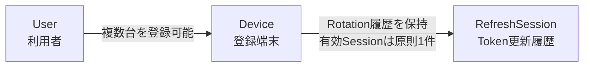

- `Device`は、Android端末や将来のWeb端末を表す。

- `RefreshSession`には`userId`と`deviceId`の両方を保存する。


#### 認証試行とDeviceの関係

**この図で分かること:**

認証試行時にDeviceを特定できた場合だけ、Authentication Attemptへ`deviceId`を記録する。

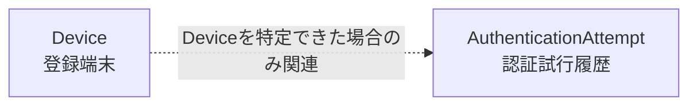

未登録端末からのログインや、Deviceを信頼できる方法で特定できない認証試行では、`AuthenticationAttempt.deviceId`を未設定とする。

`AuthenticationAttempt`はUserへ直接関連付けず、必要に応じて正規化済みユーザー名のハッシュを記録する。

---

### 5.8.2 ファイル・共有・派生データ

#### Userとファイルの所有関係

**この図で分かること:**

すべてのファイルまたはフォルダには、所有者となるUserが1人存在する。

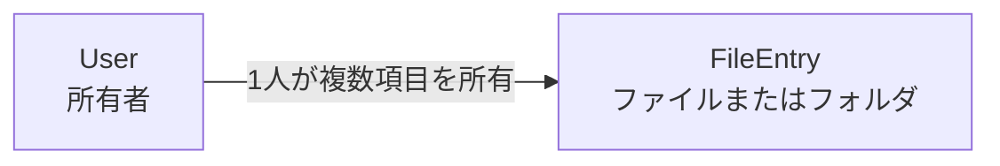

`FileEntry.ownerUserId`によって、そのファイルまたはフォルダの所有者を管理する。

#### フォルダ階層

**この図で分かること:**

フォルダとファイルはどちらもFileEntryとして保存し、`parentId`で親子関係を表す。

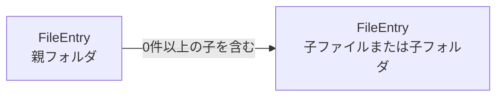

- ルート直下の項目は`parentId`を持たない。

- 子項目の`parentId`には、親フォルダの`FileEntry.id`を保存する。

- ファイルは子を持たない。

- フォルダは複数のファイルまたはフォルダを持てる。

#### ファイル・フォルダ共有

**この図で分かること:**

所有者がFileEntryを共有対象として指定し、Share Memberを通じて他のUserへ権限を付与する。

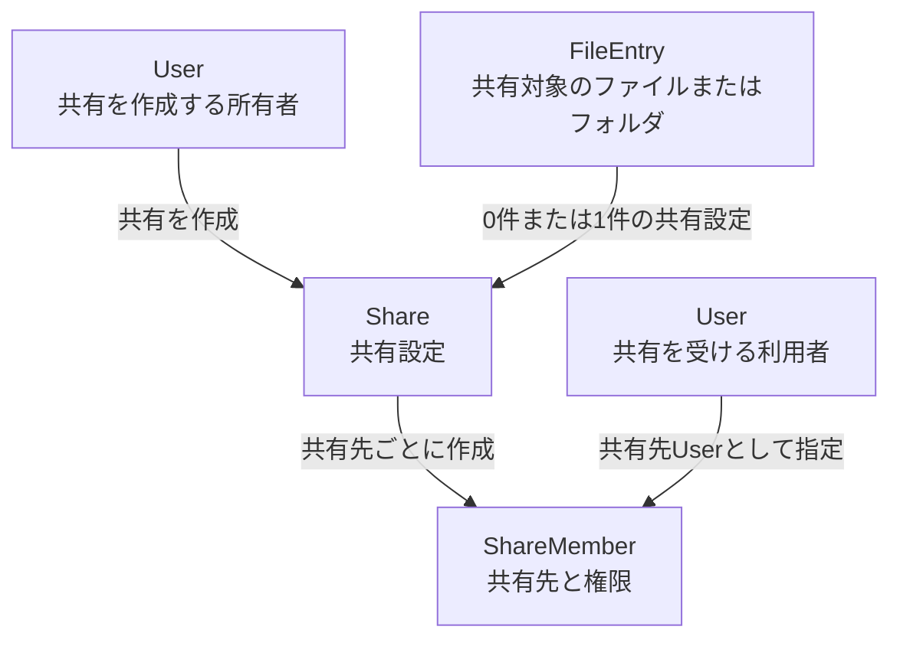

- 1つのFileEntryにつき、Shareは最大1件とする。

- Share Memberには、共有先Userと権限を保存する。

- 1つのShareに複数のShare Memberを登録できる。

- ファイル共有の場合、権限はそのファイルだけに適用する。

- フォルダ共有の場合、権限はフォルダ配下へ継承する。

#### 派生データと変換ジョブ

**この図で分かること:**

サムネイルや低・中画質データは、元のFileEntryから作られる派生データとして管理する。

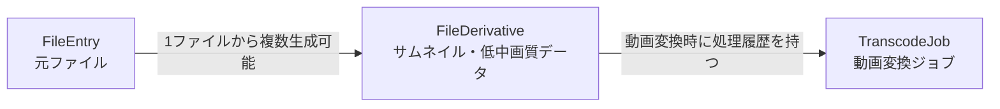

- 写真や動画のサムネイル、低画質、中画質データを`FileDerivative`として管理する。

- 同じ元ファイルでも、品質や変換設定ごとに異なるFileDerivativeを作成できる。

- 動画の変換処理は`TranscodeJob`として非同期実行する。

- 再試行や再生成により、1つのFileDerivativeに複数のTranscode Jobが関連する場合がある。

#### 最近使用したファイル

**この図で分かること:**

Recent Fileは、どのUserがどのFileEntryを最後に開いたかを記録する中間データである。

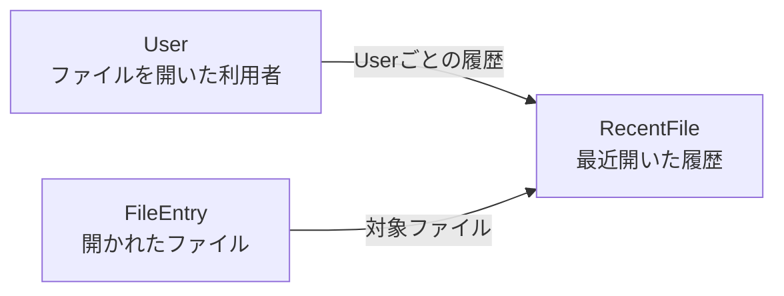

`RecentFile`は、`userId`、`fileId`、`openedAt`を持つ。

同じファイルでも、Userごとに異なる最近使用履歴を管理する。

---

### 5.8.3 転送・操作・バックアップ

#### アップロード処理

**この図で分かること:**

Upload Sessionには、アップロードを行うUser、送信元Device、保存先フォルダが関連する。

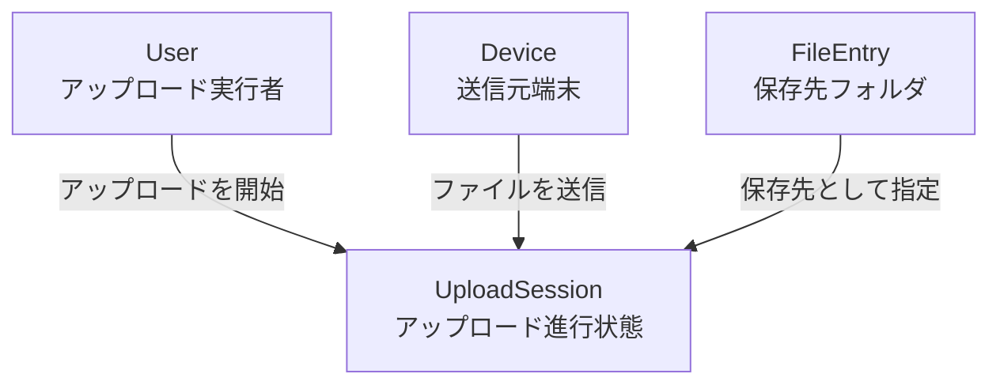

- `UploadSession.userId`には操作したUserを保存する。

- `UploadSession.deviceId`には送信元Deviceを保存する。

- `destinationFolderId`には保存先フォルダのFileEntry IDを保存する。

- Upload Session完了後、正式なFileEntryを作成する。

#### ファイル操作履歴

**この図で分かること:**

File Operationはファイル操作の途中経過を記録するが、処理段階によってはFileEntryがまだ存在しない場合がある。

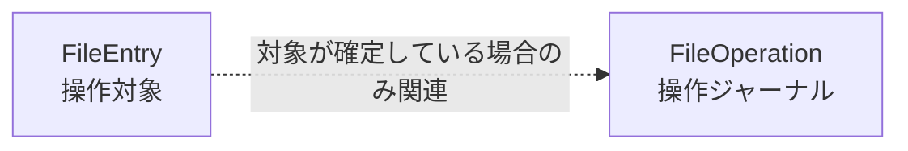

`FileOperation.fileEntryId`は任意項目とする。

たとえばアップロード確定処理では、File Operationを作成した時点で正式なFileEntryがまだ作成されていない場合がある。その場合は、元パスと移動先パスを使用して処理状態を管理する。

#### 自動バックアップ完了記録

**この図で分かること:**

Backup Receiptは、どのUserのどのDeviceから、どのFileEntryへバックアップされたかを記録する。

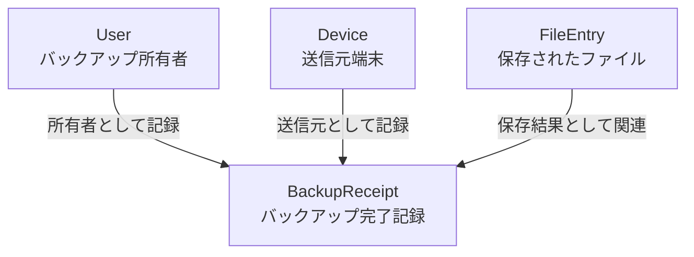

Backup Receiptには、次の対応関係を保存する。

- バックアップ対象のUser

- 送信元Device

- Android端末側のファイル識別子

- サーバー側で作成されたFileEntry

- ファイルサイズ

- 元ファイルの更新日時

- アップロード完了日時

これにより、次回バックアップ時に端末側のファイルとサーバー側のファイルを対応付け、同じファイルの不要な再アップロードを防止する。
`BackupReceipt`は`userId`、認証済み`deviceId`、`localDocumentKey`の組で一意とする。
同じUserでもDeviceが異なる場合は、端末内識別子の名前空間を共有しない。

## 6. コンポーネント設計

## 6.1 Androidアプリ

### 6.1.1 ConnectionCoordinator

**責務**

- ローカル直接接続、ZeroTier経路、TLS検証、HDD、User認証、Device・Session状態を統合して画面状態へ変換する。
- 接続状態の変化をUIへ通知する。
- 利用中の経路が到達不可になったとき、進行中の転送や再生へ停止通知を送る。

```kotlin
interface ConnectionCoordinator {
    val state: StateFlow<ConnectionState>
    suspend fun refresh()
}

enum class ConnectionRoute {
    LOCAL_DIRECT,
    REMOTE_SECURE,
    DISCONNECTED
}

data class ConnectionState(
    val route: ConnectionRoute,
    val underlyingNetwork: UnderlyingNetworkType,
    val serverReachable: Boolean,
    val serverTrusted: Boolean,
    val storageStatus: StorageStatus,
    val authenticationStatus: AuthenticationStatus,
    val deviceRegistrationStatus: DeviceRegistrationStatus
)
```

**経路判定順序**

1. ZeroTierを介さない利用可能なWi-FiまたはEthernetネットワークを取得する。
2. Android端末のIPアドレスとプレフィックス、およびKuraStorageエンドポイントが解決したローカルIPアドレスを比較し、管理者設定の同一IPサブネットに属することを確認する。
3. 同一サブネットの場合、そのネットワークへヘルスチェック通信を明示的にバインドする。
4. TLS証明書・ホスト名とKuraStorage API応答を検証し、成功した場合は`LOCAL_DIRECT`とする。
5. 同一サブネット確認またはローカル直接確認が失敗した場合は、`NET-API-HOSTNAME`を`NET-ZEROTIER-API-IP`へ解決して同じHTTPS確認を行う。
6. ZeroTier経由の確認が成功した場合は`REMOTE_SECURE`、失敗した場合は`DISCONNECTED`とする。
7. 接続経路確定後にHDD、User認証、Device、Session状態を別々に評価する。

SSIDやBSSIDは`LOCAL_DIRECT`の判定条件に使用しない。同一IPサブネットは必須条件だが認証情報ではないため、HTTPS到達性とTLS検証を省略しない。ZeroTierがOS上で有効な場合も、ローカル直接確認は基盤ネットワークへ明示的にバインドして実施し、ZeroTier経由の成功をローカル直接接続と誤判定しない。

### 6.1.2 RemoteAccessGuidanceController

**責務**

- `DISCONNECTED`時にZeroTierの別アプリで接続を確認する案内を組み立てる。
- KuraStorageアプリがForegroundへ戻った際と、利用者が再確認を選択した際に`ConnectionCoordinator.refresh()`を呼び出す。
- Network ID、Managed IP、Node Identity、認可情報の実値を画面やログへ表示しない。
- ZeroTier SDK、Controller API、トンネル操作APIに依存しない。

### 6.1.3 AuthRepository

**責務**

- 登録済みDeviceのログイン、Token更新、ログアウトを実行する。
- Android内に有効な`deviceId`とRefresh Tokenがない場合、`LOCAL_DIRECT`でDeviceRegistrationCoordinatorを開始する。
- ZeroTier経由では新規Device登録を開始しない。
- Access Tokenをメモリ中心で扱う。
- Refresh TokenをSecureCredentialStoreで保護して保存する。
- Refresh Token更新時に`deviceId`を補助情報として送信しても、Token自体の検証を認証根拠とする。
- DeviceまたはSession失効時にローカルTokenを削除し、再ログイン画面へ遷移させる。
- Token再利用検知とUserセキュリティロックのエラーを専用状態へ変換する。

### 6.1.4 FileRepository

**責務**

- ファイル一覧、検索、詳細、共有情報を取得する。
- アップロード、ダウンロード、移動、名前変更、削除、復元を呼び出す。
- 物理パスを保持しない。

### 6.1.5 MVP後: MediaViewerController

**責務**

- ネットワーク種別ごとの初期画質を決定する。
- 接続環境に関係なく、写真・動画の低・中・元画質を選択可能にする。
- 写真・動画の品質変更を実行する。
- Media3へ再生URL、認証ヘッダー、シーク、速度設定を渡す。
- 元画質取得前にサイズ確認を行う。

### 6.1.6 MVP後: BackupCoordinator

**責務**

- MediaStoreまたはSAFから差分候補を取得する。
- Roomの保留キューを更新する。
- NetworkPolicyEvaluatorで自動バックアップ可否を確認する。
- WorkManagerへ一意なバックアップ処理を登録する。
- 一度に扱うファイル数・合計容量を制限し、次のWorkerへ継続する。

### 6.1.7 MVP後: NetworkPolicyEvaluator

**責務**

- 現在の基盤ネットワークと`ConnectionRoute`を判定する。
- `LOCAL_DIRECT`ではWi-Fi登録名に依存せず、管理者設定の同一IPサブネット、非ZeroTier経路の到達性、TLS検証、認証状態を評価する。
- 外部Wi-FiではWi-Fi登録情報、ZeroTier経路状態、TLS検証、認証状態を評価する。
- `AUTO_BACKUP_ALLOWED`、`MANUAL_ONLY`、`BLOCKED`を返す。

```kotlin
enum class TransferPolicyResult {
    AUTO_BACKUP_ALLOWED,
    MANUAL_ONLY,
    BLOCKED
}
```

### 6.1.8 MVP後: LocalDatabase

Roomに次を保存する。

- バックアップルール
- ローカル差分索引
- 保留アップロードキュー
- 登録済み外部Wi-Fiポリシー
- 画質設定
- 最後に確認したMediaStore generation

### 6.1.9 DeviceRegistrationCoordinator

**責務**

- Device未登録状態と`LOCAL_DIRECT`を確認する。
- ユーザー名・パスワードと端末名を受け取る。
- `deviceId`、Access Token、Refresh Tokenを受信する。
- Device情報とRefresh TokenをSecureCredentialStoreへ保存する。
- 登録途中で失敗した場合、受信済みのTokenと一時状態を削除し、再試行可能な状態へ戻す。

### 6.1.10 SecureCredentialStore

**責務**

- Android Keystore内に取り出し不可のAES-256鍵を生成する。StrongBox対応端末ではStrongBox-backed鍵を優先し、非対応時はhardware-backed Keystore、さらに利用できない場合は標準Keystoreへフォールバックする。
- Refresh TokenもKeystoreで保護し、Roomや通常のSharedPreferencesへ平文保存しない。
- `deviceId`と固定API Hostnameなど、KuraStorage自身に必要な非秘密設定を保存する。
- アプリ再インストールまたはデータ消去後は未登録状態として扱う。
- ログアウト、Device失効、登録失敗時に対象秘密情報を安全に削除する。

## 6.2 バックエンド

### 6.2.1 AuthenticationService

- PasswordHashingServiceを使用したArgon2idハッシュ生成・検証
- 保存済み自己記述形式からArgon2idのバージョン、パラメータ、Salt、ハッシュ値を読み取り、保守されたライブラリで検証する
- 認証成功時に保存済みパラメータが現在の基準より弱い場合、現在の設定で再ハッシュして`passwordHash`を更新する
- パスワードの平文を永続化、ログ出力、例外メッセージ、監査ログへ含めない
- 有効期限15分のAccess Token発行
- 発行・ローテーションから24時間有効なRefresh Tokenのローテーション
- Refresh Tokenが24時間以内に更新されなかった場合の再ログイン要求とバックアップ認証待ち遷移
- ログイン失敗制限
- 端末・セッション失効

### 6.2.2 AuthorizationService

- 所有者判定
- 対象項目への直接共有と祖先フォルダ共有からの権限解決
- 操作別必要権限の判定
- `ADMIN`を含むすべてのUserに対する同一のファイル認可規則の適用

### 6.2.3 StorageGuard

- ストレージ利用可否の確認
- 相対パスの正規化
- 保存領域内であることの検証
- シンボリックリンク拒否
- HDD未マウント時の誤書き込み防止

### 6.2.4 FileCatalogService

- DB索引から一覧・検索・詳細を返す。
- 実ファイルを開く直前に存在確認を行う。
- `MISSING_CANDIDATE`と`MISSING`を管理する。
- ファイル詳細、所有者、共有、同期元を統合する。

### 6.2.5 FileCommandService

- フォルダ作成、名前変更、移動、削除、復元を実行する。
- 操作ジャーナルを作成する。
- HDD操作とDB更新を段階的に確定する。
- 名前変更または移動では`fileVersion`を変更せず、既存の低・中画質キャッシュを無効化しない。
- 元ファイル内容の更新、削除、欠損確定など、派生データの有効性が失われる操作では関連キャッシュの無効化または削除を依頼する。

### 6.2.6 TransferService

- 分割アップロードセッションを管理する。
- 一時ファイルへの追記と受信範囲を管理する。
- 完了時にサイズ・チェックサムを検証する。
- 正式配置後に索引を作成する。
- アップロードおよびダウンロードは、大容量であることだけを理由に一律拒否せず、分割転送とRange Requestで処理する。
- アップロード開始時に安全余裕を差し引いた利用可能容量を検証し、不足時は`STORAGE_CAPACITY_INSUFFICIENT`を返す。
- 対象APIに明示的な処理可能サイズ上限がある場合だけ、超過時に`OPERATION_SIZE_LIMIT_EXCEEDED`を返す。
- ダウンロードとRange Requestを処理する。
- ダウンロード用ファイル名はリクエスト時点の`FileEntry.name`から生成し、派生キャッシュの物理ファイル名や生成時点の名称を使用しない。

### 6.2.7 MVP後: PreviewService

- 派生キャッシュの有無・元バージョンを確認する。
- 写真の低・中画質データは要求処理内で短時間生成を試みる。
- 写真生成が設定済み待機閾値を超える場合、`202 Accepted`を返して生成を継続する。
- 動画変換ジョブをキューへ登録する。
- 同一派生データの重複生成を防止する。
- 元画質再生はクライアントが明示的に選択した場合だけ許可する。
- 配信時に`lastAccessedAt`と`expiresAt`を更新する。

### 6.2.8 MVP後: MediaTranscodeWorker

- FFmpegを使用して動画派生データをAPI要求とは独立して生成する。
- 基準ハードウェアをRaspberry Pi 4 Model B（8GB RAM）とし、同時変換数を1に制限する。
- 低画質は最大720p・H.264・約1.5Mbps・AAC 96kbps・最大30fps、中画質は最大1080p・H.264・約4Mbps・AAC 128kbps・最大30fpsで生成する。
- 出力コンテナを完成済みMP4に固定する。
- キュー待ち、開始、進捗、完了、失敗をDBへ記録する。
- クライアントが再生画面を離れても、ジョブが完了または失敗するまで継続する。
- 一時出力へ全体を生成し、整合性検証とatomic rename完了後に`READY`へ変更する。
- 生成途中、検証未完了、失敗した派生データを再生用URLとして公開しない。

MVP後の初回Media実装では、低・中画質動画をバックグラウンドで全体生成し、完成済みMP4（H.264＋AAC）として検証後に配信する。再生はHTTP Range Requestを使用し、HLSおよび生成途中のセグメント配信は対象外とする。

### 6.2.9 MVP後: CacheCleanupService

- 30分ごとに期限切れキャッシュを検索する。
- 24時間未利用の低・中画質キャッシュを削除する。
- 合計容量が10GBを超えた場合、LRU順で6GB以下まで削除する。
- 写真・動画・PDFのサムネイルはTTL・容量清掃の対象外とし、元ファイルの完全削除まで保持する。
- `PENDING`、`RUNNING`、`DELETING`、`leaseUntil > now`を除外する。
- 削除失敗を記録し、次回再試行する。

### 6.2.10 MVP後: IndexingService

- inotifyイベントを受けて変更対象だけを索引更新する。
- 定期再スキャンでイベント取りこぼしを補完する。
- HDDが正常な場合だけ`MISSING`候補を作成する。
- DBにないHDDファイルを取り込み候補として登録する。

### 6.2.11 MVP後: BackupService

- Androidから送られた候補と`BackupReceipt`を比較する。
- アップロード不要・必要・内容変更を判定する。
- 端末削除をサーバー削除へ反映しない。

### 6.2.12 DeviceRegistrationService

- `LOCAL_DIRECT`からの要求だけを受け付け、ZeroTier経由の登録を拒否する。
- User状態、セキュリティロック状態、パスワードを確認する。
- `deviceId`をUUIDで生成し、Deviceを作成する。
- Refresh Sessionを作成する。
- Androidへ`deviceId`、Access Token、Refresh Tokenを返す。ZeroTier固有の設定情報は返さない。

### 6.2.13 SessionService

- Access Token発行とRefresh Tokenローテーションを行う。
- Refresh Tokenをハッシュで検索し、User、Device、Session状態を確認する。
- 使用済みRefresh Token再利用時に同一系列を失効する。
- Device単位、User単位のSession一覧・強制失効を管理CLIへ提供する。

### 6.2.14 AdministrationService・AdminCli

- `KuraStorage.AdminCli`からのみUser作成、無効化、再有効化、パスワード強制再設定、ロック解除を実行する。
- CLIはApplication層のサービスを呼び出し、直接SQLだけで状態を変更しない。
- User作成、初期管理者作成、パスワード強制再設定はすべて同じPasswordHashingServiceを使用し、Argon2idの現在設定で`passwordHash`を生成する。
- パスワードは対話形式で画面へ表示せずに入力し、コマンド引数、環境変数、シェル履歴、監査ログへ平文を残さない。
- パスワード強制再設定時は対象UserのRefresh Sessionをすべて失効する。
- CLI実行ファイルはroot所有とし、Raspberry Piのローカルコンソール上のrootまたは限定sudoユーザーだけが実行できる。
- MVPでは管理CLIをSSH経由の遠隔管理手段として提供しない。

主要コマンド。

```bash
sudo KuraStorage-admin setup create-admin

sudo KuraStorage-admin user create
sudo KuraStorage-admin user list
sudo KuraStorage-admin user show <username>
sudo KuraStorage-admin user disable <username>
sudo KuraStorage-admin user enable <username>
sudo KuraStorage-admin user unlock <username>
sudo KuraStorage-admin user reset-password <username>

sudo KuraStorage-admin device list --user <username>
sudo KuraStorage-admin device revoke <device-id>

sudo KuraStorage-admin session list --user <username>
sudo KuraStorage-admin session revoke-all --user <username>
sudo KuraStorage-admin session revoke-all --device <device-id>
```

`setup create-admin`はADMINが存在しない初期状態だけ許可する。`setup create-admin`、`user create`、`user reset-password`のパスワード入力は対話形式で画面へ表示せず、コマンド引数、環境変数、シェル履歴、ログへ残さない。

### 6.2.15 AuthenticationAttemptService・AuditLogService

- User単位の認証失敗回数と15分の計測期間を管理する。
- 15分以内に10回連続失敗したUserへセキュリティロックを適用する。
- 正常ログイン時は対象Userの失敗回数を0へ戻し、計測期間を初期化する。

---

## 7. 主要アルゴリズム設計

## 7.1 安全な物理パス解決

**入力**: `fileId`

1. DBから`FileEntry`を取得する。
2. ユーザー権限を検証する。
3. `relativePath`が絶対パスでないことを確認する。
4. `storageRoot + relativePath`を正規化する。
5. 正規化後のパスが`storageRoot`配下であることを確認する。
6. 経路中にシンボリックリンクがないことを確認する。
7. ストレージ識別・マウント状態を確認する。
8. ファイルハンドルを開く。

```csharp
ResolvedPath ResolveFilePath(FileEntry entry)
{
    var candidate = Path.GetFullPath(Path.Combine(storageRoot, entry.RelativePath));
    if (!candidate.StartsWith(storageRootWithSeparator, StringComparison.Ordinal))
        throw new StorageBoundaryViolationException();

    EnsureNoSymbolicLinkInPath(candidate);
    EnsureExpectedStorageMounted();
    return new ResolvedPath(candidate);
}
```

## 7.2 MVP後: 共有権限判定

必要権限の強さを次の順とする。

```text
VIEWER < CONTRIBUTOR < EDITOR < MANAGER
```

判定順序。

1. 所有者本人なら所有者権限を返す。
2. 対象項目への直接共有を検索する。
3. 対象項目の祖先フォルダをルートまでたどり、適用可能なフォルダ共有を検索する。
4. 各`Share`の`ShareMember`から対象ユーザーに付与された権限を取得する。
5. 複数の共有経路がある場合は、最も強い権限を有効権限とする。
6. 操作に必要な権限以上か判定し、満たさない場合は拒否する。
7. 直接共有も継承共有も存在しない場合は拒否する。

`ADMIN` RoleはUser、Device、Security Lock等の管理CLI操作に使用するが、ファイルAPIでは他Userの個人領域へ暗黙の権限を付与しない。`ADMIN`も他Userの項目には直接共有または祖先Folder共有が必要であり、付与された`VIEWER`、`CONTRIBUTOR`、`EDITOR`、`MANAGER`の範囲だけを利用できる。

ファイル共有は対象ファイルへの直接共有だけを成立させる。フォルダ共有は共有対象フォルダ自身と配下項目に適用する。MVP後の初回共有実装では個別ファイルに拒否設定を持たせないため、直接共有によって祖先フォルダから継承した権限を弱めることはできない。

| 操作                             | 必要権限    | 適用上の補足                     |
| -------------------------------- | ----------- | -------------------------------- |
| 一覧・閲覧・ダウンロード         | VIEWER      | ファイル共有では対象ファイルのみ |
| アップロード・新規作成           | CONTRIBUTOR | フォルダ共有だけで使用可能       |
| 名前変更・移動・編集・削除       | EDITOR      | 対象項目または継承範囲内の項目   |
| メンバー管理・権限変更・共有解除 | MANAGER     | 共有対象単位                     |

## 7.3 MVP後: 写真の品質別プレビュー生成

### キャッシュキー

```text
SHA-256(fileId + sourceVersion + derivativeType + profileVersion)
```

ファイル名と相対パスはキャッシュキーに含めない。名前変更または移動だけでは`sourceVersion`が変わらないため、同じキャッシュを再利用する。元ファイル内容が変更された場合だけ`sourceVersion`が変わり、旧バージョンのキャッシュは配信対象外となる。

### 処理

1. ファイルが`ACTIVE`であることを確認する。
2. 実ファイルの存在を確認する。
3. 対象キーの`READY`キャッシュを検索する。
4. キャッシュがあり物理ファイルも存在する場合、最終アクセスを更新して返す。
5. `PENDING`または`RUNNING`が存在する場合、設定した短時間だけ完了を待機し、未完了なら`202 Accepted`を返す。
6. キャッシュがない場合、一意制約を利用して生成権を取得する。
7. 低画質は長辺最大1280px・WebP品質70、中画質は長辺最大2560px・WebP品質82へ縮小する。元画像が対象長辺より小さい場合は拡大しない。
8. 生成時間が同期処理の待機閾値を超える場合、処理をバックグラウンドへ引き継ぎ`202 Accepted`を返す。
9. 一時パスへ出力し、完成後にatomic renameする。
10. `READY`、サイズ、`lastAccessedAt`、`expiresAt = now + 24h`を保存する。
11. 派生画像だけをクライアントへ送信する。

## 7.4 MVP後: 動画の品質別プレビュー生成

1. 原動画の存在、権限、メタデータ、元ファイルサイズを取得する。
2. 対象品質の`READY`派生データを検索する。
3. キャッシュヒットなら完成済み派生MP4を返す。
4. 未生成なら`PENDING`派生レコードと`QUEUED`変換ジョブを作成する。
5. クライアントへ`202 Accepted`、ジョブ状態URL、元画質サイズ、利用可能な選択肢を返す。
6. クライアントは「完了まで待つ」「バックグラウンドで生成」「元画質で再生」のいずれかを選択できる。
7. 元画質はユーザーが明示的に選択した場合だけRange Requestで配信し、自動フォールバックしない。
8. Workerがキュー順にFFmpegで対象品質の全体を一時MP4へ生成する。低画質は最大720p・H.264・約1.5Mbps・AAC 96kbps・最大30fps、中画質は最大1080p・H.264・約4Mbps・AAC 128kbps・最大30fpsとする。
9. Workerは可能な場合に処理済み時間から進捗率を計算し、ジョブ状態へ記録する。
10. 生成完了後に出力検証とatomic renameを行い、派生データを`READY`、ジョブを`COMPLETED`へ変更する。
11. クライアントはジョブ状態を再確認し、`READY`後に再生を開始する。
12. 配信時は選択品質の完成済みデータだけを送る。

変換ジョブはRaspberry Pi 4 Model B（8GB RAM）上で同時実行数1とし、キュー順に処理する。アプリ画面の終了や一時的なクライアント切断ではキャンセルしない。MVP後のMedia実装でも完成済みMP4だけを公開し、部分生成済みデータを再生用として公開しない。

## 7.5 MVP後: キャッシュ清掃

### 定数

```text
TTL = 最終アクセスから24時間
HIGH_WATERMARK = 10GB
LOW_WATERMARK = 6GB
```

### 処理

```text
1. 期限切れキャッシュを取得
2. 生成中・利用中・削除中を除外
3. 最終アクセスが古い順に削除
4. 現在の合計容量を再計算
5. 10GBを超えている場合、古い順に追加削除
6. 合計容量が6GB以下になったら終了
```

```typescript
async function cleanupPreviewCache(): Promise<void> {
  await deleteExpiredEntries({
    olderThan: nowMinusHours(24),
    excludeStatuses: ["PENDING", "RUNNING", "DELETING"],
    requireLeaseExpired: true,
  });

  let total = await getManagedPreviewCacheSize();
  if (total <= GB(10)) return;

  for await (const entry of listReadyCacheByOldestAccess()) {
    if (entry.leaseUntil && entry.leaseUntil > now()) continue;
    await deleteDerivative(entry);
    total -= entry.size;
    if (total <= GB(6)) break;
  }
}
```

清掃対象は`IMAGE_LOW`、`IMAGE_MEDIUM`、`VIDEO_LOW`、`VIDEO_MEDIUM`とする。写真・動画・PDFサムネイルは元ファイルの完全削除まで保持し、TTL・容量上限を適用しない。

## 7.6 ネットワークポリシー判定

### TLS固定ホスト名と名前解決

- Phase 1の接続URLはLANとZeroTierの両方で、Git管理外の`docs/environment-info.md`にある`NET-API-HOSTNAME`から構成したHTTPS URLとする。公開項目定義は`docs/environment-info.example.md`を参照する。
- NginxがTLSを終端し、KuraStorage専用Root CAが直接発行したサーバー証明書を提示する。Phase 1では中間CAを設けず、Root CAの`pathlen`を0とする。
- Androidは`TLS-ROOT-CA-CERT-PATH`からRoot CA公開証明書をアプリへ同梱し、Network Security Configurationの`domain-config`を`NET-API-HOSTNAME`の値へ限定する。システムCAやユーザー追加CAをKuraStorage用Trust Anchorとして暗黙に追加しない。
- Production Buildでは証明書検証とホスト名検証を無効化する設定、全証明書を許可するTrustManager、常に成功するHostnameVerifierを禁止する。
- Root CA秘密鍵はパスフレーズ付きでオフライン管理し、サーバーにはNginxが読むサーバー秘密鍵とサーバー証明書だけを配置する。Androidと配布物へ含めるのはRoot CA公開証明書だけとする。
- 発行と更新は再現可能なOpenSSLスクリプトで手動実施し、署名Chain、SAN、CA制約、Key Usage、Extended Key Usage、鍵一致、期限、署名Algorithm、鍵長を配置前に検証する。

### 判定表

| 基盤ネットワーク | 接続経路       | 外部Wi-Fi登録 | User・Device・Session | 自動バックアップ |
| ---------------- | -------------- | ------------: | --------------------- | ---------------- |
| Wi-Fi / Ethernet | `LOCAL_DIRECT` |          不要 | 有効                  | 許可             |
| Wi-Fi            | `REMOTE_SECURE`   |      登録済み | 有効                  | 許可             |
| Wi-Fi            | `REMOTE_SECURE`   |        未登録 | 有効                  | 不可             |
| モバイル通信     | `REMOTE_SECURE`   |        対象外 | 有効                  | 不可             |
| 任意             | `DISCONNECTED` |          任意 | 任意                  | 不可             |
| 任意             | 任意           |          任意 | 無効・失効            | 不可             |

手動閲覧は`LOCAL_DIRECT`または`REMOTE_SECURE`でUser、Device、Sessionが有効なら許可する。モバイル通信＋ZeroTierでも手動閲覧は可能とする。

### 安全確認

`LOCAL_DIRECT`は次をすべて満たす場合だけ確定する。

1. AndroidがZeroTier経路ではない基盤Wi-FiまたはEthernetを取得する。
2. Android端末のIPアドレスとプレフィックス、およびKuraStorageエンドポイントが解決したローカルIPアドレスが、管理者設定の同一IPサブネットに属する。
3. ヘルスチェック通信をその基盤ネットワークへ明示的にバインドする。
4. KuraStorage HTTPSエンドポイントへ到達する。
5. TLS証明書とホスト名の検証に成功する。
6. 期待するKuraStorage API応答を受信する。

`REMOTE_SECURE`は次をすべて満たす場合だけ確定する。

1. `NET-API-HOSTNAME`を`NET-ZEROTIER-API-IP`へ解決する。
2. ZeroTier経路でKuraStorage HTTPSエンドポイントへ到達する。
3. TLS証明書とホスト名の検証に成功する。
4. 期待するKuraStorage API応答を受信する。

SSID、BSSID、端末が保持する`deviceId`は接続経路の確定条件に使用しない。同一IPサブネットは`LOCAL_DIRECT`の必須条件だが、端末本人確認やUser認証の代替にはならないため、HTTPS到達性、TLS検証、Token認証を別途実行する。

## 7.7 MVP後: 自動バックアップ差分検知

### 写真・動画・音声

1. 前回保存したMediaStore generationを取得する。
2. それ以降に追加・変更されたメディアを問い合わせる。
3. 対象フォルダ・種類に該当する項目をRoomへ登録する。
4. 削除された項目は`LOCAL_MISSING`にするが、サーバー削除要求は作成しない。

### SAF任意フォルダ

1. 選択フォルダを走査する。
2. `localDocumentKey`、相対パス、サイズ、更新日時を既存索引と比較する。
3. 新規・変更候補だけを保留キューへ追加する。
4. サイズと更新日時が同じ場合は内容を読まない。
5. 必要な候補だけチェックサムを計算する。

### Workerの実行単位

初期値として以下の小さい単位に分割する。

- 最大100ファイル
- または合計2GB
- または実行時間20分

いずれかへ達したら残りを次のWorkerへ継続する。

## 7.8 MVP後: `MISSING`判定

1. ストレージ状態が`AVAILABLE`か確認する。
2. DB上`ACTIVE`の実パスを確認する。
3. 存在しない場合、`MISSING_CANDIDATE`と検出時刻を記録する。
4. 次回スキャンまたは一定時間後に再確認する。
5. まだ存在せずHDDが正常なら`MISSING`へ変更する。
6. 関連派生データを`BLOCKED_SOURCE_MISSING`へ変更し、配信しない。
7. ユーザーが一覧から削除した場合、DB関連情報と全派生データを削除する。

## 7.9 アプリ内削除

```text
ACTIVE
  ↓ 削除要求・権限確認
DELETING相当の操作ジャーナル作成
  ↓
元ファイルをtrashへatomic rename
  ↓
DBをTRASHEDへ更新
  ↓
低・中画質キャッシュを削除し、サムネイルはゴミ箱表示用に保持
  ↓
操作ジャーナルCOMPLETED
```

キャッシュ削除だけ失敗した場合、元ファイルのゴミ箱移動を取り消さず、清掃ジョブで再試行する。ゴミ箱へ移動したファイルは30日間保持し、日次清掃で30日経過後に完全削除する。HDD容量不足を理由に保持期間を自動短縮しない。

完全削除は次の順で実行する。

```text
TRASHED
  ↓ 完全削除要求または30日経過・権限確認
完全削除用の操作ジャーナルをPENDINGで作成
  ↓
ゴミ箱内の元ファイル、サムネイル、低・中画質キャッシュ等を削除
  ↓
操作ジャーナルをFILESYSTEM_DONEへ更新
  ↓
DBトランザクションで共有、Recent、BackupReceipt、派生データ等の関連管理情報とFileEntryを削除
  ↓
操作ジャーナルCOMPLETED
```

完全削除後に`FileEntry`を`DELETED`として残さない。物理削除後にDB処理が失敗した場合は、操作ジャーナルを`RECOVERY_REQUIRED`として保持し、再実行時に存在しない物理ファイルを正常な削除済み状態として扱ってDB削除を完了する。完全削除の監査イベントは関連管理情報の削除と同じDBトランザクションで独立した監査テーブルへ追加し、監査保存が失敗した場合もDB削除をRollbackして再試行可能にする。監査ログはファイル索引や共有状態の代替としては使用しない。

## 7.10 MVP後: テキスト編集競合

クライアントは取得時の`fileVersion`を保存し、更新時に`expectedVersion`として送る。

```text
DB.fileVersion != expectedVersion
→ 409 Conflict
```

更新処理は対象`fileId`のPostgreSQL advisory lockを取得してから現在Versionを再取得する。名前変更・移動・ゴミ箱操作も同じlockを使用し、複数IDを扱う場合はIDから導出したlock keyを昇順に取得する。同一ファイルへの並行更新を直列化し、一致する場合だけ一時ファイルへ保存して、atomic rename後に`fileVersion + 1`でDBを更新する。

---

## 7.11 初回Device登録

1. Androidは有効な`deviceId`とRefresh Tokenが存在しない場合だけ初回登録候補とする。
2. ConnectionCoordinatorが`LOCAL_DIRECT`を確認する。`REMOTE_SECURE`では登録を拒否する。
3. Androidがユーザー名、パスワード、端末名をTLS通信で送信する。
4. バックエンドがUserの状態とセキュリティロック、Argon2idパスワードハッシュ、1ユーザー10台のDevice上限を確認する。
5. DBトランザクション内でDeviceを作成し、`deviceId`を生成する。
6. SessionServiceがAccess TokenとRefresh Tokenを発行する。
7. Androidへ`deviceId`とTokenを返す。

## 7.12 認証失敗・アカウントロック判定

1. ログインまたは初回Device登録でUser名を正規化し、該当Userが存在する場合だけUser単位の失敗回数を管理する。Userの存在有無はレスポンスへ反映せず、認証失敗メッセージは共通化する。
2. パスワード認証に失敗した時点で、`failedLoginWindowStartedAt`が未設定または計測開始から15分を超えている場合は、計測期間を現在時刻から開始して`failedLoginCount`を1にする。
3. それ以外、つまり同じ計測期間の15分以内に発生した失敗では`failedLoginCount`を1加算する。
4. 15分以内に`failedLoginCount`が10へ達した場合、Userを`SECURITY`ロックにして`securityLockedAt`と理由を記録する。
5. `SECURITY`ロックは時間経過では解除せず、Raspberry Pi上の管理CLIからだけ解除する。
6. セキュリティロック時は対象UserのRefresh Sessionをすべて失効し、以降のログインとToken更新を拒否する。
7. 10回へ達する前に正常ログインした場合、`failedLoginCount`を0へ戻し、`failedLoginWindowStartedAt`を未設定にする。
8. 管理CLIでロック解除した場合も、`failedLoginCount`を0へ戻し、計測期間とロック情報を初期化する。
9. 成功・失敗・アカウントロック・管理CLI解除は監査ログへ記録する。認証試行履歴はカウンターをリセットした後も監査目的で保持する。
10. 失敗回数10回と計測期間15分は設定可能な初期値とする。

## 7.13 パスワードハッシュ生成・検証

### 生成

1. User作成、初期管理者作成、またはパスワード強制再設定で平文パスワードを処理中のメモリ上だけに保持する。
2. 暗号学的に安全な乱数生成器で16バイトのSaltを生成する。
3. Argon2id v1.3（`v=19`）を、メモリ19MiB、反復2回、並列度1の初期設定で実行する。
4. アルゴリズム、バージョン、パラメータ、Salt、ハッシュ値を含む自己記述形式へエンコードし、`User.passwordHash`へ保存する。
5. 平文パスワード、Saltだけを分離した秘密ファイル、復号用鍵は保存しない。

### 検証・再ハッシュ

1. DBから`passwordHash`を取得し、自己記述形式を厳格に解析する。形式不正または未対応パラメータの場合は認証失敗として扱い、内部エラーを監査記録する。
2. 保存済みSaltとパラメータを使用し、保守されたArgon2idライブラリで入力パスワードを検証する。
3. 比較処理はライブラリの安全な検証APIを使用し、アプリケーション側で文字列の単純比較を実装しない。
4. 検証成功時に保存済みパラメータが現在の設定より弱い場合、新しいSaltと現在の設定で再ハッシュし、`passwordHash`を原子的に更新する。
5. 検証失敗時は平文パスワード、ハッシュ値、Salt、内部パラメータをレスポンスまたはログへ出力しない。
6. Raspberry Pi 4 Model B（8GB RAM）でハッシュ生成・検証が通常1秒未満となることを実測し、可用性を損なわない範囲でパラメータを強化する。MVP初期値未満への変更は禁止する。

参考基準はOWASP Password Storage Cheat SheetおよびRFC 9106とする。

## 8. API設計

すべてのAPIは`/api/v1`配下とし、認証不要APIを除いてBearer Tokenを要求する。

### 8.1 共通エラーレスポンス

```json
{
  "code": "STORAGE_UNAVAILABLE",
  "message": "ストレージを利用できません。",
  "requestId": "uuid",
  "details": {}
}
```

### 8.2 システム状態

#### `GET /api/v1/system/health`

認証前の到達確認は最小限の情報だけを返す。

```json
{
  "api": "AVAILABLE",
  "protocolVersion": 1,
  "storage": "AVAILABLE"
}
```

API自体は応答できるがHDDを利用できない場合は`storage: UNAVAILABLE`とする。OS情報、物理Path、DB・HDDの詳細、storageId、空き容量を含めない。詳細HealthとPrometheus形式MetricsはMVP後の運用機能とする。

### 8.3 認証・Device登録

#### `POST /api/v1/auth/register-device`

`LOCAL_DIRECT`からの初回ログイン専用。ZeroTier経由では`DEVICE_REGISTRATION_REQUIRES_LOCAL_DIRECT`を返す。

```json
{
  "username": "family-user",
  "password": "********",
  "deviceName": "Android device"
}
```

成功時。

```json
{
  "deviceId": "uuid",
  "accessToken": "...",
  "refreshToken": "..."
}
```

条件。

- `LOCAL_DIRECT`である。
- Userが`ACTIVE`でロックされていない。
- パスワードが正しい。
- Userに紐づく`ACTIVE`なDeviceが初期値10台未満である。`REVOKED`は上限へ含めない。

#### `POST /api/v1/auth/login`


```json
{
  "username": "family-user",
  "password": "********",
  "deviceId": "uuid"
}
```

`deviceId`は補助情報であり、単独では認証に使用しない。Argon2idによるパスワード検証後、Deviceが対象Userに属し、失効されていないことを確認する。正常ログイン時は対象Userの認証失敗回数を0へリセットし、保存済みハッシュパラメータが現在の基準より弱ければ再ハッシュして更新する。

#### `POST /api/v1/auth/refresh`

```json
{
  "deviceId": "uuid",
  "refreshToken": "..."
}
```

Access Tokenは15分、Refresh Tokenは発行または前回ローテーションから24時間有効とする。Refresh Tokenハッシュ、User、Device、Session状態を確認して毎回ローテーションする。24時間を超えた場合は再ログインを要求し、自動バックアップを認証待ちへ移行する。使用済みToken再利用時は同じSession系列を失効する。

#### `POST /api/v1/auth/logout`

現在のRefresh Sessionを失効する。

### 8.4 ファイル一覧・詳細

#### `GET /api/v1/files?parentId={id}&sort=updatedAt&order=desc&page=1&pageSize=100`

#### `GET /api/v1/files/{fileId}`

```json
{
  "id": "uuid",
  "name": "IMG_0001.jpg",
  "entryType": "FILE",
  "mimeType": "image/jpeg",
  "size": 4281932,
  "status": "ACTIVE",
  "fileVersion": 3,
  "owner": { "id": "uuid", "displayName": "Ryo" },
  "permission": "EDITOR",
  "permissionSource": "DIRECT",
  "shareTargetId": "uuid",
  "updatedAt": "2026-07-10T20:00:00+10:00"
}
```

### 8.5 MVP元ファイル配信・MVP後派生データ配信

#### `GET /api/v1/files/{fileId}/content`

MVPでは元ファイルだけをHTTP Range対応で配信する。`Range`がない場合は`200`、単一Rangeには`206`と`Content-Range`、不正または範囲外には`416 RANGE_NOT_SATISFIABLE`を返す。派生データの`variant`、Inline Preview、Media JobはMVP後とする。

- `original`: 元ファイルを送信する。
- `thumbnail`: 写真・動画・PDFの完成済み一覧用WebPだけを送信する。
- `image-low` / `image-medium`: 画像派生データだけを送信する。
- `video-low` / `video-medium`: 完成・検証済みの動画派生データだけを送信する。
- `disposition=inline`: 閲覧・再生用として返す。
- `disposition=attachment`: ダウンロード用として返し、`Content-Disposition`を設定する。
- 生成中の場合は`202 Accepted`を返す。

ダウンロード名の決定規則。

1. リクエスト時点の`FileEntry.name`を取得する。
2. `original`では最新の`FileEntry.name`をそのまま使用する。
3. 派生データでは最新名称のベース名に`_low`または`_medium`を付け、実際の派生形式に対応する拡張子を使用する。
4. キャッシュの`relativePath`、物理ファイル名、生成時点の元ファイル名はダウンロード名に使用しない。
5. 非ASCII文字はRFC 5987形式の`filename*`でUTF-8エンコードする。

例。

```http
Content-Disposition: attachment; filename*=UTF-8''%E6%B2%96%E7%B8%84%E6%97%85%E8%A1%8C_low.webp
```

生成中の場合のレスポンス例。

```json
{
  "status": "GENERATING",
  "jobId": "uuid",
  "retryAfterSeconds": 2
}
```

#### `GET /api/v1/media-jobs/{jobId}`

このEndpoint以降のMedia Job APIはMVP後とする。

- 認証済み利用者が現在も閲覧できる元ファイルのJobだけを返す。
- `GENERATING`、`READY`、`FAILED`、進捗、Queue位置、再試行待機秒を返す。
- 他UserのJob ID、元ファイルの物理Path、変換Process出力を返さない。

#### `POST /api/v1/media-jobs/{jobId}/retry`

- `FAILED`の動画変換だけを明示的に`QUEUED`へ戻す。
- 再試行時にも元ファイルの閲覧権限と現在Versionを再確認する。

#### `HEAD /api/v1/files/{fileId}/content?variant=original`

ファイルサイズ、MIMEタイプ、Range対応を確認する。

### 8.6 MVP後: 動画・音声再生

#### `POST /api/v1/files/{fileId}/playback-sessions`

```json
{
  "quality": "LOW"
}
```

準備済みの場合。

```json
{
  "status": "READY",
  "playbackUrl": "/api/v1/playback-sessions/uuid/master.m3u8",
  "expiresAt": "2026-07-10T22:30:00+10:00"
}
```

生成中またはキュー待ちの場合。

```json
{
  "status": "GENERATING",
  "jobId": "uuid",
  "jobStatusUrl": "/api/v1/transcode-jobs/uuid",
  "progressPercent": 32,
  "queuePosition": 1,
  "retryAfterSeconds": 3,
  "originalAvailable": true,
  "originalSize": 1842339840,
  "availableActions": ["WAIT", "CONTINUE_IN_BACKGROUND", "PLAY_ORIGINAL"]
}
```

#### `GET /api/v1/transcode-jobs/{jobId}`

```json
{
  "status": "RUNNING",
  "progressPercent": 46,
  "processedDurationMs": 276000,
  "totalDurationMs": 600000,
  "retryAfterSeconds": 3
}
```

進捗を算出できない形式では`progressPercent`を省略し、`QUEUED`または`RUNNING`状態だけを返す。元画質はユーザーが明示的に選択した場合に限り、Range Request対応の`content`エンドポイントを利用する。

### 8.7 MVP後: テキスト

取得・編集対象はUTF-8として厳密にDecodeできる最大1 MiBのファイルに限定する。許可MIMEは`text/plain`、`text/markdown`、`text/csv`、`application/json`、`application/xml`、`application/yaml`とし、それ以外のMIME、UTF-8として不正なByte列、上限超過を拒否する。UTF-8 BOMは取得時に除去し、保存時はBOMなしUTF-8へ正規化する。

#### `GET /api/v1/files/{fileId}/text`

```json
{
  "content": "text content",
  "encoding": "UTF-8",
  "fileVersion": 4
}
```

#### `PUT /api/v1/files/{fileId}/text`

```json
{
  "content": "updated content",
  "expectedVersion": 4
}
```

競合時は`409 FILE_VERSION_CONFLICT`を返す。

### 8.8 アップロード

#### `POST /api/v1/files/upload`

MVPは`multipart/form-data`で単一ファイルを受信する。Formには`destinationFolderId`、`fileName`、`size`、任意の`contentType`と`sha256`、File Partを含め、`Idempotency-Key` Headerを必須とする。Client・Nginx・APIのいずれもファイル全体をメモリまたはRequest Bufferへ保持しない。

APIは容量と名前を検証して`FileOperation(PENDING)`を作成し、HDD上の同一Filesystemにある一時ファイルへ逐次書き込む。受信Sizeと任意SHA-256を確認後、atomic rename、`FileEntry(ACTIVE)`作成、`FileOperation(COMPLETED)`の順で確定する。途中ファイルは一覧に出さず、起動時と期限付きHosted Serviceで清掃・復旧する。

同じUser・Key・同一Metadataの完了済み再送は既存結果を返し、異なるMetadataでのKey再利用は`409 IDEMPOTENCY_CONFLICT`とする。同名の`ACTIVE`項目は`409 FILE_NAME_CONFLICT`、容量不足は`507 STORAGE_CAPACITY_INSUFFICIENT`とし、上書きしない。

通信中断時、Androidは同じ`Idempotency-Key`でファイル先頭から全体を再送する。MVPではUpload Session照会、Chunk、`Content-Range` Upload、中断位置からの再開を提供しない。

#### MVP後: Resumable Chunk Upload

Upload Session、Chunk範囲管理、端末をまたぐ再開はMVP完成後に別契約として追加する。MVP Endpointの挙動を暗黙に変更せず、API VersionとMigration方針を定義して導入する。

### 8.9 ファイル操作

- `POST /api/v1/folders`
- `DELETE /api/v1/files/{fileId}`: ゴミ箱へ移動
- `GET /api/v1/trash`: 認証Userのゴミ箱一覧
- `POST /api/v1/files/{fileId}/restore`

`PATCH`による名前変更・移動、完全削除、保持期限、自動清掃、`MISSING`削除はMVP後とする。復元先に同名項目がある場合は`409 FILE_RESTORE_CONFLICT`とし、既存項目を上書きしない。

### 8.10 MVP後: 共有

#### `GET /api/v1/shares/candidates`

認証済みUser本人を除く`ACTIVE`な家族Userを、共有相手候補として表示名順に返す。User作成、無効化、Role変更等の管理操作は提供せず、共有設定に必要な`userId`と`displayName`だけを返す。

#### `POST /api/v1/shares`

ファイルまたはフォルダを共有対象として登録する。

```json
{
  "targetEntryId": "uuid",
  "members": [
    {
      "userId": "uuid",
      "permission": "VIEWER"
    }
  ]
}
```

バックエンドは`targetEntryId`から`FILE`または`FOLDER`を判定する。ファイル共有で`CONTRIBUTOR`が指定された場合は`400 INVALID_SHARE_PERMISSION`を返す。

#### `GET /api/v1/shares?scope=owned|received&targetType=FILE|FOLDER`

所有している共有、または自分に直接共有されたファイル・フォルダを返す。フォルダ共有の配下項目はこの一覧へ個別展開しない。返却項目には`targetEntryId`、`entryType`、`name`、`owner`、`permission`を含める。配下項目を開いた際の有効権限と権限元は`GET /api/v1/files/{fileId}`の`permission`、`permissionSource`、`shareTargetId`で返す。`permissionSource`は`OWNER`、`DIRECT`、`INHERITED`のいずれかとし、所有者の場合は`shareTargetId`を省略する。

- `GET /api/v1/shares/{shareId}`
- `PUT /api/v1/shares/{shareId}/members/{userId}`
- `DELETE /api/v1/shares/{shareId}/members/{userId}`
- `DELETE /api/v1/shares/{shareId}`: 共有全体を解除

メンバー更新と共有解除の前に、対象項目の所有者または`MANAGER`権限を確認する。

### 8.11 MVP後: 検索

#### `GET /api/v1/search?q={text}&type=image&status=active&page=1&pageSize=50`

権限範囲をSQL条件へ含め、検索後にクライアント側で隠す方式にしない。

### 8.12 MVP後: 自動バックアップ

#### `POST /api/v1/backup/compare`

```json
{
  "destinationFolderId": "uuid",
  "items": [
    {
      "localDocumentKey": "opaque-key",
      "relativePath": "2026/07/IMG_0001.jpg",
      "size": 4281932,
      "modifiedAt": "2026-07-10T19:30:00+10:00",
      "checksum": "sha256:optional"
    }
  ]
}
```

```json
{
  "uploadRequired": [
    {
      "localDocumentKey": "opaque-key",
      "reason": "NEW",
      "remoteFileId": null
    }
  ],
  "alreadyUploaded": []
}
```

アップロード本体は通常のUpload Sessionを再利用し、開始Requestの`backup`へ
`localDocumentKey`、`relativePath`、`modifiedAt`を付加する。UserとDeviceはAccess Tokenおよび
サーバー側Sessionから取得し、クライアントが任意指定した`userId`や`deviceId`を信用しない。

```json
{
  "destinationFolderId": "uuid",
  "fileName": "IMG_0001.jpg",
  "contentType": "image/jpeg",
  "size": 4281932,
  "checksum": "sha256:optional",
  "backup": {
    "localDocumentKey": "opaque-key",
    "relativePath": "2026/07/IMG_0001.jpg",
    "modifiedAt": "2026-07-10T19:30:00+10:00"
  }
}
```

`NEW`では新しいFileEntryを作成する。`CHANGED`ではCompareが返した既存`remoteFileId`と
File Versionをサーバー側で再確認し、一時ファイルの検証後に同じFileEntryの内容だけを
atomic replaceしてVersionを増加する。Upload完了、FileEntry更新、BackupReceipt作成・更新、
保留Backup Upload解除は同じDBトランザクションで確定する。未完了・失敗したUploadでは
BackupReceiptを進めない。同じ端末文書の並行Uploadは1件だけを保留状態にできる。

端末側で候補が削除され、Compare Requestから省略されても、ServerのFileEntryやBackupReceiptを
削除しない。Server側削除は通常の明示的なFile操作だけで行う。

---

## 9. 主要ユースケース

シーケンス図では、左から右へ関係者を並べ、上から下へ時間が進む。通常処理と分岐が一目で分かるよう、1つの図に含める責務を限定する。

## 9.1 起動・初回Device登録・ZeroTierログイン

### 未登録端末のローカル初回ログイン


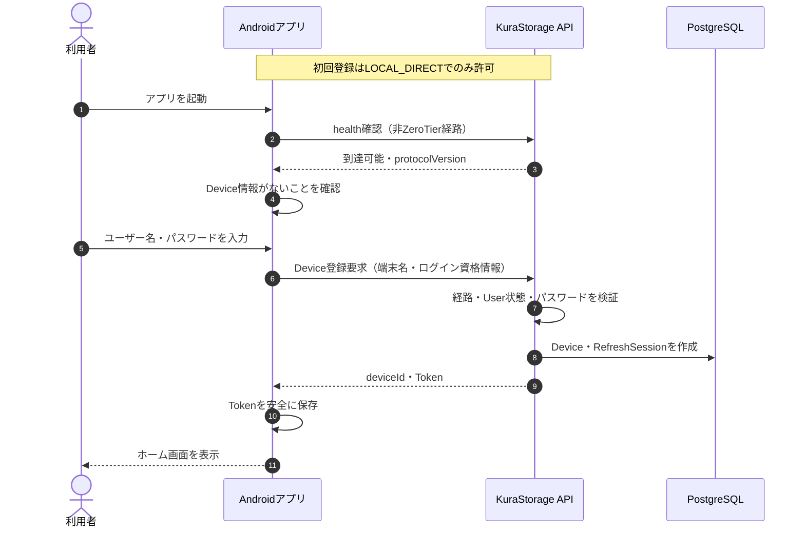

### 登録済み端末のZeroTier利用


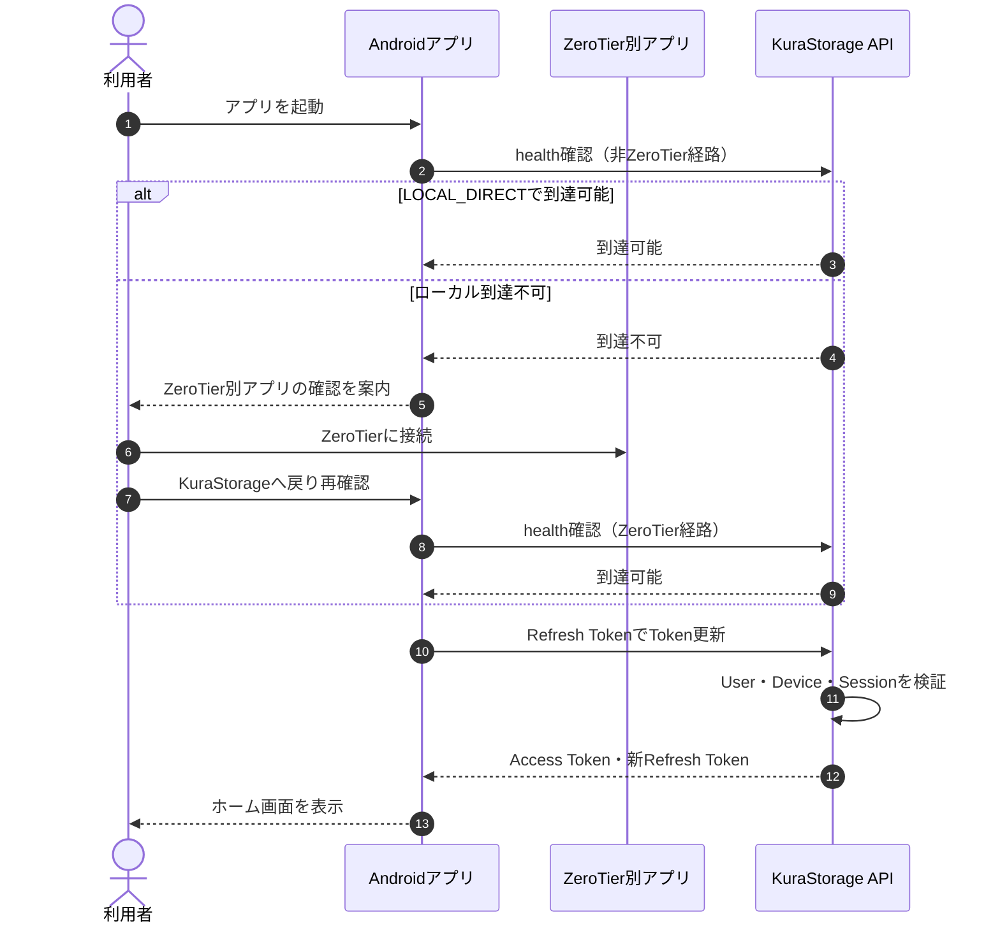

ZeroTier経由の未登録Device登録は拒否する。ZeroTierへ接続できても、User、Device、Refresh Sessionの確認とファイル単位認可を省略しない。

## 9.2 低画質写真の閲覧

**この図で分かること:** READYキャッシュがあればそのまま配信し、なければ元画像から低画質版を生成する。低画質を選んだ要求で元画像本体をクライアントへ送信しない。

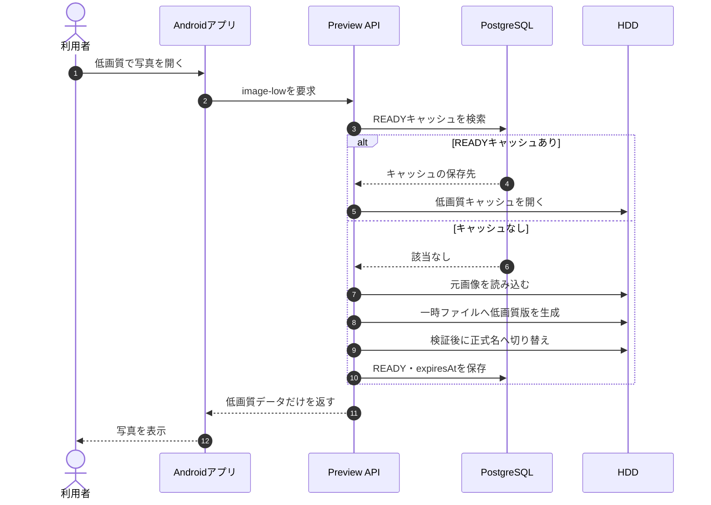

## 9.3 低画質動画の初回再生

### 利用者から見える処理

**この図で分かること:** キャッシュがなければ変換ジョブを開始し、利用者は待機、バックグラウンド継続、または明示的な元画質再生を選択できる。

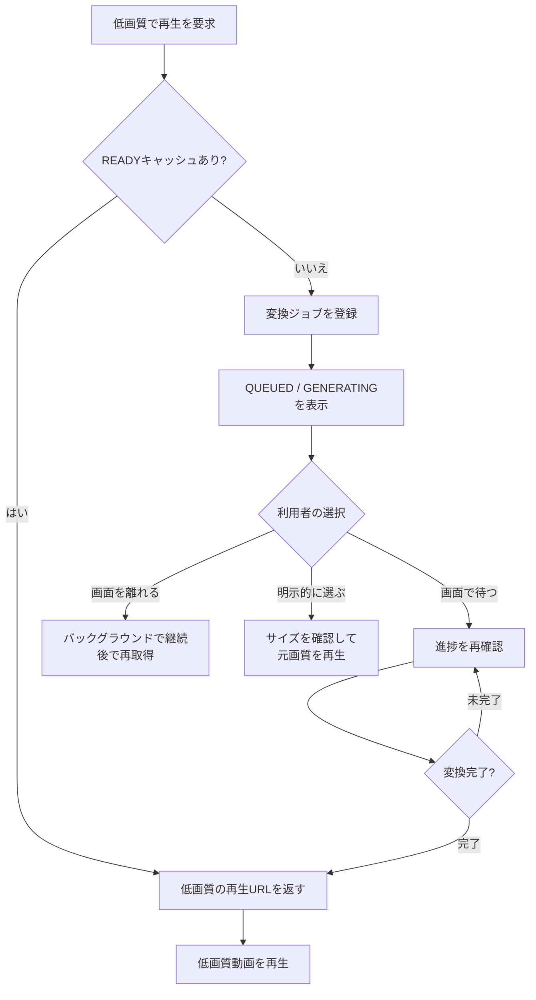

### バックエンドの変換処理

**この図で分かること:** FFmpeg Workerは動画全体を一時ファイルへ生成し、検証とatomic renameが完了してからREADYとして公開する。

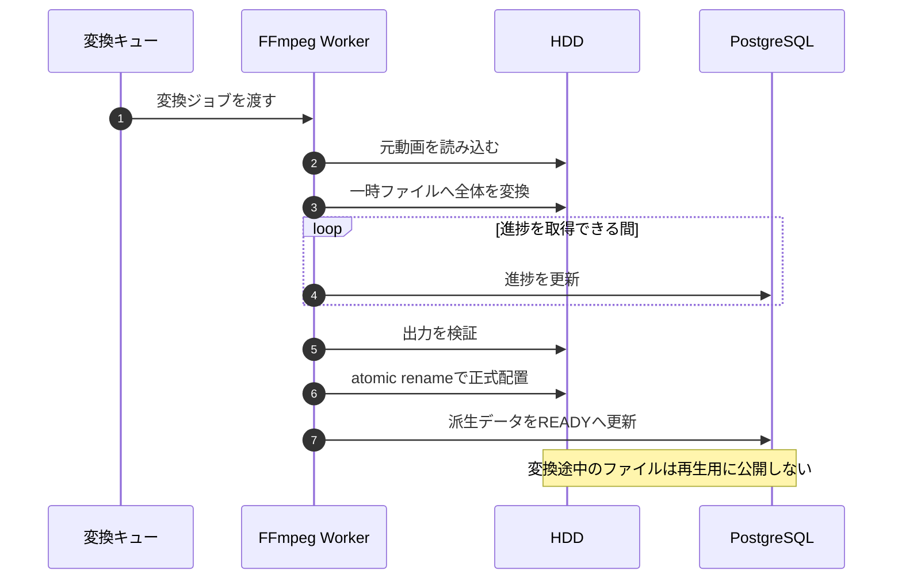

## 9.4 登録済み外部Wi-Fiでの自動バックアップ

**この図で分かること:** 自動バックアップはWi-Fi上だけで実行し、ローカル直接接続または許可済み外部Wi-Fi＋ZeroTierのどちらかを満たす必要がある。

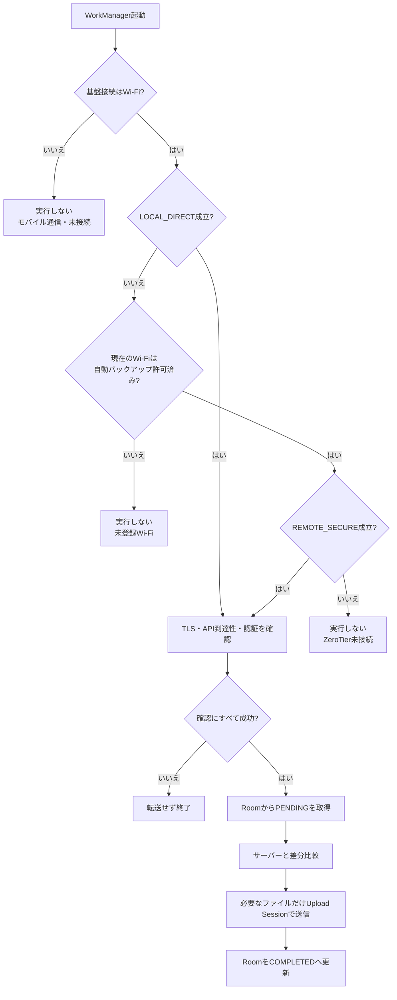

SSID・BSSIDは外部Wi-Fiの自動実行許可を選ぶためにだけ使用し、サーバー本人確認や`LOCAL_DIRECT`判定には使用しない。

## 9.5 アプリから削除

**この図で分かること:** 元ファイルを即時消去せずゴミ箱へ移動し、DB状態と派生データを更新した後で操作完了とする。

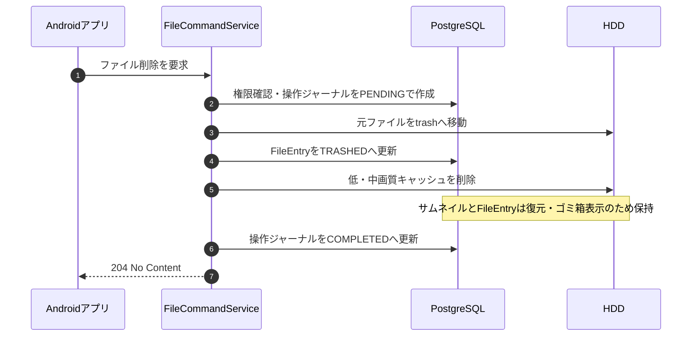

途中で失敗した場合は操作ジャーナルを`RECOVERY_REQUIRED`として残し、復旧処理でHDDとDBの状態を再確認する。

完全削除では、ゴミ箱内の元ファイルと全派生データを削除した後、DBトランザクションで共有・同期・Recent等の関連情報と`FileEntry`を削除する。`DELETED`状態への更新は行わない。監査ログだけは独立した追記専用データとして保持できる。

## 9.6 MVP後: HDDから直接削除されたファイル

**この図で分かること:** 1回見つからなかっただけでは即座にMISSINGへせず、HDD全体が利用可能であることと後続スキャンでの再確認を経て確定する。

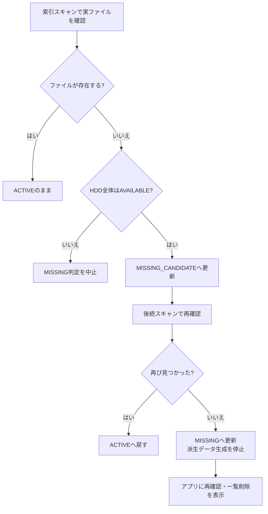

---

## 10. 画面遷移図

画面遷移も目的別に分割する。矢印はユーザー操作または認証・接続状態の変化による遷移を表す。

### 10.1 起動・接続・認証

**この図で分かること:** 未登録端末はローカル初回登録へ、登録済み端末はローカル接続またはZeroTier接続を経てログインへ進む。

```mermaid
stateDiagram-v2
    state "接続確認" as ConnectionCheck
    state "初回Device登録" as FirstRegistration
    state "ZeroTier接続確認案内" as RemoteGuidance
    state "ログイン・Token更新" as Login
    state "ホーム" as Home

    [*] --> ConnectionCheck
    ConnectionCheck --> FirstRegistration: LOCAL_DIRECT・未登録
    FirstRegistration --> Home: 登録・認証成功
    FirstRegistration --> ConnectionCheck: 失敗

    ConnectionCheck --> Login: 登録済み・到達可能
    ConnectionCheck --> RemoteGuidance: 登録済み・ローカル到達不可
    RemoteGuidance --> ConnectionCheck: 別アプリ確認後に再確認

    Login --> Home: 認証成功
    Login --> ConnectionCheck: Device無効・到達不可
    Home --> Login: Session失効
    Home --> ConnectionCheck: 接続喪失
```

### 10.2 ホームからの主要ナビゲーション

**この図で分かること:** MVPのホーム画面は、個人ファイル、転送状況、ゴミ箱、接続状態への入口となる。共有、検索、最近使用、自動バックアップ設定はMVP後に追加する。

```mermaid
flowchart LR
    Home["ホーム"] --> Files["ファイル"]
    Home --> Transfer["転送状況"]
    Home --> Trash["ゴミ箱"]
    Home --> Connection["接続状態"]
```

### 10.3 ファイル詳細と表示画面

**この図で分かること:** ファイル一覧または共有一覧から詳細画面へ進み、ファイル種別に対応したビューアーを開く。

```mermaid
flowchart LR
    Files["ファイル一覧"] --> Detail["ファイル詳細"]
    Shared["共有一覧"] --> Detail

    Detail --> Type{"ファイル種別"}
    Type -->|画像| Image["写真ビューアー"]
    Type -->|動画・音声| Media["メディアプレイヤー"]
    Type -->|PDF| PDF["PDFビューアー"]
    Type -->|テキスト| Text["テキストエディター"]

    Files --> Share["共有設定"]
    Detail --> Share
    Files --> Trash["ゴミ箱"]
    Files --> Missing["MISSING項目"]
```

### 10.4 設定画面

**この図で分かること:** 設定画面から、自動バックアップ、許可Wi-Fi、画質、キャッシュ状態を個別に管理する。

```mermaid
flowchart LR
    Settings["設定"] --> BackupSettings["自動バックアップ設定"]
    Settings --> WifiSettings["許可Wi-Fi設定"]
    Settings --> QualitySettings["画質・通信量設定"]
    Settings --> CacheStatus["キャッシュ状態"]
```

保護画面の表示中にSessionが失効した場合はログイン画面へ戻し、サーバー到達性を失った場合は接続確認画面へ戻す。

## 11. UI設計

### 共通UI方針

- Android画面の実装時は、各画面・状態に記載した参考UIをデザインの基準として使用する。
- 機能、表示項目、操作、制約は本書を含む正式文書を優先する。
- 正式仕様に必要だがMockupが存在しない画面や状態は、既存Mockupと統一したデザインで実装する。
- Mockup画像全体を背景画像として使用せず、Jetpack Composeで画面を再構築する。
- 画面下部の木々のイラストは使用しない。桜などの装飾は既存Mockupの表現に合わせる。

### 正式画面・状態と参考UIの対応

参考UIのPathは本書からの相対Pathである。Mockup番号は正式画面番号とは別の通番であり、機能仕様との対応は次の表を正とする。

| 正式画面・状態 | 対応する既存仕様 | 参考UI |
| --- | --- | --- |
| 起動画面 | 9.1、10.1 | `ui/android/mockups/connection-auth/001-splash.png` |
| 接続状態画面（確認中、ローカル直接接続、未接続、ZeroTier接続） | 10.1、11.1 | `ui/android/mockups/connection-auth/002-connection-check.png`<br>`ui/android/mockups/connection-auth/003-local-connection-status.png`<br>`ui/android/mockups/connection-auth/004-disconnected-status.png`<br>`ui/android/mockups/connection-auth/005-vpn-connection.png` |
| ログイン画面 | 10.1 | `ui/android/mockups/connection-auth/006-login.png` |
| 初回Device登録画面（処理中、登録不可） | 7.11、10.1 | `ui/android/mockups/connection-auth/007-initial-setup.png`<br>`ui/android/mockups/connection-auth/008-device-registration-error.png` |
| ホーム画面 | 10.2、11.2 | `ui/android/mockups/home-navigation/009-home.png` |
| ファイル一覧 | 10.2、10.3、11.3 | `ui/android/mockups/home-navigation/010-my-files.png` |
| 最近使用したファイル | 10.2、11.2 | `ui/android/mockups/home-navigation/011-recent-files.png` |
| 共有一覧 | 10.2、10.3、11.4.1 | `ui/android/mockups/home-navigation/012-shared-files.png` |
| カテゴリ別一覧 | 11.2 | `ui/android/mockups/home-navigation/013-category-browser.png` |
| 検索画面 | 10.2 | `ui/android/mockups/home-navigation/014-search.png` |
| 設定画面 | 10.2、10.4 | `ui/android/mockups/home-navigation/015-settings.png` |
| 写真ビューアー | 10.3、11.5 | `ui/android/mockups/files-media/016-photo-viewer.png` |
| 動画プレイヤー | 10.3、11.6 | `ui/android/mockups/files-media/017-video-player.png` |
| 音声プレイヤー | 10.3、11.6 | `ui/android/mockups/files-media/018-audio-player.png` |
| PDFビューアー | 10.3 | `ui/android/mockups/files-media/019-pdf-viewer.png` |
| テキストエディター | 10.3、11.7 | `ui/android/mockups/files-media/020-text-editor.png` |
| アプリ内表示非対応ファイルの詳細 | 11.4 | `ui/android/mockups/files-media/021-unsupported-file.png` |
| ファイル詳細画面 | 10.3、11.4 | `ui/android/mockups/files-media/022-file-details.png` |
| フォルダ詳細画面 | 10.3、11.4 | `ui/android/mockups/files-media/023-folder-details.png` |
| 共有設定画面 | 10.3、11.4.1 | `ui/android/mockups/files-media/024-sharing-settings.png` |
| 共有相手・権限選択画面 | 11.4.1 | `ui/android/mockups/files-media/025-share-permissions.png` |
| サーバー側保存先選択画面 | 11.8 | `ui/android/mockups/files-media/026-server-folder-selection.png` |
| 転送状況画面 | 6.1、Android Step 5 | `ui/android/mockups/files-media/027-transfer-status.png` |
| ゴミ箱画面 | 10.3、7.9 | `ui/android/mockups/files-media/028-trash.png` |
| `MISSING`項目画面 | 10.3、11.12 | `ui/android/mockups/files-media/029-missing-files.png` |
| バックアップ状態画面 | 10.2、11.8 | `ui/android/mockups/backup-settings/030-backup-status.png` |
| バックアップルール一覧 | 11.8 | `ui/android/mockups/backup-settings/031-backup-rules.png` |
| バックアップルール追加・編集画面 | 11.8 | `ui/android/mockups/backup-settings/032-backup-rule-editor.png` |
| 許可Wi-Fi一覧 | 10.4、11.9 | `ui/android/mockups/backup-settings/033-trusted-wifi.png` |
| 許可Wi-Fi登録・編集画面 | 11.9 | `ui/android/mockups/backup-settings/034-trusted-wifi-editor.png` |
| 画質・通信量設定画面 | 10.4、11.10 | `ui/android/mockups/backup-settings/035-quality-network-settings.png` |
| キャッシュ状態画面 | 10.4、11.11 | `ui/android/mockups/backup-settings/036-cache-management.png` |

次の正式画面・確認状態には専用Mockupが存在しないため、参考UIはなしとする。

| 正式画面・確認状態 | 対応する既存仕様 | 参考UI |
| --- | --- | --- |
| フォルダ共有・ファイル共有の適用範囲確認 | 11.4.1 | なし |
| 完全削除の確認画面 | Android Step 5 | なし |
| `MISSING`項目の一覧削除確認ダイアログ | 11.12 | なし |

`005-vpn-connection.png`は既存AssetのLegacy file nameである。画面仕様は本書のZeroTier別アプリ案内と到達性再確認を正とし、KuraStorage内の接続・切断操作は実装しない。

## 11.1 接続状態画面

**表示項目**

- 接続状態アイコンとテキスト
- 接続経路: ローカル直接接続 / ZeroTier接続 / 未接続
- 基盤ネットワーク: Wi-Fi / Ethernet / モバイル通信 / 不明
- ZeroTier経路状態
- サーバー到達状態
- HDD状態
- ZeroTier別アプリの接続確認案内
- 再確認ボタン

接続経路は、SSID名ではなく到達性判定結果に基づいて表示する。ローカル直接接続とZeroTier接続の両方が利用可能な場合は「ローカル直接接続中」を表示する。接続できない理由を一つの汎用エラーへまとめず、次の優先順位で表示する。

1. ZeroTier未接続またはMember未認可
2. サーバー到達不可
3. TLS証明書またはホスト名の検証失敗
4. HDD利用不可
5. 認証必要

## 11.2 ホーム画面

**主要カード**

- 自分のファイル
- 家族共有
- 最近開いたファイル
- 写真・動画・音声・文書
- 自動バックアップ状態
- 接続方式とHDD状態

画面上部には技術詳細ではなく、利用者が次の操作を判断できる短い状態を表示する。

```text
ローカル直接接続中
すべて同期済み
```

## 11.3 ファイル一覧

| 項目         | リスト表示       | グリッド表示 |
| ------------ | ---------------- | ------------ |
| ファイル名   | 表示             | 省略表示     |
| 種類アイコン | 表示             | 表示         |
| サムネイル   | 任意             | 表示         |
| 更新日時     | 表示             | 詳細画面     |
| サイズ       | 表示             | 詳細画面     |
| MISSING      | 警告ラベル       | 警告バッジ   |
| 共有状態     | アイコン＋ラベル | アイコン     |

一覧用サムネイル取得時に元画像を取得しない。ファイルとフォルダのコンテキストメニューから共有設定画面へ移動できる。

## 11.4 ファイル詳細画面

- ファイル名
- MIMEタイプ
- サイズ
- 作成・更新日時
- 所有者・共有元
- 自分の権限
- アップロード元端末
- ファイル状態
- ダウンロード
- 名前変更、移動、共有、削除

### 11.4.1 MVP後: 共有一覧・共有設定

- 「共有」画面には、フォルダ共有のルートと個別共有されたファイルを同じ一覧で表示する。
- 各項目にファイル／フォルダ種別、所有者、自分の権限を表示する。
- 所有者または`MANAGER`は、ファイルまたはフォルダの詳細画面から共有相手の追加、権限変更、相手単位の解除、共有全体の解除を行える。
- フォルダ共有では「配下の項目にも適用される」ことを確認画面へ表示する。
- ファイル共有では「このファイルだけに適用される」ことを確認画面へ表示し、`CONTRIBUTOR`を選択肢に表示しない。
- 継承権限で開いた配下項目には、共有元フォルダを表示する。

## 11.5 MVP後: 写真ビューアー

- MVP後の初回Photo Viewerで保証するMIME候補は`image/jpeg`、`image/png`、`image/webp`、`image/gif`、`image/bmp`、`image/heic`、`image/heif`とする。
- ピンチズーム
- 前後移動
- 画質選択: 低 / 中 / 元
- 現在の通信種別
- 元画質サイズ
- ダウンロード品質選択
- 詳細情報

初期画質は通信環境別設定から決定するが、ローカル直接接続を含むすべての手動閲覧可能な接続で、低・中・元画質へ切り替えられる。元画質へ切り替える前にはファイルサイズまたは推定転送量を表示する。

## 11.6 MVP後: 動画・音声プレイヤー

- MVP後の初回Playerで保証する動画MIME候補は`video/mp4`、`video/webm`、`video/3gpp`とする。
- MVP後の初回Playerで保証する音声MIME候補は`audio/mpeg`、`audio/mp4`、`audio/aac`、`audio/ogg`、`audio/opus`、`audio/flac`、`audio/wav`、`audio/3gpp`、`audio/amr`、`audio/amr-wb`とする。
- コンテナMIMEが保証対象でも端末のMediaCodecが内部コーデックを再生できない場合は、非対応形式として表示し、再生失敗を再試行ループにしない。
- 再生・一時停止
- シークバー
- 5秒戻る・進む
- 10秒戻る・進む
- 0.5〜3.0倍速
- 画質選択（接続環境に関係なく低 / 中 / 元を選択可能）
- 現在時間・総時間
- 変換キュー待ち・変換中・進捗・失敗表示
- 変換中の操作: 完了まで待つ / バックグラウンドで続ける / 元画質で再生
- 元画質を選択する前のファイルサイズ・推定通信量表示
- 通信切断時の再接続表示

低・中画質が未生成の場合、アプリは元画質へ自動切替しない。ユーザーが「バックグラウンドで続ける」を選択した場合は画面を離れてもジョブを継続し、後から同じファイルを開いた際に状態を再取得する。画質変更時は現在再生位置を保持し、準備完了後に同じ位置付近から再開する。

## 11.7 MVP後: テキストエディター

- 閲覧・編集モード
- 保存ボタン
- 未保存状態表示
- 現在の文字コード
- ファイルバージョン
- 競合時の選択肢: 再読込 / 別名保存 / 内容比較（P1）

## 11.8 MVP後: 自動バックアップ設定

- 端末側フォルダ
- サーバー側保存先
- 有効・無効
- ネットワークモード
- 初回のみ充電中
- 最低バッテリー残量
- 端末削除をサーバーへ反映しない旨
- 最終成功日時
- 保留・失敗件数

## 11.9 MVP後: 許可Wi-Fi設定

一覧項目。

- 表示名
- SSID
- BSSID制限の有無
- 登録済み外部Wi-Fi
- 従量制扱い
- 有効状態

登録画面では現在接続中Wi-Fiを読み取り、ユーザーが登録確定する。Wi-Fi情報取得権限の目的を説明する。

## 11.10 MVP後: 画質・通信量設定

| 通信環境               | 初期値 |
| ---------------------- | ------ |
| ローカル直接接続       | 元画質 |
| 登録済み外部Wi-Fi＋ZeroTier | 中画質 |
| 未登録Wi-Fi＋ZeroTier       | 低画質 |
| モバイル通信＋ZeroTier      | 低画質 |

利用者は環境別の初期値を変更できる。これらはビューアー起動時の既定値であり、手動閲覧中は接続環境に関係なく低画質、中画質、元画質へ変更できる。ただしモバイル通信での自動バックアップは変更不可で禁止とする。

## 11.11 MVP後: キャッシュ状態画面

管理者向けに次を表示する。

- 低・中画質キャッシュ使用量
- 上限10GB
- 清掃後目標6GB
- 最終清掃日時
- 生成中件数
- 失敗件数
- 今すぐ清掃

元ファイルとは別の再生成可能データであることを明示する。

## 11.12 MVP後: `MISSING`項目画面

- ファイル名と元の場所
- 検出日時
- 再確認
- 一覧から削除

確認ダイアログ。

```text
元ファイルはHDD上に存在しません。
管理情報、共有情報、同期情報、サムネイル、プレビューキャッシュを削除します。
実ファイルへの削除操作は行いません。
```

---

## 12. エラーハンドリング

### 12.1 エラー分類

| コード | HTTP | サーバー処理 | ユーザー表示 |
| --- | ---: | --- | --- |
| `VALIDATION_FAILED` | 400 | 入力拒否 | 入力内容を確認してください |
| `AUTHENTICATION_REQUIRED` | 401 | 処理中断 | 再ログインしてください |
| `REFRESH_TOKEN_REUSED` | 401 | Session系列失効 | セキュリティ上の理由で再ログインが必要です |
| `DEVICE_REVOKED` | 403 | Token更新・保護操作拒否 | この端末は失効されています |
| `DEVICE_REGISTRATION_REQUIRES_LOCAL_DIRECT` | 403 | 登録拒否 | 新しい端末は自宅ネットワークから登録してください |
| `FILE_NOT_FOUND` | 404 | 未存在と他User所有を同じ結果にする | ファイルが見つかりません |
| `FILE_NAME_CONFLICT` | 409 | 作成・Upload拒否、既存項目維持 | 同じ名前の項目があります |
| `FILE_RESTORE_CONFLICT` | 409 | Restore拒否、既存項目維持 | 復元先に同じ名前の項目があります |
| `IDEMPOTENCY_CONFLICT` | 409 | 異なるPayloadでのKey再利用拒否 | 転送を最初からやり直してください |
| `UPLOAD_SIZE_MISMATCH` | 422 | 正式公開しない | ファイルサイズが一致しません |
| `UPLOAD_CHECKSUM_MISMATCH` | 422 | 正式公開しない | ファイル内容を確認できませんでした |
| `STORAGE_UNAVAILABLE` | 503 | File更新停止 | HDDを利用できません |
| `STORAGE_CAPACITY_INSUFFICIENT` | 507 | Upload開始・確定拒否 | 保存先の空き容量が不足しています |

TLS検証失敗と`REMOTE_SECURE`未到達は通信層の状態として扱う。MVP後のMedia、Backup、Search固有Errorは各機能追加時に定義する。認証エラーではUserの存在有無を推測できる文言を返さない。

### 12.2 ZeroTier切断時

- 新しいAPI要求を送信しない。
- アップロードを失敗として終了し、同じIdempotency Keyで先頭から全体再試行できる状態にする。
- ダウンロードを停止し、利用者の操作で再試行する。
- 接続画面または再接続バナーを表示する。

### 12.3 HDD操作とDB更新の不整合

- 操作ジャーナルを`RECOVERY_REQUIRED`へ変更する。
- 通常一覧には確定していない状態を表示しない。
- MVPではAPI内Recovery Hosted ServiceがHDDとDBの状態を確認する。
- 自動復旧できない場合、管理者画面へ通知する。

---

## 13. パフォーマンス最適化

1. ファイル一覧はDB索引から取得し、毎回HDD全体を走査しない。
2. フォルダ一覧はページングする。初期値100件、最大500件とする。
3. Uploadは逐次Stream、DownloadはRange Requestを使用し、ファイル全体をメモリへ読み込まない。
4. Server全体の同時Upload数を初期値2へ制限する。
5. 任意SHA-256は受信Streamと同時に計算し、検証のために全体を再読込しない。

検索、Thumbnail、低・中画質、動画変換、Cache、WorkManagerの最適化は、それぞれのMVP後機能を追加する際に定義する。

---

## 14. セキュリティ考慮事項

### 14.1 ネットワーク・ZeroTier境界

- KuraStorage APIを一般インターネットへ直接公開しない。
- ZeroTier MemberからKuraStorage HTTPS以外のSSH、PostgreSQL、SMB、LAN端末、ZeroTier端末へ到達できないようにする。
- ZeroTier Network内でもHTTPSとTLS証明書・ホスト名検証を行う。
- ZeroTier接続をUserログイン完了として扱わない。

### 14.2 認証・認可・Session

- 保護APIはFallback Policy等で既定認証必須にする。
- 認証不要APIをヘルス確認、Device初回登録、ログイン、Refresh等へ明示的に限定する。
- パスワードはArgon2id v1.3（`v=19`）でハッシュ化し、MVP初期値をメモリ19MiB、反復2回、並列度1とする。
- パスワード設定ごとに16バイトのランダムSaltを生成し、自己記述形式のハッシュ文字列だけをDBへ保存する。
- 平文、復号可能な暗号文、MD5、SHA系の単純ハッシュを保存せず、独自暗号実装を行わない。
- 正常ログイン時に保存済みパラメータが現在の基準より弱ければ、現在の設定で再ハッシュする。
- Access Tokenの有効期限は15分とする。
- Refresh Tokenは発行・ローテーションから24時間有効とし、端末単位で使用ごとにローテーションしてDBにはハッシュだけを保存する。
- 使用済みRefresh Token再利用時は同じ系列を失効する。
- クライアント指定の`userId`や`deviceId`を認証・認可の根拠にしない。
- すべてのファイルAPIでサーバー側権限確認を行う。
- User単位で認証失敗を管理し、15分以内に10回連続失敗した場合は管理CLI解除が必要なセキュリティロックとする。
- 正常ログイン時は対象Userの失敗回数を0へリセットし、計測期間を初期化する。

### 14.3 Device登録・ZeroTier管理境界

- Device登録は`LOCAL_DIRECT`だけで許可し、ZeroTier経由では拒否する。
- DeviceとRefresh Sessionの一貫性はKuraStorageのDBトランザクションで保つ。
- ZeroTierのNetwork参加、Member認可、Managed IP、Node IdentityはKuraStorageの管理対象外とし、Device・Sessionと同期させない。
- Device失効とZeroTier Member失効は独立した操作とし、管理者に両方の確認を促す。

### 14.4 管理CLI・権限分離

- 管理用HTTP APIとAndroid管理GUIを提供しない。
- APIを専用非rootユーザーで実行する。
- APIユーザーからroot権限の処理、systemd操作、任意シェル文字列の実行を許可しない。
- 管理CLIはRaspberry Piのローカルコンソール上でrootまたは限定sudoユーザーだけが実行できる。
- CLIとAPIはApplication層の共通処理を使用し、CLIだけが直接SQLで状態を変更する構成にしない。

### 14.5 ファイルアクセス

- OSの絶対パスをAPIへ露出しない。
- `../`、絶対パス、NUL文字、不正区切り文字を拒否する。
- シンボリックリンクを禁止する。
- KuraStorage専用ルート以外を書き込み不可にする。
- アップロードは一時領域で完了検証してから正式配置する。

### 14.6 Android秘密情報

- Refresh TokenもAndroid Keystoreで保護する。
- `deviceId`は秘密情報として扱わないが、単独で認証に使用しない。
- ログへToken、パスワード、ZeroTier Node Identity、ファイル本文を出力しない。

### 14.7 メディア変換

- 変換プロセスへユーザー入力をシェル文字列として直接連結しない。
- 入力・出力パスは内部生成値だけを使用する。
- 変換プロセスへCPU時間、メモリ、出力サイズの制限を設ける。
- 破損・悪意あるメディアによる変換失敗を元ファイル削除へつなげない。

## 15. MVP後: Androidバックグラウンド実行設計

本節は自動バックアップ追加時の設計でありMVPには適用しない。MVPのServer側バックグラウンド処理は、API内の期限付きHosted Serviceによる未完了Upload清掃と`FileOperation`復旧だけとする。

### 15.1 起動契機

- アプリ起動時
- アプリプロセス生存中のネットワーク変更
- MediaStore変更通知
- 保留キュー追加時
- WorkManagerの定期取りこぼし確認
- 端末再起動後のWorkManager再スケジュール
- ユーザーの「今すぐバックアップ」

### 15.2 標準動作

- 常時Foreground Serviceは使用しない。
- 通常時はCPU、ネットワークを使用しない。
- Worker開始後、ネットワークポリシーを満たさなければ短時間で正常終了する。
- 大量転送だけ長時間Workerと進捗通知へ切り替える。
- 強制停止中は実行できない旨を設定画面に表示する。

### 15.3 取りこぼし確認

- MediaStore: generation差分を使用する。
- SAFフォルダ: 6時間ごと、アプリ起動時、許可ネットワーク到達時に走査する。
- 実行間隔は実機のバッテリー測定後に調整する。

---

## 16. 可観測性

### 16.1 ログ

構造化ログへ次を記録する。

- requestId
- 接続経路
- ログイン成功・失敗、アカウントロック・解除
- 管理CLIコマンド、実行OSユーザー、対象、結果、理由
- 操作種別
- fileId
- 結果コード
- 処理時間
- 転送サイズ
- キャッシュヒット・ミス
- 変換時間
- バックアップポリシー判定結果


### 16.2 メトリクス

- API応答時間
- ログイン成功・失敗数
- アカウントセキュリティロック・解除件数
- ACTIVE / REVOKED Device数
- Refresh Token再利用検知数
- アップロード・ダウンロード量
- 変換キュー長
- 変換成功・失敗数
- 低・中画質キャッシュ使用量
- キャッシュヒット率
- 清掃で削除した容量
- HDD空き容量
- `MISSING`件数
- 自動バックアップ成功・失敗件数

## 17. テスト戦略

## 17.1 ユニットテスト

- 相対パス正規化と範囲外アクセス拒否
- シンボリックリンク拒否
- 所有者・直接共有・フォルダ継承を含む有効権限判定
- 複数共有経路から最も強い権限を選択する判定
- ファイル共有への`CONTRIBUTOR`拒否
- テキスト更新競合
- ファイル状態遷移
- `MISSING_CANDIDATE`から`MISSING`への遷移
- キャッシュキー生成
- 名前変更・移動で`fileVersion`とキャッシュキーが変化しないこと
- 派生データのダウンロード名が最新の`FileEntry.name`から生成されること
- 24時間TTL判定
- 10GB超過から6GBまでのLRU削除
- 生成中・利用中キャッシュの除外
- ネットワークポリシー判定表の全組み合わせ
- 差分バックアップ候補判定
- 端末削除をサーバー削除へ変換しないこと
- Argon2id自己記述形式の生成・解析・検証
- 同一パスワードでもSaltが異なれば異なる`passwordHash`になること
- 不正形式の`passwordHash`を安全に拒否すること
- 旧パラメータでの認証成功後に現在設定へ再ハッシュされること
- User単位の失敗回数、15分計測期間、成功時リセット、セキュリティロック判定
- Refresh Tokenローテーション系列と再利用検知

## 17.2 統合テスト

- User作成、初期管理者作成、パスワード強制再設定のすべてでArgon2id自己記述形式だけがDBへ保存されること
- パスワード強制再設定後に対象Userの全Refresh Sessionが失効すること
- PostgreSQLと一時HDD領域を使用したファイル一覧
- 分割アップロードの中断・再開・完了
- 大容量ファイルが空き容量および明示的な操作上限の範囲内ならサイズだけを理由に拒否されないこと
- 空き容量不足と対象操作のサイズ上限超過が異なるエラーコードになること
- アップロード完了前に一覧へ表示されないこと
- atomic rename後の索引作成
- 削除・復元と派生キャッシュ連動
- HDD未マウント時に`MISSING`化しないこと
- HDDから直接削除後の二段階`MISSING`判定
- 写真低画質キャッシュの生成・再利用・期限切れ
- キャッシュ生成後に元ファイルを名前変更または移動し、再生成せず同じキャッシュを利用できること
- 名前変更後に派生データをダウンロードし、変更後の名称と品質識別子を持つファイル名が返ること
- 動画変換ジョブの重複防止
- 動画変換ジョブのキュー待ち、進捗、完了、失敗遷移
- クライアントが画面を離れてもジョブが継続すること
- 生成途中の動画派生データが配信されないこと
- Range Request
- ファイル直接共有のアクセス制御
- フォルダ共有配下のアクセス制御
- 直接共有と継承共有が重複した場合に最も強い権限が適用されること
- ファイル共有へ`CONTRIBUTOR`を設定できないこと
- 共有解除後に対象ユーザーのアクセスが失効すること
- ZeroTier経由のDevice登録が拒否されること
- Device失効後にRefreshとKuraStorageの保護APIが拒否されること
- 管理CLI操作が共通Application処理と監査ログを使用すること

## 17.3 Androidテスト

- 接続状態ごとの画面表示
- 同一SSIDでもサーバーへ直接到達できない場合に`LOCAL_DIRECT`と判定しないこと
- 異なるサブネットからZeroTierを介さず信頼済みサーバーへ到達できても`LOCAL_DIRECT`と判定しないこと
- ZeroTier経路で接続中でも基盤ネットワークへバインドした直接確認が成功した場合に`LOCAL_DIRECT`を優先すること
- バックエンドプロセスが起動中でもリバースプロキシ経由で到達できない場合に接続済みと判定しないこと
- ZeroTier未接続案内・Foreground復帰時の再確認・手動再確認
- モバイル通信で自動バックアップしないこと
- 未登録Wi-Fiで自動バックアップしないこと
- 登録済み外部Wi-FiでもZeroTierなしでは実行しないこと
- ZeroTier切断時の転送一時停止
- WorkManagerの再実行
- Roomの保留キュー復元
- 画質変更時の再生位置維持
- 動画変換中の待機、バックグラウンド生成、元画質再生の選択
- 低・中画質未準備時に元画質へ自動フォールバックしないこと
- 低画質表示時に元画質APIを呼ばないこと
- 未登録端末がLOCAL_DIRECTから初回登録できること
- 未登録端末がZeroTier経由で登録できないこと
- Device失効エラー時にローカルTokenを無効化すること

## 17.4 E2Eテスト

1. Local Directから未登録AndroidをDevice登録し、ログイン、一覧表示まで完了する。
2. 同じ未登録端末をZeroTier経由で登録しようとすると拒否される。
3. 登録済みDeviceがLANとZeroTierの両方からログイン・Token更新できる。
4. SAFで選択したファイルをStreaming Uploadし、送信元と保存内容が一致する。
5. Uploadを途中で切断し、同じIdempotency Keyで全体再試行して重複や不完全公開が起きない。
6. 元ファイルをRange Downloadし、SAF保存先の内容が一致する。
7. ファイルとフォルダをゴミ箱へ移動し、元の場所へ復元する。同名競合では上書きしない。
8. 他UserのFile IDを指定した一覧外操作が拒否され、存在情報を過度に公開しない。
9. HDDを未マウントにしてUploadを拒否し、OSルートへ誤保存しない。途中状態は再起動後に復旧または`RECOVERY_REQUIRED`となる。
10. AndroidとRaspberry Piを再起動し、接続確認、再ログイン、主要操作を再度完了する。

---

## 18. 実装順序

### 18.1 実装の進め方

Phase 1は、サーバー側をすべて完成させてからAndroidアプリを作るのではなく、**サーバー側で必要なAPIを先に実装し、そのAPIを使用するAndroid機能を順に接続する**形で進める。

MVPの正式な実装単位は次の順とする。詳細な作業進捗は`.steering/20260722-kurastorage-mvp/tasklist.md`を正とする。

1. 文書・環境前提とRepository／CI基盤
2. ServerのStorage、認証、Device、Session
3. Serverの個人領域、一覧、詳細、Folder、Streaming Upload、Range Download、Trash、Restore、復旧
4. Androidの接続、認証、一覧、詳細、SAF Upload／Download、Trash／Restore
5. Raspberry Pi配置、Android Release、LAN／ZeroTier実機E2E

18.2および18.3に残す追加Stepのうち「MVP後」と明示したものは、MVP完了後の参考順序であり現行リリースを妨げない。

基本方針は次のとおり。

- サーバー側は、認証・Device登録・ファイル操作など、後続機能の前提となる処理から実装する。
- Androidアプリ側は、画面だけを先に作るのではなく、対応するサーバーAPIが利用可能になった段階で結合する。
- API完成前にAndroid UIを進める場合は、一時的なFake RepositoryまたはMock APIを使用する。
- 各段階で、サーバー単体テスト、Android単体テスト、API結合テスト、実機確認を完了してから次へ進む。

### 18.2 サーバー側の実装順序

#### Server Step 1: プロジェクト・DB・ストレージ基盤

最初に、すべてのサーバー機能が依存する共通基盤を作成する。

- 共通設定、依存性注入、ログ、例外処理、共通エラーレスポンス
- PostgreSQL接続、Migration、トランザクション方針
- MVPのUser、Device、Session、Audit、FileEntry、FileOperation Table
- StorageGuard
- HDDマウント、`storageId`、読み書き、空き容量の確認
- NginxのHTTPS入口とAPIへの内部接続
- ヘルスチェックAPI

**完了条件:** APIが起動し、DBとHDDの状態を確認でき、共通エラー形式と監査ログが動作する。

#### Server Step 2: User管理・認証・Session

次に、すべての保護APIで使用するUser認証を実装する。

- PasswordHashingServiceとArgon2idによるハッシュ生成・検証
- 初期管理者作成
- User作成、一覧、無効化、再有効化、パスワード再設定
- 認証失敗回数、15分以内10回失敗によるセキュリティロック
- 管理CLIによるロック解除
- Access Token発行
- Refresh Tokenのハッシュ保存、24時間有効期限、ローテーション
- Refresh Token再利用検知とSession系列失効
- 認証・認可の既定拒否構成
- AuthenticationAttemptとAuditLogへの記録

**完了条件:** 管理CLIでUserを作成でき、ログイン、Token更新、ログアウト、ロック、Session失効をAPIテストで確認できる。

#### Server Step 3: Device登録

Android端末を安全に登録し、KuraStorageのDeviceとSessionをネットワークメンバーシップから独立して管理できるようにする。

- `LOCAL_DIRECT`からだけ受け付けるDevice登録API
- 1ユーザーあたり有効Device最大10台の制御
- DeviceとRefresh Sessionの一貫した作成と登録失敗時のロールバック
- Device失効時のRefresh Session一括失効

**完了条件:** Local DirectでDeviceを登録でき、ZeroTier経由の新規登録を拒否し、Device失効時に関連Sessionを失効できる。

#### Server Step 4: ファイル一覧・転送・基本操作

認証済み利用者がHDD上のファイルを扱うための主要APIを実装する。

- FileCatalogService
- FileCommandService
- TransferService
- 個人領域と基本フォルダの作成
- ファイル・フォルダ一覧、詳細取得
- Streaming Multipart Upload、全体再試行、サイズ・チェックサム検証
- HTTP Range対応ダウンロード
- フォルダ作成
- ゴミ箱移動、復元（完全削除はMVP後）
- 操作ジャーナル
- HDD操作後にDB更新が失敗した場合の復旧情報記録

**完了条件:** Android以外のAPIクライアントから、一覧、詳細、Folder作成、Streaming Upload、Range Download、ゴミ箱移動、復元を一通り実行できる。

#### Server Step 5（MVP後）: 共有・認可・検索

ファイル操作の基本機能が安定した後に、複数User間の利用機能を追加する。

- AuthorizationService
- ファイル共有とフォルダ共有
- `VIEWER`、`CONTRIBUTOR`、`EDITOR`、`MANAGER`の権限制御
- 親フォルダからの権限継承
- 複数共有経路がある場合の最強権限解決
- DB索引を使用した検索
- 最近使用したファイル
- 共有対象の移動、削除、復元時の整合性処理

**完了条件:** 所有者と共有先Userで許可・拒否される操作が仕様どおりに分かれる。

#### Server Step 6（MVP後）: 自動バックアップ受信機能

Androidの自動バックアップに必要なサーバー側処理を実装する。

- BackupService
- BackupReceipt
- `userId`、`deviceId`、`localDocumentKey`による対応管理
- 新規、変更済み、アップロード不要の判定API
- 分割アップロードとの統合
- 同一ファイルの重複登録防止
- 端末側削除をサーバー削除へ反映しない制御
- Access TokenからのUser・Device特定
- バックアップ先フォルダの認可

**完了条件:** 同一端末から同じファイルを再送しても不要な重複が発生せず、内容変更時だけ更新できる。

#### Server Step 7（MVP後）: サムネイル・低中画質・動画変換

基本的なファイル閲覧が動作した後に、通信量と表示速度を改善する。

- FileDerivativeとTranscodeJob
- 写真・動画・PDFサムネイル生成
- 写真・動画サムネイルの全件保持
- 写真低画質・中画質生成
- 写真生成の待機閾値と`202 Accepted`
- 動画変換キュー
- Raspberry Pi 4での動画変換並列数1
- 720p低画質、1080p中画質、完成済みMP4生成
- 変換進捗・状態API
- 完成・検証・atomic rename後だけ`READY`として公開
- 24時間TTL
- 低・中画質キャッシュが10GBを超えた場合の6GB以下までのLRU清掃
- 配信中・生成中データを削除しないLease制御

**完了条件:** 未生成、生成中、完成、失敗の各状態をAPIで扱え、完成した派生データだけをRange配信できる。

#### Server Step 8（MVP後）: 高度な索引整合性・運用機能

最後に、長期運用で必要になる自動修復と監視を完成させる。

- inotifyによる変更検知
- 定期再スキャン
- `MISSING_CANDIDATE`と`MISSING`管理
- DBにないHDDファイルの取り込み候補登録
- 操作ジャーナルからの起動時復旧
- 未完了UploadSessionと一時ファイルの清掃
- ゴミ箱30日保持後の完全削除
- キャッシュ清掃の定期実行
- 管理状態、ジョブ状態、容量、エラー件数のメトリクス
- バックアップ・復元手順と障害試験

**完了条件:** APIやRaspberry Piを異常終了させても、再起動後に不整合を検出し、安全に復旧または管理者確認状態へ移行できる。

### 18.3 Androidアプリ側の実装順序

#### Android Step 1: アプリ基盤

最初に、各画面とバックグラウンド機能が共通で使用する基盤を作成する。

- Kotlin、Jetpack Compose、Navigationの基本構成
- ViewModel、Repository、UseCaseの責務分離
- APIクライアントと共通エラー変換
- SecureCredentialStore
- Android KeystoreとAES-256-GCM
- ネットワーク状態監視
- Fake RepositoryまたはMock APIによる画面開発環境

**完了条件:** API接続先を切り替えられ、Keystore、画面遷移、共通エラー表示が動作する。

#### Android Step 2: 接続経路判定

認証やファイル取得より先に、サーバーへどの経路で到達できるかを判定する。

- ConnectionCoordinator
- 基盤Wi-FiまたはEthernetネットワークの取得
- Android端末とサーバーの同一IPサブネット確認
- 非ZeroTier Networkへ明示的にバインドしたHTTPSヘルスチェック
- TLS証明書・ホスト名検証
- `LOCAL_DIRECT`、`REMOTE_SECURE`、`DISCONNECTED`の判定
- HDD状態、認証状態、Device状態を接続経路とは別に表示
- 接続状態画面

**完了条件:** 家庭内直接接続、ZeroTier接続、到達不能を誤分類せず、現在の状態を画面へ表示できる。

#### Android Step 3: 初回Device登録・ログイン・ZeroTier案内


- DeviceRegistrationCoordinator
- `LOCAL_DIRECT`での初回Device登録
- `deviceId`とRefresh Tokenの保存
- ZeroTier別アプリの確認案内
- Foreground復帰時と手動操作による到達性再確認
- 登録済みDeviceのログイン
- Access Tokenのメモリ管理
- Refresh Tokenの自動更新とローテーション結果保存
- ログアウト、Session失効、Device失効時の秘密情報削除
- 別VPNアプリとの競合、ZeroTier未接続、到達不可の表示


#### Android Step 4: ホーム・ファイル一覧・基本閲覧

主要な閲覧機能を先に完成させる。

- ホーム画面
- 個人領域、転送状況、ゴミ箱への入口
- ファイル・フォルダ一覧
- ページングまたは段階読み込み
- ファイル詳細
- 通信切断、Token期限切れ、HDD利用不可の表示

**完了条件:** 認証済みUserが一覧と詳細を表示し、必要な元ファイルをOSの対応アプリで開くためにDownloadできる。

#### Android Step 5: ファイル転送・編集操作

閲覧機能の後に、データを変更する操作を追加する。

- ファイル選択とアップロード
- 単一ファイルのStreaming Multipart Uploadと全体再試行
- ダウンロードと保存先選択
- フォルダ作成
- ゴミ箱移動
- 復元
- 操作中の進捗、キャンセル、失敗後再試行
- 同名競合では既存ファイルを上書きせず、競合を表示して操作を終了する

**完了条件:** 大容量ファイルを含む主要操作を実行でき、通信中断後に安全に再試行できる。

#### Android Step 6（MVP後）: 共有・検索・最近使用

サーバー側の共有・検索APIへ接続する。

- ファイル・フォルダ共有画面
- 共有先User選択
- 権限選択
- 共有解除と権限変更
- 継承された権限の表示
- 検索画面
- ファイル形式、所有者、更新日時等の絞り込み
- 最近使用したファイル一覧
- 権限不足エラーの操作別表示

**完了条件:** 所有者が共有を管理でき、共有先Userには許可された操作だけが表示・実行される。

#### Android Step 7（MVP後）: 自動バックアップ

通常の手動アップロードが安定した後に、自動バックアップを実装する。

- BackupCoordinator
- MediaStore差分取得
- SAF選択フォルダの差分取得
- LocalBackupRule
- LocalSyncItemとRoom保留キュー
- WorkManagerによる一意なバックアップ処理
- 初回大量バックアップ時の充電・電池残量条件
- 1回あたりのファイル数・合計容量制限
- `LOCAL_DIRECT`での自動実行
- 許可済み外部Wi-Fi＋ZeroTierでの自動実行
- モバイル通信での自動実行拒否
- Refresh Token期限切れ時の認証待ち
- 失敗理由、再試行、進捗の表示

**完了条件:** アプリを閉じた状態でも許可条件下で処理が継続し、禁止されたネットワークでは自動送信されない。

#### Android Step 8（MVP後）: 品質別プレビュー・通信量最適化

サーバー側の派生データ生成へ接続し、閲覧体験を改善する。

- 一覧用サムネイル表示
- ネットワーク種別に応じた初期画質
- 写真・動画の低画質、中画質、元画質選択
- 写真生成中の待機表示と再取得
- 動画変換のキュー位置、進捗、失敗表示
- 変換完了後の自動再取得
- 完成済みMP4のRange再生
- シークと再生速度変更
- 元画質取得前のサイズ表示と確認
- 低・中画質未準備時に元画質へ自動切替しない制御

**完了条件:** 各品質を明示的に選択でき、生成中状態を扱い、意図しない元画質通信が発生しない。

#### Android Step 9: 実機安定化・リリース準備

最後に、Android特有の中断・権限・端末差を確認する。

- Android 10以降の権限差確認
- アプリ再起動、プロセス終了、端末再起動後の復元
- Wi-Fiからモバイル通信、モバイル通信からWi-Fiへの切替
- ZeroTier切断・再接続
- Token期限切れと再ログイン
- Keystore利用不可・鍵消失時の未登録状態への移行
- WorkManagerの重複実行防止
- 大量ファイル一覧と大量バックアップの性能確認
- Accessibility、画面回転、ダークモード等の基本確認
- リリースビルドでの秘密情報・デバッグログ確認

**完了条件:** 対象Android端末で主要な中断パターンを再現しても、データ破損や秘密情報漏えいを起こさず復帰できる。

### 18.4 サーバー側とAndroid側の結合順序

サーバー側とAndroid側は、次の単位で結合確認する。

| 結合段階 | 先に利用可能にするサーバー機能 | 接続するAndroid機能 | 主な確認内容 |
| -------- | ------------------------------ | ------------------- | ------------ |
| 1 | Server Step 1〜2 | Android Step 1〜2 | HTTPS、ヘルスチェック、TLS、ログイン前状態、共通エラー |
| 2 | Server Step 3 | Android Step 3 | Local DirectでのDevice登録、Token保存、ZeroTier案内、外部経路からの登録拒否 |
| 3 | Server Step 4 | Android Step 4〜5 | 一覧、閲覧、アップロード、ダウンロード、変更操作、再試行 |
| 4 | Server Step 5 | Android Step 6 | 共有権限、検索、最近使用、許可・拒否の一致 |
| 5 | Server Step 6 | Android Step 7 | 差分判定、WorkManager、自動実行条件、重複防止 |
| 6 | Server Step 7 | Android Step 8 | サムネイル、写真生成、動画変換、品質切替、Range再生 |

### 18.5 Phase 2 Webアプリ準備

Phase 1のAndroid機能とAPIが安定した後、Webアプリ向けの準備を行う。

- API契約の固定
- OpenAPI出力の整理
- Android固有処理がApplication層へ混入していないことの確認
- ブラウザ向け認証方式の設計
- Web向けアップロード・ダウンロード制約の確認
- React＋TypeScriptクライアントからの共通API接続

## 19. PRD要件トレーサビリティ

| PRD領域                | 主な機能設計セクション                                    |
| ---------------------- | --------------------------------------------------------- |
| 接続・ZeroTier              | 1.2、2.1、6.1.1、6.1.2、6.2.12、7.6、9.1、11.1            |
| 認証・ユーザー・Device | 5.1、6.1.3、6.1.9、6.2.1、6.2.12〜6.2.15、7.11、7.12、8.3 |
| ファイル閲覧           | 5.2、6.2.4、8.4、11.3                                     |
| ファイル操作           | 5.5、6.2.5、6.2.6、8.8、8.9                               |
| 写真・動画・音声       | 6.1.5、6.2.7、6.2.8、7.3、7.4、8.5、8.6                   |
| テキスト編集           | 7.10、8.7、11.7                                           |
| 共有                   | 5.3、7.2、8.10                                            |
| 自動バックアップ       | 5.6、6.1.6、6.1.7、7.6、7.7、8.12、15                     |
| キャッシュ管理         | 5.4、6.2.9、7.5、11.11                                    |
| HDD・MISSING           | 4.3、6.2.3、6.2.10、7.8、11.12                            |
| UI・UX                 | 10、11                                                    |
| セキュリティ           | 2.1、7.12、12.1、14、16                                   |
| テスト                 | 17                                                        |
